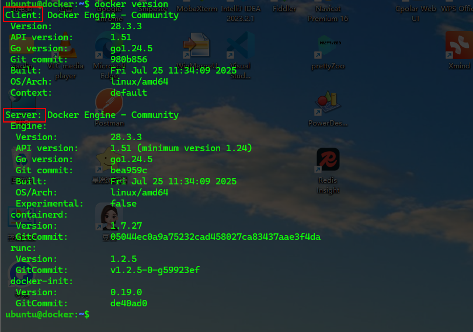
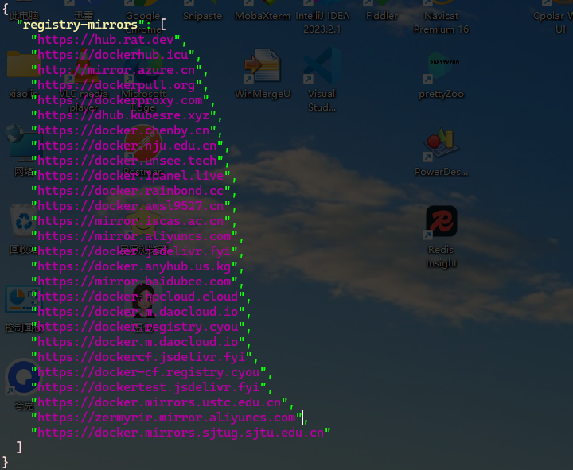
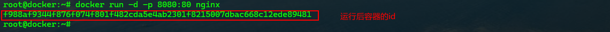
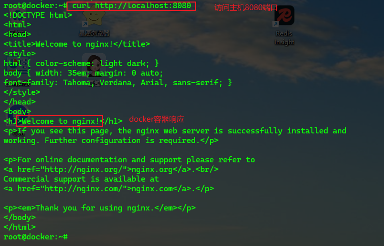
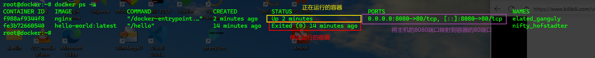
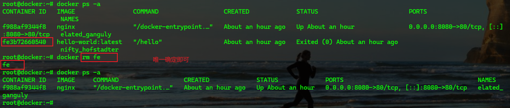
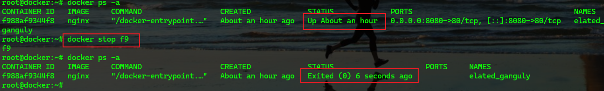
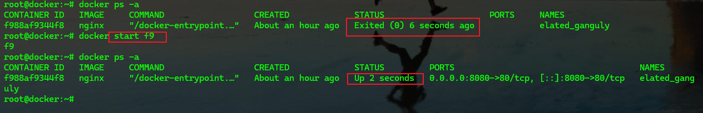
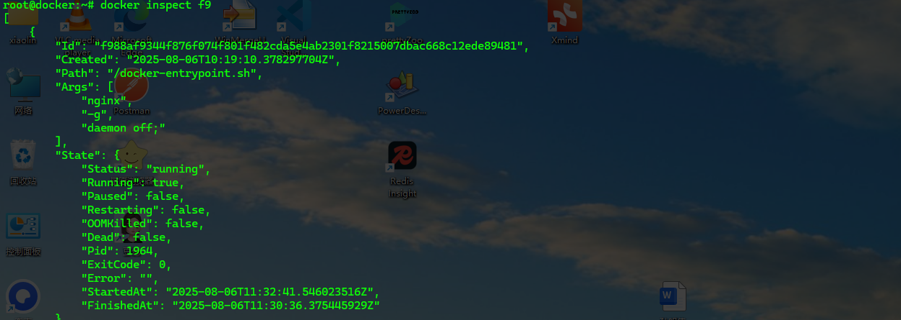

<!-- toc -->

### 前言

`Docker`作为容器的先行者，当前热度虽然下降，但是依然是学习和使用的好选择。

本系列希望达成的目标有三个：1. 学会安装和基本使用；2. 学会进阶内容；3. 能自己通过`Docker`进行项目部署

### 安装

#### `Ubuntu`

```bash
# 一些操作需要root权限，如果觉得麻烦可以到root用户下操作
# 如果源中没有该应用或者下载过慢，需要更换源
# 建议先更新软件库
sudo apt update
sudo apt upgrade
# 安装过程中如果缺少系统工具需先安装系统工具
sudo apt -y install docker-ce
```

> 注：本次内容基于`multipass`虚拟机的`Ubuntu`系统

#### `CentOS`

```bash
# 一些操作需要root权限，如果觉得麻烦可以到root用户下操作
# 如果源中没有该应用或者下载过慢，需要更换源
# 建议先更新软件库
# 安装过程中如果缺少系统工具需先安装系统工具
sudo yum -y install docker-ce
```

#### 验证

```bash
docker version
```



#### 修改源

创建并编辑 `/etc/docker/daemon.json`文件

```bash
{
  "registry-mirrors": [
    "https://hub.rat.dev",
    "https://dockerhub.icu",
    "http://mirror.azure.cn",
    "https://dockerpull.org",
    "https://dockerproxy.com",
    "https://dhub.kubesre.xyz",
    "https://docker.chenby.cn",
    "https://docker.nju.edu.cn",
    "https://docker.unsee.tech",
    "https://docker.1panel.live",
    "https://docker.rainbond.cc",
    "https://docker.awsl9527.cn",
    "https://mirror.iscas.ac.cn",
    "https://mirror.aliyuncs.com",
    "https://docker.jsdelivr.fyi",
    "https://docker.anyhub.us.kg",
    "https://mirror.baidubce.com",
    "https://docker.hpcloud.cloud",
    "https://docker.m.daocloud.io",
    "https://docker.registry.cyou",
    "https://dockercf.jsdelivr.fyi",
    "https://docker-cf.registry.cyou",
    "https://dockertest.jsdelivr.fyi",
    "https://docker.mirrors.ustc.edu.cn",
    "https://zermyrir.mirror.aliyuncs.com",
    "https://docker.mirrors.sjtug.sjtu.edu.cn"
  ]
}
```



> 1. 国内的仓库源大部分(阿里，腾讯，网易，校园镜像)都失效了，我将找到的一个可用的藏到了里面:sunglasses:
> 2. 使用`docker search`命令结果可能出现`ERROR`，可以使用`docker pull hello-world`命令拉取一个简单镜像尝试，可以拉取成功即可

#### 重新运行

```bash
systemctl daemon-reload
service docker restart
```

```bash
# Ubuntu系统下载完成后会默认启动，如果要重新启动可以使用 service 命令
# 启动
sudo service docker start
# 关闭
sudo service docker stop
# 重启
sudo service docker restart
# 状态
sudo service docker status
```

### 基本使用

#### 镜像

##### 查找镜像

```bash
docker search xxx
```

从`Docker Hub`查找

##### 拉取镜像

```bash
docker pull xxx[:version]
```

##### 删除镜像

```bash
docker rmi IMAGE_ID	# 注意是rmi，rm是删除容器
```

##### 查看本地镜像

```bash
docker images
```

#### 容器

##### 创建并运行容器

```bash
docker run [option] xxx
# oprion
# -p machine_prot:container_port：如 -p 8080:80 表示将主机的8080端口映射到容器的80端口
# -d：后台运行，不添加时为前端运行，会占用当前的命令行窗口
# --name：指定名称，如 --name nginx01 
# --rm：退出时删除，无参，如 --rm
# --restart：no默认，不重启；on-failure:n失败时重启，尝试n次；always总是重启，如 --restart on-failure:3
# --env/-e：容器中的环境变量，采用key=value形式，如， -e JAVA_ENV=dev --env JAVA_HOME=/xxx/xxx
# --cpus：指定cpu核心数
# --memory：指定内存
# 其他参数可以通过docker run --help查看
```





##### 查看容器

```bash
docker ps [option]
# option 
# 不添加： 当前运行的容器
# -a： 所有容器
```



##### 删除容器

```bash
docker rm xxx
```



##### 停止容器

```bash
docker stop xxx
```



##### 启动容器

```bash
docker start xxx
```



##### 查看容器信息

```bash
docker inspect xxx
```



##### 容器中执行命令

```bash
docker exec -it xxx cmd
# -it：使用终端执行
# cmd：具体命令，如ls，vi，echo等
```

##### 查看容器状态

```bash
docker stats xxx
```

##### 进入容器内部

```bash
# 在容器中开启一个终端，执行 /bin/bash
docker exec -it xxx /bin/bash

# 退出
exit;
```

##### 查看容器日志

```bash
docker logs [option] xxx
# -f：实时更新
# -n：展示n行，如 -n 20
```


