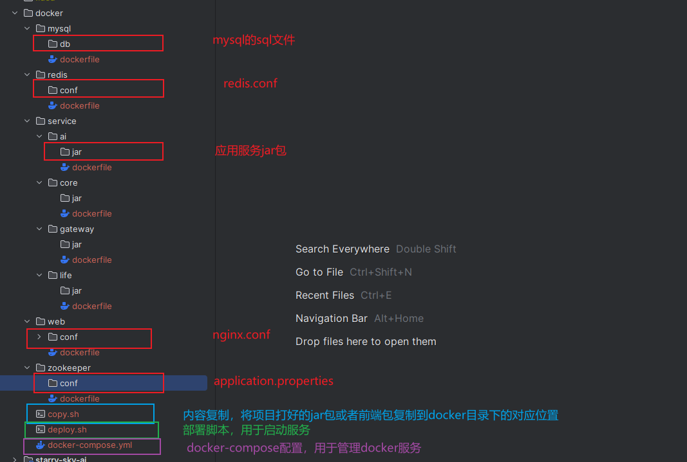

重头戏来了，学习的最终目的就是为了应用，所以项目部署就是我们的最终阶段。本阶段是在`windows`系统上完成的，需要在`windows`上安装`Docker Desktop`

### 安装`Docker Desktop`

1. 开启功能

   - `Hyper-V`
   - 适用于`Linux`的`Windows`子系统
   - 虚拟机平台

2. `wsl`安装`Ubuntu`

   - 将`wsl`设置为版本2

     ```bash
     # 用powershell
     wsl --set-default-version 2
     ```

   - 用`wsl`安装`Ubuntu`

     ```bash
     wsl --install ubuntu
     ```

     也可以使用`Microsoft Store`安装

     安装后建议修改源文件

3. 安装`Docker Desktop`

   如果一直卡在`Docker engine starting`，可以到`C:\Program Files\Docker\Docker`目录下执行命令

   ```bash
   ./DockerCli.exe --SwitchDaemon
   ```

4. 客户端设置

   `Settings` -> `Docker Engine`添加源

   ```json
   {
     "builder": {
       "gc": {
         "defaultKeepStorage": "20GB",
         "enabled": true
       }
     },
     "experimental": false,
     "insecure-registries": [],
     "registry-mirrors": [
       "https://docker.m.daocloud.io"
     ]
   }
   ```

   > 注意：
   >
   > 由于国内限制问题，会出现查询镜像查询不到的问题，建议直接使用`docker`命令直接拉取目标镜像，拉取完后可以在`Docker Desktop`中查看使用

### `SpringBoot`项目部署

#### `maven`插件

##### 常见插件

1. `Spring Boot Maven`打包内置的`build-image`

   ```bash
   # spring-boot-maven-plugin
   mvn spring-boot:build-image
   # 不需要写dockerfile，而是基于plugin配置构建
   # 配置官方文档： https://docs.spring.io/spring-boot/maven-plugin/build-image.html#build-image.build-image-goal
   # 官方文档的地址可能会发生变化，建议直接到spring-boot官网找maven-plugin，然后从goals中找到build-image即可
   ```

2. `Google`的`jib-maven-plugin`

   ```bash
   # 不需要dockerfile，甚至本地可以没有docker
   mvn comple com.google.cloud.tools:jib-maven-plugin:2.3.0:dockerBuild
   ```

3. `Spotify`的`dockerfile-maven-plugin`

   `pom.xml`

   ```xml
   <build>
       <plugins>
           <!-- 打包springboot包 -->
           <plugin>
               <groupId>org.springframework.boot</groupId>
               <artifactId>spring-boot-maven-plugin</artifactId>
           </plugin>
           <!-- 镜像构建插件 -->
           <plugin>
               <groupId>com.spotify</groupId>
               <artifactId>dockerfile-maven-plugin</artifactId>
               <version>1.4.13</version>
               <executions>
                   <execution>
                       <id>default</id>
                       <goals>
                           <goal>build</goal>
                           <goal>push</goal>
                       </goals>
                   </execution>
               </executions>
               <configuration>
                   <repository>192.168.0.1:5000/xiao-lin-unit/${project.artifactId}</repository>
                   <tag>${project.version}</tag>
                   <!-- 开启验证 -->
                   <useMavenSettingsForAuth>true</useMavenSettingsForAuth>
                   <buildArgs>
                       <!-- 设置dockerfile中的JAR_FILE参数定义的值 -->
                       <JAR_FILE>target/${project.artifactId}-${project.version}.jar</JAR_FILE>
                   </buildArgs>
               </configuration>
           </plugin>
       </plugins>
   </build>
   ```

   `settings.xml`

   ```xml
   <servers>
       <server>
           <id>192.168.0.1:5000</id>
           <username>admin</username>
           <password>123456</password>
       </server>
   </servers>
   ```

   `Dockerfile`

   ```dockerfile
   FROM openjdk:21
   
   MAINTAINER xiao-lin <xiao_lin_unit@163.com>
   
   ARG JAR_FILE
   
   RUN mkdir -p /spring-boot-demo
   
   WORKDIR /spring-boot-demo
   
   COPY $JAR_FILE application.jar
   
   ENV TZ=Asia/Shanghai JAVA_OPTS="-Xms256m -Xmx256m"
   
   EXPOSE 8080
   
   CMD java $JAVA_OPTS -Djava.security.edg=file:/dev/./urandom -jar application.jar
   ```

   > 打包时需要将docker的2375端口暴露出来
   >
   > `Docker Desktop` -> `Settings` -> `General` -> `Expose daemon on tcp://localhost:2375 without TLS`

   创建一个`docker`启动容器的脚本`docker-deploy.sh`

   ```bash
   #!/bin/bash
   
   COMMAND=$1
   
   APP_NAME=$2
   
   # shellcheck disable=SC1069
   if[ -z "$APP_NAME" ]; then
     APP_NAME="spring-boot-demo"
   fi
   
   EXPOSE_PORT=8080
   
   NAMESPACE=xiao-lin-unit
   
   TAG=1.0.0
   
   REGISTRY_SERVER=192.168.0.1:5000
   
   # shellcheck disable=SC2209
   USERNAME=admin
   
   PASSWORD=123456
   
   IMAGE_NAME="$REGISTRY_SERVER/$NAMESPACE/$APP_NAME:$TAG"
   
   function usage() {
       echo "Usage: sh docker-deploy.sh [up|start|stop|restart|rm]"
       exit 1
   }
   
   function login() {
       echo "docker login -u $USERNAME --password-stdin $REGISTRY_SERVER"
       echo "$PASSWORD" | docker login -u $USERNAME --password-stdin $REGISTRY_SERVER
   }
   
   # shellcheck disable=SC2120
   function start() {
       CONTAINER_NAME=$(docker ps | grep "$APP_NAME" | awk '{print $NF}')
       if [ -n "$CONTAINER_NAME" ]; then
         echo "container $CONTAINER_NAME already started..."
         exit 1
   
       fi
       IMAGE=$(docker images | grep "$APP_NAME" | awk "{print $3}")
       if [ -z "$IMAGE" ]; then
           login
       fi
       echo "starting container $APP_NAME..."
       docker run -d --restart=already --name $APP_NAME -p $EXPOSE_PORT:8080 $IMAGE_NAME
       echo "container $APP_NAME started..."
   }
   
   function stop() {
       CONTAINER_NAME=$(docker ps | grep "$APP_NAME" | awk '{print $NF}')
       if [ -z "$CONTAINER_NAME" ]; then
         echo "container $CONTAINER_NAME not running..."
         exit 1
       fi
       echo "stopping container $APP_NAME..."
       docker stop "$CONTAINER_NAME"
       echo "container $APP_NAME stopped..."
   }
   
   function restart() {
       stop
       start
   }
   
   function rm() {
       CONTAINER_NAME=$(docker ps | grep "$APP_NAME" | awk '{print $NF}')
       if [ -n "$CONTAINER_NAME" ]; then
         stop
   
         echo "removing container $APP_NAME..."
         docker rm "$CONTAINER_NAME"
         echo "container $APP_NAME removed..."
       fi
   
       IMAGE=$(docker images | grepj "$APP_NAME" | awk '{print $3}')
       if [ -n "$IMAGE" ]; then
           echo "removing image $IMAGE..."
           docker rmi "$IMAGE"
           echo "image $IMAGE removed..."
       fi
   }
   
   function up() {
       rm
       start
   }
   
   case "$COMMAND" in
   "up")
     up
     ;;
   "start")
     start
     ;;
   "stop")
     stop
     ;;
   "restart")
     restart
     ;;
   "rm")
     rm
     ;;
   *)
     usage
     ;;
   esac
   ```

   > 基于以上内容后，部署项目只需要三个步骤
   >
   > 1. 项目打包
   > 2. 推送到镜像仓库
   > 3. 使用部署脚本重新部署项目

推荐`IDEA`插件，`Alibaba Cloud Toolkit`，此工具包是一个远程连接的插件，可以时间在`IDEA`中连接远程服务器，不修改和影响前面的项目部署配置和过程

1. 安装

   在`IDEA`中添加`Alibaba Cloud Toolkit`插件

2. 添加`Host`

   > 如果连接的是`Windows`系统，需要确认系统是否安装了`OpenSSH`
   >
   > 安装方式，使用管理员运行`PowerShell`：
   >
   > ```bash
   > # 获取相关组件
   > Get-WindowsCapability -Online | Where-Object Name -like 'OpenSSH*'
   > # 安装服务
   > Add-WindowsCapability -Online -Name OpenSSH.Server~~~~0.0.1.0
   > # 启动服务
   > Start-Service sshd
   > # 设置启动类型
   > Set-Service -Name sshd -StartupType Automatic
   > ```

### 微服务项目部署

#### 微服务项目部署问题及解决方案

1. 服务+中间件的复杂度问题

   使用`docker-compose`的服务编排能力，实现多服务的批量化处理

2. 服务与服务之间的依赖关系

   使用`docker-compose`的`depends_on`属性来设置服务依赖

3. 服务之间的网络共享问题

   利用自定义网络或者`links`来实现网络共享

4. 有状态服务的数据持久化问题

   使用数据卷进行持久化的数据管理

#### 微服务项目`docker`镜像结构及配置



`docker-compose.yml`

```yml
version: "3.8"

services:
  starry-sky-mysql:
    container_name: "starry-sky-mysql"
    image: "mysql:8.5"
    build:
      context: ./mysql
    ports:
      - "3306:3306"
    volumes:
      - ./mysql/conf:/etc/mysql/conf.d
      - ./mysql/logs:/logs
      - ./mysql/data:/var/lib/mysql
    command: [
      'mysqld',
      '--innodb-buffer-pool-size=80M',
      '--character-set-server=utf8mb4',
      '--collation-server=utf8mb4_unicode_ci',
      '--default-time-zone=+8:00'
      '--lower-case-table-names=1'
    ]
    environment:
      MYSQL_DATABASE: 'starry-sky'
      MYSQL_ROOT_PASSWORD: '123456'
  starry-sky-redis:
    container_name: "starry-sky-redis"
    image: redis
    build:
      context: ./redis
    ports:
      - "6379:6379"
    volumes:
      - ./redis/conf/redis.conf:/home/starry-sky/redis/redis.conf
      - ./redis/data:/data
    command: redis-server /home/starry-sky/redis/redis.conf
  starry-sky-zookeeper:
    container_name: "starry-sky-zookeeper"
  starry-sky-web:
    container_name: "starry-sky-web"
    image: nginx
    build:
      context: ./web
    ports:
      - "80:80"
    volumes:
      - ./web/html/dist:/home/projects/starry-sky/web
      - ./web/conf/nginx.conf:/etc/nginx/nginx.conf
      - ./web/logs:/var/log/nginx
      - ./web/conf.d:/etc/nginx/conf.d
    depends_on:
      - starry-sky-gateway
    links:
      - starry-sky-gateway
  starry-sky-gateway:
    container_name: "starry-sky-gateway"
    build:
      context: ./service/gateway
      dockerfile: dockerfile
    ports:
      - "8080:8080"
    depends_on:
      - starry-sky-redis
    links:
      - starry-sky-redis
  starry-sky-core:
    container_name: "starry-sky-core"
    build:
      context: ./service/core
      dockerfile: dockerfile
    ports:
      - "8081:8081"
    depends_on:
      - starry-sky-redis
      - starry-sky-mysql
      - starry-sky-gateway
  starry-sky-life:
    container_name: "starry-sky-life"
    build:
      context: ./service/life
      dockerfile: dockerfile
    ports:
      - "8082:8082"
    depends_on:
      - starry-sky-redis
      - starry-sky-mysql
      - starry-sky-gateway
      - starry-sky-core
  starry-sky-ai:
    container_name: "starry-sky-ai"
    build:
      context: ./service/ai
      dockerfile: dockerfile
    ports:
      - "8083:8083"
    depends_on:
      - starry-sky-redis
      - starry-sky-mysql
      - starry-sky-gateway
      - starry-sky-core
```

> 注意：
>
> 1. 每个项目的配置不一样，`docker-compose.yml`应该根据自己的项目进行自定义配置,具体如何配置可以根据<a href="https://docs.docker.com/reference/compose-file">官方文档</a>查看
> 2. 每个`dockerfile`文件的内容应基于镜像本身和项目特点来修改配置，如`mysql`、`redis`可能需要持久化策略，需要用到数据卷；`zookeeper`则根据需要，如果只是服务注册而不作为配置中心则不需要数据卷

`deploy.sh`

```bash
#!/bin/sh

usage() {
  echo "Usage: sh deploy.sh [base|services|stop|rm]"
  exit 1
}

base() {
  docker-compose up -d starry-sky-mysql starry-sky-redis starry-sky-zookeeper
}

services() {
  docker-compose up -d starry-sky-gateway starry-sky-core starry-sky-life starry-sky-ai
}

all() {
  base
  services
}

stop() {
  docker-compose stop
}

rm() {
  docker-compose rm
}

case "$1" in
"base")
  base
  ;;
"services")
  services
  ;;
"all")
  all
  ;;
"stop")
  stop
  ;;
"rm")
  rm
  ;;
*)
  usage
  ;;
esac
```

基于以上，微服务项目的部署步骤如下：

1. 项目打包
2. 内容复制，利用`copy.sh`（或者基于配置手动复制）将相关内容复制到对应的目录下
3. 目录上传，将整个`docker`目录及其内容复制到部署服务器
4. 项目部署，使用`deploy.sh`（或者手动）进行容器编排方式的项目部署

> `docker-compose`是单机的项目部署方式
>
> 分布式部署可以使用`swarm`


