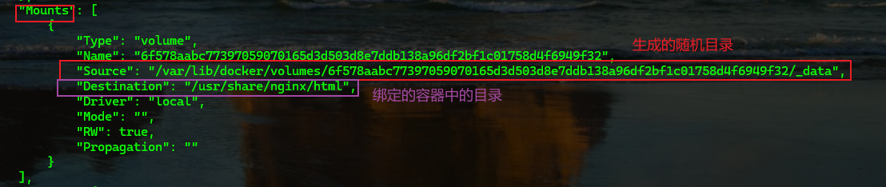
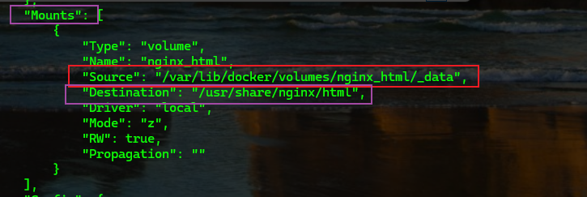
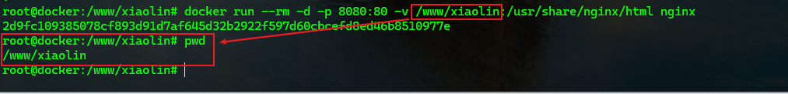
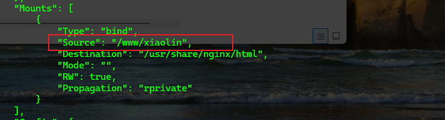
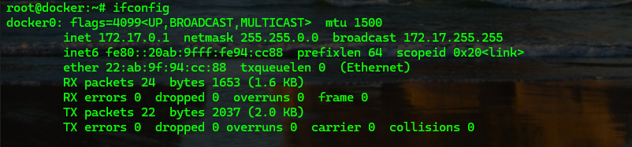
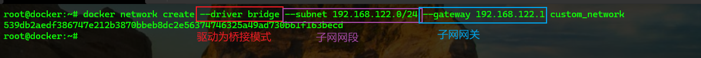
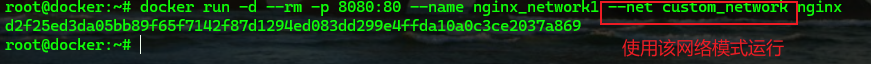
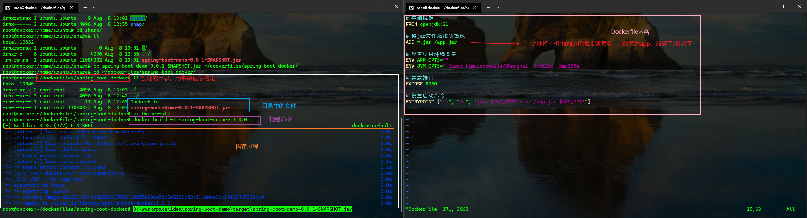
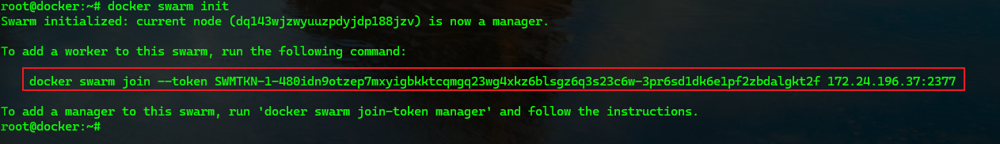
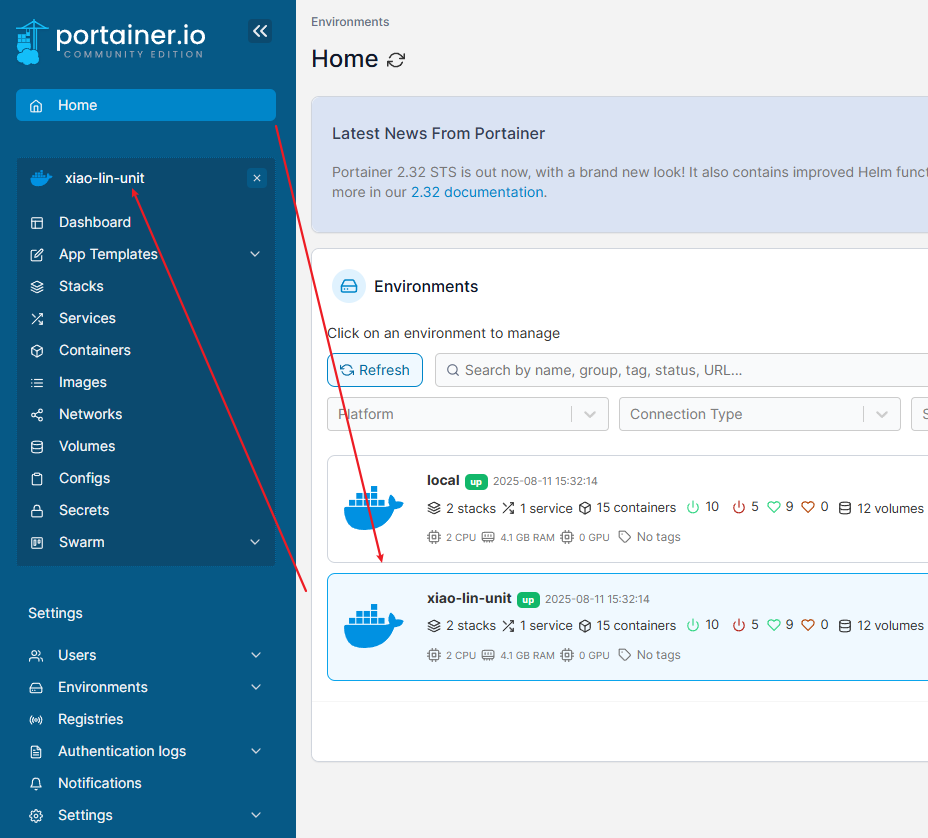

### 数据卷

`Volume`

#### 基本概念

由于容器会将数据进行隔离，所以容器无法访问外部内容，容器内部的内容也不易改变，导致容器实际用途不大。比如，通过`nginx`镜像创建的容器只能访问到`nginx`的`index.html`页面，如果想要将自己的网站部署到该容器中，有两种方式

1. 将自己的网站内容添加到容器中
2. 采用数据卷的方式，将容器与内容绑定

数据卷就是容器访问外部数据的通道，实现数据的部分共享

#### 绑定方式

1. 匿名绑定

   - 启动容器时直接使用`-v container_dir`绑定
   - 在`Docker`的`volumes`目录下生成一个随机目录，指定的`/container_dir`中的文件或目录将保存在该随机目录中
   - 匿名绑定的`volumes`在容器被删除时也会被删除
   - 使用`docker inspect container_id`查看`Mounts.Source`内容查找数据卷在主机中的哪个位置

   > `container_dir`指的是容器内的目录

   

   

2. 具名绑定

   - 启动容器时直接使用`-v host_dir_name:container_dir`绑定
   - 在`Docker`的`volumes`目录下生成一个`host_dir_name`目录，指定的`/container_dir`中的文件或目录将保存在该`host_dir_name`目录中
   - 具名绑定的`volumes`在容器被删除时不会被删除
   - 使用`docker inspect container_id`查看`Mounts.Source`内容查找数据卷在主机中的哪个位置

   

   

3. `Bind Mounts`

   - `Bind Mounts`方式是绑定并加载主机的某个文件目录到容器中，而不是像前两种方式共享容器中的目录内容
   - `Bind Mounts`绑定方式与具名绑定类似，不同的是具名绑定使用的是目录名称(自定义的)，`Bind Mounts`使用的是目录的绝对路径`-v /host_dir:container_dir`

   

   

#### 数据卷管理

`docker volume`命令管理数据卷

##### 创建

```bash
docker volume create
```

##### 查看

```bash
docker volume ls	# 列表查看	
docker volume inspect xxx # 查看某个数据卷的详细信息
```

##### 删除

```bash
docker volume rm xxx # 删除指定的数据卷
docker volume prune # 删除本地未使用的数据卷
```

### 网络

`Network`

实现部分容器间的网络共享，管理多个子网下的容器`IP`

#### 网络模式

##### 桥接模式

`bridge`，在主机中创建一个`Docker`网桥(`Docker0`)，在`Docker0`上创建一对虚拟网卡一半在主机(`veth n`)，一半在容器内(`eth 0`)，是容器的默认网络模式



##### 主机模式

`host`，容器不再有自己的网络空间，而是直接与主机共享网络空间，基于此模式创建的容器的`IP`实际就是与主机同一个子网

##### `none`

`Docker`会有自己的网络空间，不与主机共享，在这个网络模式下的容器不会被分配网卡，`IP`，路由等相关信息

##### `container`

`container`是基于已有容器的网络模式，与某个已有容器共享网络

##### 自定义

使用`docker network`命令，基于前三种网络模式自定义网络模式

1. 创建

   ```bash
   docker network create [opetion] {name}
   ```

   

   使用自定义的网络创建容器

   ```bash
   docker run -d --rm -p {host_port}:{container_port} --name {contrainer_name} --net {custom_network_name} {image_name}
   ```

   

   网络内部的容器可以通过容器名称互通

   ```bash
   ping {contrainer_name}
   ```

2. 删除

   ```bash
   docker network rm xxx #删除指定网络
   docker network prune #删除所有未使用的网络
   ```

3. 连接

   ```bash
   # 将某个容器连接到某个网路欧中
   docker network connect {network} {container}
   ```

4. 断开连接

   ```bash
   docker network connect {network} {container}
   ```

5. 查看

   ```bash
   docker network ls # 列表查看
   docker network inspect xxx # 查看某个网络的详细信息
   ```

### `Dockerfile`

自定义构建镜像的配置文件，描述如何构建一个镜像，利用`Docker`的`build`命令，指定`Dockerfile`，就可以按照配置将镜像构建出来

#### 常用指令

##### `FROM`

指定当前镜像的基础镜像

```dockerfile
FROM {image_name}
# 例如
FROM openjdk:21
```

##### `MAINTAINER`

描述镜像的作者和联系方式（可选）

```dockerfile
MAINTAINER {author_name}<{author_address}>
# 例如
MAINTAINER xiaolin<xiao_lin_unit@163.com>
```

##### `LABEL`

为镜像设置标签，可以设置多个（可选）

```dockerfile
LABEL {key}={value}
# 例如
LABEL version='1.0.0'
LABEL description='image description'
```

##### `ENV`

环境变量配置，可以设置多个

```dockerfile
ENV {key} {value} # 设置一个
ENV {key}={value} {key}={value}... #设置多个
```

##### `RUN`

在构建镜像时，需要执行的`shell`命令，长配合`ADD`使用

```dockerfile
RUN {cmd} # 基于shell命令，执行某个命令
# 例如
RUN ls -al
RUN mkdir /example
RUN ["{path}/{name}.sh", "param1", "param2"...] # 基于可执行文件
# 例如
RUN ["/var/lib/rancher/k3s/etc/containerd/k3s-agent-uninstall.sh"]
```

##### `ADD`或者`COPY`

将主机中的指定文件复制到容器中的目标位置

```dockerfile
ADD {host_file} {container_dir}
ADD ["{host_file}", "{container_dir}"]
# 例如
ADD /etc/hosts /etc
```

> ADD和COPY的使用方式基本一致，大多数情况下可以替换
>
> 在添加压缩包时不能替换，ADD会将压缩包解压，但是COPY只是原样复制

##### `WORKDIR`

设置容器中的工作目录，如果目录不存在，则创建

```dockerfile
WORKDIR {list_path}
# 执行完后，后续操作将在该目录下执行（类似于cd到该目录下）
```

##### `VOLUME`

镜像数据卷绑定，将主机中的指定目录挂在到容器中

```dockerfile
VOLUME ["{host_dir_path}"]
VOLUME {host_dir_path}
VOLUME {host_dir_path} {host_dir_path}
# 通过这种方式绑定的目录，在主机目录和由该镜像创建的容器中的目录是一一对应的
# 如 主机中有一个 /www/xiaolin 目录，经过 VOLUME ["/www/xiaolin"] 绑定后，创建的容器用也有一个 /www/xiaolin 目录，而且与主机目录是Bind Mounts的绑定方式
```

##### `EXPOSE`

设置容器启动后要对容器外暴露的端口

```dockerfile
EXPOSE port
# 仅仅是指将容器的端口暴露出来，并不与主机建立绑定关系
```

##### `CMD`或者`ENTRYPOINT`

选择其中一个即可，作用是描述镜像构建完成后，启动容器时默认执行的脚本或参数。只设置一次，如果写了多次则只有最后一次生效

1. `CMD`: 

   ```dockerfile
   CMD ["{path}/{bash}.sh", "param1", "param2"]
   CMD ["param1", "param2"]
   CMD {cmd} {param1} {param2}
   # 会被容器运行时指定的命令覆盖
   # docker run xxx /bin/bash -> 其中/bin/bash会覆盖掉CMD执行的内容 
   ```

2. `ENTRYPOINT`:

   ```dockerfile
   ENTRYPOINT ["{path}/{bash}.sh", "param1", "param2"]
   ENTRYPOINT ["param1", "param2"]
   ENTRYPOINT {cmd} {param1} {param2}
   # 不会被容器运行时指定的命令覆盖
   # docker run xxx /bin/bash -> /bin/bash不会覆盖掉ENTRYPOINT执行的内容 
   ```
   

> CMD的扩展性比ENTRYPOINT更高

##### 扩展指令

1. `ARG`: 设置变量，在镜像中定义一个变量，当使用`docker build`命令构建镜像时，带上`--build-arg key=value`来指定参数值

   ```dockerfile
   ARG {var}[="{default_value}"]
   # 使用时用 ${var} 使用
   # 如
   ARG centos=latest
   FROM centos:$contos
   ```

2. `USER`: 设置容器的用户，可以是用户名或`PID`，如果容器设置了以`daemon`用户去运行，那么`RUN`、`CMD`和`ENTRYPOINT`都会以这个用户去运行，一定要先确定容器中有这个用户，并且有对应的操作权限

   ```dockerfile
   USER {username}
   USER {PID}
   ```

3. `ONBUILD`: 对构建当前镜像没有影响，在其他镜像的基础镜像为当前镜像时，会执行`ONBUILD`指定的操作

   ```dockerfile
   ONBUILD RUN ls -al # 如此镜像为 image01
   # 上述内容在构建当前镜像时没有影响
   # 当构建其他镜像，其基础镜像为当前镜像时（FROM image01），会执行RUN ls -al操作
   ```

4. `STOPSIGNAL`: 容器停止时发送的信号

   ```dockerfile
   STOPSIGNAL {signal}
   ```

5. `HEALTHCHECK`: 在容器内部按照指定周期运行指定命令来检测容器健康状况；取消在基础镜像

   ```dockerfile
   HEALTHCHECK [opetion] CMD {cmd}
   # option
   # interval
   # timeout
   # retries
   ```


#### 构建镜像

##### `commit`

基于一个现有的容器，构建一个新的镜像

```bash
docker commit [option] {container} [repository[:tag]
docker commit -a "xiao-lin" -m "build a image with a container" {container_name} {image_name:version}
```

##### `build`

1. `spring-boot`

   ```bash
   # build 命令
   docker build [option] {path}
   # path指向含有Dockerfile文件的目录
   # option
   # -t 指定tag
   docker build -t spring-boot-docker:1.0.0 .
   # -t 指定镜像名称和版本
   # path为 . ,即当前目录
   ```

   

2. `nginx`

   ```dockerfile
   ARG CENTOS_VERSION="7"
   
   # 设置基础镜像
   FROM centos:$CENTOS_VERSION
   
   # 维护者信息
   MAINTAINER xiaolin<xiao_lin_unit@163.com>
   
   # 安装工具
   RUN curl -o /etc/yum.repos.d/CentOS-Base.repo https://mirrors.aliyun.com/repo/Centos-7.repo
   RUN yum clean all
   RUN yum makecache
   RUN yum install -y wget
   RUN yum install -y gcc
   RUN yum install -y gcc-c++
   RUN yum install -y make
   RUN yum install -y openssl-devel
   # 创建 www用户作为nginx启动用户
   # RUN useradd -s /sbin/nologin -M www
   WORKDIR /usr/local/src
   RUN wget http://nginx.org/download/nginx-1.22.1.tar.gz
   RUN tar -zxvf nginx-1.22.1.tar.gz
   #
   WORKDIR /usr/local/src/nginx-1.22.1
   
   # nginx编译安装
   RUN ./configure --prefix=/usr/local/nginx --with-http_ssl_module --with-http_stub_status_module
   RUN make && make install
   
   # 关闭nginx后台运行
   RUN echo 'daemon off;' >> /usr/local/nginx/conf/nginx.conf
   
   # 创建 nginx 命令快速访问的环境变量
   ENV PATH=/usr/local/nginx/sbin:$PATH
   
   # 暴露端口
   EXPOSE 80
   
   CMD ["nginx"]
   ```

### 仓库

`regitry`

#### 阿里云

1. 创建仓库：容器镜像服务 -> 实例列表 -> 个人/企业 -> 命名空间（创建命名空间）-> 镜像仓库（创建镜像仓库，自己使用的仓库选择本地仓库即可）

   > 创建的每一个仓库都是一个镜像的版本库，不同名称的镜像创建不同名称的仓库
   >
   > 如，你的`nginx`镜像就创建`nginx`仓库，你的`redis`镜像就创建`redis`仓库

2. 登录仓库：根据仓库的基本信息中的仓库登录方式，登录仓库并输入密码

   ```bash
   docker login --username={usernmae} {registy_sign}.cn-qingdao.personal.cr.aliyuncs.com
   ```

3. 推送仓库：分为打标签和推送两步

   ```bash
   # 打标签
   docker tag {image_id} {registy_sign}.cn-qingdao.personal.cr.aliyuncs.com/xiao_lin_unit/nginx:{version}
   ```

   ```bash
   # 推送，push的内容与前面打标签的内容要一致
   docker push {registy_sign}.cn-qingdao.personal.cr.aliyuncs.com/xiao_lin_unit/nginx:{version}
   ```

#### `Nexus`

1. 主机做仓库

   ```bash
   # 1. 安装jdk8
   sudo apt install openjdk-8-jdk
   # 2. 上传nexus包
   # 3. 解压缩nexus包
   tar -zxvf nexus.tar.gz
   # 修改相关配置后启动
   java -jar nexus.jar
   ```

2. 使用`docker`镜像创建容器，绑定相关端口和数据卷

   ```bash
   mkdir /opt/nexus
   chmod 755 /opt/nexus
   docker run -d --restart=always -p 8868:8081 -p 5000:5000 -p 5001:5001 --name nexus -v /opt/nexus:/nexus-data sonatype/nexus3
   # 我使用时镜像创建的容器内启动jar包时报错，无妨访问
   ```
```
   
3. 登录`nexus manager`，注意访问地址和端口

4. 创建一个存储器`Blob Stores`

5. 创建仓库`Repositories`选择`docker`类型的仓库，添加信息并创建

6. 将私服仓库添加到`docker`的镜像源

   ```bash
   vi /etc/docker/daemon.json
   
   # 修改内容
   {
     "insecure-registries": ["ip:5000", "ip:5001"]
   }
   
   systemctl daemon-reload
   systemctl restart docker
   # 使用docker方式部署nexus则需要重新启动容器
```

#### `Harbor`

`docker`专用，必须安装`docker`和`docker-compose`

```bash
apt install -y docker-compose
```

下载`Harbor`

```bash
wget https://github.com/goharbor/harbor/releases/download/v2.11.1/harbor-offline-installer-v2.11.1.tgz
tar -zxvf harbor-offline-installer-v2.11.1.tgz
cd harbor
cp harbor.yml.tmpl harbor.yml
vi harbor.yml

# 修改内容
hostname: IP # 不要用localhost和127.0.0.1
# 修改密码
harbor_admin_password: 123456
# 注释掉ssl部分


# 修改完后安装
bash prepare
bash install.sh --with-trivy
```

登录系统 -> 创建项目

```bash
vi /etc/docker/daemon.json

# 修改内容
{
  "insecure-registries": ["ip:port"]
}

systemctl daemon-reload
systemctl restart docker
# 使用docker方式部署nexus则需要重新启动容器
```

```bash
# 登录
docker login -u{username} ip:port

docker tag {image_id} ip:port/{project_name}/{image_name}[:{version}]

docker push ip:port/{project_name}/{image_name}[:{version}]
```

### 容器编排

针对容器生命周期的管理

依赖管理，副本数控制，配置共享

#### `Docker Compose`

单机环境的容器编排

关键：`docker-compose.yml`配置文件

##### 安装

```bash
# 版本要跟docker对应
# 下载
sudo curl -L "http://mirrors.aliyun.com/docker-toolbox/linux/1.21.2/docker-compose-$(uname -s)-$(uname -m)" -o /usr/local/bin/docker-compose

# 赋予可执行权限
sudo chmod +x /usr/local/bin/docker-compose

# 添加软链接
sudo ln -s /usr/local/bin/docker-compose /usr/bin/docker-compose

# 查看结果
docker-compose --version
```

##### 使用

创建一个目录作为一个项目的`docker-compose`工作空间，并在该目录下创建`docker-compose.yml`文件

```bash
mkdir -r /opt/docker/nginx
cd /opt/docker/nginx
touch docker-compose.yml

# 对普通镜像而言，最重要的三个配置是 services，networks，volumes
vi docker-compose.yml
```

> `docker-compose.yml`的配置可以通过<a href="https://docs.docker.com/reference/compose-file">官方文档</a>查看

```yml
version: "3.1" # 遵循的docker-compose的api版本
name: myapp

services: 
  # mynginx配置
  mynginx: 
    image: "nginx" # 指定镜像
    restart: "always" # 重启策略
    networks: 
      - xiao_lin_n
    volumes: 
      - xiao_lin_v:/var/lib/data
    envrionment: 
      APP_ENV: dev
    dns: 
      - 114.114.114.114
    depends_on: 
      - centos # 依赖于centos服务，等centos服务启动才能运行
  centos: 
    image: centos
  myservice: 
    image: "java"
    networks: 
      - xiao_lin_n
    volumes: 
      - xiao_lin_v:/etc/data
    depends_on: 
      - redis
      - db
    ports: 
      - 80 # 表示容器暴露的端口，与主机不进行固定绑定
  redis: 
    image: redis
  db: 
    image: "mysql:8.1"
      
networks: 
  xiao_lin_n: 
    driver: bridge
    ipam: 
      driver: default
      config: 
        - subnet0: 192.173.0.0/24
          gateway: 192.173.0.1
        - subnet1: 192.174.00/24
          gateway: 192.174.0.1

volumes: 
  xiao_lin_v: # 通过数据卷定义，将上述两个服务的 /var/lib/data 和 /etc/data 目录挂载
```

```bash
docker-compose config # 查看配置文件是否有错误
# 创建服务
docker-compose create [{service_name}]
# 创建并启动服务
docker-compose up [-d {service_name}]
# 启动服务
docker-compose start [{service_name}]
# 停止服务
docker-compose stop
# 停止并删除服务
docker-compose done

# 弹性扩容缩容
docker-compose scale {service_name}=num
```


#### `Swarm`

分布式环境的容器编排

多台物理机，在`master`物理机上执行初始化命令

```bash
docker swarm init
```



在`node`物理机上执行上述红色标记的命令，将该物理机作为一个`node`

之后的相关内容在`master`节点上执行即可

```bash
# 创建服务容器
# option
# replicas: 创建数量
docker service create [option] {image}
docker service create --replicas 1 -p 8080:80 --name nginx_swarm nginx

# 查看服务信息
docker service inspect --pretty {service_name}

# 修改数量
docker service update --replicas {num}

# node节点退出集群
docker swarm leave
```


### 可视化

`portainer`

使用`portainer`镜像

```bash
# 基于swarm
docker service create --replicas 1 -p 9000:9000 --mount type=bind,src=/var/run/docker.sock,dst=/var/run/docker.sock --mount type=volume,src=portainer_data,dst=/data portainer/portainer
```

使用浏览器访问，初次访问时默认为`admin`用户，为其设置密码

1. 创建环境

2. 基于环境进行`docker`管理

   


