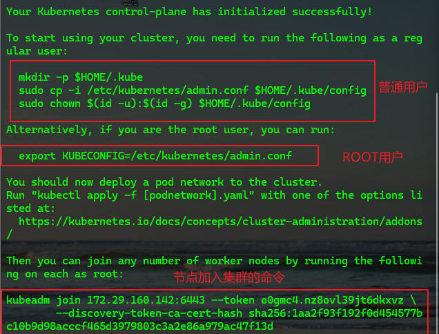
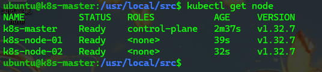
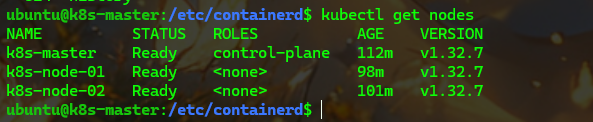
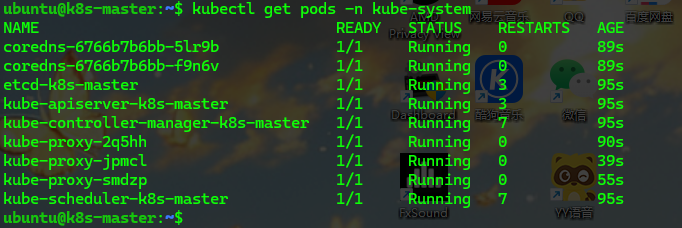
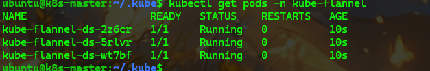

<!-- toc -->

### 前言

基于前篇, 我们已经安装并配置好了`containerd`环境, 本篇将在此基础上开始搭建`K8s`

### 安装`K8s`功能包

安装`kubeadm`、`kubelet` 和 `kubectl`

```bash
# 更新 apt 包索引并安装使用 Kubernetes apt 仓库所需要的包
sudo apt update
# apt-transport-https 可能是一个虚拟包（dummy package）；如果是的话，你可以跳过安装这个包
sudo apt install -y apt-transport-https ca-certificates curl gpg

# 下载用于 Kubernetes 软件包仓库的公共签名密钥
# 如果 `/etc/apt/keyrings` 目录不存在，则应在 curl 命令之前创建它，请阅读下面的注释。
# sudo mkdir -p -m 755 /etc/apt/keyrings
curl -fsSL https://pkgs.k8s.io/core:/stable:/v1.32/deb/Release.key | sudo gpg --dearmor -o /etc/apt/keyrings/kubernetes-apt-keyring.gpg

# 添加 Kubernetes 仓库, 仅包含 1.32的软件包
# 此操作会覆盖 /etc/apt/sources.list.d/kubernetes.list 中现存的所有配置。
echo 'deb [signed-by=/etc/apt/keyrings/kubernetes-apt-keyring.gpg] https://pkgs.k8s.io/core:/stable:/v1.32/deb/ /' | sudo tee /etc/apt/sources.list.d/kubernetes.list

# 跟新包索引
sudo apt update
# 安装kubelet kubeadm kubectl
sudo apt install -y kubelet kubeadm kubectl
# 锁定kubelet kubeadm kubectl版本
sudo apt-mark hold kubelet kubeadm kubectl
```

### 前期配置

主节点和从节点都需要修改主机的网络配置

```bash
sudo vi /etc/sysctl.conf
# 修改内容
net.ipv4.ip_forward=1
# 立即生效
sudo sysctl -p
# 永久生效
sudo chmod 644 /etc/sysctl.conf
```

### 部署`Kubernetes Master`

在主节点上做初始化操作

```bash
sudo kubeadm init --image-repository registry.aliyuncs.com/google_containers --apiserver-advertise-address=${k8s_master_ip} --kubernetes-version v1.32.7 --service-cidr=10.96.0.0/12 --pod-network-cidr=10.244.0.0/16

# 例如
# sudo kubeadm init --image-repository registry.aliyuncs.com/google_containers --apiserver-advertise-address=192.168.5.101  --kubernetes-version v1.32.7 --service-cidr=10.96.0.0/12 --pod-network-cidr=10.244.0.0/16
```

> 国内在初始化时指定一下镜像源, 否则会无法拉取镜像而导致失败



```bash
# 普通用户
mkdir -p $HOME/.kube
sudo cp -i /etc/kubernetes/admin.conf $HOME/.kube/config
sudo chown $(id -u):$(id -g) $HOME/.kube/config
 
# ROOT 用户
export KUBECONFIG=/etc/kubernetes/admin.conf
```

推荐使用普通用户

重置集群

```bash
sudo kubeadm reset
```

需要在每个节点都执行

### 加入集群`Kubernets Node`

1. 使用以下命令加入集群

    ```bash
    sudo kubeadm join {k8s_master_ip}:6443 --token {k8s_master_token} --discovery-token-ca-cert-hash sha256:{k8s_maste_hash}
    
    # 例如 sudo kubeadm join 192.168.5.101:6443 --token c1qyym.5srgs3r3i94wepqh --discovery-token-ca-cert-hash  sha256:472d5b07da9edd6bc1ecf93d9b8f0ed8e9888eba504e2620ab94d253c0fc9bc0
    ```
    
如果初始化时的`token`清空了, 可以在`master`服务器通过以下命令查看
    
```bash
    kubeadm token list
    ```
    
如果`token`已经过期, 可以通过以下命令重新申请
    
```
    kubeadm token create
    ```
    
如果初始化时的master_hash清空了, 可以在master服务器通过以下命令查看
    
```
    openssl x509 -pubkey -in /etc/kubernetes/pki/ca.crt | openssl rsa -pubin -outform der 2>/dev/null | openssl dgst -sha256 -hex | sed 's/^.* //'
    ```
    
在执行命令成功后可以通过以下命令查看是否已经加入集群
    
```
    kubelet get nodes
    ```
    

    
> 注意: 
    >
    > 1. 查看节点的操作要在`master`节点上操作
    > 2. 如果节点是`NotReady`状态, 可能是没有安装跨服务器的网络插件
    
2. 将`master`节点配置复制到`node`节点

   ```bash
   # 或者想其他方式将文件复制过去
   scp root@<master-ip>:/etc/kubernetes/admin.conf ~/.kube/config
   # scp root@k8s-master:~/.kube/config ~/.kube/config
   # k8s-master 是主机名, 需要配置hosts, 如果没有配置则需要改为IP
   # ~/.kube/config是基于普通用户的, root用户方式与master节点一致
   # scp root@192.168.31.101:/etc/kubernetes/admin.conf ~/.kube/config
   sudo chown $(id -u):$(id -g) $HOME/.kube/config
   ```

### 部署跨服务器的`CNI`网络插件

本系列的跨服务器的`CNI`网络插件使用`flannel`

首先需要安装`flannel`

```bash
# 使用Flannel
# 安装Flannel
cd /usr/local/src

sudo wget https://raw.githubusercontent.com/flannel-io/flannel/v0.27.1/Documentation/kube-flannel.yml

sudo wget https://github.com/flannel-io/flannel/releases/latest/download/kube-flannel.yml

# 下面一行命令我每次关机重启后都需要重新执行一次, 可以做成自启配置
sudo modprobe br_netfilter

# 安装完Flannel后执行操作
# 删除历史应用数据(如果有)
# 此处的删除和应用flannel实际上是删除和创建集群中的flannel资源, 只需要在一个节点上执行即可
kubectl delete -f /usr/local/src/kube-flannel.yml --ignore-not-found
kubectl apply -f /usr/local/src/kube-flannel.yml
# 如果从节点出现了错误, 连接到本地8080, 则可能是没有将master节点配置复制到node节点
```

<span style="color: red">非常抱歉, 我到这里卡住了. 因为flannel-cni-plugin:v1.7.1-flannel1这个破玩意儿无法安装, 原因是魔法, 国内的魔法地址要么不能用了, 要么没有这个破玩意儿. 不要慌, 我正在积极寻找</span>:grin:

==我胡汉三又回来了. 我想到了一个方案, 很蠢, 这里不多说了, 写一个吧==

插件安装成功后, 就会发现各个节点都已经准备好

```bash
kubectl get nodes
```



查看`kube-system`命名空间下启动的容器

```bash
kubectl get pods -n kube-system
```



查看`kube-flannel`命名空间下启动的容器

```bash
kubectl get pods -n kube-flannel
```



成功的标志, 个人的判断方式, 不代表官方

- `kube-system`中容器正常运行, 并且`proxy`容器数量与节点数量一致
- `kube-flannel`中容器正常运行, 并且`ds`容器数量与节点数量一致
- 使用`ip addr`命令, 每个节点都出现了`flannel.1`这一项

[coredns一直处于ContainerCreating状态](#问题一)


到此, `k8s`集群的搭建已经完成, 之后就可以愉快(但愿吧)的使用了:laughing:


### 问题

<i id="问题一">问题一</i>

`coredns`处于`ContainerCreating`状态

问题的原因可以通过日志查看

```bash
kubectl logs {pod_name} -n kube-flannel -c kube-flannel
```

这个问题出现的原因一般有三种:

1. `CNI`插件未初始化, `Flannel`未正常部署. 本人前文中已经正常部署, 所以此处的解决方案参考`Flannel`插件部署

2. `CoreDNS`镜像拉取失败. 这个请用自己的方式拉取合适的镜像

3. 找不到`subnet.env`文件. 这个问题是`Flannel`未生成子网配置文件, 网络插件未就绪导致的,参考[`Flannel`部署资源失败](#问题二)

   通过命令查看`flannel`部署资源是否正常运行

<i id="问题二">问题二</i>

`Flannel`部署资源失败

```bash
# 检查kube-flannel命名空间是否存在
kubectl get namespace kube-flannel

# 检查 Flannel 的 DaemonSet 资源（核心部署资源）
kubectl get daemonset -n kube-flannel

# 检查 Flannel 的所有相关资源（包括 ConfigMap、ServiceAccount 等）
kubectl get all -n kube-flannel
```

这个问题的原因一般有四种:

1. 命名空间不存在, 说明部署文件未正确创建命名空间, 可以运行资源部署命令并查看错误

   ```bash
   # 假设部署文件为 kube-flannel.yml，重新应用
   kubectl apply -f kube-flannel.yml
   ```

   - `error: unable to recognize "kube-flannel.yml": no matches for kind "DaemonSet" in version "apps/v1"`

     部署文件版本与`K8s`版本不兼容

   - `error: failed to create namespace "kube-flannel": ...`

     权限不足或者命名空间被锁定, 手动创建命名空间后再部署即可

     ```bash
     kubectl create namespace kube-flannel
     kubectl apply -f kube-flannel.yml
     ```

   - 无错误输出但资源仍未创建

     部署文件内容损坏或格式错误, 下载最新部署文件, 如果原网址连接超时可以用以下网址尝试

     ```bash
     wget https://ghproxy.com/https://raw.githubusercontent.com/flannel-io/flannel/v0.22.2/Documentation/kube-flannel.yml
     ```

2. `kube-flannel-ds`容器启动失败

   查看容器崩溃日志

   ```bash
   # 查看当前崩溃的日志（替换 <pod-name> 为实际名称，如 kube-flannel-ds-wl42w）
   kubectl logs {pod_name} -n kube-flannel -c kube-flannel
   
   # 若当前日志无有效信息，查看上一次启动的日志
   kubectl logs {pod_name} -n kube-flannel -c kube-flannel --previous
   ```

   错误原因: 

   1. 权限不足

      ```bash
      # 编辑 Flannel DaemonSet
      kubectl edit daemonset kube-flannel-ds -n kube-flannel
      ```

      在 `spec.template.spec.containers[0].securityContext` 下添加 / 确认：

      ```yml
      securityContext:
        privileged: true  # 必须开启，允许修改主机网络
        capabilities:
          add: ["NET_ADMIN", "NET_RAW"]  # 必要的网络管理权限
      ```

   2. `etcd`连接失败

      ```bash
      # 编辑 Flannel ConfigMap（存储核心配置）
      kubectl edit configmap kube-flannel-cfg -n kube-flannel
      ```

      确保 `net-conf.json` 中使用 `kube-api` 后端：

      ```json
      {
        "net-conf.json": {
          "Network": "10.244.0.0/16",  # 与 kubeadm init 时的 --pod-network-cidr 一致
          "Backend": {
            "Type": "vxlan",
            "KubeAPIEndpoint": "https://192.168.5.101:6443",  # 控制平面 API 地址
            "KubeAPIToken": "<你的 kube-proxy token>"  # 可留空，Flannel 会自动获取
          }
        }
      }
      ```

      > 若不清楚 API 地址，可通过 `kubectl cluster-info` 查看。

   3. 网络冲突

      检查端口占用

      ```bash
      sudo netstat -tulpn | grep 8472  # 找到占用端口的进程并停止
      ```

      若无法停止冲突进程或者该端口确实需要被占用, 则修改`Flannel`端口, 编辑`ConfigMap`

      ```bash
      kubectl edit configmap -n kube-flannel
      ```

      ```json
      "Backend": {
        "Type": "vxlan",
        "Port": 8473  # 改为未占用的端口（如 8473）
      }
      ```

   4. 资源不足

      参考`DaemonSet`资源不足的解决方案

   5. 镜像损坏或版本不兼容

      检查或者重新导入兼容的镜像

   6. 找不到文件或者目录

      根据找不到的文件或者目录的不同, 解决方案有可能不同, 本人就是在此遇到问题, 这里给出此文件的解决方案

      - `Failed to check br_netfilter: stat /proc/sys/net/bridge/bridge-nf-call-iptables: no such file or directory`: 缺少 `br_netfilter` 内核模块或对应的相关配置文件

        这个问题其实在上一篇中的系统配置就解决了, 只是当时使用的是临时生效内核参数, 导致虚拟机重启后失效了

        ```bash
        # 加载 br_netfilter 模块
        sudo modprobe br_netfilter
        
        # 验证模块是否加载成功
        lsmod | grep br_netfilter
        # 若输出类似 br_netfilter 24576 0，说明模块加载成功。
        ```

        ```bash
        # 1. 临时生效内核参数（立即应用）
        sudo sysctl -w net.bridge.bridge-nf-call-iptables=1
        sudo sysctl -w net.bridge.bridge-nf-call-ip6tables=1
        sudo sysctl -w net.ipv4.ip_forward=1
        
        # 2. 持久化配置（重启后自动生效）
        # 创建/编辑内核参数配置文件
        sudo cat > /etc/sysctl.conf <<EOF
        net.bridge.bridge-nf-call-iptables  = 1
        net.bridge.bridge-nf-call-ip6tables = 1
        net.ipv4.ip_forward                 = 1
        EOF
        # 上面命令可能会出现权限不足的情况, 可以通过vi命令直接编辑
        
        # 3. 生效配置
        sudo sysctl --system
        ```

        确认配置文件存在

        ```bash
        # 验证文件是否存在
        ls -l /proc/sys/net/bridge/bridge-nf-call-iptables
        ```

        重启`Flannel`和`kubelet`

        ```bash
        # 重启 Flannel Pod（使其检测到新配置）
        kubectl delete pods -n kube-flannel --all
        
        # 重启 kubelet
        sudo systemctl restart kubelet
        ```
        
        > 一般情况下只需要执行加载`br_netfilter`模块命令, 然后删除`kube-flannel`的`pod`, 重启`kubelet`即可, 或者等待容器自己重新启动

3. `DaemonSet`不存在

   这种情况通常是部署文件未被正确应用, 或应用时出错, 解决方式参考第一种情况, 查看部署文件部署失败的原因

4. `DaemonSet`存在但`DESIRED`和`CURRENT`为0

   这种情况通常是存在调度限制或配置错误

   - `node(s) had taint {node-role.kubernetes.io/master: }, but no tolerations`: `master`节点有污点, 而`Flannel DaemonSet`未配置容忍(`toleration`), 导致无法调度到`master`节点

     解决: 编辑`DaemonSet`, 添加对`master`污点的容忍

     ```bash
     kubectl edit daemonset kube-flannel-ds -n kube-flannel
     ```

     在 `spec.template.spec` 下添加：

     ```yaml
     tolerations:
     - key: node-role.kubernetes.io/master
       operator: Exists
       effect: NoSchedule
     - key: node-role.kubernetes.io/control-plane
       operator: Exists
       effect: NoSchedule
     ```

   - `Insufficient cpu` 或 `Insufficient memory`: 节点资源不足

     解决: 清理节点资源, 或降低`Flannel`的资源请求, 编辑`DaemonSet`, 调整`resources.requests`(操作方式同上)

   - `no nodes available`: 节点亲和性规则不匹配

     解决: 检查`DaemonSet`中的`nodeSelector`, 确保节点有对应标签, 或删除不必要的`nodeSelector`

5. 控制平面组件异常

   查看控制平面组件状态

   ```bash
   kubectl get pods -n kube-system | grep -E "kube-apiserver|kube-controller-manager|kube-scheduler"
   ```

   如果异常需先修复控制平面
