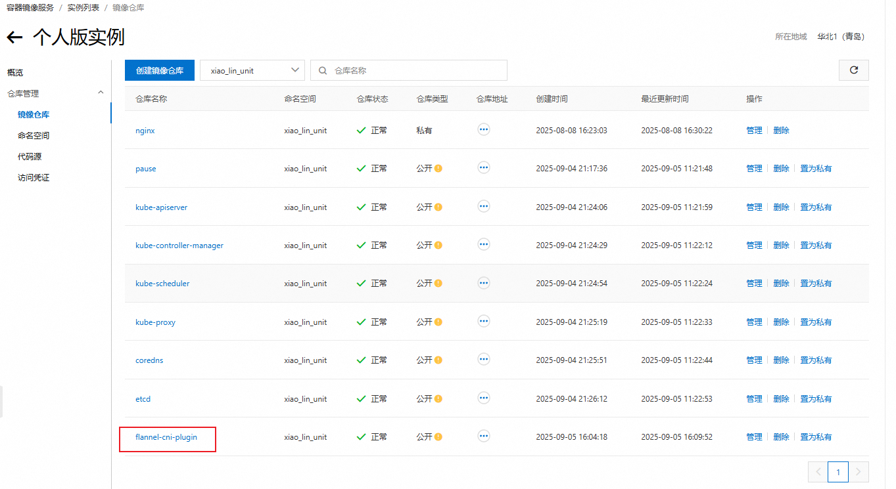

<!-- toc -->

### 前言

前面我们在安装`flannel-cni-plugin`插件时发生了一个问题, 该插件下载不下来. 可能是由于使用最新版本的原因, 国内的镜像源找不到该版本, 再加上很多镜像源失效了, 这个问题折磨了我两天:sob:. 终于在我艰苦奋斗, 锲而不舍, 永不言弃的优秀品质下, 找到了一种解决办法.

先提前说一下, 这种方法比较繁琐, 也有限制, 也是束手无策的办法下的方法(就认为是立体几何的建坐标系)

如果你会网络魔法, 请直接忽略, 如果你不会, 可以看一下

### 网络加速

如果你想使用`docker hub`的官方仓库, 可以下载一个`Watt Tookit`(`Steam++`)网络加速. 此软件可以对`github`和`docker hub`进行网络加速

如果你想使用`k8s`的仓库`registry.k8s.io`, 则需要在`docker hub`上有该镜像

描述到这里, 想必大家也明白了, 其实就是从`docker hub`上下载镜像

### 方式

#### 私人仓库

如果是使用本地主机直接拉取, 则不需要有私人仓库

需要有一个私人的镜像仓库, 我个人使用的是阿里云的个人镜像仓库. 推荐使用可外部访问的镜像仓库

以阿里云为例, 在容器镜像服务中开通个人的镜像服务, 然后创建命名空间就可以使用了

在实例中创建镜像仓库, 建议名称与你要获取的镜像名一致, 比较方便



#### 拉取

需要你有一个`docker hub`的账户, 如果没有可以使用`github`账户登录`docker hub`

使用`Watt Tookit`加速的情况下我们就可以从`docker hub`上拉取镜像

1. 本地拉取

   在你本地主机上直接拉取即可

2. 网络访问拉取

   网络访问拉取是在在线网站[Play with Docker](https://labs.play-with-docker.com/)上登录个人的`docker hub`账户拉取, 然后使用命令行登录你的个人仓库并将镜像上传使用, 是在你无法访问外部网络时使用

#### 案例

以`flannel-cni-plugin`为例, 我通过网络访问拉取, 将其推送到了我的阿里云个人仓库, 然后在集群虚拟机上使用`containerd`拉取并做`tag`处理, 这样在`kubeadm init`时就不会再缺少网络插件了

`containerd`拉取镜像时出现了一个问题, 是虚拟机的`DNS`解析的问题, 也记录一下, 下次使用虚拟机时再出现有解决的办法记录

```
sudo vi /etc/resolv.conf

nameserver 114.114.114.114
nameserver 233.5.5.5
nameserver 8.8.8.8
```

