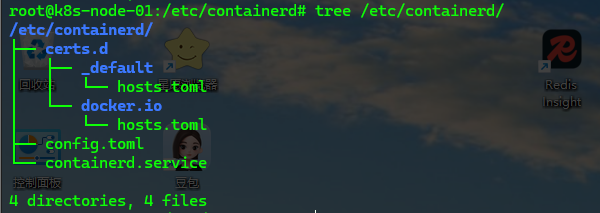

<!-- toc -->

### 搭建方案

1. `minikube`
2. `k3s`
3. `kubeadm`
4. 二进制安装
5. 命令行工具

### `kubeadm`

因为`k8s`在`1.24.x`版本开始不支持`docker`,所以本次演示搭建使用`containerd`做为容器

使用的系统为`Ubuntu`

##### 系统配置

1. 修改源配置

   ```bash
   sudo cp /etc/apt/sources.list /etc/apt/sources.list.bak
   ```

   ```bash
   sudo vi /etc/apt/sources.list
   ```

   ```txt
   deb https://mirrors.aliyun.com/ubuntu/ focal main restricted universe multiverse
   deb-src https://mirrors.aliyun.com/ubuntu/ focal main restricted universe multiverse
   
   deb https://mirrors.aliyun.com/ubuntu/ focal-security main restricted universe multiverse
   deb-src https://mirrors.aliyun.com/ubuntu/ focal-security main restricted universe multiverse
   
   deb https://mirrors.aliyun.com/ubuntu/ focal-updates main restricted universe multiverse
   deb-src https://mirrors.aliyun.com/ubuntu/ focal-updates main restricted universe multiverse
   
   # deb https://mirrors.aliyun.com/ubuntu/ focal-proposed main restricted universe multiverse
   # deb-src https://mirrors.aliyun.com/ubuntu/ focal-proposed main restricted universe multiverse
   
   deb https://mirrors.aliyun.com/ubuntu/ focal-backports main restricted universe multiverse
   deb-src https://mirrors.aliyun.com/ubuntu/ focal-backports main restricted universe multiverse
   ```

   ```bash
   sudo apt update
   sudo apt upgrade
   ```

2. 关闭防火墙

   ```bash
   # 关闭防火墙和selinux
   systemctl stop firewalld && systemctl disable firewalld
   sed -i 's/enforcing/disabled/' /etc/selinux/config
   setenforce 0
   ```

3. 关闭`swap`分区

   ```bash
   # 关闭swap分区
   sudo sed -ri 's/."swap.*/#&/' /etc/fstab
   # 重启
   ```

4. 安装时间同步服务,确保服务器时间准确

   ```bash
   sudo apt install -y chrony
   ```

5. 修改`hosts`

   ```bash
   sudo vi /etc/hosts
   ```

   ```hosts
   172.21.207.78 k8s-master
   172.21.206.141  k8s-node-01
   172.21.200.110 k8s-node-02
   ```

6. 转发`IPv4`并让`iptables`看到桥接流量

   ```bash
   sudo cat > /etc/sysctl.d/k8s.conf << EOF 
   overlay
   br_netfilter
   EOF
   
   sudo modprobe overlay
   sudo modprobe br_netfilter
   
   # 设置所需的 sysctl 参数
   sudo cat > /etc/sysctl.d/k8s.conf << EOF
   net.bridge.bridge-nf-call-iptables  = 1
   net.bridge.bridge-nf-call-ip6tables = 1
   net.ipv4.ip_forward                 = 1
   EOF
   
   # 应用 sysctl 参数
   sudo sysctl --system
   
   # 检验配置是否生效
   lsmod | grep br_netfilter
   lsmod | grep overlay
   
   sysctl net.bridge.bridge-nf-call-iptables net.bridge.bridge-nf-call-ip6tables net.ipv4.ip_forward
   ```

##### 安装软件

1. 安装`containerd`

   ```bash
   # 官方安装教程：https://github.com/containerd/containerd/blob/main/docs/getting-started.md
   
   # 下载安装containerd
   cd /usr/local/src
   sudo wget https://github.com/containerd/containerd/releases/download/v2.1.4/containerd-2.1.4-linux-amd64.tar.gz
   sudo tar Cxzvf /usr/local containerd-2.1.4-linux-amd64.tar.gz
   ```

2. 配置通过`systemd`启动`containd`

   ```bash
   cd /usr/local/src
   sudo wget https://raw.githubusercontent.com/containerd/containerd/main/containerd.service -o /usr/lib/systemd/system/containerd.service
   sudo systemctl daemon-reload
   sudo systemctl enable containerd
   ```

3. 安装 `runc`

   ```bash
   #版本说明：https://github.com/containerd/containerd/blob/release/1.6/script/setup/runc-version
   cd /usr/local/src
   sudo wget https://github.com/opencontainers/runc/releases/download/v1.3.0/runc.amd64
   sudo install -m 755 runc.amd64 /usr/local/sbin/runc
   ```

4. 安装 `CNI plugins`

   ```bash
   # 版本说明：https://github.com/containerd/containerd/blob/release/1.6/go.mod
   sudo wget https://github.com/containernetworking/plugins/releases/download/v1.7.1/cni-plugins-linux-amd64-v1.7.1.tgz
   sudo mkdir -p /opt/cni/bin
   sudo tar Cxzvf /opt/cni/bin cni-plugins-linux-amd64-v1.7.1.tgz
   ```
   
5. 生成默认配置文件

   ```bash
   # 生成 containerd 默认配置文件
   sudo mkdir /etc/containerd
   # 这一步如果出现权限拒绝可以直接到root用户下执行
   sudo containerd config default > /etc/containerd/config.toml
   ```

6. 修改配置文件

   ```bash
   # 修改配置文件
   # 注意配置文件中标记的version号, 根据version号找对应的配置内容
   # 文档：https://github.com/containerd/containerd/blob/main/docs/hosts.md
   sudo vi /etc/containerd/config.toml
   
   # 添加一下配置, 注意格式
   [plugins."io.containerd.cri.v1.images".registry]
      config_path = "/etc/containerd/certs.d"
   
   [plugins."io.containerd.cri.v1.images".pinned_images]
     sandbox = 'registry.aliyuncs.com/google_containers/pause:3.10'
   ```
   
   ```toml
   version = 3
root = '/var/lib/containerd'
   state = '/run/containerd'
   temp = ''
   disabled_plugins = []
   required_plugins = []
   oom_score = 0
   imports = []
   
   [grpc]
     address = '/run/containerd/containerd.sock'
     tcp_address = ''
     tcp_tls_ca = ''
     tcp_tls_cert = ''
     tcp_tls_key = ''
     uid = 0
     gid = 0
     max_recv_message_size = 16777216
     max_send_message_size = 16777216
   
   [ttrpc]
     address = ''
     uid = 0
     gid = 0
   
   [debug]
     address = ''
     uid = 0
     gid = 0
     level = ''
     format = ''
   
   [metrics]
     address = ''
     grpc_histogram = false
   
   [plugins]
     [plugins.'io.containerd.cri.v1.images']
       snapshotter = 'overlayfs'
       disable_snapshot_annotations = true
       discard_unpacked_layers = false
       max_concurrent_downloads = 3
       concurrent_layer_fetch_buffer = 0
       image_pull_progress_timeout = '5m0s'
       image_pull_with_sync_fs = false
       stats_collect_period = 10
       use_local_image_pull = false
   
       [plugins.'io.containerd.cri.v1.images'.pinned_images]
         sandbox = 'registry.k8s.io/pause:3.10'
   
       [plugins.'io.containerd.cri.v1.images'.registry]
         config_path = '/etc/containerd/certs.d'
   
       [plugins.'io.containerd.cri.v1.images'.image_decryption]
         key_model = 'node'
   
     [plugins.'io.containerd.cri.v1.runtime']
       enable_selinux = false
       selinux_category_range = 1024
       max_container_log_line_size = 16384
       disable_apparmor = false
       restrict_oom_score_adj = false
       disable_proc_mount = false
       unset_seccomp_profile = ''
       tolerate_missing_hugetlb_controller = true
       disable_hugetlb_controller = true
       device_ownership_from_security_context = false
       ignore_image_defined_volumes = false
       netns_mounts_under_state_dir = false
       enable_unprivileged_ports = true
       enable_unprivileged_icmp = true
       enable_cdi = true
       cdi_spec_dirs = ['/etc/cdi', '/var/run/cdi']
       drain_exec_sync_io_timeout = '0s'
       ignore_deprecation_warnings = []
   
       [plugins.'io.containerd.cri.v1.runtime'.containerd]
         default_runtime_name = 'runc'
         ignore_blockio_not_enabled_errors = false
         ignore_rdt_not_enabled_errors = false
   
         [plugins.'io.containerd.cri.v1.runtime'.containerd.runtimes]
           [plugins.'io.containerd.cri.v1.runtime'.containerd.runtimes.runc]
             runtime_type = 'io.containerd.runc.v2'
             runtime_path = ''
             pod_annotations = []
             container_annotations = []
             privileged_without_host_devices = false
             privileged_without_host_devices_all_devices_allowed = false
             cgroup_writable = false
             base_runtime_spec = ''
             cni_conf_dir = ''
             cni_max_conf_num = 0
             snapshotter = ''
             sandboxer = 'podsandbox'
             io_type = ''
   
             [plugins.'io.containerd.cri.v1.runtime'.containerd.runtimes.runc.options]
               BinaryName = ''
               CriuImagePath = ''
               CriuWorkPath = ''
               IoGid = 0
               IoUid = 0
               NoNewKeyring = false
               Root = ''
               ShimCgroup = ''
               SystemdCgroup = true
   
       [plugins.'io.containerd.cri.v1.runtime'.cni]
         bin_dir = ''
         bin_dirs = ['/opt/cni/bin']
         conf_dir = '/etc/cni/net.d'
         max_conf_num = 1
         setup_serially = false
         conf_template = ''
         ip_pref = ''
         use_internal_loopback = false
   
     [plugins.'io.containerd.differ.v1.erofs']
       mkfs_options = []
   
     [plugins.'io.containerd.gc.v1.scheduler']
       pause_threshold = 0.02
       deletion_threshold = 0
       mutation_threshold = 100
       schedule_delay = '0s'
       startup_delay = '100ms'
   
     [plugins.'io.containerd.grpc.v1.cri']
       disable_tcp_service = true
       stream_server_address = '127.0.0.1'
       stream_server_port = '0'
       stream_idle_timeout = '4h0m0s'
       enable_tls_streaming = false
       [plugins.'io.containerd.grpc.v1.cri'.x509_key_pair_streaming]
         tls_cert_file = ''
         tls_key_file = ''
   
     [plugins.'io.containerd.image-verifier.v1.bindir']
       bin_dir = '/opt/containerd/image-verifier/bin'
       max_verifiers = 10
       per_verifier_timeout = '10s'
   
     [plugins.'io.containerd.internal.v1.opt']
       path = '/opt/containerd'
   
     [plugins.'io.containerd.internal.v1.tracing']
   
     [plugins.'io.containerd.metadata.v1.bolt']
       content_sharing_policy = 'shared'
       no_sync = false
   
     [plugins.'io.containerd.monitor.container.v1.restart']
       interval = '10s'
   
     [plugins.'io.containerd.monitor.task.v1.cgroups']
       no_prometheus = false
   
     [plugins.'io.containerd.nri.v1.nri']
       disable = false
       socket_path = '/var/run/nri/nri.sock'
       plugin_path = '/opt/nri/plugins'
       plugin_config_path = '/etc/nri/conf.d'
       plugin_registration_timeout = '5s'
       plugin_request_timeout = '2s'
       disable_connections = false
   
     [plugins.'io.containerd.runtime.v2.task']
       platforms = ['linux/amd64']
   
     [plugins.'io.containerd.service.v1.diff-service']
       default = ['walking']
       sync_fs = false
   
     [plugins.'io.containerd.service.v1.tasks-service']
       blockio_config_file = ''
       rdt_config_file = ''
   
     [plugins.'io.containerd.shim.v1.manager']
       env = []
   
     [plugins.'io.containerd.snapshotter.v1.blockfile']
       root_path = ''
       scratch_file = ''
       fs_type = ''
       mount_options = []
       recreate_scratch = false
   
     [plugins.'io.containerd.snapshotter.v1.btrfs']
       root_path = ''
   
     [plugins.'io.containerd.snapshotter.v1.devmapper']
       root_path = ''
       pool_name = ''
       base_image_size = ''
       async_remove = false
       discard_blocks = false
       fs_type = ''
       fs_options = ''
   
     [plugins.'io.containerd.snapshotter.v1.erofs']
       root_path = ''
       ovl_mount_options = []
       enable_fsverity = false
       set_immutable = false
   
     [plugins.'io.containerd.snapshotter.v1.native']
       root_path = ''
   
     [plugins.'io.containerd.snapshotter.v1.overlayfs']
       root_path = ''
       upperdir_label = false
       sync_remove = false
       slow_chown = false
       mount_options = []
   
     [plugins.'io.containerd.snapshotter.v1.zfs']
       root_path = ''
   
     [plugins.'io.containerd.tracing.processor.v1.otlp']
   
     [plugins.'io.containerd.transfer.v1.local']
       max_concurrent_downloads = 3
       concurrent_layer_fetch_buffer = 0
       max_concurrent_uploaded_layers = 3
       check_platform_supported = false
       config_path = ''
   
   [cgroup]
     path = ''
   
   [timeouts]
     'io.containerd.timeout.bolt.open' = '0s'
     'io.containerd.timeout.cri.defercleanup' = '1m0s'
     'io.containerd.timeout.metrics.shimstats' = '2s'
     'io.containerd.timeout.shim.cleanup' = '5s'
     'io.containerd.timeout.shim.load' = '5s'
     'io.containerd.timeout.shim.shutdown' = '3s'
     'io.containerd.timeout.task.state' = '2s'
   
   [stream_processors]
     [stream_processors.'io.containerd.ocicrypt.decoder.v1.tar']
       accepts = ['application/vnd.oci.image.layer.v1.tar+encrypted']
       returns = 'application/vnd.oci.image.layer.v1.tar'
       path = 'ctd-decoder'
       args = ['--decryption-keys-path', '/etc/containerd/ocicrypt/keys']
       env = ['OCICRYPT_KEYPROVIDER_CONFIG=/etc/containerd/ocicrypt/ocicrypt_keyprovider.conf']
   
     [stream_processors.'io.containerd.ocicrypt.decoder.v1.tar.gzip']
       accepts = ['application/vnd.oci.image.layer.v1.tar+gzip+encrypted']
       returns = 'application/vnd.oci.image.layer.v1.tar+gzip'
       path = 'ctd-decoder'
       args = ['--decryption-keys-path', '/etc/containerd/ocicrypt/keys']
       env = ['OCICRYPT_KEYPROVIDER_CONFIG=/etc/containerd/ocicrypt/ocicrypt_keyprovider.conf']
   ```
   
   
   
```bash
sudo mkdir -p /etc/containerd/certs.d
sudo mkdir -p /etc/containerd/certs.d/docker.io
sudo mkdir -p /etc/containerd/certs.d/_default
   
sudo touch /etc/containerd/certs.d/docker.io/hosts.toml
sudo touch /etc/containerd/certs.d/_default/hosts.toml
```

   ```bash
sudo vi /etc/containerd/certs.d/docker.io/hosts.toml
server = "https://registry-1.docker.io"
   
[host."https://m.daocloud.io/docker.io"]
  capabilities = ["pull", "resolve"]
     
     
sudo vi /etc/containerd/certs.d/_default/host.toml
   
server = "https://registry-1.docker.io"
   
[host."http://192.168.31.250:5000"]
  capabilities = ["pull", "resolve", "push"]
  skip_verify = true
[host."https://docker.m.daocloud.io"]
  capabilities = ["pull", "resolve"]
   ```

   

7. 启动`containerd`

   ```bash
   # 启动 containerd
   sudo systemctl restart containerd
   
   # 启动成功后可以查看到监听的端口
   sudo netstat -nlput | grep containerd
   ```

8. 安装`cli`工具(可选)

   ```bash
   # 安装cli工具
   # 安装 containerd 的 cli 管理工具（此步骤是非必选项）
   # 官方文档https://github.com/kubernetes-sigs/cri-tools/blob/master/docs/crictl.md
   
   # 1、下载安装
   cd /usr/local/src
   sudo wget https://github.com/kubernetes-sigs/cri-tools/releases/download/v1.26.0/crictl-v1.26.0-linux-amd64.tar.gz
   sudo tar Czxvf crictl-v1.26.0-linux-amd64.tar.gz /usr/local/bin
   
   # 2、创建配置文件，运行 crictl config 命令可获取参数说明
   sudo cat <<EOF | sudo tee /etc/crictl.yaml
   runtime-endpoint: unix:///run/containerd/containerd.sock
   image-endpoint: unix:///run/containerd/containerd.sock
   timeout: 2
   debug: false
   pull-image-on-create: false
   disable-pull-on-run: false
   EOF
   
   # 3、测试
   sudo crictl pods
   
   # 可使用 crictl config --set debug=true 来开启调试模式
   # 通过命令 crictl config --get debug 查看当前是否处于debug模式
   ```

9. 安装`kubeadm`、`kubelet` 和 `kubectl`

   ```bash
   # 更新 apt 包索引并安装使用 Kubernetes apt 仓库所需要的包
   sudo apt update
   # apt-transport-https 可能是一个虚拟包（dummy package）；如果是的话，你可以跳过安装这个包
   sudo apt install -y apt-transport-https ca-certificates curl gpg
   
   # 下载用于 Kubernetes 软件包仓库的公共签名密钥
   # 如果 `/etc/apt/keyrings` 目录不存在，则应在 curl 命令之前创建它，请阅读下面的注释。
   # sudo mkdir -p -m 755 /etc/apt/keyrings
   curl -fsSL https://pkgs.k8s.io/core:/stable:/v1.32/deb/Release.key | sudo gpg --dearmor -o /etc/apt/keyrings/kubernetes-apt-keyring.gpg
   
   # 添加 Kubernetes 仓库, 仅包含 1.32的软件包
   # 此操作会覆盖 /etc/apt/sources.list.d/kubernetes.list 中现存的所有配置。
   echo 'deb [signed-by=/etc/apt/keyrings/kubernetes-apt-keyring.gpg] https://pkgs.k8s.io/core:/stable:/v1.32/deb/ /' | sudo tee /etc/apt/sources.list.d/kubernetes.list
   
   # 跟新包索引
   sudo apt update
   # 安装kubelet kubeadm kubectl
   sudo apt install -y kubelet kubeadm kubectl
   # 锁定kubelet kubeadm kubectl版本
   sudo apt-mark hold kubelet kubeadm kubectl
   ```


##### 部署`Kubernetes Master`

```bash
sudo vi /etc/sysctl.conf
# 修改内容
net.ipv4.ip_forward=1
# 立即生效
sudo sysctl -p
# 永久生效
sudo chmod 644 /etc/sysctl.conf
```

```bash
kubeadm init --apiserver-advertise-address=172.21.207.78 --image-repository registry.aliyuncs.com/google_containers --kubernetes-version v1.32.7 --service-cidr=10.96.0.0/12 --pod-network-cidr=10.244.0.0/16
```


> kubeadm join 172.21.207.78:6443 --token lbfjn5.2yb5ru96ogc0tcz0 \
>            --discovery-token-ca-cert-hash sha256:0825062ad115d8d5c492bda345fb335bba4c784dfbd33fa3d9596422393e987f

```bash
# 普通用户
mkdir -p $HOME/.kube
sudo cp -i /etc/kubernetes/admin.conf $HOME/.kube/config
sudo chown $(id -u):$(id -g) $HOME/.kube/config
 
# ROOT 用户
export KUBECONFIG=/etc/kubernetes/admin.conf
```

##### 加入`Kubernets Node`

```sudo
sudo kubeadm join {master_ip}:6443 --token {master_token} --discovery-token-ca-cert-hash sha256:{master_hash}
```

```bash
# 如果初始化时的master_token清空了, 可以在master服务器通过以下命令查看
kubeadm token list
# 如果已经过期, 可以通过以下命令重新申请
kubeadm token create
```

```bash
# 如果初始化时的master_hash清空了, 可以在master服务器通过以下命令查看
openssl x509 -pubkey -in /etc/kubernetes/pki/ca.crt | openssl rsa -pubin -outform der 2>/dev/null | openssl dgst -sha256 -hex | sed 's/^.* //'
```

##### 部署`CNI`网络插件

```bash
# 使用Flannel
# 安装Flannel
cd /usr/local/src

sudo wget https://raw.githubusercontent.com/flannel-io/flannel/v0.27.1/Documentation/kube-flannel.yml

kubectl delete -f /usr/local/src/kube-flannel.yml --ignore-not-found
kubectl apply -f /usr/local/src/kube-flannel.yml

sudo vi /usr/local/src/kube-flannel.yml

sudo systemctl daemon-reload
sudo service containerd restart
sudo service kubelet restart
docker.m.dao.cloud.io
https://mirrors.tuna.tsinghua.edu.cn/
```

<span style="color: red">非常抱歉, 我到这里卡住了. 因为pause:3.10这个破玩意儿无法安装, 原因是魔法, 国内的魔法地址要么不能用了, 要么没有这个破玩意儿. 不要慌, 我正在积极寻找</span>

