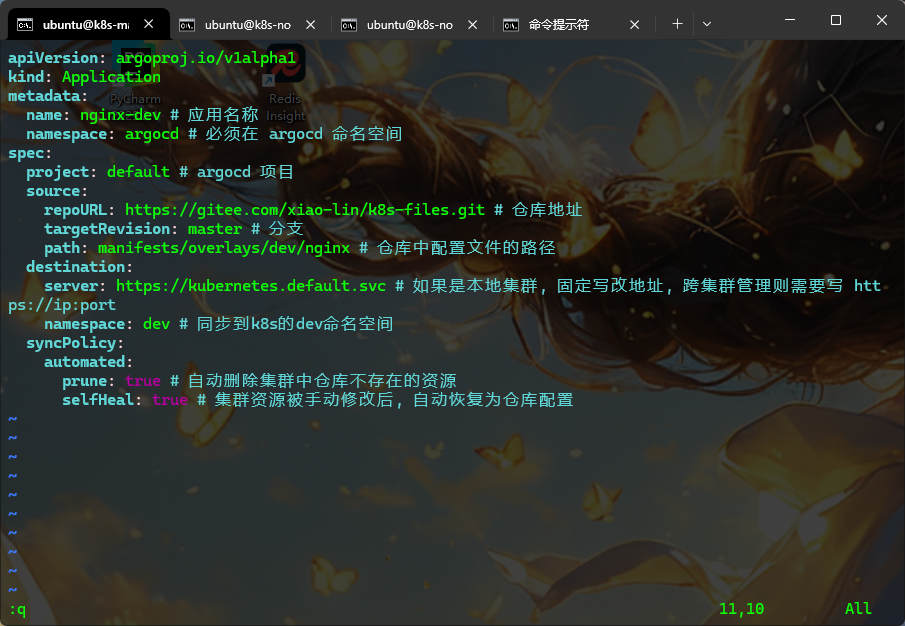
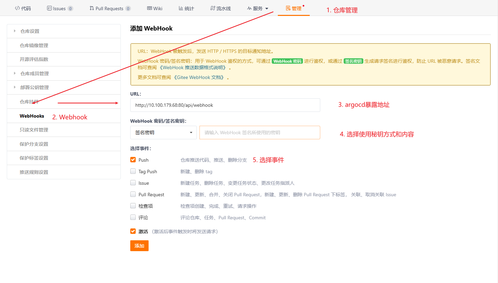
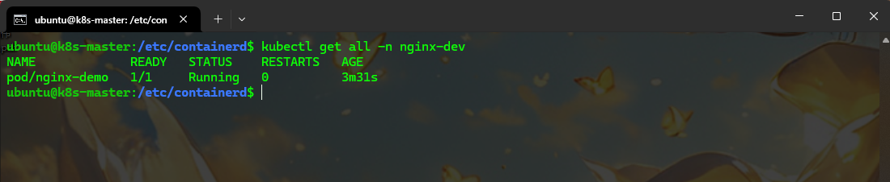
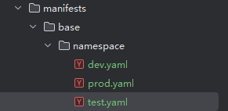
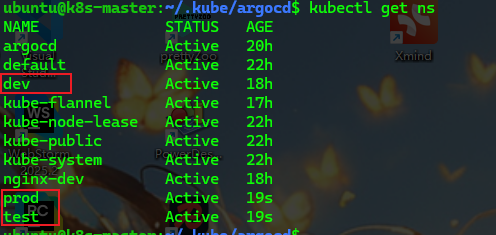
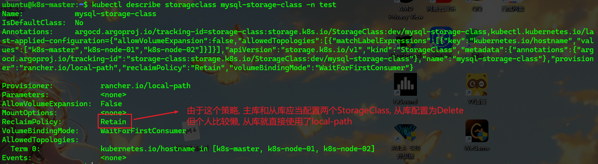
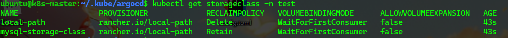
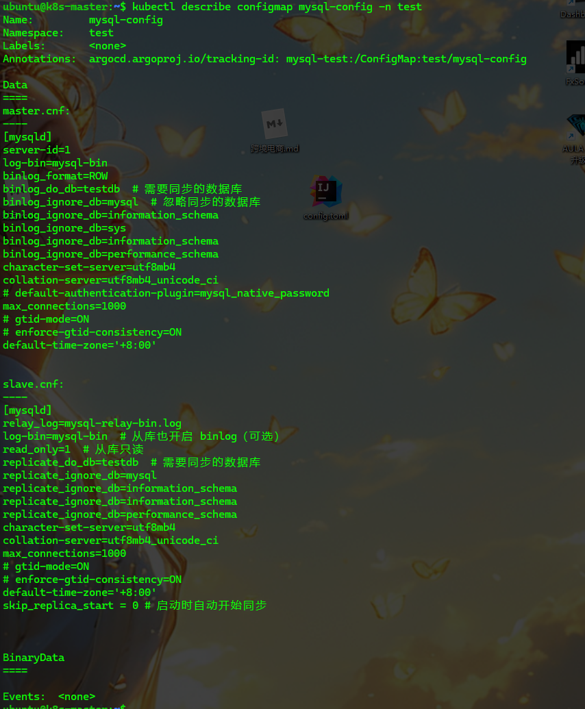
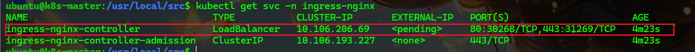

<!-- toc -->

### 前言

前文中我们了解了`k8s`中的常用命令, 可能并没有实操. 其中有许多命令带有`yaml`的配置文件, 到此我们还没有学习这个配置文件如何编写, 此篇就来深入`pod`做仔细讲解

### `GitOps`部署

项目中大多使用`git`仓库作为`pod`配置文件的来源,  便于管理, 只需要对应修改提交到仓库即可做到有效控制

本篇也将使用`git`仓库作为配置来源(主要是不想在虚拟机上使用`vi`写配置, 直接用`ide`写比较方便, 在学习, 开发, 测试时不推荐, 因为在应用`yaml`配置时可能会出现报错, 但是使用这种方式发现不了). 

> 注意: `GitOps`这种部署方式可能会出现滞后性, 原因是读取配置是周期性的. 可以通过配置`Webhook`进行实时同步

使用`gitee`作为配置文件存储

1. 创建`git`仓库

   目录结构大致如下

   ```plaintext
   manifests/
   ├── base/              	# 基础配置（通用模板，无环境差异）
   │   ├── nginx/
   │   │   ├── deployment.yaml  # Nginx 部署的通用配置
   │   │   └── service.yaml     # Nginx 服务的通用配置
   │   └── redis/
   │       └── statefulset.yaml
   └── overlays/          	# 环境差异配置（通过 kustomize 叠加）
       ├── prod/          	# 生产环境（资源限制更高、镜像版本不同）
       │   ├── nginx/
       │   └── redis/
       ├── test/         	# 测试环境（资源限制更高、镜像版本不同）
       │   ├── nginx/
       │   └── redis/
       └── dev/ 
       	├── nginx/		# 开发环境（资源限制低、使用测试镜像）
           └── redis/
   ```

   以上只是结构示例, 此种方式可以将基础内容配置好, 根据环境做定制化配置

2. 安装`GitOps`工具, 使用`ArgoCD`
   - 安装`ArgoCD`

       ```bash
       # 创建命名空间
       kubectl create namespace argocd

       # 部署 ArgoCD（使用官方 manifest）
       kubectl apply -n argocd -f https://raw.githubusercontent.com/argoproj/argo-cd/stable/manifests/install.yaml
       ```

   - 验证`ArgoCD`组件运行

       ```bash
       kubectl get pods -n argocd
       # 确保所有 pod 处于 Running 状态（如 argocd-server、argocd-application-controller 等）
       ```

   - 暴露`ArgoCD`控制台

       ```bash
       kubectl patch service argocd-server -n argocd -p '{"spec":{"type":"NodePort"}}'
       # 查看暴露的端口（如 30080）
       kubectl get service argocd-server -n argocd
       ```

   - 配置`ArgoCD`访问`Gitee`仓库

       ```bash
       # 需要现在gitee上创建token, 注意权限, 要能访问你的文件仓库
       # 创建 Secret
       kubectl create secret generic gitee-creds -n argocd \
         --from-literal=type=git \
         --from-literal=url=https://gitee.com \
         --from-literal=username=<your-github-username> \
         --from-literal=password=<your-github-token>
       ```
       
   - 定义`ArgoCD`应用

      - 创建`Application`配置文件

          自定义`k8s`工作目录, 创建一个`argocd`目录, 在该目录下创建`argocd`的应用配置文件

       如创建一个`nginx-dev.yaml`

       ```yaml
      apiVersion: argoproj.io/v1alpha1
      kind: Application
      metadata:
        name: nginx-dev # 应用名称
        namespace: argocd # 必须在 argocd 命名空间
      spec:
        project: default # argocd 项目
        source:
          repoURL: https://gitee.com/xiao-lin/k8s-files.git # 仓库地址
          targetRevision: master # 分支
          path: manifests/overlays/dev/nginx # 仓库中配置文件的路径
        destination:
          server: https://kubernetes.default.svc # 如果是本地集群, 固定写该地址, 跨集群管理则需要写 https://ip:port
          namespace: dev # 同步到k8s的dev命名空间
        syncPolicy:
          automated:
            prune: true # 自动删除集群中仓库不存在的资源
            selfHeal: true # 集群资源被手动修改后, 自动恢复为仓库配置
       ```

      > 注意: 
      >
      > `destination.server`的地址需要根据集群修改

      - 本地集群(即`argocd`所在就是要部署的`k8s`集群): 固定写`https://kubernetes.default.svc`
      - 跨集群部署: 需要写该集群`APIServer`的实际地址: `https://ip:port`

      查看集群的`APIServer`地址: 

      ```shell
      # 查看 kube-apiserver 的启动参数（包含监听地址）
      sudo cat /etc/kubernetes/manifests/kube-apiserver.yaml | grep "server-cert"
      # 或直接通过 kubectl 查看（需在目标集群有配置）
      kubectl cluster-info | grep "Kubernetes control plane"
      ```

      

      - 应用配置

      ```bash
         kubectl apply -f app.yaml
      ```

    - 验证同步状态

      安装`argocd`应用, 用于验证服务是否正常

      ```bash
      # 1. 下载最新版本的 argocd CLI（也可指定版本，如 v2.12.0）
      # 查看最新最稳定版本：https://github.com/argoproj/argo-cd/stable
      VERSION=$(curl -L -s https://raw.githubusercontent.com/argoproj/argo-cd/stable/VERSION)
      curl -sSL -o argocd-linux-amd64 https://github.com/argoproj/argo-cd/releases/download/v$VERSION/argocd-linux-amd64
      
      sudo install -m 555 argocd-linux-amd64 /usr/local/bin/argocd
      rm argocd-linux-amd64
      
      # curl -sSL -o /usr/local/bin/argocd "https://github.com/argoproj/argo-cd/releases/download/v3.0.16/argocd-linux-amd64"
      
      
      # 2. 赋予执行权限
      chmod +x /usr/local/bin/argocd
      
      # 3. 验证安装（出现版本号即成功）
      argocd version --client
      ```

      验证同步情况

         ```bash
      # 查看应用状态（SYNC STATUS 应为 Synced）
      argocd app get nginx-dev
      # 或通过控制台查看（访问步骤 2 暴露的 NodePort）
      
      # 或者使用`k8s APID`验证
      kubectl get applications -n {namespace}
         ```

       验证结果中应用的同步状态为`Synced`

       如果同步状态异常, 可以通过以下命令查看原因

         ```bash
      kubectl describe application {app-name} -n {
      namespace}
         ```

   - 配置`Webhook`(可选)

       `ArgoCD` 需要一个可被 `Gitee` 访问的 `URL` 接收 `Webhook` 事件，可通过 `NodePort` 或 `Ingress` 暴露临时暴露为 `NodePort`（生产环境建议用 `Ingress` + 域名）
       
       ```bash
       kubectl patch service argocd-server -n argocd -p '{"spec":{"type":"NodePort"}}'
       # 获取暴露的端口（如 30443）
       kubectl get service argocd-server -n argocd
       ```
       
       `Webhook URL` 格式：`http://<集群节点IP>:<NodePort>/api/webhook`
       
       在`Gitee`仓库 -> 管理 -> `Webhook`添加
       
       

   - 验证

       根据自己的`Application`配置文件, 在`Gitee`仓库中的对应位置添加一个部署文件做测试
       
       ```yaml
       # manifests/overlays/dev/nginx/nginx.yaml
       apiVersion: v1 # api版本
       kind: Pod # 资源对象类型
       metadata: # 元数据定义
         name: nginx-demo # Pod的名称
         labels: # 定义Pod的标签
           type: app # 自定义label标签, 名字为type, 值为app
           version: v1
         namespace: nginx-dev # 命名空间
       spec: # 期望描述
         containers: # 容器描述
           - name: nginx # 容器名称
             image: nginx:1.25 # 容器镜像
             imagePullPolicy: IfNotPresent # 镜像拉取策略 Always, Never, IfNotPresent
             ports:
               - name: title
                 containerPort: 80
                 protocol: TCP
             command: ["nginx", "-g", "daemon off;"] # 启动后执行的命令
             workingDir: /usr/share/nginx/html # 工作目录
         restartPolicy: Always
       ```
       
       
       
       > 注意: 
       >
       > 1. 需要提前创建`namespace`
       >
       > 2. 如果状态不是`Running`则启动失败, 可以通过以下命令排查
       >
       >    ```bash
       >    # 查看启动过程中的描述
       >    kubectl describe po nginx-demo -n nginx-dev
       >    # 查看上次启动中的错误
       >    kubectl logs nginx-demo -n nginx-dev -c nginx --previous
       >    ```

### 部署配置

#### 什么是部署

部署是什么的概念应该不需要多说, 在`k8s`中关于部署配置, 我们其实是需要解决三个问题

1. 可以配置哪些资源
2. 什么情况下该配置哪些资源
3. 每种资源如何配置

#### 部署资源

首先我们需要知道配置文件中可以配置哪些内容, 可以参考[k8s资源清单](https://www.cnblogs.com/misakivv/p/18304329)或者<a href="K8s资源清单.pdf">常用配置清单</a>

详细清单或者配置细节可以查看官方文档中的[`Kubernetes API`]([Kubernetes API | Kubernetes](https://kubernetes.io/zh-cn/docs/reference/kubernetes-api/))

通过命令可以查看`k8s`可以部署的资源

```bash
kubectl api-resources
```

但通常情况下需要我们使用配置文件配置的资源并不多, 像`node`, `role`等一些配置只需要配置一次, 可能不需要配置文件. 常用做配置的主要有以下:

| 资源                                               | 描述                                                         | 使用情形                                    | 类型               |
| -------------------------------------------------- | ------------------------------------------------------------ | ------------------------------------------- | ------------------ |
| `Deployment(deploy)`                               | 可以看做`Pod`和`ReplicaSet`的管理组                          | 最常用的部署资源, 无状态服务使用            | 工作负载类         |
| `StatefulSet(sts)`                                 | 可以看做`Pod`和`ReplicaSet`的管理组                          | 有状态服务专用, `Pod`有固定标识符和持久存储 | 工作负载类         |
| `DaemonSet(ds)`                                    | 用于每个（或指定）`Node`上自动运行一个`Pod`                  | 通常是伴生服务使用, 如日志收集              | 工作负载类         |
| `Job/CronJob`                                      | 调度任务                                                     | 任务型服务使用, 如一次性任务或定时任务      | 工作负载类         |
| `Service(svc)`                                     | 集群内持久服务入口，实现`Pod`间或外部服务访问负载均衡        | 需要通信的服务使用                          | 服务发现与负载均衡 |
| `Ingress`                                          | 七层路由，支持HTTP/S流量的准入、反向代理、SSL                | 一般用于与外部通信                          | 服务发现与负载均衡 |
| `PersistentVolume(pv)、PersistentVolumeClaim(pvc)` | PV是系统管理员提供的物理存储，PVC是用户申请的逻辑存储，两者绑定让Pod能持久存储 | 需持久化存储使用                            | 存储管理           |
| `StorageClass(sc)`                                 | 提供动态存储卷选项，简化PVC自动分配                          | 需持久化存储使用                            | 存储管理           |
| `ConfigMap(cm)`                                    | 存储配置数据                                                 | 环境变量, 配置文件等                        | 配置与密钥         |
| `Secret`                                           | 存储敏感数据                                                 | 密码, `token`等                             | 配置与密钥         |
| `Namespace(ns)`                                    | 命名空间                                                     | 自创命名空间                                | 集群级管理         |

#### 部署流程

##### 特点分析

现在我们以`mysql`为例, 在`k8s`中部署`mysql`服务

以`mysql`为例是因为`mysql`具有以下特点

- 外部访问
- 持久化
- 可以配置集群(此处是指`mysql`的主从复制)

现在我们考虑一下搭建这个`mysql`的架构

- 主库负责写入, 开启`binlog`日志
- 从库负责读取, 通过`binlog`同步主库
- 网络通信, 主从通过`Service`名称互相访问
- 数据持久化, 使用`pvc`存储

然后我们回想一下`mysql`搭建主从复制的过程

- 搭建主库: 修改主库配置, 然后启动主库
- 同步用户: 在主库中创建同步用户, 用于数据同步
- 搭建从库: 修改从库配置, 然后启动从库
- 执行同步操作: 从库启动后, 执行首次同步操作

==下面部署过程中可能会遇到很多问题, 静心慢慢来, 尽可能的完成, 我与你同在(部署失败也没关系)==

##### 前置资源

基于以上我们在创建之前首先需要两个资源

- 命名空间, 我们搭建`mysql`服务的工作空间
- `StorageClass`动态存储卷选项

现在我们先把这两个内容处理好

1. 命名空间

   - `namespace`的`yaml`配置

     ```yaml
     apiVersion: v1
     kind: Namespace
     metadata:
       name: test
     ```

     多环境则需要创建多个`yaml`文件

     

   - `argocd`关于`namespace`的`yaml`文件

     ```yaml
     apiVersion: argoproj.io/v1alpha1
     kind: Application
     metadata:
       name: namespace # 应用名称
       namespace: argocd # 必须在 argocd 命名空间
     spec:
       project: default # argocd 项目
       source:
         repoURL: https://gitee.com/xiao-lin/k8s-files.git # 仓库地址
         targetRevision: master # 分支
         path: manifests/base/namespace # 仓库中配置文件的相对路径
       destination:
         server: https://kubernetes.default.svc # 如果是本地集群, 固定写改地址, 跨集群管理则需要写 https://ip:port
         namespace: dev # 同步到k8s的dev命名空间
       syncPolicy:
         automated:
           prune: true # 自动删除集群中仓库不存在的资源
           selfHeal: true # 集群资源被手动修改后, 自动恢复为仓库配置
     ```

     ==注意别忘记应用==

     

2. `StorageClass`

   - 下载本地持久化卷的配置

     下载[local-path-storage](https://raw.githubusercontent.com/rancher/local-path-provisioner/v0.0.24/deploy/local-path-storage.yaml)文件, 内有一个`local-path`的`StorageClass`

     ```yaml
     # local-path
     apiVersion: v1
     kind: Namespace
     metadata:
       name: local-path-storage
     
     ---
     apiVersion: v1
     kind: ServiceAccount
     metadata:
       name: local-path-provisioner-service-account
       namespace: local-path-storage
     
     ---
     apiVersion: rbac.authorization.k8s.io/v1
     kind: ClusterRole
     metadata:
       name: local-path-provisioner-role
     rules:
       - apiGroups: [ "" ]
         resources: [ "nodes", "persistentvolumeclaims", "configmaps" ]
         verbs: [ "get", "list", "watch" ]
       - apiGroups: [ "" ]
         resources: [ "endpoints", "persistentvolumes", "pods" ]
         verbs: [ "*" ]
       - apiGroups: [ "" ]
         resources: [ "events" ]
         verbs: [ "create", "patch" ]
       - apiGroups: [ "storage.k8s.io" ]
         resources: [ "storageclasses" ]
         verbs: [ "get", "list", "watch" ]
     
     ---
     apiVersion: rbac.authorization.k8s.io/v1
     kind: ClusterRoleBinding
     metadata:
       name: local-path-provisioner-bind
     roleRef:
       apiGroup: rbac.authorization.k8s.io
       kind: ClusterRole
       name: local-path-provisioner-role
     subjects:
       - kind: ServiceAccount
         name: local-path-provisioner-service-account
         namespace: local-path-storage
     
     ---
     apiVersion: apps/v1
     kind: Deployment
     metadata:
       name: local-path-provisioner
       namespace: local-path-storage
     spec:
       replicas: 1
       selector:
         matchLabels:
           app: local-path-provisioner
       template:
         metadata:
           labels:
             app: local-path-provisioner
         spec:
           serviceAccountName: local-path-provisioner-service-account
           containers:
             - name: local-path-provisioner
               image: rancher/local-path-provisioner:v0.0.24
               imagePullPolicy: IfNotPresent
               command:
                 - local-path-provisioner
                 - --debug
                 - start
                 - --config
                 - /etc/config/config.json
               volumeMounts:
                 - name: config-volume
                   mountPath: /etc/config/
               env:
                 - name: POD_NAMESPACE
                   valueFrom:
                     fieldRef:
                       fieldPath: metadata.namespace
           volumes:
             - name: config-volume
               configMap:
                 name: local-path-config
     
     ---
     apiVersion: storage.k8s.io/v1
     kind: StorageClass
     metadata:
       name: local-path
     provisioner: rancher.io/local-path
     volumeBindingMode: WaitForFirstConsumer
     reclaimPolicy: Delete
     
     ---
     kind: ConfigMap
     apiVersion: v1
     metadata:
       name: local-path-config
       namespace: local-path-storage
     data:
       config.json: |-
         {
           "nodePathMap":[
             {
               "node":"DEFAULT_PATH_FOR_NON_LISTED_NODES",
               "paths":["/data/mysql/local-path-provisioner"]
             }
           ]
         }
       setup: |-
         #!/bin/sh
         set -eu
         mkdir -m 0777 -p "$VOL_DIR"
       teardown: |-
         #!/bin/sh
         set -eu
         rm -rf "$VOL_DIR"
       helperPod.yaml: |-
         apiVersion: v1
         kind: Pod
         metadata:
           name: helper-pod
         spec:
           containers:
             - name: helper-pod
               image: busybox
               imagePullPolicy: IfNotPresent
     ```

   - `StorageClass`的`yaml`配置

     ```yaml
     apiVersion: storage.k8s.io/v1
     kind: StorageClass
     metadata:
       name: mysql-storage-class
     provisioner: rancher.io/local-path  # 存储后端驱动（根据实际环境修改）
       # parameters:
       # 存储类型（根据后端支持调整，如 gp2、gp3、ssd 等）
       # type: gp3
       # 是否加密（可选）
       # encrypted: "true"
     # 其他参数根据存储后端添加（如 Ceph 需要指定 pool 等）
     reclaimPolicy: Retain  # MySQL 数据建议保留，避免误删
     allowVolumeExpansion: false  # 允许动态扩容（MySQL 数据增长可能需要）
     volumeBindingMode: WaitForFirstConsumer  # 延迟绑定 PV（或 Immediate 立即绑定）
     allowedTopologies:
       - matchLabelExpressions:
           - key: kubernetes.io/hostname
             values:
               - k8s-master
               - k8s-node-01  # 允许使用的节点名称（替换为你的节点名）
               - k8s-node-02  # 可添加多个节点
     ```

     

     > 1. `provisioner`（存储驱动）：
     >
     >    根据你的存储后端修改，常见选项：
     >
     >    - `AWS EBS`: `kubernetes.io/aws-ebs`
     >    - `Ceph RBD`: `rbd.csi.ceph.com`
     >    - `NFS`: `k8s.io/minikube-hostpath`（`minikube` 测试用）或第三方 `NFS provisioner`
     >    - 本地存储: `kubernetes.io/no-provisioner`（需手动创建 `PV`）
     >    - 阿里云盘: `diskplugin.csi.alibabacloud.com`
     >    - `rancher.io/local-path`: `Rancher` 提供的本地路径存储（自动管理节点本地目录）,需要第一步中下载的`local-path-storage.yaml`文件支持
     >
     > 2. `parameters`（存储参数）：
     >
     >    - `type: gp3`：`AWS` 通用型 `SSD`，适合 `MySQL` 等数据库（性能与成本平衡）
     >    - 其他后端示例：
     >    - `Ceph`: `pool: mysql-pool`, `imageFeatures: layering`
     >    - 本地存储：无需额外参数
     >
     > 3. `reclaimPolicy`: `Retain`：
     >
     >    - 保留 `PV` 即使 `PVC `被删除，防止 `MySQL` 数据意外丢失
     >    - 生产环境强烈建议使用 `Retain`，测试环境可考虑 `Delete`
     >
     > 4. `allowVolumeExpansion`: `true`：
     >
     >    - 允许通过修改 `PVC `的 `storage` 字段动态扩容，适应 `MySQL` 数据增长
     >
     > 5. `mountOptions`（挂载选项）：
     >
     >    - `uid=999` 和 `gid=999`：匹配 `MySQL `容器内的用户权限（避免权限问题）
     >    - `dir_mode` 和 `file_mode`：设置目录和文件权限为 `777`（或根据安全需求调整）

     ==此处不添加自己的`StorageClass`也可以, 可以使用`Rancher`提供的`StorageClass`, 但需要修改其回收策略, 名称为`local-path`==

   - `argocd`关于`StorageClass`的`yaml`配置

     ```yaml
    apiVersion: argoproj.io/v1alpha1
     kind: Application
     metadata:
       name: storage-class # 应用名称
       namespace: argocd # 必须在 argocd 命名空间
     spec:
       project: default # argocd 项目
       source:
         repoURL: https://gitee.com/xiao-lin/k8s-files.git # 仓库地址
         targetRevision: master # 分支
         path: manifests/base/storageclass # 仓库中配置文件的相对路径
       destination:
         server: https://kubernetes.default.svc # 如果是本地集群, 固定写改地址, 跨集群管理则需要写 https://ip:port
         namespace: dev # 同步到k8s的dev命名空间
       syncPolicy:
         automated:
           prune: true # 自动删除集群中仓库不存在的资源
        selfHeal: true # 集群资源被手动修改后, 自动恢复为仓库配置
     ```
   
     ==关于`argocd`的配置没有特殊情况, 下面将不再重复==
   
     

##### 部署步骤

前置资源已经备好, 现在我们在测试环境下进行`mysql`服务部署

1. 创建`Secret`存储敏感信息

   ```yaml
   apiVersion: v1
   kind: Secret
   metadata:
     name: mysql-secrets
     namespace: test
   type: Opaque
   data:
     # 密码需用 base64 编码（示例：echo -n '密码' | base64）
     root-password: MTIzNDU2  # 示例密码：123456
     repl-password: MTIzNDU2  # 复制用户密码：123456
   ```

2. 创建`ConfigMap`配置主从参数

   先把主库和从库的部分配置准备好, 主库配置中有`server-id`配置, 从库中没有, 从库需要使用启动参数添加

   ```yaml
   apiVersion: v1
   kind: ConfigMap
   metadata:
     name: mysql-config
     namespace: test
   data:
     # 主库配置
     master.cnf: |
       [mysqld]
       server-id=1
       log-bin=mysql-bin
       binlog_format=ROW
       binlog_do_db=testdb  # 需要同步的数据库
       binlog_ignore_db=mysql  # 忽略同步的数据库
       binlog_ignore_db=information_schema
       binlog_ignore_db=sys
       binlog_ignore_db=information_schema
       binlog_ignore_db=performance_schema
       character-set-server=utf8mb4
       collation-server=utf8mb4_unicode_ci
       # default-authentication-plugin=mysql_native_password
       max_connections=1000
       # gtid-mode=ON
       # enforce-gtid-consistency=ON
       default-time-zone='+8:00'
     # 从库配置
     slave.cnf: |
       [mysqld]
       relay_log=mysql-relay-bin.log
       log-bin=mysql-bin  # 从库也开启 binlog（可选）
       read_only=1  # 从库只读
       replicate_do_db=testdb  # 需要同步的数据库
       replicate_ignore_db=mysql
       replicate_ignore_db=information_schema
       replicate_ignore_db=information_schema
       replicate_ignore_db=performance_schema
       character-set-server=utf8mb4
       collation-server=utf8mb4_unicode_ci
       max_connections=1000
       # gtid-mode=ON
       # enforce-gtid-consistency=ON
       default-time-zone='+8:00'
       skip_replica_start = 0 # 启动时自动开始同步
   ```

   

3. 创建持久化存储

   主库

   ```yaml
   apiVersion: v1
   kind: PersistentVolumeClaim
   metadata:
     name: mysql-master-pvc
     namespace: test
   spec:
     accessModes:
       - ReadWriteOnce
     resources:
       requests:
         storage: 10Gi
     storageClassName: mysql-storage-class  # 集群实际的 StorageClass
   ```
   
4. 部署主库

   `StatefulSet`

   ```yaml
   # 主库 StatefulSet
      apiVersion: apps/v1
      kind: StatefulSet
      metadata:
        name: mysql-master-sts
        namespace: test
        labels:
          app: mysql
          role: master
      spec:
        serviceName: mysql-master-svc
        replicas: 1
        selector:
          matchLabels:
            app: mysql
            role: master
        template:
          metadata:
            labels:
              app: mysql
              role: master
          spec:
            containers:
              - name: mysql-master
                image: mysql:8.4.6
                imagePullPolicy: IfNotPresent
                ports:
                  - containerPort: 3306
                env:
                  - name: MYSQL_ROOT_PASSWORD
                    valueFrom: # 配置环境变量值的来源
                      secretKeyRef:
                        name: mysql-secrets  # 前面为mysql配置的Secrets的名称
                        key: root-password   # 前面为mysql配置的Secrets的中data项
                volumeMounts:
                  - name: master-config # 挂载数据卷
                    mountPath: /etc/mysql/conf.d/master.cnf # 挂载路径, 前面 ConfigMap 配置中的主库配置名称
                    subPath: master.cnf
                  - name: master-data
                    mountPath: /var/lib
                    subPath: mysql
                # 健康检查
                livenessProbe:
                  exec:
                    command: ["/bin/sh", "-c", "mysqladmin ping -u root -p\"$MYSQL_ROOT_PASSWORD\""]
                  initialDelaySeconds: 30
                  periodSeconds: 10
                readinessProbe:
                  exec:
                    command: ["/bin/sh", "-c", "mysql -u root -p\"$MYSQL_ROOT_PASSWORD\" -e 'SELECT 1'"]
                  initialDelaySeconds: 5
                  periodSeconds: 5
                securityContext:
                  readOnlyRootFilesystem: false
            volumes:
              - name: master-config # 数据卷名称, 同前面 volumeMounts 中挂载的数据卷名称匹配
                configMap:
                  name: mysql-config # 前面为mysql配置的ConfigMap的名称
              - name: master-data
                persistentVolumeClaim:
                  claimName: mysql-master-pvc # 前面配置的持久化存储  
   ```

      `Service`

   ```yaml
   # 主库 Service
   apiVersion: v1
   kind: Service
   metadata:
     name: mysql-master-svc
     namespace: test
   spec:
     selector:
       app: mysql
       role: master
     ports:
       - port: 3306
         targetPort: 3306
     clusterIP: None  # Headless Service，便于从库通过域名访问
   ```

5. 部署从库

   由于我们在部署时, 同时将文件上传, 可能出现主库未启动, 从库就开始部署了, 我也不知道会出现什么问题, 所以我先将从库中的`replicas`置为`0`, 待主库启动完成并正常运行后再将`replicas`置为`2`, 从而达到目的

   `StatefulSet`

   ```yaml
   # 从库 StatefulSet
   apiVersion: apps/v1
   kind: StatefulSet
   metadata:
     name: mysql-slave-sts
     namespace: test
     labels:
       app: mysql
       role: slave
   spec:
     serviceName: mysql-slave-svc
     replicas: 2
     selector:
       matchLabels:
         app: mysql
         role: slave
     template:
       metadata:
         labels:
           app: mysql
           role: slave
       spec:
         securityContext:
           runAsUser: 0
           runAsGroup: 0
         containers:
           - name: mysql-slave
             image: mysql:8.4.6
             imagePullPolicy: IfNotPresent
             ports:
               - containerPort: 3306
   #          args:
   #            - "--server-id=$(echo $HOSTNAME | awk -F '-' '{print $NF + 101}')"
             env:
               - name: MYSQL_ROOT_PASSWORD
                 valueFrom: # 配置环境变量值的来源
                   secretKeyRef:
                     name: mysql-secrets  # 前面为mysql配置的Secrets的名称
                     key: root-password   # 前面为mysql配置的Secrets的中data项
               - name: MASTER_MYSQL_ROOT_PASSWORD
                 valueFrom: # 配置环境变量值的来源
                   secretKeyRef:
                     name: mysql-secrets  # 前面为mysql配置的Secrets的名称
                     key: root-password   # 前面为mysql配置的Secrets的中data项
               - name: REPLICATION_USER
                 value: repl_user  # 复制用户名
               - name: REPLICATION_PASSWORD
                 valueFrom:
                   secretKeyRef:
                     name: mysql-secrets
                     key: repl-password
               - name: MASTER_HOST
                 value: mysql-master-svc.test.svc.cluster.local  # 主库域名, 格式为 {master-service-name}.{namespace-name}.svc.cluster.local
             volumeMounts:
               - name: slave-config # 挂载数据卷
                 mountPath: /etc/mysql/conf.d/slave.cnf # 挂载路径, 前面 ConfigMap 配置中的主库配置名称
                 subPath: slave.cnf
               - name: slave-data
                 mountPath: /var/lib
                 subPath: mysql
               - name: init-script
                 mountPath: /docker-entrypoint-initdb.d  # 初始化脚本目录
             # 健康检查
             livenessProbe:
               exec:
                 command: ["/bin/sh", "-c", "mysqladmin ping -u root -p\"$MYSQL_ROOT_PASSWORD\""]
               initialDelaySeconds: 30
               periodSeconds: 10
             readinessProbe:
               exec:
                 command: ["/bin/sh", "-c", "mysql -u root -p\"$MYSQL_ROOT_PASSWORD\" -e 'SELECT 1'"]
               initialDelaySeconds: 5
               periodSeconds: 5
         volumes:
           - name: slave-config # 数据卷名称, 同前面 volumeMounts 中挂载的数据卷名称匹配
             configMap:
               name: mysql-config # 前面为mysql配置的ConfigMap的名称
           - name: slave-data
             persistentVolumeClaim:
               claimName: local-path # 前面配置的持久化存储
           - name: init-script
             configMap:
               name: mysql-replication-script  # 引用初始化脚本的 ConfigMap, 在下一步配置
     volumeClaimTemplates:
       - apiVersion: v1
         kind: PersistentVolumeClaim
         metadata:
           name: slave-data
           namespace: test
         spec:
           accessModes:
             - ReadWriteOnce
           resources:
             requests:
               storage: 10Gi
               cpu: 500m
               memory: 2Gi
           storageClassName: local-path
   ```

   `Service`

   ```yaml
   # 从库 Service
   apiVersion: v1
   kind: Service
   metadata:
     name: mysql-slave-svc
     namespace: test
   spec:
     selector:
       app: mysql
       role: slave
     ports:
       - port: 3306
         targetPort: 3306
     clusterIP: None  
   ```

6. 创建主从复制初始化脚本

   ```yaml
   apiVersion: v1
   kind: ConfigMap
   metadata:
     name: mysql-replication-script
     namespace: test
   data:
     init-replication.sh: |
       #!/bin/bash
       set -e
       echo "从库初始化主库内容开始"
       echo "USER: $USER"
       echo "HOME: $HOME"
       # 动态生成 server-id（100 + Pod 序号）
       # 假设 POD_NAME 格式为 mysql-slave-xxx-<序号>，提取最后一段作为序号
       echo "host name $HOSTNAME"
       SERVER_ID=$(echo $HOSTNAME | awk -F '-' '{print $NF + 101}')
       echo "server-id: $SERVER_ID"
       # 执行当前脚本时容器将mysql临时启动, 此时的server-id因为没有在配置文件中配置, 所以为1, 通过sql语句修改server-id, 使其不与主库冲突
       mysql -u root -p"$MYSQL_ROOT_PASSWORD" -e "SET GLOBAL server_id=$SERVER_ID\G"
   
       # mysql如果内容为空会启动两次, 第一次临时启动会初始化一些内容并执行添加的脚本, 第二次启动才是正式使用
       # 如果不将server-id以配置文件的方式添加, 第二次启动时, mysql的server-id将重置为1
       cat > $HOME/.my.cnf << EOF
       [mysqld]
       server-id=$SERVER_ID
       EOF
       
       # 等待主库启动
       until mysql -h "$MASTER_HOST" -u root -p"$MASTER_MYSQL_ROOT_PASSWORD" -e "SELECT 1"; do
         echo "等待主库启动..."
         sleep 5
       done
   
       # 在主库创建复制用户
       mysql -h "$MASTER_HOST" -u root -p"$MASTER_MYSQL_ROOT_PASSWORD" <<EOF
       CREATE USER IF NOT EXISTS '$REPLICATION_USER'@'%' IDENTIFIED BY '$REPLICATION_PASSWORD';
       GRANT REPLICATION SLAVE ON *.* TO '$REPLICATION_USER'@'%';
       FLUSH PRIVILEGES;
       EOF
   
       # 获取主库 binlog 位置
       MASTER_STATUS=$(mysql -h "$MASTER_HOST" -u root -p"$MYSQL_ROOT_PASSWORD" -e "SHOW BINARY LOG STATUS\G" | grep -E 'File|Position')
       echo "主库状态: $MASTER_STATUS"
       
       MASTER_LOG_FILE=$(echo "$MASTER_STATUS" | grep File | awk '{print $2}')
       echo "主库日志文件: $MASTER_LOG_FILE"
       
       MASTER_LOG_POS=$(echo "$MASTER_STATUS" | grep Position | awk '{print $2}')
       echo "主库日志定位: $MASTER_LOG_POS"
       
       # 获取主库的历史数据并导出为sql
       mysqldump -h "$MASTER_HOST" -u root -p"$MYSQL_ROOT_PASSWORD" --routines --events --databases testdb > /tmp/master_repl_backup.sql
       # 将历史数据添加到库中
       mysql -u root -p"$MYSQL_ROOT_PASSWORD" < /tmp/master_repl_backup.sql
   
       # 配置从库通过binlog同步主库
       mysql -u root -p"$MYSQL_ROOT_PASSWORD" <<EOF
       STOP REPLICA;
       CHANGE REPLICATION SOURCE TO
         SOURCE_HOST='$MASTER_HOST',
         SOURCE_USER='$REPLICATION_USER',
         SOURCE_PASSWORD='$REPLICATION_PASSWORD',
         SOURCE_LOG_FILE='$MASTER_LOG_FILE',
         SOURCE_LOG_POS=$MASTER_LOG_POS,
         SOURCE_SSL=0,
         GET_SOURCE_PUBLIC_KEY=1; 
       START REPLICA;
       EOF
   
       # 检查同步状态
       echo "检查主从同步状态："
       mysql -u root -p"$MYSQL_ROOT_PASSWORD" -e "SHOW REPLICA STATUS\G" | grep -E 'Replica_IO_Running|Replica_SQL_Running'
       echo "从库初始化主库内容结束"
   ```

基于以上配置, 我们尝试部署

`OK`, 如果成功了那么恭喜, 如果失败了也不要气馁, 我开启这篇文章的时候是`9`月`7`号, 写到这里的时候是`9`月`14`号(:sob:当然我也不是全天). 看一下你是否出现了以下问题

<a href="问题一">问题一: `yaml`配置不生效</a>

<a href="问题二">问题二: 从库不同步主库数据</a>

##### 外网访问

现在我们部署了一套`mysql`服务, 接下来就来做外网访问

`k8s`集群的外网访问方式有三种

`NodePort`, `LoadBanlancer`, `Ingress`

1. `NodePort`

   前面我们为主库和从库分别配置了`svc`, 现在我们修改一下这个`svc`(以主库为例)

   ```yaml
   # 主库 Service
   apiVersion: v1
   kind: Service
   metadata:
     name: mysql-master-svc
     namespace: test
   spec:
     type: NodePort
     selector:
       app: mysql
       role: master
     ports:
       - port: 3306  # Service内部端口（集群内访问用，可自定义）
         targetPort: 3306  # 容器内MySQL实际监听的端口（固定为3306）
         nodePort: 31306 # 节点对外开发宽口, 用于外网访问
   ```

   然后使用`navicat`访问`node_ip:nodePort`(上述配置中就是`ip:31306`)即可访问到主库

2. `LoadBanlancer`

   `LoadBanlancer`这种方式是`k8s`与云厂商`API`联动的产物, 本地集群使用这种类型会失效, 因为没有云厂商`API`的支持

   此处添加一个配置, 由于此次是本地搭建, 此处配置无法保证正常使用

   ```yaml
   apiVersion: v1
   kind: Service
   metadata:
     name: mysql-master-svc
     namespace: test
     # 可选：云厂商扩展注解（如指定SLB类型、带宽等，需根据云厂商调整）
     annotations:
       # 示例1：阿里云SLB注解（指定为公网SLB，带宽10M）
       service.beta.kubernetes.io/alibaba-cloud-loadbalancer-type: "public"
       service.beta.kubernetes.io/alibaba-cloud-loadbalancer-bandwidth: "10"
       # 示例2：AWS ELB注解（指定为应用负载均衡器ALB）
       # service.beta.kubernetes.io/aws-load-balancer-type: "alb"
   spec:
     type: LoadBalancer
     selector:
       app: mysql
       role: master
     ports:
       - port: 3306        # Service内部端口（集群内访问用，可自定义）
         targetPort: 3306  # 容器内MySQL实际监听的端口（固定为3306）
         protocol: TCP     # MySQL用TCP协议，默认即可
     # 可选：指定负载均衡器的固定公网IP（需云厂商支持，且IP已创建）
     # loadBalancerIP: 101.xxx.xxx.xxx
   ```

3. `Ingress`

   `Ingress`资源本身只是流量规则定义, 需要`Ingress Controller`来实际转发流量, 而`App Ingress`则直接通过`k8s`的`ingress`配置就可实现访问

   - 部署`Ingress Controller`, 本次使用`Nginx Ingress Controller`

     ```bash
     # 对于K8s 1.19+，使用官方manifest部署
     kubectl apply -f https://raw.githubusercontent.com/kubernetes/ingress-nginx/controller-v1.8.1/deploy/static/provider/cloud/deploy.yaml
     
     # 验证部署（确保ingress-nginx命名空间下的Pod正常运行）
     kubectl get pods -n ingress-nginx
     ```

     `ingress-nginx`下有三个资源, 其中有两个为一次性的`job`型资源, 运行完成后, 状态变为`Completed`只要`controller`资源状态为`Running`即可

   - 确认`Ingress Controller`的外网访问方式

     ```bash
     kubectl get svc -n ingress-nginx
     ```

     - 云环境：`EXTERNAL-IP`会显示公网 `IP`（如`101.xxx.xxx.xxx`）；
     - 本地集群：`PORT(S)`会显示 `NodePort`（如`80:30080/TCP,443:30443/TCP`）。

     

   - `mysql`是`tcp`服务, 许特殊配置`Ingress`

     - 配置`Ingress Controller`转发`TCP`流量

       ```yaml
       # nginx-ingress-tcp-config.yaml
       apiVersion: v1
       kind: ConfigMap
       metadata:
         name: mysql-ingress-config
         namespace: ingress-nginx  # 与Ingress Controller同命名空间
       data:
         # 格式：<外部访问端口>: <命名空间>/<Service名称>:<Service端口>
         "13306": "test/mysql-master-svc:3306"  # 主库：外部13306端口→主库Service
         "13307": "test/mysql-slave-svc:3306"   # 从库：外部13307端口→从库Service
       ```

       注意命名空间为`ingress-nginx`

     - 更新`Ingress Controller`, 开放`TCP`端口

       修改`ingress-nginx-controller`这个`Service`配置, 添加`TCP`端口

       ```yaml
       apiVersion: v1
       kind: Service
       metadata:
         labels:
           app.kubernetes.io/component: controller
           app.kubernetes.io/instance: ingress-nginx
           app.kubernetes.io/name: ingress-nginx
           app.kubernetes.io/part-of: ingress-nginx
           app.kubernetes.io/version: 1.8.1
         name: ingress-nginx-controller
         namespace: ingress-nginx
       spec:
         externalTrafficPolicy: Local
         ipFamilies:
         - IPv4
         ipFamilyPolicy: SingleStack
         ports:
         - appProtocol: http
           name: http
           port: 80
           protocol: TCP
           targetPort: http
         - appProtocol: https
           name: https
           port: 443
           protocol: TCP
           targetPort: https
         - name: mysql-master
           port: 13306 # 对外开放端口
           protocol: TCP
           targetPort: 13306  # 对应ConfigMap中的端口
         selector:
           app.kubernetes.io/component: controller
           app.kubernetes.io/instance: ingress-nginx
           app.kubernetes.io/name: ingress-nginx
         type: LoadBalancer
       ```

       如上添加了一个`mysql-master`的端口配置, `targetPort`对应上一步中`ConfigMap`中的端口

       由此可以看出`Nginx Ingress Controller`方式访问`mysql` , 其本质还是使用`Service`方式

     - `App Ingress`的访问则是使用`yaml`配置一个`k8s`的`Ingress`资源

       配置内容如下

       ```yaml
       # app-ingress.yaml（HTTP服务示例）
       apiVersion: networking.k8s.io/v1
       kind: Ingress
       metadata:
         name: app-ingress
         namespace: test
         annotations:
           kubernetes.io/ingress.class: "nginx"  # 指定Ingress控制器类型
           # 可选：启用HTTPS重定向
           nginx.ingress.kubernetes.io/ssl-redirect: "false"  # 先使用HTTP测试，后续可改为true
           # 可选：设置连接超时
           nginx.ingress.kubernetes.io/proxy-connect-timeout: "30s"
           nginx.ingress.kubernetes.io/proxy-read-timeout: "180s"
       spec:
         rules:
           - host: app.example.com  # 外部访问域名
             http:
               paths:
                 - path: /
                   pathType: Prefix
                   backend:
                     service:
                       name: app-service  # 目标Service名称
                       port:
                         number: 80  # Service端口
       ```

       ==注意, `Ingress`中配置的目标资源是`Service`而不是`Pod`==

       由于当前没有`app`型的部署资源, 此项验证暂且搁置, 在我们后面实践时验证

最适合`mysql`服务的外网访问方式

前面我们部署了一套`mysql`主从复制的架构, 现在我们应当想到另一个名词“读写分离”. 这才是符合`mysql`集群的访问方式, 此方式需要使用`ProxySQL`, 并定义路由配置, 下面我们来实现

1. 创建`ProxySQL`配置

   ```yaml
   apiVersion: v1
   kind: ConfigMap
   metadata:
     name: mysql-proxysql-config
     namespace: test
   data:
     proxysql.cnf: |
       datadir="/var/lib/proxysql"
   
       admin_variables=
       {
         admin_credentials="admin:admin;remote:admin"  # ProxySQL 管理界面账号密码
         mysql_ifaces="0.0.0.0:6032"     # 管理端口
         refresh_interval=2000           # 配置刷新间隔（毫秒）
         max_connections_admin=100
       }
   
       mysql_variables=
       {
         threads=4
         max_connections=2048
         default_query_delay=0
         default_query_timeout=36000000
         have_compress=true
         poll_timeout=2000
         interfaces="0.0.0.0:6033"       # ProxySQL 对外服务端口
         default_schema="information_schema"
         stacksize=1048576
         server_version="8.4.6"         # 模拟 MySQL 版本
         connect_timeout_server=3000
         mysql-authentication-plugin="caching_sha2_password"
         # 允许客户端连接超时配置
         client_connect_timeout=10000
       }
   
       # 主从库服务器列表（通过 Kubernetes Service 域名访问）
       mysql_servers =
       (
         {
           address="mysql-master-svc.test.svc.cluster.local"  # 主库地址
           port=3306
           hostgroup=10  # 主库组 ID（写操作）
           status="ONLINE"
           # 健康检查（确保后端可连接）
           check_type="ping"
           max_connections=100
         },
         {
           address="mysql-slave-svc.test.svc.cluster.local"   # 从库地址
           port=3306
           hostgroup=20  # 从库组 ID（读操作）
           status="ONLINE"
           check_type="ping"
           max_connections=100
         }
       )
   
       # 数据库用户（需与主从库的 Secret 一致）
       mysql_users =
       (
         {
           username="root"
           password="123456"  # 与前面 Secret 中的 root-password 原文一致
           default_hostgroup=10    # 默认路由到主库组
           active=1
           plugin="caching_sha2_password"
         },
         {
           username="repl_user"
           password="123456" # 与前面 Secret 中的 repl-password 原文一致
           default_hostgroup=10
           active=1
           plugin="caching_sha2_password"
         }
       )
   
       # 路由规则（读操作到从库组，写操作到主库组）
       mysql_query_rules =
       (
         {
           rule_id=1
           active=1
           match_pattern="^SELECT.*FOR UPDATE$"  # 带 FOR UPDATE 的 SELECT 视为写操作
           destination_hostgroup=10
           apply=1
         },
         {
           rule_id=2
           active=1
           match_pattern="^SELECT"               # 普通 SELECT 视为读操作
           destination_hostgroup=20
           apply=1
         }
       )
   ```

2. 部署`ProxySQL`(`Deployment` + `Service`)

   ```yaml
   # ProxySQL Deployment
   apiVersion: apps/v1
   kind: Deployment
   metadata:
     name: mysql-proxysql
     namespace: test
     labels:
       app: proxysql
   spec:
     replicas: 1  # 单实例，生产环境可增加副本
     selector:
       matchLabels:
         app: proxysql
     template:
       metadata:
         labels:
           app: proxysql
       spec:
         containers:
           - name: proxysql
             image: proxysql/proxysql:3.0.1  # ProxySQL 镜像
             ports:
               - containerPort: 6033  # 对外服务端口（客户端连接）
               - containerPort: 6032  # 管理端口
             volumeMounts:
               - name: proxysql-config
                 mountPath: /etc/proxysql.cnf
                 subPath: proxysql.cnf
               - name: proxysql-data
                 mountPath: /var/lib/proxysql  # 持久化 ProxySQL 数据
             livenessProbe:
               tcpSocket:
                 port: 6033
               initialDelaySeconds: 10
               periodSeconds: 5
             readinessProbe:
               tcpSocket:
                 port: 6033
               initialDelaySeconds: 5
               periodSeconds: 5
         volumes:
           - name: proxysql-config
             configMap:
               name: mysql-proxysql-config
           - name: proxysql-data
             emptyDir: {}  # 临时存储，生产环境建议用 PVC 持久化
   ```

   ```yaml
   # ProxySQL Service（客户端访问入口）
   apiVersion: v1
   kind: Service
   metadata:
     name: proxysql-service
     namespace: test
   spec:
     selector:
       app: proxysql
     ports:
       - port: 6033   # Service内部端口（集群内访问用，可自定义）
         targetPort: 6033  # 容器内MySQL实际监听的端口（固定为3306）
         nodePort: 31033 # 节点对外开发宽口, 用于外网访问
         name: mysql-connect
       - port: 6032
         targetPort: 6032
         nodePort: 31032
         name: mysql-manage
     type: NodePort  # 集群内访问，外部访问可改为 NodePort
   ```

   > 注意:
   >
   > 1. `ConfigMap`中`mysql_variables.interfaces="0.0.0.0:6033"`端口为`ProxySQL`对外提供`SQL`服务的端口, `ProxySQL`默认开放该端口, 如果想做到`mysql`服务的无感知, 可以改为`3306`端口, 但是需要`Deployment`和`Service`做对应的修改
   >    - `Deployment`中`container`的`ports`中要开放自定义的端口
   >    - `Deployment`中`livenessProbe`和`readinessProbe`需要修改端口为自定义端口
   >    - `Service`中`ports`要添加该端口的对外访问端口设置`mysql-connect`
   > 2. `mysql`服务中的加密插件默认为`caching_sha2_password`, `ProxySQL`中在`2.6.0`版本之后才添加支持

`OK`, 以`mysql`为例子的资源部署工作完结撒花. 同时做到这里, 你也应该要被开除了, 谁会把有状态的`mysql`服务放到容器里呢?

### 出现问题

<i id="问题一">问题一</i>

配置的`yaml`不生效, 可能有以下原因

1. 如果你是用的是`GitOps`, 有可能在应用`yaml`应用时报错, 但是`GitOps`不会有报错信息, 导致配置不生效, 这就是自己部署时不推荐这种方式的原因
2. 如果你是用的是`GitOps`, 看看自己是不是没有提交, 或者等待一下, 因为这种方式默认是定期拉取更新的
3. 配置的内容发生错误, 如挂载卷时, 名称错误, 名称不存在等

<i id="问题二">问题二</i>

从库不同步主库数据的问题是出现最多的, 总体来说分为三种

1. 从库初始化时没有执行初始化同步脚本:<a href="问题三">问题三</a>
2. 从库初始化时从库脚本出错:<a href="问题四">问题四</a>
3. 数据同步时出错:<a href="问题五">问题五</a>

<i id="问题三">问题三</i>

从库初始化时没有执行初始化脚本出现的原因

1. 初始化脚本所放目录有问题(这个问题我没有出现, 但还是放在这里, 因为下面的会用到)
2. 数据卷的挂载问题(我是被这个问题卡了两天, 不是不会挂载, 而是被`mysql`的挂载方式整的有点懵)

我的解决过程:

1. 我确认了我的同步脚本在`/docker-entrypoint-initdb.d`目录下, 并确认了容器可以正常启动, 当我将`/var/lib/mysql`这个目录挂载到我的数据卷下后, 在容器正常启动后, 我的数据卷的物理目录下有了`mysql`初始化完成后的文件, 但是没有从主库中同步而来的数据, 我去查看日志, 发现并没有执行我的同步脚本, 这时我有三个解决方向

   - 是不是我的同步脚本没有在目标目录下, 或者有脚本文件, 但是脚本文件中没有内容
   - 是不是我的同步脚本在执行时没有执行权限
   - 是不是我挂载的数据卷下被重复利用, 导致查找时目录下有内容而不执行我的同步脚本

2. 第一个方向非常容易, 登录到对应容器下, 查看容器中对应目录的是否有文件, 文件中内容是否正常(这个我是没有的, 解决的非常快:happy:)

3. 第二个方向比较麻烦, 因为容器内的执行权限不容易处理, 我通过修改命令(`yaml`配置中的`command`)和参数(`yaml`配置中的`args`), 将容器中该目录中的文件增加执行权限, 然后按照原容器启动方式启动(这个花了点时间的:sweat_smile:), 这个解决办法我不确定能不能行, 然后又从网上找了一下`mysql`容器启动后执行脚本的文章, 我没有尝试按照他们的配置运行容器, 但是从他们的文章中给到我的信息时, 这样添加的脚本确实可以执行, 所以应该不是权限问题

4. 第三个方向就比较重磅了, 花费的时间几乎都在这一方向上

   - 我先到网上寻找`mysql`启动后执行脚本的文章, 大多数都是两种, 一种是基于`mysql`镜像自己再构建镜像, 另一种是第二个方向中提到的网上的文章, 他们单独启动一个`mysql`容器, 没有挂载`mysql`数据的数据卷, 你懂吧, 就是启动个`mysql`容器, 然后只把脚本挂载到容器中, 容器关了, `mysql`服务和数据就都没有了, 跟扯犊子一样, 这两种都不是我想要的

   - 然后我去问了一下豆包, 豆包的回答是:`MySQL` 官方镜像的`/docker-entrypoint-initdb.d`目录下的脚本（如你的同步脚本）**仅在首次启动且`/var/lib/mysql`目录为空时执行**. 好吧我就向着这个方向去努力, 然后反复修改启动, 然后确认. 我确认了`pv`和`pvc`的挂载, 确认了挂载目录中初始时确实没有任何内容, 包括隐藏文件(期间各种配置不生效, 各种启动错误等等, 说多了都是泪:sob:). 这一步我确认了两个问题: 我的挂载没有问题, 确实将`pv`中的内容挂载到了`/var/lib/mysql`目录下, 因为在容器启动后, 数据库文件都初始化到该`pv`指定的目录下了; 脚本文件确实没有执行, 甚至日志中都没有`/docker-entrypoint-initdb.d`这个目录相关的字眼

   - 到这里我就没辙了, 卡在这里了, 因为我的配置和操作都符合豆包的描述, 为何没有执行. 走投无路的情况下, 我又修改了命令行, 这次在执行启动文件执行先打印了下`/var/lib/mysql`这个目录, 惊奇的发现, 这个目录下是有文件的, 但是这个时候我还没有执行容器中原本的启动文件. 我告诉了豆包, 豆包回答我说, `mysql`官方镜像中的`/var/lib/mysql`这个目录中原本是带有内容的, 只有将其挂载到数据卷后, 里面才会绑定你挂载的目录内容, 可能是初始时`/var/lib/mysql`下是有内容 -> 如果有内容则判定不会执行提供的脚本 -> 挂载数据卷 -> `mysql`服务启动时, 在空目录中自动生成基础数据文件. 我人傻了, 我告诉豆包, 如果你的推论正确, 那么这个镜像写的就是一坨屎, 因为添加的脚本无论如何都不会执行

   - 到这一步, 我唯一的想法就是去看看`mysql`官方镜像的<a href="docker-entrypoint.sh">启动文件</a>, 然后将它复制了下来. 从脚本中可以看出, 如果想要执行脚本, 则必然有`Temporary server started.`这部分的数据日志, 但是我的日志中并没有, 我循着这一线索查找`DATABASE_ALREADY_EXISTS`这一变量, 直到在`docker_setup_env`这一函数中发现了

     ```bash
     if [ -d "$DATADIR/mysql" ]; then
     	DATABASE_ALREADY_EXISTS='true'
     fi
     ```

     这一段代码, 我人直接崩溃, 这一段是告诉我, 如果**没有`$DATADIR/mysql`这一目录**, 则认为是首次启动, 这根豆包说的不一样啊. 好吧, 就是挂载卷的问题, 我之前的挂载卷配置是

     ```yaml
     volumeMounts:
       - name: slave-config # 挂载数据卷
         mountPath: /etc/mysql/conf.d/slave.cnf # 挂载路径, 前面 ConfigMap 配置中的主库配置名称
         subPath: slave.cnf
       - name: slave-data
         mountPath: /var/lib/mysql
       - name: init-script
         mountPath: /docker-entrypoint-initdb.d  # 初始化脚本目录
     ```

     修改后为

     ```yaml
     volumeMounts:
       - name: slave-config # 挂载数据卷
         mountPath: /etc/mysql/conf.d/slave.cnf # 挂载路径, 前面 ConfigMap 配置中的主库配置名称
         subPath: slave.cnf
       - name: slave-data
         mountPath: /var/lib
         subPath: mysql
       - name: init-script
         mountPath: /docker-entrypoint-initdb.d  # 初始化脚本目录
     ```

     区别是什么

     ```yaml
     # 方式一
     volumeMounts:
       - name: slave-data
         mountPath: /var/lib/mysql
     # 实际效果：
     # 将数据卷的根目录直接挂载到容器内的 /var/lib/mysql 目录。
     # 容器内 /var/lib/mysql 下的所有文件，会直接存储在数据卷的根目录中。
     # 数据卷中根目录中已有的文件，会直接显示在容器的 /var/lib/mysql 下。
     
     # 方式二
     volumeMounts:
       - name: slave-data
         mountPath: /var/lib
         subPath: mysql
     # 实际效果：
     # 将数据卷的根目录下的mysql目录挂载到容器内的 /var/lib 目录。
     # 容器内 /var/lib 下的所有文件，会直接存储在数据卷的根目录中。
     # 数据卷中根目录下的mysql目录中已有的文件，会直接显示在容器的 /var/lib 下。
     ```

     现在应该能看出区别了挂载是的每一项的配置中`mountPath`指向的是容器内的目录, `subPath`指向的是你数据卷中根目录下的目录, 如果没有`subPath`配置, 则指向的是数据卷的根目录.

     前文中我们提到, 豆包给出的提示是`/var/lib/mysql`这个目录为空, 那么如果你确保你挂载的数据卷的根目录为空, 则使用第一种方式挂载即可. 但实际上`mysql`镜像的判断是是否有`msyql`这一级目录, 当使用第一种方式时, 你的`/var/lib/mysql`这个目录下是空的, 但是`/var/lib/mysql`这一级目录是存在的, 所以会跳过脚本执行操作 

     到此解决

<i id="问题四">问题四</i>

初始化脚本出现的问题遇到的有两个:

1. `mysql`脚本出错
2. 文件权限问题

第一个问题主要是使用的`mysql`版本问题, 在`mysql:8.4.x`之后, `mysql`不再支持`SLAVE`这样的字样, 全部替换为了`REPLICATION`, 同时`MASTER`也不再支持, 现在`SHOW MASTER STATUS`被`SHOW BINARY LOG STATUS`代替

第二个问题主要是在添加`server-id`这个`mysql`启动参数时引发的. 由于主库和从库的`server-id`不能一致, 而`mysql`默认的`server-id`又都是`1`, 所以需要将从库中的`server-id`参数修改切不能重复, 我们采用`StatefulSet`的`HOSTNAME`中最后的固定数字加一个固定值来表示从库的`server-id`, 这样能确保唯一

详细讲一下第二个问题:

我起初想通过添加`args`解决, 但是`args`的添加内容在执行时, 不会识别`$HOSTNAME`这样的内容, 因为它不是使用`/bin/bash`执行的, 所以才在脚本中做修改. 看过问题三中提到的`mysql`服务的<a href="docker-entrypoint.sh">启动文件</a>应该了解了, `mysql`容器在首次启动时是启动两次的, 第一次是临时启动, 然后执行你添加的脚本, 执行完后停止然后进行第二次启动. 现在要解决两个问题: 临时启动时, 会执行你添加的脚步, 但此时启动的`mysql`服务的`server-id`为1, 应当将其改为目标值, 与其他库不一致, 这样才能正常执行同步操作; 第二次启动时`server-id`也应当修改, 但此时不再执行你添加的脚本, 所以需要想办法添加到`mysql`可读取的配置文件中, 所以

```bash
mysql -u root -p"$MYSQL_ROOT_PASSWORD" -e "SET GLOBAL server_id=$SERVER_ID\G"
```

这一行是临时启动时修改`server-id`, 为了执行同步操作

```bash
cat > $HOME/.my.cnf << EOF
[mysqld]
server-id=$SERVER_ID
EOF
```

这一行是添加`server-id`配置, 为第二次启动准备

看着挺简单的, 你可以去网上看一下, 关于这个有没有描述. 对于网上的文章, 大多都是在做`ConfigMap`配置时, 配置多个`slave.cnf`, 然后将`server-id`写的不一样, 这样做的, 这种方式是无法修改`replicas`来动态扩缩容的, 只能把一个个配置好然后部署, 多捞啊!!!:stuck_out_tongue_winking_eye:. 然后当你想要添加一个`server-id`这样的配置时, 网上的文章就会告诉你, 写到`my.cnf`中, 或者在`/etc/mysql/conf.d`下创建一个`cnf`文件, 然后将配置写进去. 这就出现权限问题了, `/etc`下的所有内容都是系统只读的, 即使你使用`runAsUser:0`也做不到, 在使用`chmod`修改权限时也会告诉你操作不允许. 聪明的我找了一下`mysql`的配置顺序和优先级, 发现最后会读取`~/.my.cnf`中的配置, 我没写错, 带`.`, 然后试了一下, 在`$HOME`这个目录下我们是可以操作的, 打印日志就可以看到, `$HOME`在镜像中指向的是`/var/lib/mysql`,熟悉不熟悉, 就是你挂载的生成的目录(别告诉我你想手动添加到你挂载的数据卷下, 除非你不想执行初始化脚本了, 而且你也不能确定`server-id`该取哪个值)

<i id="问题五">问题五</i>

同步时出错我就遇到两个问题

1. `server-id`重复, 这个在<a href="问题四">问题四</a>中讲了, 参考问题四
2. 主库已经创建了库表甚至添加了数据, 当我的从库启动时, 即使执行了初始化脚本, 也没有将数据初始化到从库中, 这是因为`binlog`时增量同步, 历史数据无法同步. 所以我在同步脚本中添加了同步主库历史数据的操作

其他错误可以通过`SHOW REPLICA STATUS`查看错误信息


