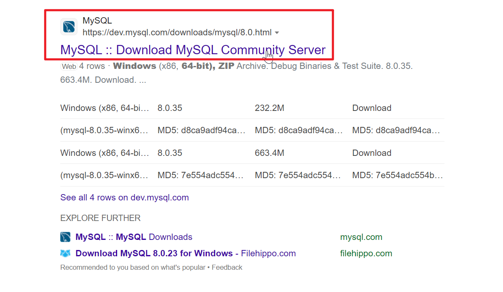
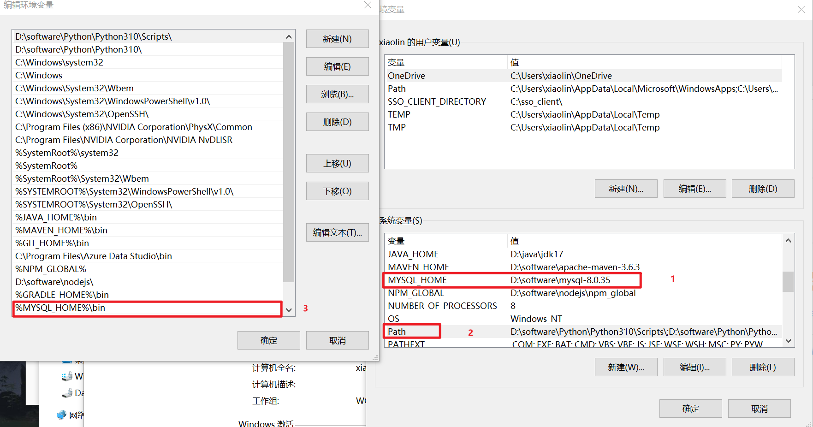
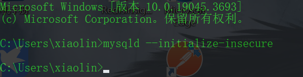
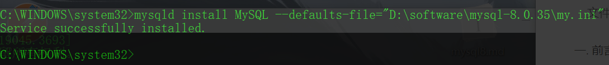
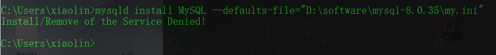
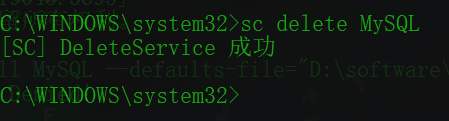
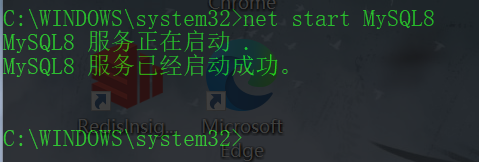
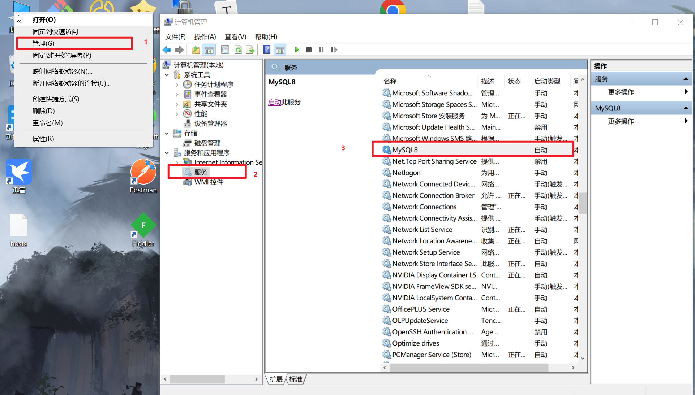
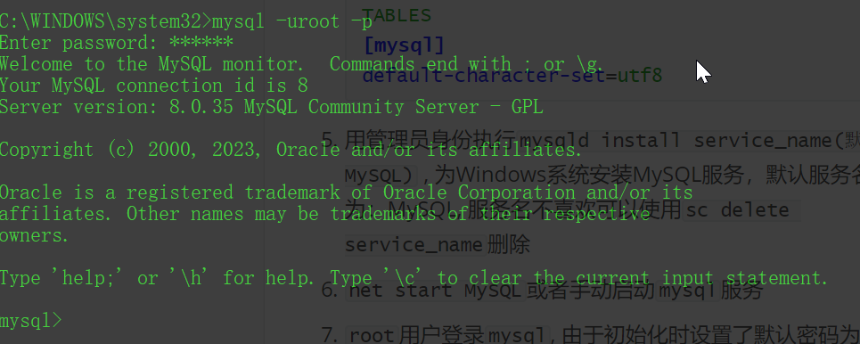
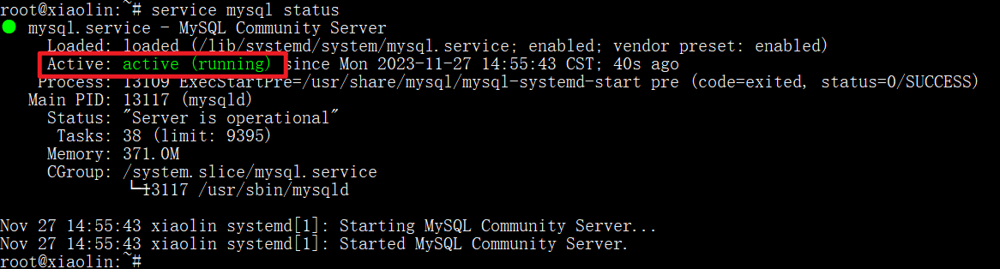

<!-- toc -->

### 前言

数据库是后端必须要掌握的一项内容, `MySQL`是数据库中学习和使用比较方便的, 所以本次就来学习一下`MySQL`数据库

此处学习使用的是`MySQL8`, 新版本的安装和使用总是那么的吸引人.

本次将`Windows`和`Linux`系统中安装`MySQL8`统一介绍, `Windows`使用`zip`包的格式, `Linux`使用命令下载

当前阶段`Docker`盛行, 让开发者不再需要去花费时间关注环境, 但是工具的目的是提高效率节省时间而不是使人退化, 所以依然要学会安装

### Windows

#### 下载

1. 下载地址: https://dev.mysql.com/downloads/mysql/

2. 使用`bing`搜索`mysql8 windows zip`.  <font color="red">不要使用百度!不要使用百度!不要使用百度!</font> 搜索结果中找`MySQL Community Server`

   

3. 本次使用的是`mysql-8.0.35-winx64.zip`

#### 安装

##### 解压缩

解压缩到想要的文件夹下, 修改下文件夹的名字, 主要是不要让它那么长: `mysql-8.0.35`

==注意以下的`D:/software/mysql-8.0.35`是我`mysql8`的安装目录, 应根据个人安装位置查找相关内容==

##### 配置环境变量



##### 初始化数据库

```shell
mysqld --initialize-insecure
```

使用上述命令初始化数据库, 并设置默认`root`密码为空, 这样初次登录时就不需要输入密码了



==建议: 在整个安装过程中, 使用`cmd`执行命令时建议全部使用管理员方式打开, 避免因管理员权限导致失败或者执行成功但没有效果的情况==

如果使用了`--initialize`, 可以配合`--console`查看密码, 或者到`D:/software/mysql-8.0.35/data/计算机用户名.err`文件中查看密码

##### 安装服务

在`mysql`的根目录下创建一个`my.ini`文件并添加配置

```ini
[mysqld]

#免密登录
#注意, 使用上面的初始化命令后, 下面的这行配置一定要注释掉, 否则会出现服务启动成功了又自己关闭了的情况
#skip-grant-tables
# 设置3306端口
port = 3306
# 设置mysql的安装目录
basedir=D:/software/mysql-8.0.35
# 设置 mysql数据库的数据的存放目录
datadir=D:/software/mysql-8.0.35/data
# 允许最大连接数
max_connections=200
# 服务端使用的字符集默认为8比特编码的latin1字符集
character-set-server=utf8
# 创建新表时将使用的默认存储引擎
default-storage-engine=INNODB
sql_mode=NO_ENGINE_SUBSTITUTION,STRICT_TRANS_TABLES
# 修改默认的加密方式为mysql_native_password, 在mysql8中, 默认的加密方式改为了caching_sha2_password
default-authentication-plugin=mysql_native_password 
[mysql]
default-character-set=utf8
```

用==管理员身份==执行命令

```shell
mysqld install service_name(默认MySQL) --defaults-file="xxx\my.ini"
# 如 mysqld install MySQL8 --defaults-file="D:\software\mysql-8.0.35\my.ini"
```

注意: 指定配置文件时, 指令是`--defaults-file`, 注意`default`后面有个`s`, 否则启动时会出错, 在`D:/software/mysql-8.0.35/data/计算机用户名.err`文件中会有类似一下的报错信息

```err
2023-11-26T15:45:38.283085Z 0 [ERROR] [MY-000067] [Server] unknown variable 'default-file=D:\software\mysql-8.0.35\my.ini'.
```



如果没有使用管理员权限会出现一下错误



如果想删除服务, 可以使用一下命令删除

```powershell
sc delete service_name
```



或者使用`mysql`的命令删除`MySQL`服务

```powershell
mysqld --remove service_name
```

##### 启动服务

- 使用命令启动

  ```powershell
  net start service_name 
  # 如 net start MySQL8
  ```

  

  如果出现无法正常启动的提示, 可以去查看自己上一步中`defaults`是不是少了`s`或者指向的文件路径是否正确

  如果出现服务启动成功, 但是连接时连接不上, 查看服务发现自动关闭了的情况

  - 查看`ini`文件中`skip-grant-tables`是否注释掉, 这种情况在`D:/software/mysql-8.0.35/data/计算机用户名.err`有以下信息

    ```err
    2023-11-26T15:45:38.283085Z 0 [ERROR] [MY-000067] [Server] TCP/IP, --shared-memory, or --named-pipe should be configured on NT OS.
    ```

  - 使用管理员权限启动尝试

  - 其他原因可以通过`D:/software/mysql-8.0.35/data/计算机用户名.err`查看错误日志

- 手动启动

  

  失败情况

  

  上述问题多半是`my.ini`文件中的配置导致的, 可以去`D:/software/mysql-8.0.35/data/计算机用户名.err`查看错误日志, 不行的话从头来过

##### 登录

使用数据库连接命令连接数据库

```shell
mysql -uroot -p
```



如果连接失败, 应该是服务启动失败或者启动后自动停止了

##### 修改密码和允许远程访问

```mysql
USE mysql;
# 修改密码
ALTER USER 'root'@'localhost' IDENTIFIED WITH mysql_native_password BY '密码';
# 允许root用户远程登录访问
UPDATE user SET host='%' WHERE user='root';
FLUSH PRIVILEGES;
```

注意在防火墙中开放`MySQL`服务的端口

注意修改密码的方式, 要替换一下密码加密方式, 否则可能导致`Navicat`连接不上或者远程连接失败

如果很不幸的复制`SQL`没有改动执行后退出了, 建议是使用`Navicat`去连接登录修改密码, 毕竟使用`CMD`不太方便

##### 参考文章:

https://blog.csdn.net/qq_43674360/article/details/121809469

https://zhuanlan.zhihu.com/p/442759047

https://blog.csdn.net/u014672466/article/details/86093534

### Linux

`Linux`系统本人是在`Windows`下的`Ubuntu`进行的

1. 配置好`wsl`环境

2. 执行`wsl --install`安装默认的`Ubuntu`系统或者从`Store`中安装

3. 创建`Ubuntu`系统的用户和密码

4. 更换源

   清华镜像源配置获取: https://mirror.tuna.tsinghua.edu.cn/help/ubuntu/

参考文章:

https://zhuanlan.zhihu.com/p/423249278

https://blog.csdn.net/chigenb/article/details/105641189

https://mirror.tuna.tsinghua.edu.cn/help/ubuntu/

#### 下载安装

执行命令下载安装`MySQL`服务

```bash
apt install mysql-server -y
```

下载安装后, 系统已经进行了数据库初始化, 服务注册等操作, 不需要手动操作

执行命令查看`MySQL`服务状态

```shell
service mysql status
```



`MySQL`安装后默认会自动启动

#### 登录

使用数据库连接命令连接数据库

```shell
mysql -uroot -p
```

#### 修改密码和允许远程访问

```mysql
USE mysql;
# 修改密码
ALTER USER 'root'@'localhost' IDENTIFIED WITH mysql_native_password BY '密码';
# 允许root用户远程登录访问
UPDATE user SET host='%' WHERE user='root';
FLUSH PRIVILEGES;
```

注意修改密码的方式, 要替换一下密码加密方式, 否则可能导致`Navicat`连接不上或者远程连接失败

使用`ufw`的`ufw allow 3306`使防火墙开放3306端口

使用`vim /etc/mysql/mysql.conf.d/mysqld.cnf`命令, 将配置文件中的`bind-address = 127.0.0.1`注释或者改为`0.0.0.0`并重启服务

安装`net-tools`, 使用`ifconfig`命令查看`ip`