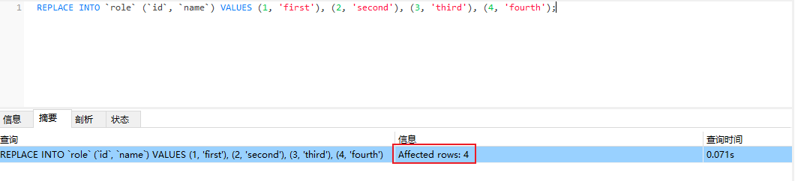
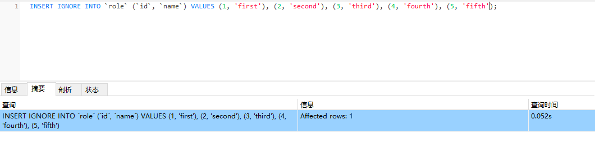
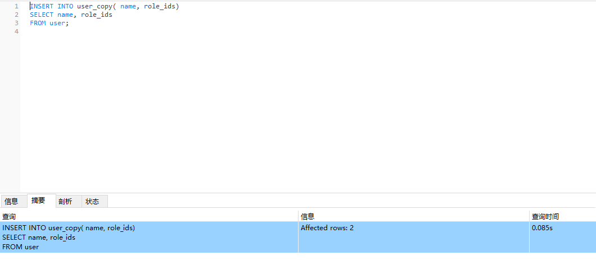
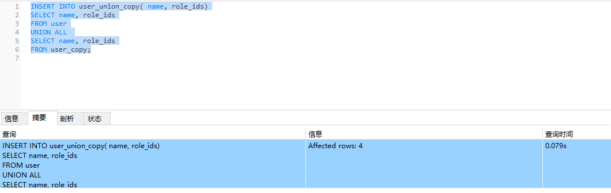
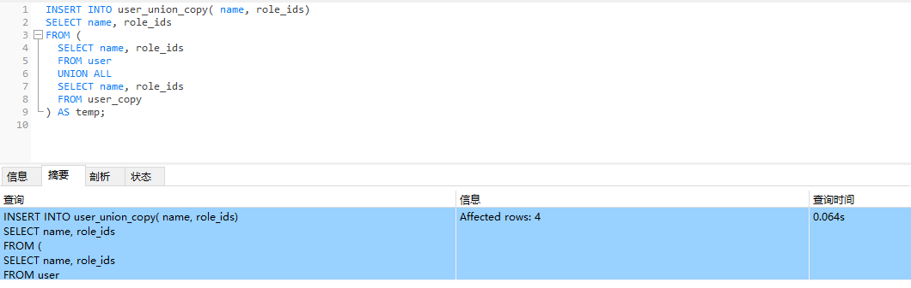
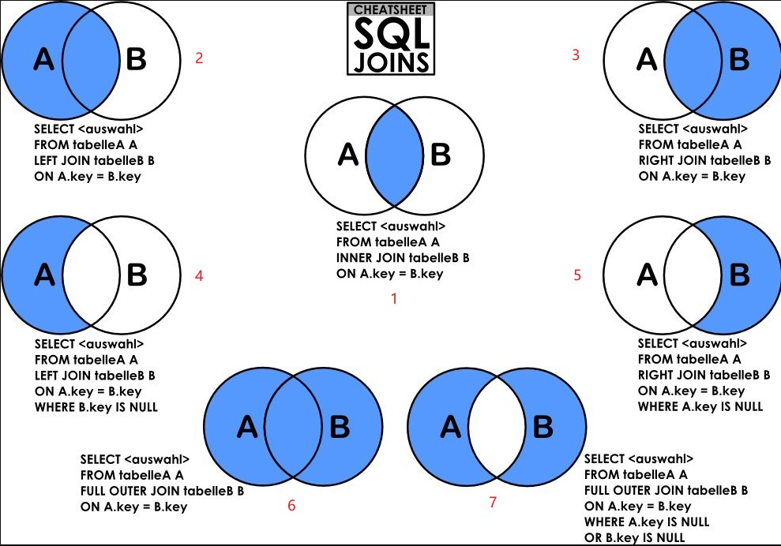
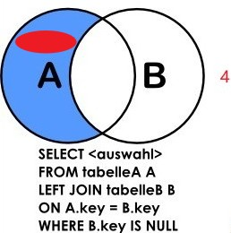

<!-- toc -->

### 前言

`MySQL`是常用的数据库, 市场占有率很高, 我们可以通过`MySQL`来学习`SQL`的通俗标准, 当遇到其他数据库时, 只需要知道数据库之间的差异性即可.

前篇已经讲解了如何安装`MySQL`, 本篇来介绍`SQL`基础, 本篇是基于用户对`MySQL`有一定的认识, 比如`MySQL`的数据类型.`SQL`分为`DDL`,`DML`,`DQL`,`DCL`, 本篇主要是介绍`DML`和`DQL`.

本篇学习比较好的视频教程可参考(个人认为是感官最好的, 详细(啰嗦)有干货): 

https://edu.csdn.net/course/detail/24472

其他的内容不做介绍, 若学习可参考: 

https://www.w3schools.cn/mysql/default.html

https://zhuanlan.zhihu.com/p/391552199

表结构

```mysql
-- 用户表
CREATE TABLE `user` (
  `id` int NOT NULL AUTO_INCREMENT,
  `name` varchar(64) COLLATE utf8mb4_general_ci DEFAULT NULL,
  `sex` char(1) COLLATE utf8mb4_general_ci DEFAULT NULL,
  `age` int DEFAULT NULL,
  `role_ids` varchar(32) COLLATE utf8mb4_general_ci DEFAULT NULL,
  PRIMARY KEY (`id`)
) ENGINE=InnoDB DEFAULT CHARSET=utf8mb4 COLLATE=utf8mb4_general_ci;
```

```mysql
-- 角色表
CREATE TABLE `role` (
  `id` int NOT NULL AUTO_INCREMENT,
  `name` varchar(64) COLLATE utf8mb4_general_ci DEFAULT NULL,
  PRIMARY KEY (`id`)
) ENGINE=InnoDB DEFAULT CHARSET=utf8mb4 COLLATE=utf8mb4_general_ci;
```

### 增

新增操作(`INSERT`)是一种`DML`操作, 用来新增一条或者多条记录

新增操作的语法结构:

#### 常用结构

```sql
INSERT INTO
	table_name(column1, column2,...)
VALUES
	(c1_value1, c2_value1,...),
	(c1_value2, c2_value2,...),
	...
```

常用结构可以用于新增一条记录或者多条记录, 新增多条记录时, 通常批量新增比单条循环新增效率要高, 但也不宜数量过大, 这反而会影响效率, 应使用合适的数量进行循环的批量新增

```mysql
INSERT INTO `user` (`id`, `name`, `sex`, `age`, `role_ids`) VALUES (1, 'xiao-lin', '1', 18, '1,3'), (2, 'xiao_lin', '2', 18, '1,3');

INSERT INTO `role` (`id`, `name`) VALUES (1, 'first'), (2, 'second'), (3, 'third');
```

#### 替换结构

```mysql
REPLACE INTO
	table_name(id, column2,...)
VALUES
	(id_value1, c2_value1,...),
	(id_value2, c2_value2,...),
	...
```

当插入的数据已经存在时(==通过主键判断==), 则删除原记录并添加新记录, 如果不存在则直接添加新记录

```mysql
REPLACE INTO `role` (`id`, `name`) VALUES (1, 'first'), (2, 'second'), (3, 'third'), (4, 'fourth');
```



#### 忽略结构

```mysql
INSERT IGNORE INTO
	table_name(column1, column2,...)
VALUES
	(id_value1, c2_value1,...),
	(id_value2, c2_value2,...),
	...
```

当插入的数据已经存在时(==通过主键判断==), 则忽略该记录, 如果不存在则添加新记录



#### 迁移结构

```mysql
INSERT INTO
	table_name(column1, column2,...)
SELECT
	c1_value1, c2_value1,...
FROM 
	source_table_name
```

新增的数据可直接通过查询得到, 此处的查询是简单表示, 详细的查询可在查询模块中学习. 

在使用此结构时需要注意, ==此结构中的`SELECT`是支持`UNION`操作结果的, 也可以将`UNION`结果作为一个临时表, 外套一个`SELECT`使用==

```mysql
INSERT INTO user_union_copy( name, role_ids)
SELECT name, role_ids
FROM user
```



```mysql
INSERT INTO user_union_copy( name, role_ids)
SELECT name, role_ids
FROM user
UNION ALL 
SELECT name, role_ids
FROM user_copy;
```




```mysql
INSERT INTO user_union_copy( name, role_ids)
SELECT name, role_ids 
FROM (
	SELECT name, role_ids
	FROM user
	UNION ALL 
	SELECT name, role_ids
	FROM user_copy
) AS temp;
```



### 删

删除操作(`DELETE`)是一种`DML`操作, 也是其中最简单的操作, 用来删除符合条件的记录

删除操作的语法结构:

```sql
DELETE
FROM
	table_name
WHERE
	condition
```

删除操作是将符合条件的记录全部删除, 所以一定要记得添加正确的`condition`条件, `condition`条件具体会在查询操作中讲解, 需要注意的是, ==`DELETE`的条件只能是`WHERE`跟随的条件, 无法使用聚合函数条件==

还有一种是清空数据库记录的操作(`TRUNCATE`), `TRUNCATE`的方式清除数据后, 该表进入初始状态, 自增字段值也会回到初始值

```mysql
TRUNCATE table_name;
```

```mysql
TRUNCATE user_union_copy;
```

### 改

修改操作(`UPDATE`)是一种`DML`操作, 用来修改符合条件的记录

#### 基础结构

```mysql
UPDATE
	table_name
SET
	column1 = value1,
	column2 = value2,
	...
WHERE
	condition
```

基础结构是将符合条件的所有记录的对应列全部修改为对应值, 所以执行修改操作时需要特别注意`condition`条件,  `condition`条件具体会在查询操作中讲解, 需要注意的是, ==`UPDATE`的条件只能是`WHERE`跟随的条件, 无法使用聚合函数条件==

#### 关联结构

```mysql
UPDATE
	table_name1 t1
[FULL/INNER/LEFT/RIGHT] JOIN
	table_name2 t2
SET
	t1.column1 = t2.column1_value
	t2.column2 = 0
```

`UPDATE`的关联结构中, ==值是无法使用聚合函数来计算获得的==, 但是可以通过子查询的方式来做一个临时表实现

### 查

查询操作(`SELECT`)是`DQL`操作, 用来查询数据库中保存的记录

#### 查询结构

```mysql
SELECT 
	column1, column2, ...
FROM
	table_name_1 AS t1
[INNER/LEFT/RIGHT] JOIN 
	table_name_2 t2
ON 
	condition0
WHERE
	condition1
GROUP BY
	column3, column4,...
HAVING
	condition2
ORDER BY
	column5, column5
LIMIT 
	offset, length
```

最简单的`SQL`结构

```mysql
SELECT 
	column1, column2, ...
FROM
	table_name_1 AS t1
```

在查询表或者视图数据时, 上述结构就是不可再简化的结构, 其他关键字及其内容是可以省略的, 在需要时添加

#### 关键字描述

`SELECT`

输出, 查询的列, 可以使用`*`表示所有列, 通常情况下不建议

`FROM`

查询的源, 获取数据的来源, 通常是表或者视图

可以通过`JOIN`家族进行表与表, 表与视图, 视图与视图之间的关联, 其==最终结果是一个临时表==, 详细信息可以查看**==表关联==章节**

`WHERE`

过滤, 不可使用聚合函数过滤

`WHERE`的过滤只能基于来自`FROM`的结果集的`COLUMN`, 这是由于`WHERE`执行在`SELECT`之前, 没有任何计算相关操作, 但是可以在`WHERE`中执行非聚合函数的计算(如加减乘除, 取余取模等)并进行结果判断

`WHERE`中不能使用列别名

`GROUP BY`

分组, 根据指定列分组, 可以指定多个列, 不可以是聚合操作列

==此处在执行时可能会出现`GROUP BY`的报错, 说`SELECT`查询的`COLUMN`没有在`GROUP BY`中出现, 这个是开启了`ONLY_FULL_GROUP_BY`模式的原因==

从`GROUP BY`开始, 可以使用列别名

`HAVING`

过滤, 可使用聚合函数的过滤

`HAVING`的过滤的条件来自于`FROM`的结果集+`SELECT`的结果集

`ORDER BY`

排序, 根据指定列排序, 可以指定多个列, 也可以指定每个列的升序和降序

`ORDER BY`的排序列可以来自`FROM`的结果集, 也可以来自`SELECT`的结果集

`LIMIT`

限定个数

`offset`跳过的记录数

`size`取的记录数

#### 执行顺序

`FROM` -> `WHERE` -> `GROUP BY` -> `HAVING` -> `SELECT` -> `ORDER BY` -> `LIMIT`

关于执行顺序的问题存在很大的争议, 其中的争议点主要是`SELECT`的执行位置, 这个执行顺序即使是官方也没有说明, 上述顺序是网上认可度比较高的顺序.

个人想法:

`SELECT`的执行位置与对`SELECT`的认识有关, 整个查询结构中, 将关键字按等级划分的话, `GROUP BY`和`HAVING`是附属流程的关键字, 它们为`SELECT`关键字工作.

`FROM` -> `WHERE` -> `SELECT_PARSE` -> `GROUP BY` -> `SELECT_PROCESS` -> `HAVING` -> `SELECT_RESULT` -> `ORDER BY` -> `LIMIT`

`SELECT_PARSE`为`SELECT`的开始, 此时只解析`SELECT`中定义的内容, 不做任何处理

`GROUP BY`为`SELECT`过程中的分组过程, 此时只是按内容做分组处理, 不做计算

`SELECT_PROCESS`为`SELECT`的处理过程, 这个过程中会做内容计算

`HAVING`为`SELECT`过程中的筛选过程, 这个过程对之前的处理结果进行筛选工作

`SELECT_RESULT`为`SELECT`的输出过程, 这个过程是将最终的结果返回

==以上为个人猜测, 请理性看待==

猜测的依据:

1. `SELECT`中定义的别名在`GROUP BY`中就可以使用, 这说明`SELECT`中定义的内容, 在`GROUP BY`之前就已经解析了, 但应该只是解析了列名, 没有做数据处理, 因为聚合操作的列需要在分组之后处理, 在`GROUP BY`中使用聚合操作列分组时会报错 `=>`  `SELECT_PARSE` -> `GROUP BY` -> `SELECT_PROCESS`
2. `SELECT`在解析时, 不仅仅解析了`SELECT`中定义的列, 还包括源数据(来自于`FROM`的数据)中的列, 并进行了合并, 可以通过`GROUP BY`和`HAVING`验证
3. `HAVING`和`SELECT_RESULT`这两个过程其实不太明确了, 即使调换理论上也没有错误, 参考`WHERE`的筛选, 应该是在输出结果之前

可参考:

https://builtin.com/data-science/sql-order-of-execution

https://stackoverflow.com/questions/24127932/mysql-query-clause-execution-order

### 聚合函数

#### COUNT

计数

不记录`NULL`值, 如果在查询之后进行了分组然后计算`COUNT`, `COUNT`的列中如果有为`NULL`的记录, 则该记录不计算在内, 结果比`COUNT(1), COUNT(*)`小

`COUNT`中的列如果使用`DISTINCT`, 则会去重

#### SUM

求和

不记录`NULL`值

计算字符串时, 会转为0

#### MAX

最大值

不记录`NULL`值

#### MIN

最小值

不记录`NULL`值

#### AVG

平均值

不记录`NULL`值

#### GROUP_CONCAT

字符串分组拼接, 使用`,`作为分隔符

### 结构关键字

#### CASE WHEN

结构

```mysql
-- 1. 变量形式
CASE 变量
WHEN 值 THEN ...
WHEN 值 THEN ...
ELSE ...
END
-- 2. 表达式形式
CASE
WHEN condition THEN ...
WHEN condition THEN ...
ELSE ...
END
```

特殊的使用`CASE WEHN`+聚合函数可以将纵向记录横向化

| name | subject | score |
| ---- | ------- | ----- |
| 赵   | 语      | 1     |
| 钱   | 语      | 2     |
| 孙   | 语      | 1     |
| 李   | 语      | 2     |
| 赵   | 数      | 3     |
| 钱   | 数      | 3     |
| 孙   | 数      | 2     |
| 李   | 数      | 2     |
| 赵   | 外      | 2     |
| 钱   | 外      | 3     |
| 孙   | 外      | 3     |
| 李   | 外      | 2     |

转为

| name | 语   | 数   | 外   |
| ---- | ---- | ---- | ---- |
| 赵   | 1    | 3    | 2    |
| 钱   | 2    | 3    | 3    |
| 孙   | 1    | 2    | 3    |
| 李   | 2    | 2    | 2    |

```mysql
SELECT
	MAX(
    	CASE subject
        WHEN '语' THEN score
        ELSE NULL
        END
    ) AS '语',
	MAX(
    	CASE subject
        WHEN '数' THEN score
        ELSE NULL
        END
    ) AS '数',
	MAX(
    	CASE subject
        WHEN '外' THEN score
        ELSE NULL
        END
    ) AS '外'
FROM score
GROUP BY name;
```

每一列用`CASE WHEN`将除了符合科目条件的记录的成绩输出, 否则为`NULL`

得到

| name | 语   | 数   | 外   |
| ---- | ---- | ---- | ---- |
| 赵   | 1    | NULL | NULL |
| 钱   | 2    | NULL | NULL |
| 孙   | 1    | NULL | NULL |
| 李   | 2    | NULL | NULL |
| 赵   | NULL | 3    | NULL |
| 钱   | NULL | 3    | NULL |
| 孙   | NULL | 2    | NULL |
| 李   | NULL | 2    | NULL |
| 赵   | NULL | NULL | 2    |
| 钱   | NULL | NULL | 3    |
| 孙   | NULL | NULL | 3    |
| 李   | NULL | NULL | 2    |

使用分组`MAX`, 得到每个人每一科目的`MAX`, 由于`NULL`不纳入计算, 所以得到最大值就是唯一值

### 表关联

#### 关联结构

```sql
FROM
	table_1
[INNER/LEFT/RIGHT] JOIN
	table_2
ON condition
```

#### 关键字

连接分为内连接和外连接

`[INNER] JOIN`: 内连接, 通过`ON`来进行条件匹配, 其返回结果是两个关联的表中存在互相关联的数据, 即两个表的交集.==内连接也可以没有`ON`条件, 通过`WHERE`条件语句实现==, 当时用内连接关联时, 使用`ON`关联与使用`WHERE`关联是一致的, 执行时会将`ON`关联优化为`WHERE`关联

`LEFT/RIGHT JOIN`: 外连接 通过`ON`来进行条件匹配, 其返回结果是两个关联的表中以其中一张表为基础, 通过另一张表添加附属数据, 可以不存在附属数据, ==外连接必须包含`ON`条件==



> 上面是网上的常用的`JOIN`集合图, 共有其中情况, 其中`1, 2, 3`这三种情况是我们最常用的场景
>
> 情况`4, 5`是单表去除了公共部分, 需要注意, 这两种情况如果需要的到, 关联是必须的, 这需要区分一下两条语句(以`LEFT JOIN`为例):
>
> ```mysql
> -- 单表
> SELECT <auswahl>
> FROM tableA A
> WHERE A.key IS NULL;
> -- 关联表
> SELECT <auswahl>
> FROM tableA A
> LEFT JOIN tableB B
> ON A.key = B.key
> WHERE B.key IS NULL;
> ```
>
> 上面两条语句的结果集是不一样的, 在关联的查询方式中, 如果`tableA`的`key`是存在的, 但是`tableB`中不存在对应的记录, 则该记录不会记录在内, 其数据量是大于等于单表查询方式的
>
> 
>
> 假设红色区域是`tableA`中存在`key`, 但是`tableB`中不存在对应`key`的记录, 那么, 单表的查询结果=蓝色区域 - 红色区域
>
> 情况`6, 7`在`mysql`中是不支持这种写法的, 但是可以通过`UNION`实现
>
> ```mysql
> -- 情况6 = 情况2 + 情况3 - 情况1(-情况1是去重)
> SELECT <auswahl>
> FROM tableA A 
> LEFT JOIN tableB B
> ON A.key = B.key
> UNION -- 去重
> SELECT <auswahl>
> FROM tableB A
> RIGHT JOIN tableB B
> ON A.key = B.key;
> -- 情况7 = 情况4 + 情况5
> SELECT <auswahl>
> FROM tableA A 
> LEFT JOIN tableB B
> ON A.key = B.key
> WHERE B.key IS NULL
> UNION -- 去重
> SELECT <auswahl>
> FROM tableB A
> RIGHT JOIN tableB B
> ON A.key = B.key
> WHERE A.key IS NULL;
> ```
>
> 


下面的方式可以实现使用字符串拼接关联字段的关联, 但受限于`help_topic`数值, 拼接字段的个数只能在600个左右

如`user`表中某个用户的`role_ids`的值为`1,3,5`, 则该用户使用一下方式时, 可以实现

| user | role       |
| ---- | ---------- |
| user | role_first |
| user | role_third |
| user | role_fifth |

```mysql
SELECT
	u.id as uid, u.name as username, r.id as rid, r.name as role_name
FROM 
	user u 
LEFT JOIN
	role r
ON r.id = ANY(
	SELECT SUBSTRING_INDEX(SUBSTRING_INDEX(u.role_ids,',',help_topic_id+1),',',-1)
	FROM mysql.help_topic h
	WHERE h.help_topic_id < LENGTH(u.role_ids) - LENGTH(REPLACE(u.role_ids,',','')) + 1
);
```

#### 使用选择

内连接和外连接的数据集是不同的, 在使用时需要根据需求进行选择

可以通过查询数据的要求, 寻求表之间是否需要有主次关系, 这种主次关系并不是表的主次关系, 而是需求上需不需要表存在主次关系

比如以上面的表结构为例

> 需求一: 查询用户角色, 携带用户信息
>
> 需求二: 查询用户列表, 携带角色信息
>
> 需求三: 查询角色列表, 携带相关用户

需求一: 两个表在需求上是不存在主次关系的, 查询的内容是来自于角色表, 被动主体是用户表

```sql
SELECT
	u.name, r.name
FROM
	user u
JOIN
	role r
ON r.id = ANY(
	SELECT SUBSTRING_INDEX(SUBSTRING_INDEX(u.role_ids,',',help_topic_id+1),',',-1)
	FROM mysql.help_topic h
	WHERE h.help_topic_id < LENGTH(u.role_ids) - LENGTH(REPLACE(u.role_ids,',','')) + 1
)
WHERE
	u.id =  1
```

当使用中间表做关联时

```sql
SELECT
	u.name, r.name
FROM 
	user u
JOIN
	user_role ur
ON u.id = ur.user_id
JOIN
	role r
ON r.id = ur.role_id
WHERE
	u.id = 1
```

查询的结果实际是表关联中符合要求的交集部分, 当没有符合关联条件的记录时, 返回空

需求二: 两个表在需求上是附属关系的, 查询的内容实际是用户内容, 而角色信息是附属内容

```sql
SELECT
	u.name, GROUP_CONCAT(r.name)
FROM 
	user u
LEFT JOIN
	role r
ON r.id = ANY(
	SELECT SUBSTRING_INDEX(SUBSTRING_INDEX(u.role_ids,',',help_topic_id+1),',',-1)
	FROM mysql.help_topic h
	WHERE h.help_topic_id < LENGTH(u.role_ids) - LENGTH(REPLACE(u.role_ids,',','')) + 1
)
GROUP BY u.id
```

查询的结果实际上是用户的内容, 需要将有角色信息的用户的角色信息一起查询出来, 用户没有角色信息也查询出来, 但角色信息展示为空

需求三: 两个表在需求上是负数关系的, 查询的内容实际是角色信息, 用户信息是附属内容

```sql
SELECT
	r.name, GROUP_CONCAT(u.name)
FROM 
	role r
LEFT JOIN
	user u
ON r.id = ANY(
	SELECT SUBSTRING_INDEX(SUBSTRING_INDEX(u.role_ids,',',help_topic_id+1),',',-1)
	FROM mysql.help_topic h
	WHERE h.help_topic_id < LENGTH(u.role_ids) - LENGTH(REPLACE(u.role_ids,',','')) + 1
)
GROUP BY r.id
```

查询的结果实际上是角色的内容, 将有关联用户的角色, 将关联的用户一起查询出来, 角色没有关联用户也查询出来, 但用户信息展示为空

### 问题:sob:

### 挖坑


