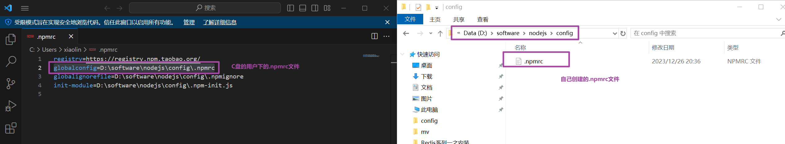
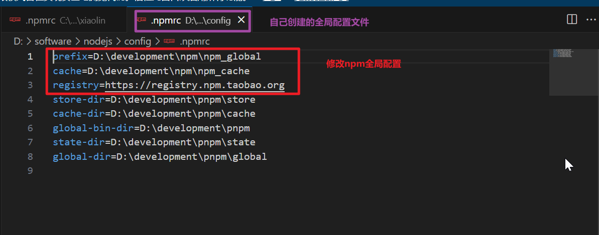
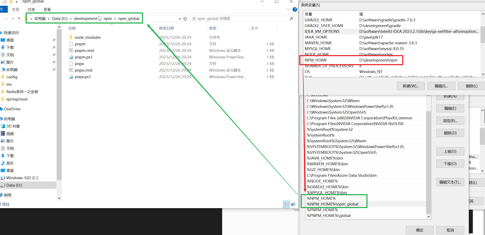
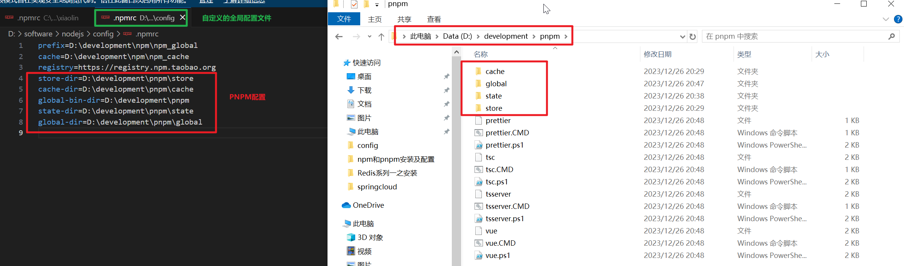
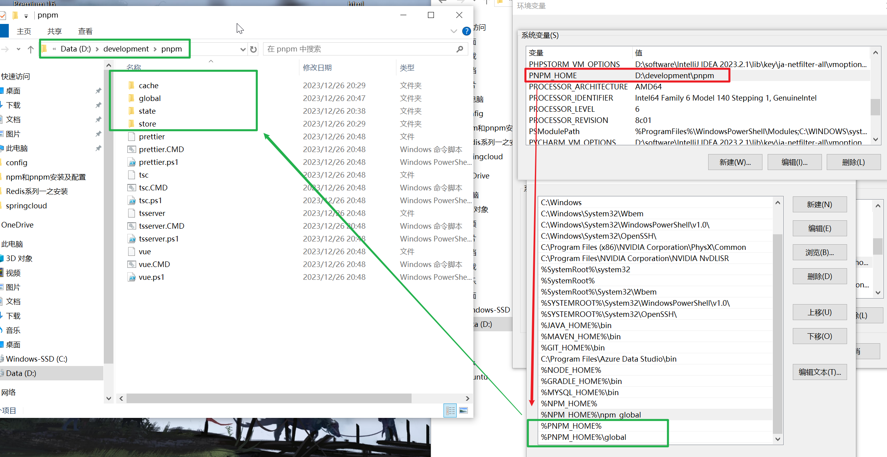

<!-- toc -->

### `NPM`配置

#### 修改配置

`npm`会伴随着`node`安装, 所以此处仅仅表述`npm`如何配置

使用命令

```shell
npm config ls
```

查看`npm`有哪些常用配置, 可以自己去修改配置

使用

```shell
npm config get xxx
```

`xxx`为配置名, 可以查看某个配置的信息

使用

```shell
npm config set xxx yyy
```

`xxx`为配置名,`yyy`为配置值

建议自配置的方式:

步骤一: 

使用命令

```shell
npm config set globalconfig "D:\software\nodejs\config\.npmrc"
```

修改全局配置的指向文件

或者直接修改`C:\Users\<user>\.npmrc`

```.npmrc
globalconfig=D:\software\nodejs\config\.npmrc
```

来修改全局配置的指向文件

步骤二:

创建全局配置的指向文件



步骤三:

在自己创建的全局配置文件中进行配置修改



#### 环境变量配置

1. `npm`的环境变量在`node`安装时即可配置

2. `npm`安装的依赖环境变量

   

3. 检验

   使用`npm`命令安装`typescript`

   ```shell
   npm install typescript -g
   ```

   - 查看`typescript`的安装位置
   - 使用`tsc -v`查看`tsc`命令是否可用

### `PNPM`安装

使用`npm`安装`pnpm`

```shell
npm install pnpm
```

使用`pnpm`命令查看是否安装成功

注意: 由于使用`npm`安装`pnpm`, `pnpm`相关的命令是在`npm`的全局安装位置下

也可以使用`pnpm.exe`安装`pnpm`, 这个自行`Bing`吧

### `PNPM`配置

#### 修改配置

上面配置`npm`时使用了自定义的配置文件, `pnpm`也会共用`npm`的配置, 所以对`pnpm`进行配置可以直接在自定义的配置文件中进行配置, 直接按照`npm`配置中的步骤三配置一下信息

- **`store-dir`**
- **`cache-dir`**
- **`global-bin-dir`**
- **`state-dir`**
- **`global-dir`**

如果使用命令行进行配置

```shell
pnpm config set xxx yyy
```

会将配置信息配置到`C:\Users\<User>\AppData\Local\pnpm\config`目录下的`rc`文件中



此时可将`C:\Users\<User>\AppData\Local`目录下的`pnpm-state`和`pnpm-cache`以及`C:\Users\<User>\AppData\Local\pnpm`目录下的`pnpm-store`内容删除

#### 环境变量配置

与`npm`的环境变量配置一样

1. 由于`pnpm`使用`npm`安装, 所以`npm`安装的依赖的环境变量配置好之后, `pnpm`的环境变量就配置好了

2. `npm`安装的依赖环境变量

   

3. 检验

   使用`pnpm`命令安装`@vue/cli`

   ```shell
   pnpm add @vue/cli
   ```

   - 查看`@vue/cli`的安装位置
   - 使用`vue -v`命令是否可用

### 出现问题:sob:

<i>问题一</i>

出现问题:

在使用`pnpm`安装`typescript`的过程中, 修改配置后, 安装包始终安装在`C:\Users\<User>\node_modules`下

问题原因:

`pnpm`没有添加`-g`和`-s`参数时, 不会自动识别为全局安装, 所以如果在任意位置使用`cmd`命令开启终端进行安装依赖的操作, `pnpm`会认为在当前目录下安装依赖(即终端中显示的目录地址), 所以安装在了用户目录下

解决方案: 全局安装时添加`-g`命令 