<!-- toc -->

### 环境

1. `node`环境 ---> 安装`node`
2. `git`环境 ---> 若需要交给托管中心, 则需要安装`git`环境
3. `hexo`环境 ---> 博客搭建使用 `npm install hexo-cli -g`

### 博客搭建

1. 创建一个空目录, 空目录, 空目录

2. 进入空目录下打开命令行

3. 执行`hexo init`命令, 进行初始化

   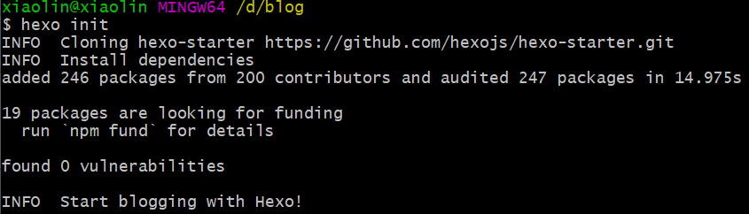

   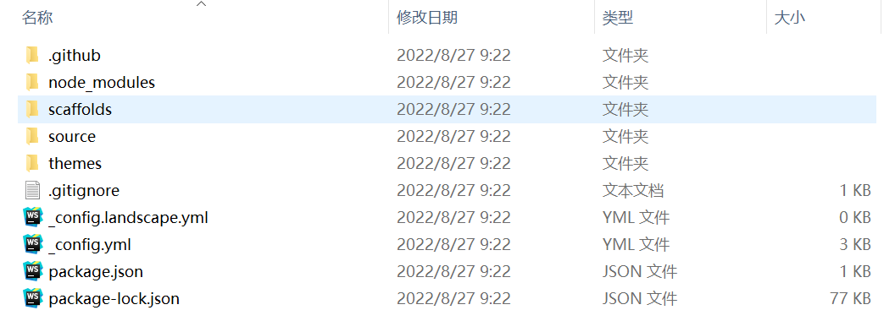

4. 执行`hexo s`或者`hexo server`命令, 即可启动搭建的博客

   

   访问`http://localhost:4000/`即可查看当前的博客

5. 执行`hexo new [layout] "title"`命令, 新建一个页面

   `layout`的选项:

   ​	`post`: 博客 ---> `source/_post`

   ​	`page`: 路由 ---> `source`

   ​	`draft`: 稿件 ---> `source/_draft`

### 使用`gitee`部署

1. 在`gitee`上新建仓库, 并将仓库地址配置到博客根目录的`_config.yml`中, 如下

   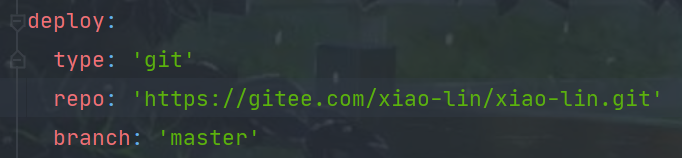

2. 安装`git`部署插件`npm install hexo-deployer-git --save`和`markdown`渲染插件`npm install hexo-renderer-marked --save`

3. 执行`hexo g`或者`hexo generate`命令生成静态文件

   在`public`目录下可以看到生成的静态文件(将`public`中的内容放到`nginx`下, 做好相关配置, 也可以实现)

4. 执行`hexo d`或者`hexo deploy`推送到`gitee`

   此时发现`gitee`仓库中已经添加了内容, 这些内容是`public`目录下的静态文件

   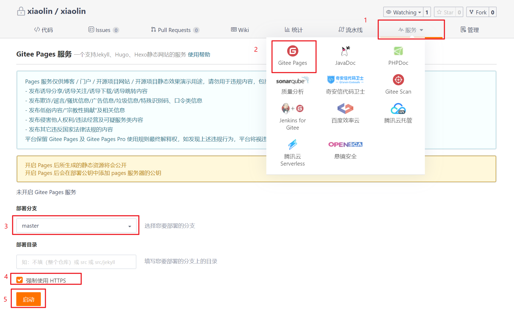

   成功之后会生成访问地址

### 修改主题

1. 选择主题

   访问https://hexo.io/themes/可以选择自己喜欢的主题

   本人选择的是`hexo-theme-cola`这一款, 这款比较符合我的期望, 还有评论功能; 最好选择带有说明的主题, 方便使用, 前人栽树后人乘凉.

2. 从`github`上下载选择的主题, 并将整个主题目录添加到`themes`目录下

   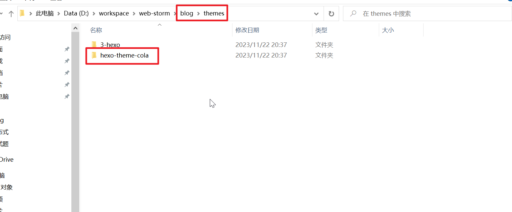

3. 根据主题中的说明, 进行主题初始化

   `hexo-theme-cola`主题的相关初始化和配置可以查看原作者`https://yangxiang.cc/`的《如何使用`hexo-theme-cola`主题》这一篇博客

   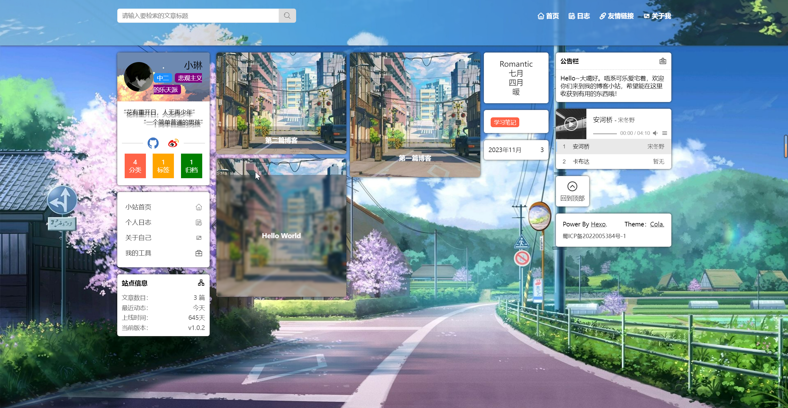

4. 根据需要, 修改配置文件`_config.yml`中的配置信息

5. 自定义和修改配置内容

   - 修改内容: 根据配置搜索定义位置, 如: 我想在`github`的图标定义为动态数量的, 则去查询配置文件中`github_url`的使用位置(在`main-left.ejs`文件中), 并修改配置

     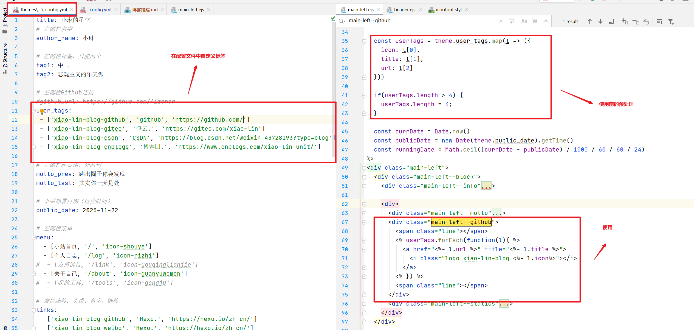

   - 修改`icon`: 

     1. 在https://www.iconfont.cn/manage/index中创建自己的项目, 添加需要的标签

        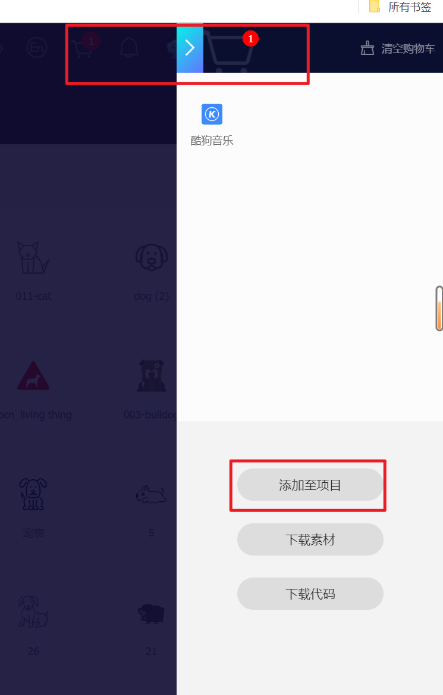

     2. 项目设置

        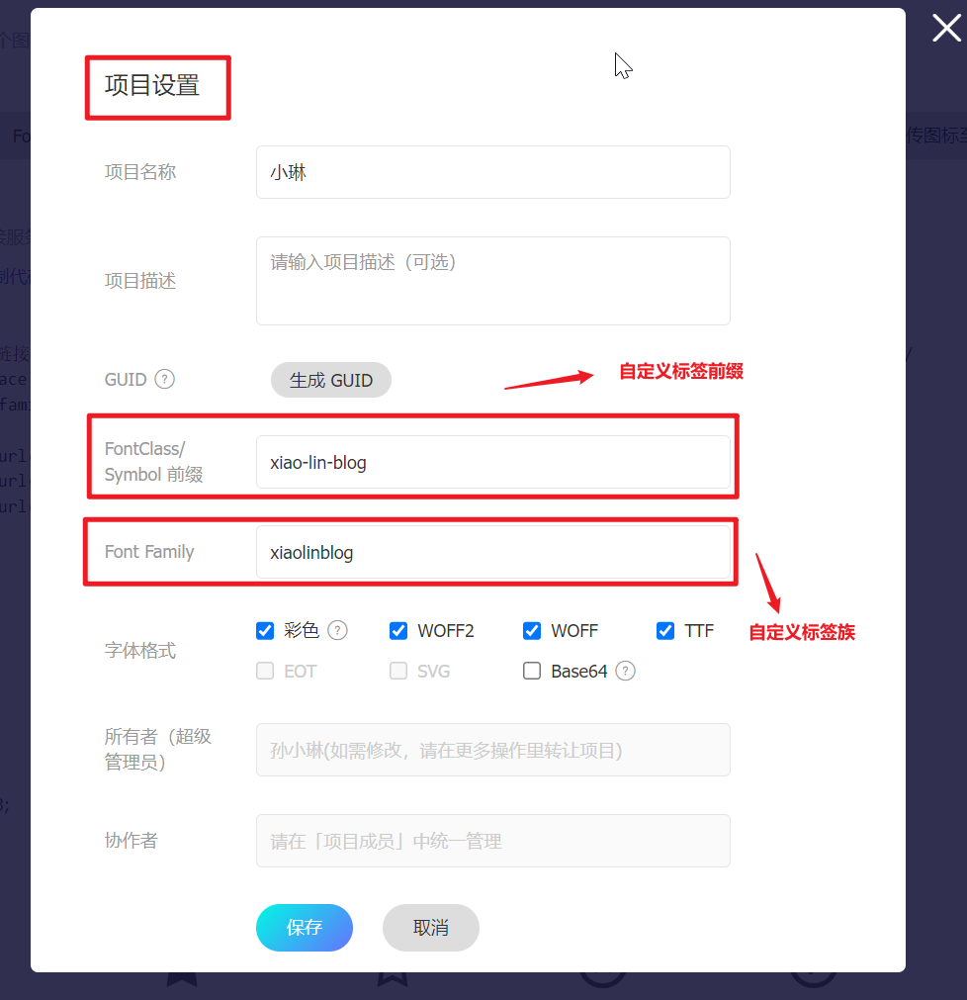

     3. 生成`icon`引入格式

        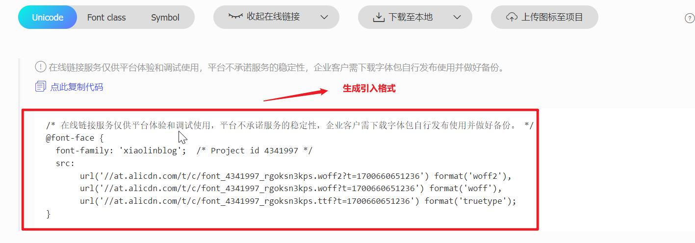

     4. `iconfont`的引入和使用

        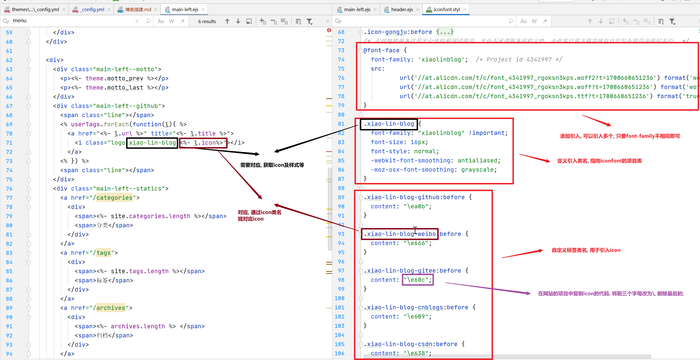

### 写博客

1. 修改配置为文件`_config.yml`中的`post_asset_folder`配置项为`true`, 允许添加资源文件夹

2. 使用`hexo new post "blog_name"`命令创建一篇博客, 会在`_posts`目录下生成一个`md`文件和一个同名的文件夹

   如果想要将博客使用文件夹分开存放, 可以使用`hexo new post -p xxx/yyy.md`命令创建博客, `hexo`会在`_post`文件夹下创建一个`xxx`的子文件夹, 然后在子文件夹下创建`yyy.md`, 如果文件路径中含有空格, 则必须使用`""`括起来

3. 编辑`md`文件, 书写博客`title`和内容

4. 添加`hexo-asset-img`组件, 可以使用`markdown`中的``格式添加图片

   2023-11-28更新

   添加图片的格式要求``

   ```js
   var regExp = RegExp("!\\[(.*?)\\]\\(" + fileName + '/(.+?)\\)', "g");
   // hexo g
   data.content = data.content.replace(regExp, "","g");
   ```

   上述为`hexo-asset-img`处理图片的核心代码, 它是将`markdown`格式的图片信息替换为编译格式, 使用的图片的所在目录是与文件名同名的, 所以有图片格式要求

   1. 图片路径必须以文章的文件名开头, 不能是`./`, 否则无法匹配, 注意是文件名, 跟文章的`title`无关

   2. 文件名中不能带有正则表达式的元字符, 如`.`, `()`, `*`, `?`, `+`, `\`等, 因为处理中的正则表达式是将文件名直接拼接的, 所以其中的包含的正则元字符是没有处理的

      别问我为啥知道的, 我花了两个多小时发现的:sob:

      最近写的两篇博客的文件名中使用了`()`元字符, 发现图片加载不出来, 之前的文章都是可以的, 然后巴拉了一堆文章看没啥用, 决定自己去翻源码看看, 别的不说`hexo-asset-img`的`README.md`写的还是不错的: 

      ```md
      # hexo-asset-img
      ```

      以上为`README.md`的全部内容, 很简洁吧:joy:

      没办法, 去翻看源码, 还好源码比较少, 好懂, 然后最关键的就是上面两行, 我在内容替换之前和替换之后分别打印了一下, 发现了问题

### 优化博客内容

#### 使用插件

1. 将`hexo-renderer-marked`替换为`@upupming/hexo-renderer-markdown-it-plus`

2. `_config.yml`中添加配置

   ```yml
   # Markdown config
   markdown_it_plus:
     render:
       html: true
       xhtmlOut: false
       breaks: true
       linkify: true
       typographer: true
       quotes: '“”‘’'
     plugins:
       - plugin:
           name: markdown-it-emoji
           enable: true
       - plugin:
           name: markdown-it-sub
           enable: true
       - plugin:
           name: markdown-it-sup
           enable: true
       - plugin:
           name: markdown-it-footnote
           enable: true
       - plugin:
           name: markdown-it-ins
           enable: true
       - plugin:
           name: markdown-it-mark
           enable: true
       - plugin:
           name: markdown-it-katex
           enable: true
     anchors:
       # Minimum level for ID creation. (Ex. h2 to h6)
       level: 2
       # A suffix that is prepended to the number given if the ID is repeated.
   #    collisionSuffix: ''
       collisionSuffix: 'v'
       # If `true`, creates an anchor tag with a permalink besides the heading.
       permalink: false
       # Class used for the permalink anchor tag.
       permalinkClass: header-anchor
       # Set to 'right' to add permalink after heading
       permalinkSide: 'left'
       # The symbol used to make the permalink
       permalinkSymbol: ¶
       # Transform anchor to (1) lower case; (2) upper case
       case: 0
       # Replace space with a character
       separator: '-'
   ```

3. 安装对应的插件

   ```shell
   npm install markdown-it-xxx
   ```

#### 添加目录
在文章的开始部分添加如下内容
```html
<!-- toc -->
```
该内容不会在文章中显示, 而是会生成目录, 使用`hexo`自带的`toc`函数即可渲染目录

目录标签使用: 

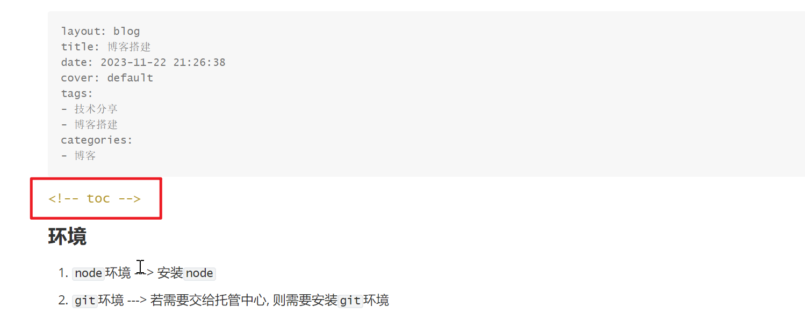

`hexo`自带`toc`函数渲染

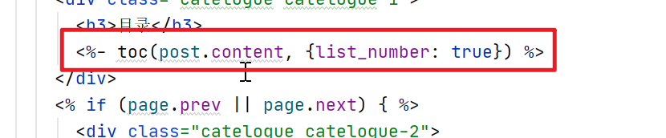

`hexo`自带`toc`函数渲染结果


此处的渲染结果指的是:

1. 添加锚点(其实不使用`toc`也有锚点, 标题标签会有`id`属性, 其值就是标题内容)

2. 渲染目录标签, 大致如下

   ```html
   <ol class="toc">
       <!-- 一级目录 -->
       <li class="toc-item toc-level-3">
           <a class="toc-link" href="#%E7%8E%AF%E5%A2%83">
               <span class="toc-number">1.</span> 
               <span class="toc-text"> 环境</span>
           </a>
       </li>
       <li class="toc-item toc-level-3">
           <a class="toc-link" href="#%E5%8D%9A%E5%AE%A2%E6%90%AD%E5%BB%BA">
               <span class="toc-number">2.</span> 
               <span class="toc-text"> 博客搭建</span>
           </a>
       </li>
       <!-- ... -->
   	<!-- 多级目录 -->
       <li class="toc-item toc-level-3">
           <a class="toc-link" href="#%E4%BC%98%E5%8C%96%E5%8D%9A%E5%AE%A2%E5%86%85%E5%AE%B9">
               <span class="toc-number">6.</span> 
               <span class="toc-text"> 优化博客内容</span>
           </a>
           <ol class="toc-child">
               <li class="toc-item toc-level-4">
                   <a class="toc-link" href="#%E4%BD%BF%E7%94%A8%E6%8F%92%E4%BB%B6">
                       <span class="toc-number">6.1.</span> 
                       <span class="toc-text"> 使用插件</span>
                   </a>
               </li>
               <li class="toc-item toc-level-4">
                   <a class="toc-link" href="#%E6%B7%BB%E5%8A%A0%E7%9B%AE%E5%BD%95">
                       <span class="toc-number">6.2.</span> 
                       <span class="toc-text"> 添加目录</span>
                   </a>
               </li>
           </ol>
       </li>
   </ol>
   ```

   


