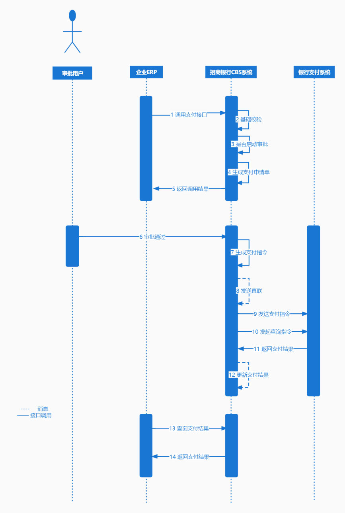

<!-- toc -->

### 前言

年前给公司系统对接了一下招商银行的`CBS`系统, 对接还是比较简单的, 只是有一些需要注意的东西, 整理一篇文章简单记录一下

对接的内容上目前是只对接了==支付==, ==支付结果==, ==电子回单==, ==交易明细==. 后三者过程大致类似, 就以支付结果为例, 特别点会进行额外描述

相关文件

<a href="cbs.7z" download="Demo.7z">官方Demo</a>

<a href="CBS8财资云业务对接指南.docx" download="CBS8财资云业务对接指南.docx">CBS8财资云业务对接指南.docx</a>

<a href="测试资源.docx" download="测试资源.docx">测试资源.docx</a>

### 前提

1. 已经在招商银行的`CBS`中注册企业用户, 获取到`app-id`和密钥等信息
2. 使用的账户已经注册到招商银行`CBS`的注册企业用户中

这两个条件保证了企业在招商银行`CBS`系统中的使用权限和可操作账户

如果企业使用了其他银行的银行卡账户, 应联系招商银行, 让其进行目标银行的对接工作, 这样此处就只需要对接招商银行的`CBS`系统即可

### 基础配置

前面讲到将企业注册为企业用户, 获取到`app-id`和密钥等信息, 这些信息我们需要配置到系统中, 用来进行对接

```yml
cbs:
  app-id: xxx
  app-secret: xxx
  #平台公钥
  platform-public-key: xxx
  #公司公钥
  firm-public-key: xxx
  #公司私钥
  firm-private-key: xxx
  #CBS请求域名
  open-api-url: https://tmcapi.cmbchina.com
  #支付接口路径
  payment-url: /openapi/payment/openapi/v1/payment-apply-common
  # 查询支付的实际支付结果
  payment-query-url: /openapi/payment/openapi/v1/query
  #电子回单
  payment-receipt-url: /openapi/account/openapi/v1/electronic-bill/query
  #交易详情
  transaction-detail-url: /openapi/account/openapi/v1/transaction-detail/query
  get-token-url: /openapi/app/v1/app/token
  refresh-token-url: /openapi/app/v1/app/refresh-token
```

```java
@Slf4j
@Configuration
@ConfigurationProperties(prefix = "cbs8")
public class CBSConfig {
    private String appId;
    private String appSecret;
    // 平台公钥
    private String platformPublicKey;
    // 公司公钥
    private String firmPublicKey;
    // 公司私钥
    private String firmPrivateKey;
    // CBS请求域名
    private String openApiUrl;
    // 支付接口路径
    private String paymentUrl;
    // 电子回单
    private String paymentReceiptUrl;
    // 交易详情
    private String transactionDetailUrl;
    // 获取TOKEN
    private String getTokenUrl;
    // 刷新TOKEN
    private String refreshTokenUrl;
	// 支付结果查询
    private String paymentQueryUrl;
}
```

### 公共内容

#### `TOKEN`

获取`token`和刷新`token`, 此处使用`Redis`存储`token`信息, `CBS`系统的`token`有效时长为30分钟

```java
@Slf4j
@Component
public class CBSTokenUtils {

    /**
     * token保存map的key
     */
    private static final String TOKEN_INFO_KEY = "cbs_docking_key";

    /**
     * token在map中的key
     */
    private static final String TOKEN_KEY = "token";

    /**
     * 过期时间
     */
    private static final String EXPIRES = "expires";

    /**
     * 保存时间
     */
    private static final String SAVE_TIME = "save_time";

    /**
     * 预留过期时间, 5分钟
     */
    private static final int RESERVE_TIME = 5 * 60;

    private static final int REFRESH_TIME = 4;

    /**
     * token 的有效时长, 30分钟
     */
    private static final int EFFECTIVE_TIME = 10 * 60;

    RestTemplate restTemplate = new RestTemplate();

    @Autowired
    private CBSConfig cbsConfig;

    @Autowired
    private RedisUtil redisUtil;

    public String token() {
        // 获取token
        String token = (String) redisUtil.hget(TOKEN_INFO_KEY, TOKEN_KEY);
        // 当前系统时间, 秒
        long l = System.currentTimeMillis() / 1000;
        // 如果token不为空
        if (StringUtils.isNotBlank(token)) {
            if (!expires(l)) {
                return token;
            }
        }
        JSONObject tokenInfo = getTokenInfo();
        token = tokenInfo.getString("token");
        Integer expires = tokenInfo.getInteger("expires");
        //刷新token
        if (null != expires) {
            // 过期时间小于4秒, 则等待重新获取
            if (expires < REFRESH_TIME) {
                try {
                    log.info("expires: {}; 等待: {}", expires, REFRESH_TIME + 1);
                    Thread.sleep((REFRESH_TIME + 1) * 1000);
                } catch (InterruptedException e) {
                    log.info("等待异常: ", e);
                }
                tokenInfo = getTokenInfo();
                token = tokenInfo.getString("token");
                expires = tokenInfo.getInteger("expires");
            }
            // 过期时间小于五分钟刷新token
            else if (expires < RESERVE_TIME) {
                JSONObject refreshTokenInfo = refreshTokenInfo(token);
                token = refreshTokenInfo.getString("token");
                expires = refreshTokenInfo.getInteger("expires");
            }
        }
        setToken(expires, token, l);
        return token;

    }

    private boolean expires(long current) {
        // 计算当前时间 - token的获取时间
        // 过期时间 秒
        Integer redisExpires = (Integer) redisUtil.hget(TOKEN_INFO_KEY, EXPIRES);
        long exp = redisExpires == null ? 0L : redisExpires;
        // 上次保存时间 秒
        Integer saveTime = (Integer) redisUtil.hget(TOKEN_INFO_KEY, SAVE_TIME);
        // 计算结果 秒 上次保存时间为null则用0
        long result = saveTime == null ? 0L : current - saveTime;
        // 如果计算结果 >= 过期时间, 则过期
        // 当前时间 - 上次保存时间 >= 有效时长 则过期
        log.info("cbs expires: {}, save time: {}, current time: {}", exp, saveTime, current);
        return result >= exp;
    }

    private void setToken(Integer expires, String token, long current) {
        // 预留5分钟
        expires = null == expires ? EFFECTIVE_TIME - RESERVE_TIME : expires - RESERVE_TIME;
        // 设置token
        redisUtil.hset(TOKEN_INFO_KEY, TOKEN_KEY, token);
        // 设置有效时长
        redisUtil.hset(TOKEN_INFO_KEY, EXPIRES, expires);
        // 设置保存时间
        redisUtil.hset(TOKEN_INFO_KEY, SAVE_TIME, current);
    }

    private JSONObject getTokenInfo() {
        HttpHeaders headers = new HttpHeaders();
        headers.setContentType(org.springframework.http.MediaType.APPLICATION_JSON);
        Map<String, String> params = new HashMap<>();
        params.put("app_id", cbsConfig.getAppId());
        params.put("app_secret", cbsConfig.getAppSecret());
        params.put("grant_type", "client_credentials");
        HttpEntity<Map<String, String>> request = new HttpEntity<>(params, headers);
        ResponseEntity<JSONObject> response = restTemplate.exchange(cbsConfig.getOpenApiUrl() + cbsConfig.getGetTokenUrl(), HttpMethod.POST, request, JSONObject.class);
        JSONObject data = response.getBody();

        if (Objects.isNull(data)) {
            throw new RuntimeException("请求TOKEN失败");
        }

        String code = data.getString("code");
        if (!"0".equals(code)) {
            log.info("获取token失败,返回报文: {} , 错误提示信息: {}", data, getErrorMessage(code));
            return new JSONObject();
        }
        return data.getJSONObject("data");

    }

    private JSONObject refreshTokenInfo(String token) {
        HttpHeaders headers = new HttpHeaders();
        headers.setBearerAuth(token);
        HttpEntity<String> request = new HttpEntity<>(headers);
        ResponseEntity<JSONObject> response = restTemplate.exchange(cbsConfig.getOpenApiUrl() + cbsConfig.getRefreshTokenUrl(), HttpMethod.GET, request, JSONObject.class);
        JSONObject data = response.getBody();
        if (Objects.isNull(data)) {
            throw new RuntimeException("获取TOKEN失败");
        }

        String code = data.getString("code");
        if (!"0".equals(code)) {
            log.info("刷新token失败,返回报文: {} , 错误提示信息: {}", data, getErrorMessage(code));
            return new JSONObject();
        }
        return data.getJSONObject("data");
    }

    private static String getErrorMessage(String code) {
        switch (code) {
            case "10010001":
                return "参数校验失败";
            case "2006":
                return "授权模式不支持";
            case "2009":
                return "客户端密钥错误";
            case "AE0004":
                return "会话已过期，请重新登录";
            default:
                return "其他错误";
        }
    }
}
```

#### 请求封装

此处的请求封装是业务请求中公共内容的封装和结果的解析, 参考官方`Demo`中的内容进行封装

```java
@Slf4j
@Component
public class CBSHttpUtil {

    @Autowired
    private CBSConfig cbsConfig;

    @Autowired
    private CBSTokenUtils cbsTokenUtils;

    public String doHttp(String url, String data) {
        // 禁止HttpClient自动解压缩
        try (CloseableHttpClient client = HttpClients.custom()
                // 禁止HttpClient自动解压缩
                .disableContentCompression()
                .build()) {
            HttpPost httpPost = setupRequest(url, data);
            CloseableHttpResponse response = client.execute(httpPost);
            return handleResponse(response);
        } catch (IOException ignored) {
            throw new RuntimeException("网络连接失败或超时！");
        } catch (Exception e) {
            log.info("{}:请求异常: {}", LocalDateTime.now(), e);
            throw new RuntimeException("请求异常");
        }
    }

    public HttpPost setupRequest(String url, String requestData) {
        return setupRequest(url, cbsTokenUtils.token(), cbsConfig.getFirmPrivateKey(), cbsConfig.getPlatformPublicKey(), requestData);
    }

    /**
     * 生成请求报文
     */
    public HttpPost setupRequest(String url, String token, String signEncryptionPrivateKey, String bodyEncryptionKey, String requestData) {
        long timestamp = System.currentTimeMillis();

        // 请求数据拼接：  报文体+时间戳
        byte[] requestDataBytes = requestData.getBytes(StandardCharsets.UTF_8);
        byte[] timestampBytes = ("&timestamp=" + timestamp).getBytes(StandardCharsets.UTF_8);
        byte[] newBytes = new byte[requestDataBytes.length + timestampBytes.length];
        System.arraycopy(requestDataBytes, 0, newBytes, 0, requestDataBytes.length);
        System.arraycopy(timestampBytes, 0, newBytes, requestDataBytes.length, timestampBytes.length);

        // 生成签名
        byte[] signature = CBSSM2Util.sign(signEncryptionPrivateKey, newBytes);
        String sign = Base64.encodeBase64String(CBSSM2Util.encodeDERSignature(signature));
        log.info("签名:{}", sign);
        // 设置请求URL
        HttpPost httpPost = new HttpPost(url);
        // 请求头设置签名
        httpPost.setHeader(CBSConstant.SIGN_HEADER_NAME, sign);
        // 请求头设置时间戳
        httpPost.setHeader(CBSConstant.TIMESTAMP_HEADER, Long.toString(timestamp));
        // 请求头设置请求参数格式，请根据实际情况改写
        httpPost.setHeader(HTTP.CONTENT_TYPE, CBSConstant.TARGET_CONTENT_TYPE);
        // 请求头设置TOKEN
        httpPost.setHeader(CBSConstant.AUTHORIZATION, CBSConstant.BEARER + token);

        // 报文体加密
        byte[] encryptedData = CBSSM2Util.encrypt(bodyEncryptionKey, requestDataBytes);
        // 设置请求体

        httpPost.setEntity(new ByteArrayEntity(encryptedData));

        return httpPost;
    }

    public String handleResponse(HttpResponse response) throws Exception {
        byte[] bytes = handleResponse(response, cbsConfig.getFirmPrivateKey());
        return new String(bytes);
    }

    /**
     * 处理响应报文
     */
    public byte[] handleResponse(HttpResponse response, String bodyDecryptionKey) throws Exception {
        InputStream content = response.getEntity().getContent();
        byte[] responseData = IOUtils.toByteArray(content);

        if (responseData == null || responseData.length == 0) {
            return responseData == null ? new byte[0] : responseData;
        }

        // 步骤1 原始响应报文解密 如果服务网关获取加解密密钥失败，则无法解密请求报文，且无法加密响应报文。 这时候，网关会直接返回错误信息，响应报文是未加密状态。
        Boolean encryptionEnable = getHeader(response, CBSConstant.ENCRYPTION_ENABLED_HEADER_NAME);

        if (Boolean.TRUE.equals(encryptionEnable)) {
            responseData = CBSSM2Util.decrypt(bodyDecryptionKey, responseData);
        }

        Boolean xMbcloudCompress = getHeader(response, CBSConstant.X_MBCLOUD_COMPRESS);
        if (Boolean.TRUE.equals(xMbcloudCompress)) {
            responseData = decompress(responseData);
        }
        return responseData;
    }

    public static Boolean getHeader(HttpMessage message, String name) {
        Header header = message.getFirstHeader(name);
        return header != null;
    }

    public static byte[] decompress(byte[] data) throws IOException {
        ByteArrayInputStream input = new ByteArrayInputStream(data);
        GZIPInputStream gzipInput = new GZIPInputStream(input);
        return IOUtils.toByteArray(gzipInput);
    }

}
```

### 业务对接

#### 支付



支付接口是一个批量操作接口, 传入的是一个`list`, 具体的参数和返回值参考对接指南.

注意事项

1. 调用支付接口是发送`CBS`的支付指令(上图中的步骤1-5), 实际的支付需要`CBS`端审核, 此审核可以关闭(询问招行如何操作)
2. 调用支付接口时会进行一系列的校验, 这些校验是可以关闭的(询问招商银行), 建议添加业务参考号的校验, 如果有要求可以全部关闭(个人需要实现记录的重复请求问题, 确保支付指令的唯一)
3. 调用支付接口后, 不会立即执行付款操作, 实际的支付操作会滞后一段时间, 并且即使在`CBS`校验通过, 也不一定会支付成功. 如果`CBS`校验通过, 但是实际支付却失败了, 则该业务参考号(开启业务参考号校验的情况下)在`CBS`中就不可用了
4. 付款的账户必须是在`CBS`注册的企业用户中备案的账户

如果不是有大量的批量支付的情况, 建议使用单条记录调用支付接口, 这样在进行本地的参数预校验和请求参数与返回结果进行操作时比较方便

```java
public CBSPaymentApplyEntity paymentApply(CBSPaymentApplyEntity payment) {
    SysPaymentConfig config = sysPaymentConfigMapper.selectConfigById(1);
    if (0 == config.getEnablePayment()) {
        throw new RuntimeException("支付接口被禁用");
    }
    if (Objectss.isNull(payment)) {
        throw new RuntimeException("请添加支付记录");
    }
    log.info("支付申请: {}", payment);

    // 数据初步校验, 判断数据是否符合要求, 不符合可直接不进行后续处理
    // ...

    // 进行固定的数据填充
    // ...

    // 调用支付接口, 只需要将有业务参考号的处理即可
    String data = JSONArray.toJSONString(Collections.singletonList(payment), SerializerFeature.PrettyFormat);
    String response = cbsHttpUtil.doHttp(cbsConfig.getOpenApiUrl() + cbsConfig.getPaymentUrl(), data);
    JSONObject jsonObject = JSONObject.parseObject(response);
    if (!"0".equals(jsonObject.get("code"))) {
        throw new RuntimeException(jsonObject.getString("msg"));
    }
    CBSPaymentApplyEntity json = jsonObject.getJSONArray("data").toJavaList(CBSPaymentApplyEntity.class).get(0);
    // 处理支付结果
    payment.setReferenceNum(referenceNum)
        .setSuccessed(json.getSuccessed())
        .setBusNum(json.getBusNum())
        .setErrorCode(json.getErrorCode())
        .setErrorMsg(json.getErrorMsg())
        .setRecordNum(json.getRecordNum())
        .setFreezeFlowNum(json.getFreezeFlowNum())
        .setPayStatus(Boolean.parseBoolean(json.getSuccessed()) ? "a" : "")
        .setStatus(Boolean.parseBoolean(json.getSuccessed()) ? "1" : "")
        .setSync("0");
    // 将实际调用支付接口的记录保存日志
    boolean saved = cbsPaymentApplyService.save(payment);
    return payment;
}
```

预处理可以根据需要自定义, 本人在此处的定义的实体中有支付参数信息, 接口返回结果信息和支付结果信息三部分内容, 所以预校验时参考的对接指南中的错误码, 添加到数据并中, 记录不必进行调用请求

支付结果中的支付状态和状态信息可以参考对接指南中的支付状态和状态对应的信息, 这个在支付结果查询处理中会用到

这个内容在做的时候, 总监设想的是使用`RabbitMQ`处理来自公司系统中的支付请求, 但是没明说, 经理就说直接用`Dubbo`调用即可, 就没用`RabbitMQ`, 设计时是应当考虑是否需要使用消息队列的

#### 支付结果

支付结果查询接口是获取一定时间段内处理的支付记录, 这些支付记录的成功与否可以通过流程状态和支付状态字段进行判断, 具体的状态信息可参考对接指南

```java
public void paymentDetail() {
    log.info("==获取支付结果开始==");
    SysPaymentConfig config = sysPaymentConfigMapper.selectConfigById(1);
    JSONObject param = new JSONObject();
    LocalDateTime now = LocalDateTime.now();
    // 查询最近n小时的记录, 通过数据库配置时长
    String startTime = now.plusHours(-1L * config.getPaymentPullOffset()).format(DATE_TIME_FORMATTER);
    String endTime = now.format(DATE_TIME_FORMATTER);
    param.put("queryDateStart", startTime);
    param.put("queryDateEnd", endTime);
    param.put("currentPage", 1);
    param.put("pageSize", 1000);
    String response = cbsHttpUtil.doHttp(cbsConfig.getOpenApiUrl() + cbsConfig.getPaymentQueryUrl(), JSONObject.toJSONString(param));
    JSONObject jsonObject = JSONObject.parseObject(response, JSONObject.class);
    if (!"0".equals(jsonObject.getString("code"))) {
        throw new RuntimeException("请求失败: " + jsonObject.getString("msg"));
    }
    JSONArray jsonArray = jsonObject.getJSONObject("data").getJSONArray("list");
    List<CBSPaymentApplyEntity> res = jsonArray.toJavaList(CBSPaymentApplyEntity.class);
    // 查询结果处理, 一般来说, 只需要处理支付状态不是最终状态的记录即可
    // 支付状态"pay_status"的最终状态有"j", "g", "i", "h", "k", "d", 只需要找到系统保存的记录中不是这些状态的记录进行处理即可
    // ...
    log.info("==获取支付结果结束==");
    // 发布监听事件
    applicationContext.publishEvent(new PaymentResultEvent(update));
}
```

本人此处在支付结果查询后进行了支付记录的结果修改, 为了避免重复处理, 每次查询后只处理系统数据库保存的记录中支付状态不是最终状态的记录

此处使用了事件监听来处理后续任务, 这样做有两个好处:

1. 分离结果获取和业务逻辑
2. 支付结果的获取处理通常是非常频繁的(公司财务要求太高), 这样在系统之间的调用或者在处理业务时会出现结果等待或者异步问题, 使用事件监听方便处理, 不会阻塞请求支付结果的任务(使用消息队列也可以, 好像没有多大必要)

后面的电子回单和交易明细也使用了相同的处理

电子回单: `bucketFileUrl`字段就是文件的下载地址, 从浏览器中即可直接访问, 对接指南中描述有效时间为7日

### 结尾

其实从对接上而言并没有难度, 只是一些问题需要多沟通解决. 还有就是在处理数据上确保数据的准确, 不会重复等问题, 毕竟涉及到钞票.