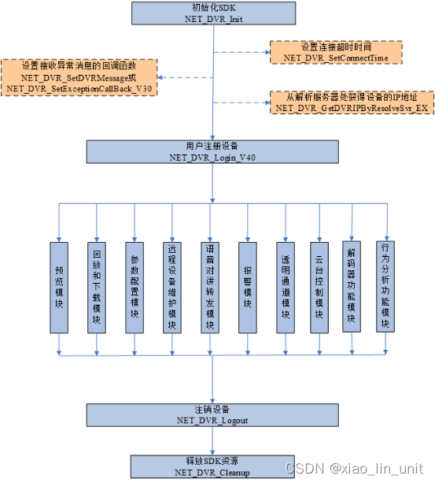

<!-- toc -->

### 前言

年前给公司对接了一下招商银行的`CBS`, 现在想整理一篇文章记录一下. 想起来之前对接过海康的`SDK`, 那真是折磨, 先把文章从`CSDN`上搬到自己的博客里吧.

原文连接: https://blog.csdn.net/weixin_43728193/article/details/125385433

以下是正文内容:

最近公司一个项目要对接海康的`SDK`, 落到了我手里, 折磨了我一个月, 写个博客来吐槽, 本篇只通过报警布防介绍对接海康`SDK`, 实时预览和视频回放下次一定。
###   简介
设备网络`SDK`是基于设备私有网络通信协议开发的，为海康威视各类硬件产品服务的配套模块，用于远程访问和控制设备的软件二次开发。
### 下载
下载地址: `https://open.hikvision.com/download`
从地址中选择硬件产品, 选择合适的版本下载即可。内含`SDK`动态库, 开发文档, `Demo`示例
### 使用流程

> 1. 虚线指向为非必要操作;
> 2. 功能模块可以单选多选不选;
> 3. `SDK`资源和设备操作为必要操作, 否则会无法操作或者没有效果.

### 对接`Demo`
本人使用`Java`开发报警预防相关, 则以此为例, 在`Spring Boot`项目中对接海康`SDK`.
#### 官方`Demo`
为方便理清思路, 将官方`Demo`的主要流程代码放置在此
官方`Dmeo`: 
在使用之前请确保按照说明文档中的方法, 将相关文件和文件夹放置妥当
```java
public static void main(String[] args) throws InterruptedException {
	// 加载SDK资源, 获取资源实例
	if (hCNetSDK == null) {
	    if (!CreateSDKInstance()) {
	        System.out.println("Load SDK fail");
	        return;
	    }
	}
	// 初始化
	hCNetSDK.NET_DVR_Init();
	// 加载日志
	hCNetSDK.NET_DVR_SetLogToFile(3, "../sdklog", false);
	//设置报警回调函数
	if (fMSFCallBack_V31 == null) {
	    fMSFCallBack_V31 = new FMSGCallBack_V31();
	    Pointer pUser = null;
	    if (!hCNetSDK.NET_DVR_SetDVRMessageCallBack_V31(fMSFCallBack_V31, pUser)) {
	        System.out.println("设置回调函数失败!");
	        return;
	    } else {
	        System.out.println("设置回调函数成功!");
	    }
	}
	/* 设备上传的报警信息是COMM_VCA_ALARM(0x4993)类型，
	 在SDK初始化之后增加调用NET_DVR_SetSDKLocalCfg(enumType为NET_DVR_LOCAL_CFG_TYPE_GENERAL)设置通用参数NET_DVR_LOCAL_GENERAL_CFG的byAlarmJsonPictureSeparate为1，
	 将Json数据和图片数据分离上传，这样设置之后，报警布防回调函数里面接收到的报警信息类型为COMM_ISAPI_ALARM(0x6009)，
	 报警信息结构体为NET_DVR_ALARM_ISAPI_INFO（与设备无关，SDK封装的数据结构），更便于解析。*/
	HCNetSDK.NET_DVR_LOCAL_GENERAL_CFG struNET_DVR_LOCAL_GENERAL_CFG = new HCNetSDK.NET_DVR_LOCAL_GENERAL_CFG();
	struNET_DVR_LOCAL_GENERAL_CFG.byAlarmJsonPictureSeparate = 1;   //设置JSON透传报警数据和图片分离
	struNET_DVR_LOCAL_GENERAL_CFG.write();
	Pointer pStrNET_DVR_LOCAL_GENERAL_CFG = struNET_DVR_LOCAL_GENERAL_CFG.getPointer();
	hCNetSDK.NET_DVR_SetSDKLocalCfg(17, pStrNET_DVR_LOCAL_GENERAL_CFG);
	// 设备登录
	Alarm.Login_V40(0, "10.17.35.41", (short) 8000, "admin", "abcd1234");
	// 设备布防
	Alarm.SetAlarm(0);
	while (true) {
	    //这里加入控制台输入控制，是为了保持连接状态，当输入Y表示布防结束
	    System.out.print("请选择是否撤出布防(Y/N)：");
	    Scanner input = new Scanner(System.in);
	    String str = input.next();
	    if (str.equals("Y")) {
	        break;
	    }
	}
	Alarm.Logout(0);
}
```
> 此处注意官方`Demo`中的`while(true)`, 下面会有使用和相关说明
#### 应用于`SpringBoot`项目中
##### 配置
以下配置是本人项目中进行相关配置
配置类:
```java
@Data
@Configuration
@ConfigurationProperties(prefix = "hik")
public class HCNetSDKConfig {

    public static HCNetSDKConfig HC_NET_SDK_CONFIG;

    /**
     * 登录的设备
     */
    public static List<DeviceApp> devices = new LinkedList<>();

    /**
     * SDK资源路径
     */
    private String sdkPath;

    /**
     * 日志文件路径
     */
    private String logPath;

    /**
     * 是否自动登录
     */
    private boolean deviceAutoLogin;

    /**
     * 设备用户名
     */
    private String username;

    /**
     * 设备密码
     */
    private String password;

    /**
     * 超脑ip
     */
    private String superBrainIp;

    @PostConstruct
    public void postConstruct() {
        HC_NET_SDK_CONFIG = this;
    }

}
```
> 1. 项目的设备较少, 在配置类中用一个`List`作为设备存档, 具体存档方式应以具体项目具体选择.
>  2. 项目中的所有设备用户名和密码一致, 所以此处使用配置作为数据项, 具体数据来源应以具体项目为准

配置文件:
```yml
hik:
  sdk-path: D:\\workspace\\idea\\hazard-chemical-web\\sdk
  device-auto-login: true
  super-brain-ip: 192.168.1.45
  username: admin
  password: 123456
```

##### 应用
此处寡人是将此资源比作了一个应用, 所以代码中会有`App`字样
设备相关:
设备信息类:
```java
@Data
@Accessors(chain = true)
public class Device {

    private String ip;

    private short port;

    private String username;

    private String password;

    private boolean userAsync;

    private String deviceName;

    private String id;

}

```

设备应用类:
```java
@Data
public class DeviceApp {

    private static Logger log = LoggerFactory.getLogger(DeviceApp.class);

    private HCNetSDK hCNetSDK;

    /**
     * 设备信息
     */
    private Device device;

    private int lUserID = -1; //用户句柄

    private int lDChannel = -1; //IP通道号

    private int lAlarmHandle = -1; // 报警布防句柄

    /**
     * 注销标记
     */
    private boolean logout;

    public DeviceApp(HCNetSDK hcNetSDK, Device device){
        this.hCNetSDK = hcNetSDK;
        this.device = device;
    }

    /**
     * 设备登录
     * @return
     */
    public boolean deviceLogin() {
        if (!this.logout) {
            return true;
        }
        log.info(device.getIp() + ": 设备登录!");
        //登录设备，每一台设备分别登录; 登录句柄是唯一的，可以区分设备
        HCNetSDK.NET_DVR_USER_LOGIN_INFO m_strLoginInfo = new HCNetSDK.NET_DVR_USER_LOGIN_INFO();//设备登录信息
        HCNetSDK.NET_DVR_DEVICEINFO_V40 m_strDeviceInfo = new HCNetSDK.NET_DVR_DEVICEINFO_V40();//设备信息

        String m_sDeviceIP = device.getIp();//设备ip地址
        m_strLoginInfo.sDeviceAddress = new byte[HCNetSDK.NET_DVR_DEV_ADDRESS_MAX_LEN];
        System.arraycopy(m_sDeviceIP.getBytes(StandardCharsets.UTF_8), 0, m_strLoginInfo.sDeviceAddress, 0, m_sDeviceIP.length());

        String m_sUsername = device.getUsername();//设备用户名
        m_strLoginInfo.sUserName = new byte[HCNetSDK.NET_DVR_LOGIN_USERNAME_MAX_LEN];
        System.arraycopy(m_sUsername.getBytes(StandardCharsets.UTF_8), 0, m_strLoginInfo.sUserName, 0, m_sUsername.length());

        String m_sPassword = device.getPassword();//设备密码
        m_strLoginInfo.sPassword = new byte[HCNetSDK.NET_DVR_LOGIN_PASSWD_MAX_LEN];
        System.arraycopy(m_sPassword.getBytes(StandardCharsets.UTF_8), 0, m_strLoginInfo.sPassword, 0, m_sPassword.length());

        m_strLoginInfo.wPort = device.getPort(); //SDK端口
        m_strLoginInfo.bUseAsynLogin = device.isUserAsync(); //是否异步登录：0- 否，1- 是
        m_strLoginInfo.write();

        this.lUserID = this.hCNetSDK.NET_DVR_Login_V40(m_strLoginInfo, m_strDeviceInfo);
        if (this.lUserID == -1) {
            log.error("登录失败，错误码为" + this.hCNetSDK.NET_DVR_GetLastError());
            this.logout = true;
            return false;
        } else {
            log.info(m_sDeviceIP + ":设备登录成功! " + "设备序列号:" + new String(m_strDeviceInfo.struDeviceV30.sSerialNumber).trim());
            this.logout = false;
            m_strDeviceInfo.read();
        }
        //byStartDChan为IP通道起始通道号, 预览回放NVR的IP通道时需要根据起始通道号进行取值
        this.lDChannel = m_strDeviceInfo.struDeviceV30.byStartDChan;
        return true;
    }

    /**
     * 设备注销
     * @return
     */
    public boolean deviceLogout() {
        log.info("设备注销!");
        this.logout = hCNetSDK.NET_DVR_Logout(lUserID);
        return this.logout;
    }

    /**
     * 布防
     * @param device
     */
    public static void setAlarm(DeviceApp device) {
        log.info("布放!");
        //尚未布防,需要布防
        if (device.getLAlarmHandle() < 0) {
            //报警布防参数设置
            HCNetSDK.NET_DVR_SETUPALARM_PARAM_V50 m_strAlarmInfo = new HCNetSDK.NET_DVR_SETUPALARM_PARAM_V50();
            m_strAlarmInfo.dwSize = m_strAlarmInfo.size();
            m_strAlarmInfo.byLevel = 1;  //布防等级
            m_strAlarmInfo.byAlarmInfoType = 1;   // 智能交通报警信息上传类型：0- 老报警信息（NET_DVR_PLATE_RESULT），1- 新报警信息(NET_ITS_PLATE_RESULT)
            m_strAlarmInfo.byDeployType = 1;   //布防类型：0-客户端布防，1-实时布防
            m_strAlarmInfo.write();
            String s = xmlData();
            log.info("xml 参数: {}", s);
            Pointer mode = new Memory(s.length() + 1);
            byte[] bytes = s.getBytes(StandardCharsets.UTF_8);
            mode.write(0, bytes, 0, bytes.length);
            int lAlarmHandle = device.getHCNetSDK().NET_DVR_SetupAlarmChan_V50(device.getLUserID(), m_strAlarmInfo, mode, s.length() + 1);
//            int lAlarmHandle = device.getHCNetSDK().NET_DVR_SetupAlarmChan_V41(device.getLUserID(), m_strAlarmInfo);
            device.setLAlarmHandle(lAlarmHandle);
            log.info("lAlarmHandle: " + lAlarmHandle);
            if (lAlarmHandle == -1) {
                log.error("布防失败，错误码为" + device.getHCNetSDK().NET_DVR_GetLastError());
            } else {
                log.info("布防成功");

            }
        }
        else {
            log.info("设备已经布防，请先撤防！");
        }
    }
    
    @PreDestroy
    public void destroy() {
        log.info("设备销毁!");
        if (this.logout) {
            return;
        }
        for (int i = 0;!this.logout && i < 3 ; i++) {
            this.logout = deviceLogout();
        }
    }

    /**
     * 设备xml配置
     * @return
     */
    private static String xmlData() {
        return "<SubscribeEvent version=\"2.0\" xmlns=\"http://www.isapi.org/ver20/XMLSchema\">" +
                "<eventMode>list</eventMode>" +
                "<EventList>" +
                "<Event>" +
                "<type>fielddetection,</type>" +
                "<pictureURLType>binary</pictureURLType>" +
                "</Event>" +
                "<Event>" +
                "<type>linedetection</type>" +
                "<pictureURLType>binary</pictureURLType>" +
                "</Event>" +
                "<Event>" +
                "<type>group</type>" +
                "<pictureURLType>binary</pictureURLType>" +
                "</Event>" +
                "</EventList>" +
                "<channels>" +
                "</channels>" +
                "<identityKey>" +
                "</identityKey>" +
                "</SubscribeEvent>";
    }
}
```

资源应用:
```java
@Data
@Component
public class HCNetSDKApp {

    private static Logger log = LoggerFactory.getLogger(HCNetSDKApp.class);
    @Autowired
    private HCNetSDKConfig hcNetSDKConfig;
    @Autowired
    private IVideoService videoService;

    /**
     * 释放资源标记
     */
    private boolean cleanup = true;

    private HCNetSDK hCNetSDK;

    private FExceptionCallBack_Imp fExceptionCallBack;

    /**
     * 初始化SDK资源
     * @return
     * @throws CreateSDKException
     */
    public boolean initSDKInstance() throws CreateSDKException {
        if (!this.cleanup) {
             return true;
        }
        log.info("SDK初始化!");
        // 创建SDK实例
        boolean createSDK = CreateSDKInstance();
        if (!createSDK) {
            log.error("创建SDK实例失败!");
            throw new CreateSDKException("创建SDK实例失败!");
        } else {
            log.info("创建SDK实例成功!");
        }
        // SDK资源初始化
        boolean initSDK = hCNetSDK.NET_DVR_Init();
        if (!initSDK) {
            log.error("初始化SDK资源失败!");
            hCNetSDK.NET_DVR_Cleanup();
            throw new CreateSDKException("初始化SDK资源失败!");
        } else {
            this.cleanup = false;
            log.info("初始化SDK资源成功!");
        }
        fExceptionCallBack = new FExceptionCallBack_Imp();
        Pointer pUser = null;
        if (!hCNetSDK.NET_DVR_SetExceptionCallBack_V30(0, 0, fExceptionCallBack, pUser)) {
            log.info("初始化异常消息回调失败!");
            // 初始化异常消息回调失败, 释放SDK资源
            hCNetSDK.NET_DVR_Cleanup();
            this.cleanup = true;
            throw new CreateSDKException("初始化异常消息回调失败!");
        } else {
            log.info("初始化异常消息回调成功!");
        }
        //启动SDK写日志
        hCNetSDK.NET_DVR_SetLogToFile(3, hcNetSDKConfig.getLogPath(), false);
        return true;
    }

    /**
     * 自动登录
     */
    public void autoDevicesLogin() {
        AtomicBoolean flag = new AtomicBoolean(false);
        QueryWrapper<VideoShowModel> wrapper = new QueryWrapper<>();
        wrapper.isNotNull("IP");
        wrapper.ne("IP", "");
        List<Video> videos = videoService.getBaseMapper().selectList(wrapper);
        List<Device> devices = videos.stream().map(item -> {
            if (hcNetSDKConfig.getSuperBrainIp().equals(item.getIp())) {
                flag.set(true);
            }
            Device device = new Device();
            device.setIp(item.getIp());
            device.setId(item.getSheetId());
            return device;
        }).collect(Collectors.toList());
        if (!flag.get()) {
            Device device = new Device();
            device.setIp(hcNetSDKConfig.getSuperBrainIp());
            devices.add(device);
        }
        devicesLogin(devices);
    }

    /**
     * 设备登录
     */
    public void devicesLogin(List<Device> devices) {
        for (Device device : devices) {
            deviceLogin(device);
        }
    }

    /**
     * 设备登录
     * @param device
     * @return
     */
    public DeviceApp deviceLogin(Device device) {
        try {
            DeviceApp deviceApp = new DeviceApp(this.hCNetSDK, device);
            // 设备登录注册
            boolean deviceLogin = deviceApp.deviceLogin();
            if (!deviceLogin) {
                log.error("注册设备失败!");
                throw new CreateSDKException("注册设备失败!");
            } else {
                log.info("注册设备成功!");
            }
            HCNetSDKConfig.devices.add(deviceApp);
            log.info("已登录设备数量: {}", HCNetSDKConfig.devices.size());
            return deviceApp;
        } catch (CreateSDKException e) {
            e.printStackTrace();
            return null;
        }
    }

    /**
     * 释放SDK资源
     *
     * @return
     */
    public boolean cleanup() {
        log.info("释放SDK资源!");
        this.cleanup = hCNetSDK.NET_DVR_Cleanup();
        return this.cleanup;
    }

    @PreDestroy
    public void destroy() {
        log.info("SDK实例销毁!");
        if (this.cleanup) {
            return;
        }
        for (int i = 0; !this.cleanup && i < 3; i++) {
            if (!HCNetSDKConfig.devices.isEmpty()) {
                HCNetSDKConfig.devices.forEach(item -> {
                    boolean b = item.deviceLogout();
                });
            }
        }
        HCNetSDKConfig.devices.clear();
        cleanup();
    }

    static class FExceptionCallBack_Imp implements HCNetSDK.FExceptionCallBack {
        public void invoke(int dwType, int lUserID, int lHandle, Pointer pUser) {
            log.error("异常事件类型: {}", dwType);
            log.error("异常用户主键: {}", lUserID);
            log.error("异常处理: {}", lHandle);
            log.error("异常Pointer: {}", pUser);
        }
    }


    /**
     * 动态库加载
     *
     * @return
     */
    private boolean CreateSDKInstance() {
        log.info("创建SDK实例!");
        String strDllPath = "";
        log.info("hc net sdk config: {}", hcNetSDKConfig);
        try {
            if (OSSelectUtil.isWindows())
                //win系统加载库路径
                strDllPath = hcNetSDKConfig.getSdkPath() + "\\windows\\HCNetSDK.dll";
            else if (OSSelectUtil.isLinux())
                //Linux系统加载库路径
                strDllPath = hcNetSDKConfig.getSdkPath() + "/linux/libhcnetsdk.so";
            this.hCNetSDK = (HCNetSDK) Native.loadLibrary(strDllPath, HCNetSDK.class);
            this.cleanup = false;
            return true;
        } catch (Exception ex) {
            log.error("loadLibrary: " + strDllPath + " Error: " + ex.getMessage());
            return false;
        }
    }
}
```

> 说明:
> 1. 资源应用使用了`Spring`的组件注解`@Component`, 因为该资源只需要加载一次即可, 可以引用`Spring`的单例模式
> 2. <font color = red>注意: </font> 在之前的配置项中, `sdk-path`使用了`\\`作为目录分隔符, 本项目是在`windows`服务器上运行, 所以使用`windows`目录格式, 尝试过使用`/`和`\`两种方式,都失败了,具体原因,猜想是`windows`使用`\`作为分隔符,字符串中`\`又为转移字符导致的;至于为什么不能用`/`或者其他原因,我知道不知道,你自己体会吧.
> 3. 此处的设备登录相关内容是本人项目中查询相关设备,然后调用设备中的登录方法,不一定非要在此处,可将其作为相关案例使用, 需根据项目要求进行合理处理.

##### 流程
流程启动类
```java
@Service
public class AlarmListenerServiceImpl implements IAlarmListenerService {

    @Autowired
    private HCNetSDKApp hcNetSDKApp;

    @PostConstruct
    public void startListener() {
		AlarmListenerTask task = new AlarmListenerTask(hcNetSDKApp);
		Thread thread = new Thread(task);
		thread.setDaemon(true);
		thread.start();
    }
}
```
> 1. 启动方式有很多, 可以选择手动启动, 也可以选择项目运行时启动, 此处项目中采用项目启动时启动
> 2. 项目启动时执行某些方法的方式有多种, 可参照博文: <a href='https://juejin.cn/post/7025858036002455589'>Springboot启动后执行方法的四种方式</a>
> 3. 此处使用新建守护线程的方式启动报警布防功能, 下方代码展示后便会知晓.

流程任务类
```java
public class AlarmListenerTask implements Runnable {

    private static Logger log = LoggerFactory.getLogger(AlarmListenerTask.class);

    private HCNetSDKApp hcNetSDKApp;

    public AlarmListenerTask(HCNetSDKApp hcNetSDKApp) {
        this.hcNetSDKApp = hcNetSDKApp;
    }

    @Override
    public void run() {
        try {
            if (hcNetSDKApp.getHCNetSDK() == null) {
                boolean b = hcNetSDKApp.initSDKInstance();
            }
        } catch (CreateSDKException e) {
            log.error("SDK实例创建失败!");
        }
        FMSGCallBack_V31 fMSFCallBack_V31 = new FMSGCallBack_V31();
        Pointer pUser = null;
        if (!hcNetSDKApp.getHCNetSDK().NET_DVR_SetDVRMessageCallBack_V50(0, fMSFCallBack_V31, pUser)) {
            log.error("设置回调函数失败!");
            return;
        } else {
            log.info("设置回调函数成功!");
        }
        /* 设备上传的报警信息是COMM_VCA_ALARM(0x4993)类型，
         在SDK初始化之后增加调用NET_DVR_SetSDKLocalCfg(enumType为NET_DVR_LOCAL_CFG_TYPE_GENERAL)设置通用参数NET_DVR_LOCAL_GENERAL_CFG的byAlarmJsonPictureSeparate为1，
         将Json数据和图片数据分离上传，这样设置之后，报警布防回调函数里面接收到的报警信息类型为COMM_ISAPI_ALARM(0x6009)，
         报警信息结构体为NET_DVR_ALARM_ISAPI_INFO（与设备无关，SDK封装的数据结构），更便于解析。*/
        HCNetSDK.NET_DVR_LOCAL_GENERAL_CFG struNET_DVR_LOCAL_GENERAL_CFG = new HCNetSDK.NET_DVR_LOCAL_GENERAL_CFG();
        struNET_DVR_LOCAL_GENERAL_CFG.byAlarmJsonPictureSeparate = 1;   //设置JSON透传报警数据和图片分离
        struNET_DVR_LOCAL_GENERAL_CFG.write();
        Pointer pStrNET_DVR_LOCAL_GENERAL_CFG = struNET_DVR_LOCAL_GENERAL_CFG.getPointer();
        hcNetSDKApp.getHCNetSDK().NET_DVR_SetSDKLocalCfg(17, pStrNET_DVR_LOCAL_GENERAL_CFG);
        // 设备登录
        hcNetSDKApp.autoDevicesLogin();
        log.info("布防设备数量: {}", HCNetSDKConfig.devices.size());
        // 设备布防
        HCNetSDKConfig.devices.forEach(DeviceApp::setAlarm);
        // 维持线程
        while (true) {}
    }
}
```
> 1. 此任务类中的`run`方法中便是整个布防流程
> 2. `while(true){}`这个位置的代码即是前面官方`Demo`中的`while`代码的修改

> 关于为什么新建一个守护线程处理流程:
> 1. `SDK`的模块功能需要维持一条线程保持运转,官方`Demo`中的`while`就是为了维持线程, 即使它被卡在`while`处无法继续向下进行,
>  猜测:`SDK`为当前线程创建了守护线程进行布防监听, 当前线程中断了,布防的守护线程就挂掉了.
> 2. `main`线程在加载资源后就会结束, 本人在初次尝试时即使用`main`执行流程,结果是报警回调后续便不再触发,所以选择新建一条线程来进行流程操作.
> 3. 使用守护线程是因为代码中有死循环代码, 守护线程在主线程结束后便会被杀死.但前两天看博文,好像`spring`项目在结束程序时会杀死所有线程,具体我不太了解,希望有大佬解答.

### 挖坑

实时预览

视频回放

### 吐槽

之前做完后主管要我写一篇对接文档给之后的开发人员作指导, 然后就被拿去批复了,我看了批注之后我表示想买个袋子把他装起来吊着打.
问题1: 设备注册需要将所有的设备都注册吗?
我丢,你爱注册多少注册多少,要不去搜罗一下全球有多少海康的摄像头,都注册进去吧!
问题2: 设备在注册登录之后就要注销吗?
我去,微信登录了就要退出吗?人出生了就要下葬吗?

***<font color=#00FF00>如果有幸有人能看到这篇博文, 请转告身边的人, 不要为难开发人员了, 他们不是万能的, 劝大家善良</font>***


