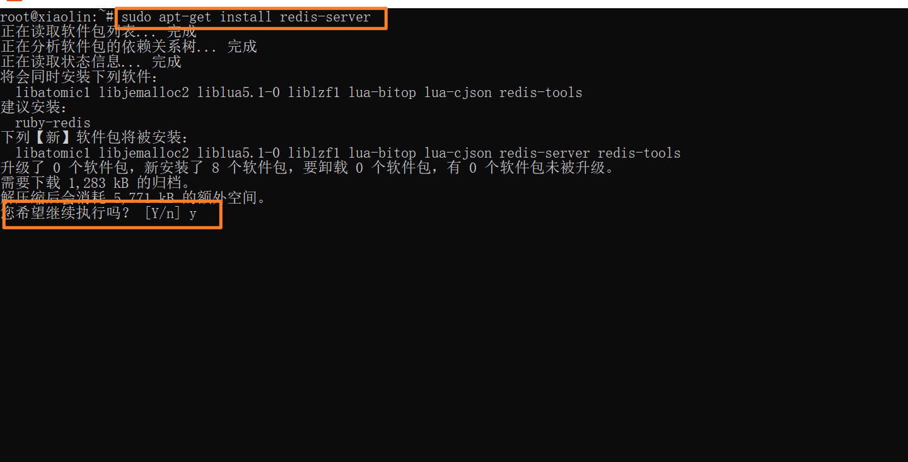
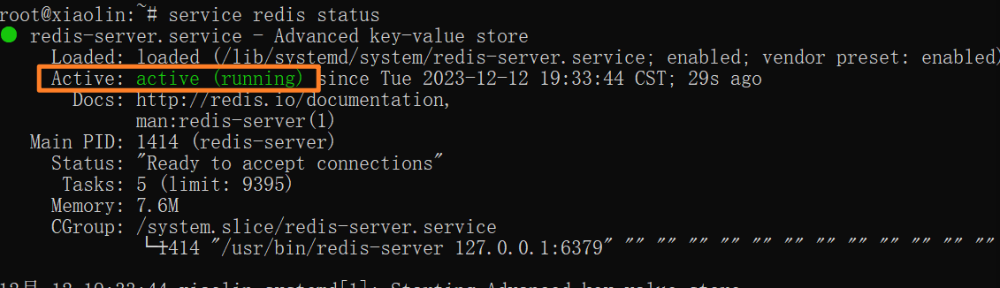
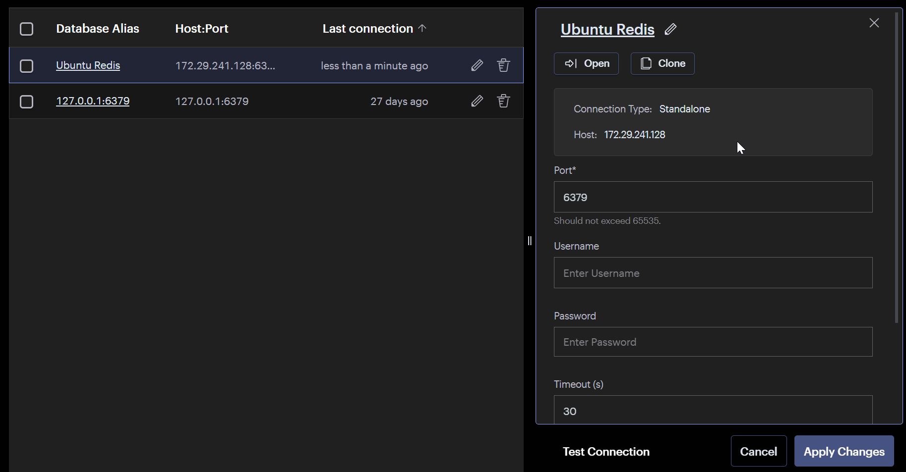
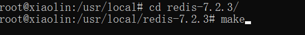
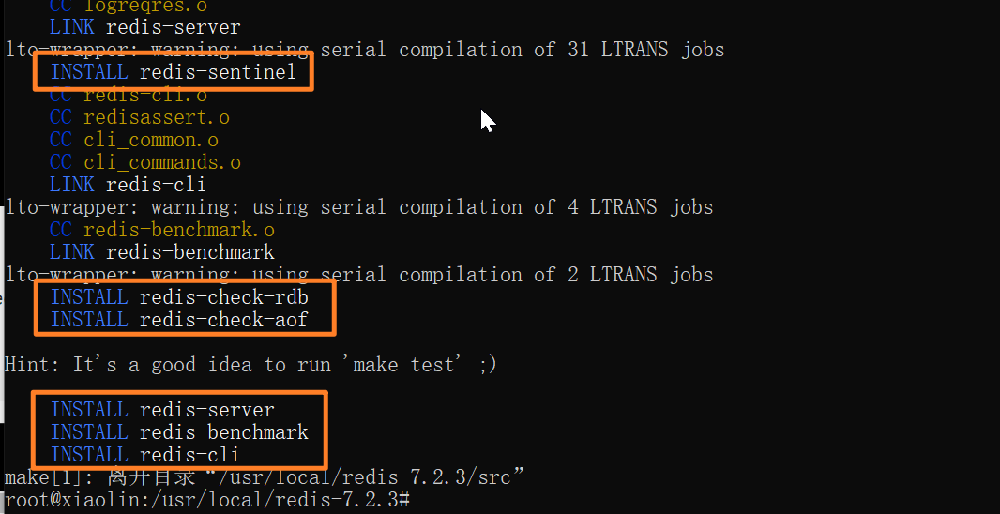
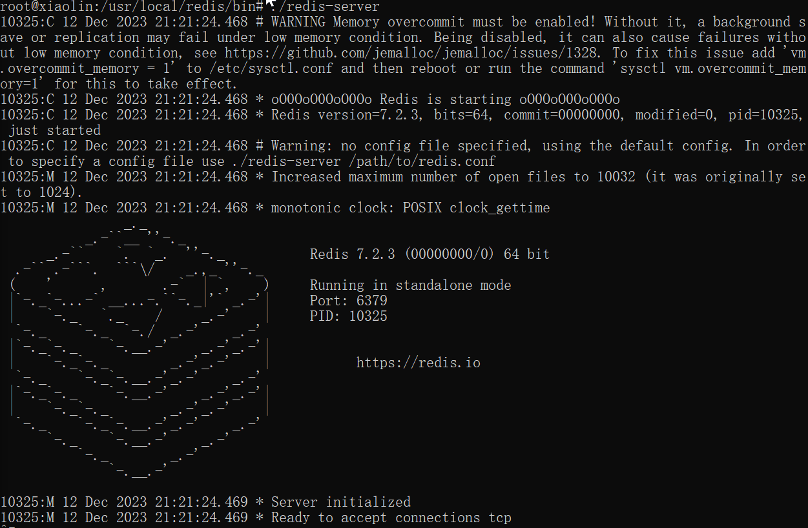
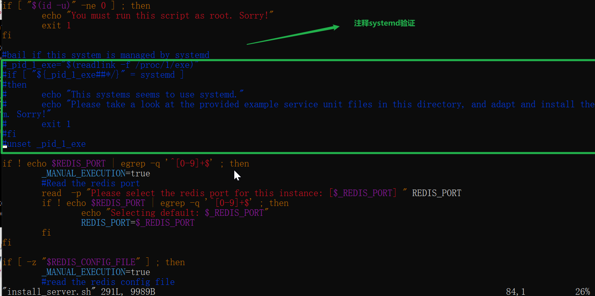
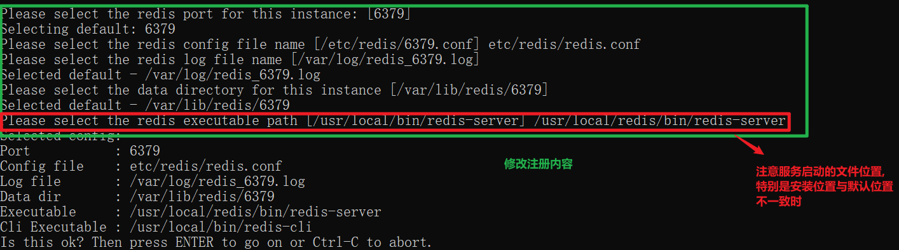

<!-- toc -->

### 前言

`Redis`作为比较火的`NoSQL`, 广泛应用与分布式系统中, 由于`Redis`是基于内存的, 极致的响应速度使其可以在分布式系统中担任众多角色, 如缓存, 分布式共享数据, 分布式锁, 分布式主键, 消息队列等

本篇先讲安装, 在`Ubuntu`系统下的安装, 分别介绍两种安装方式的过程

本人是在`Windows`下的`Ubuntu`进行的

1. 配置好`wsl`环境

2. 执行`wsl --install`安装默认的`Ubuntu`系统或者从`Store`中安装

3. 创建`Ubuntu`系统的用户和密码

4. 更换源

   清华镜像源配置获取: https://mirror.tuna.tsinghua.edu.cn/help/ubuntu/

参考文章:

https://zhuanlan.zhihu.com/p/423249278

https://blog.csdn.net/chigenb/article/details/105641189

https://mirror.tuna.tsinghua.edu.cn/help/ubuntu/

### `apt`工具安装

#### 安装

执行

```shell
sudo apt-get install redis-server
```

安装`redis`服务, 遇到输入[Y/n]的提示时输入`y`, 或者在命令之后添加`-y`



执行

```shell
service redis status
```

查看`redis`的运行状态, 使用`apt`安装时, 安装完成后默认会启动



进入`/etc/redis`目录, 执行

```shell
vim redis.conf
```

编辑`redis`配置文件, 修改位置

1. `bind 127.0.0.1 ::1`这一行注释掉, 使其可以远程访问(注意让防火墙开放6379端口)
2. <a href="#问题一">将`protected-mode`的值设置为`no`, 关闭保护模式</a>, 否则也无法正常进行远程访问

然后执行

```shell
service redis restart
```

重新启动服务

#### 连接

测试远程连接

可以使用命令

```shell
redis-cli -h ip
```

或者使用工具



`redis`默认不是以守护进程的方式运行, 可以通过修改配置文件中的`daemonize`项为`yes`来启用守护进程

#### 卸载

使用

```shell
sudo apt-get remove redis-server
```

卸载安装的`redis`服务

### 压缩包安装

#### 下载

到官网https://download.redis.io中寻找想要的版本下载, 更简单的方式是直接使用https://download.redis.io/releases/redis-x.y.z.tar.gz下载, 将`xyz`分别改为版本对应的数字即可

此处使用的是`7.2.3`版本

在`Ubuntu`系统中进入到想要放置安装包的位置

执行

```shell
wget url [-P path] [-o path/name]
```

下载压缩包, 或者直接使用`-P`指定下载到哪个目录下, 或者使用`-o`指定下载到目录并将文件命名

执行

```shell
tar -zxvf redis-x.y.z.tar.gz
```

将下载的压缩包解压

#### 安装

1. 环境

   执行

   ```shell
   apt-get install gcc && apt-get install g++
   ```

   安装`c/c++`编译器

   <a href="#问题三">`redis`是使用`c`语言开发的</a>

2. 编译

   <a href="#问题二">进入到解压后的目录中, 并执行`make`命令</a>

   ```shell
   make PREFIX=/usr/local/redis install
   ```

   这里使用`PREFIX`指定程序存放路径, 否则可能会将可执行文件存放到`/user/local/bin`目录下或者其他你找不到的位置, 别问我为啥知道:joy:

   

   编译成功

   

3. 启动

   进入`/usr/local/redis/bin`目录执行`redis-server`文件启动服务

   

4. 注册服务

   - 修改`/usr/local/redis-7.2.3/utils`目录下的`install-server.sh`

     

     参考文档: https://blog.csdn.net/w1014074794/article/details/129367170

   - 将`redis`中的配置文件`redis.conf`复制到脚本中的目录下
   
     ```shell
    cp redis.conf /etc/redis/redis.conf
     ```

   - 将启动服务文件添加到环境变量
   
     ```shell
     sudo export PATH=/usr/local/redis/bin:$PATH
    sudo source /etc/profile
     ```

     可以使用
   
     ```shell
    echo $PATH
     ```

     查看环境变量情况

   - 服务注册

     运行脚本`install-server.sh`

     

     比如我安装在了`/usr/local/redis/bin`下, 则需要将路径修改

     默认的服务名称是`redis_${port}`, 若没有修改端口号就是`redis_6379`, 服务注册成功后会默认启动

   - 服务启动和停止
   
     服务注册后即可使用`service`相关命令启动或停止服务, 也可查看服务状态, 但是服务名称与`apt-get`的方式不太一样, 即此方式的名称是`redis_${port}`
   
5. 配置远程访问

   参考`apt`工具安装中的远程访问配置

### 出现问题:sob:

<i id="问题一">问题一</i>

问题: 

```err
(error) DENIED Redis is running in protected mode ...
```

问题原因: 服务使用保护模式启动, 无法进行远程访问

解决方案: 修改`redis.conf`中的`protected-mode`的值为`no`

<i id="问题二">问题二</i>

问题: 找不到`make`命令

问题原因: 没有安装编译工具

解决方案: `sudo apt-get install make`安装编译工具

<i id="问题三">问题三</i>

问题: 使用`make`编译时报错

问题原因: 可能是没有安装`gcc-c++`

解决方案: `CentOS`使用`yum install gcc-c++`安装, `Ubuntu`使用`apt-get install gcc && apt-get install g++`安装, 在安装后使用`make clean && make`重新编译, 如果仍不成功, 可以将解压的目录删除重新解压再编译

<i id="问题四">问题四</i>

问题: 服务注册后启动时可能失败

```err
Failed to start redis.service: Unit redis.service failed to load properly, please adjust/correct and reload service manager: File exists See system logs and 'systemctl status redis.service' for details.
```

问题原因: 可能是被管控

解决方案: 使用`systemctl enable ${service_name}`允许服务运行, 但此方式只适用于被管控的情况, 如果是其他情况导致的则无法处理

### 挖坑

`Redis`的使用详情


