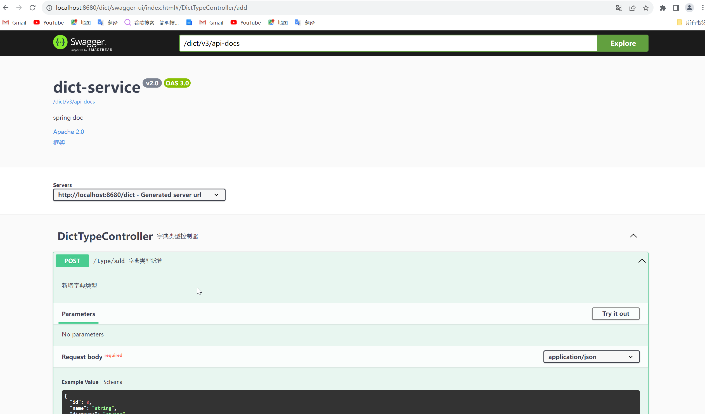

<!-- toc -->

### 前言

最近找工作有点难受啊, 工作三年, 做了三年的`cruder`, 再回头发现, 现在技术要求都这么高, 这么广了吗? 三年下来, 杂七杂八学的不少, 但是不系统也不深入, 现在找个机会系统整理一下. 同时也给自己一点目标, 看看自己能不能坚持下来, 能坚持多久.

为什么会选择从`SpringCloud`开始?

1. 市面上有自己产品的公司(大家都想去的自研公司), 大都在思考向分布式转型或者已经开始转向分布式. 而分布式中应用最多最广的就是`SpringCloud`了, 当然也会使用`SpringCloudAlibaba`
2. `SpringCloud`是一种分布式解决方案, 其中糅合了多种技术, 便于整理学习

本系列如何开展?

1. 从零开始构建一个`SpringCloud`项目, 从建表开始, 一步步搭建, 争取做到二次回首时, 根据博客即可重新搭建出一样的项目, 当然有可能会非常啰嗦
2. 关于项目搭建过程中出现的问题, 比如报错或者无效果之类的情况, 会在每篇博客的最后写明
3. 关于搭建过程中会出现没有学习过的技术, 会先去学习, 届时本系列可能会断更一段时间
4. 由于搭建过程可能只是学习使用, 所以关于使用技术的深入学习, 会在每一篇博文的结尾挖坑标注, 等待后续学习
5. 搭建过程中在使用技术时可能会想到一些面试题, 或者面试题的高发区, 可能会整理一篇相关的面试题合集
6. 搭建过程中可能会出现后续使用时遇到前面内容的问题, 则会回到前篇博客中修改, 即不保证看到的博客是最终版
7. 由于此系列类似一个流程系列, 所以在写博客时对于使用或者学习的内容没有深入思考, 导致博客质量低, 甚至类似于记流水账, 这种情况也会同上, 在后续的使用中维持前期博客的思考和更新

本系列目标?

1. 系统学习相关技术, 学会搭建`SpringCloud`项目流程
2. 搭建出一个基础项目, 后续需要搭建项目时可以直接拿来使用, 比如搭建完后打成压缩包或者上传到`gitee`, 便于后续使用
3. 后续可能会分类搭建, 将`SpringCloud`版本和`SpringCloudAlibaba`版本分开, 但不保证完全隔离, 比如事务中可能都是用`Seata`

### 创建父项目

`Type`项选择`Maven POM`, 不熟悉`Gradle`, 所以先使用`Maven`

创建后可以看到`POM`文件中的`packaging`标签的值的`pom`

注: 创建时选择合适的`SpringBoot`版本, 否则会有许多版本问题, 此处使用当前的最新版本`3.2.0`; `JDK`的版本选择也需要慎重, 此处创建时默认`JDK`版本在`IDEA`中已经不显示`jdk11`了; 本次是搭建和学习, 所以使用最新版本, 踩坑.


### 管理依赖

在创建的父项目中的`POM`文件中添加`dependencyManagement`标签管理项目的依赖版本

在`dependencyManagement`标签中管理的依赖: 

- 如果来自`Spring`预定义的版本, 则需要使用`<type>pom</type>`标记 

- 如果是预定义依赖组(自定义名称), 则需要使用`<scope>import</scope>`标记, 意思是将预定义依赖组下管理的所有依赖导入

- 参考文章: 

  https://www.cnblogs.com/huahua035/p/7680607.html(文章中的参考文章)

  https://www.cnblogs.com/xuzimian/p/10235164.html

```xml
<dependencyManagement>
    <dependencies>
        <dependency>
            <groupId>org.springframework.boot</groupId>
            <artifactId>spring-boot-starter</artifactId>
            <type>pom</type>
        </dependency>

        <dependency>
            <groupId>org.springframework.boot</groupId>
            <artifactId>spring-boot-starter-test</artifactId>
            <scope>test</scope>
            <type>pom</type>
        </dependency>
    </dependencies>
</dependencyManagement>
```

### 创建`commons`子项目


注: 此处创建普通的`Maven`项目即可, 需要将`SDK`版本与父项目保持一致


修改`POM`文件

```xml
 <!-- 将公共依赖依赖添加到项目中, 则引入公共项目的子项目就不需要挨个添加依赖了 -->
<dependencies>
    <dependency>
        <groupId>org.springframework.boot</groupId>
        <artifactId>spring-boot-starter</artifactId>
    </dependency>
    <dependency>
        <groupId>org.springframework.boot</groupId>
        <artifactId>spring-boot-starter-test</artifactId>
        <scope>test</scope>
    </dependency>
</dependencies>
```

创建公共包如: `com.xxx.util`, `com.xxx.config`, `com.xxx.entity`

### 创建服务子项目

与`commons`项目一样, 创建一个普通`Maven`项目, 通过此种方式则不需要再操作父项目的`POM`文件添加`module`

修改`POM`文件, 引入`commons`项目依赖

```xml
<packaging>jar</packaging>
<dependencies>
    <dependency>
        <groupId>com.xiaolin</groupId>
        <artifactId>commons</artifactId>
        <version>0.0.1-SNAPSHOT</version>
    </dependency>
</dependencies>
```

创建启动类, 注意类的位置, `com.xxx.XXXServiceApplication`

```java
@SpringBootApplication
public class UserServiceApplication {
    public static void main(String[] args) {
        SpringApplication.run(UserServiceApplication.class, args);
    }
}
```

启动, 确认可以正常使用

[很明显我这里出错了](#问题二):smirk:

### 在`commons`中依赖添加

父项目中添加`web`依赖和`lombok`依赖, 在`commons`中引入

```xml
<dependency>
    <groupId>org.springframework.boot</groupId>
    <artifactId>spring-boot-starter-web</artifactId>
    <version>3.2.0</version>
</dependency>

<dependency>
    <groupId>org.projectlombok</groupId>
    <artifactId>lombok</artifactId>
    <version>1.18.24</version>
</dependency>
```

### 在服务子项目中请求测试

在服务子项目中添加一个请求测试

1. 在服务子项目中添加配置文件

2. 添加服务端口配置和应用名称等配置

   ```yml
   server:
     port: 8180
     servlet:
       context-path: /user
   
   spring:
     application:
       name: user-service
   ```

3. 添加请求测试

   ```java
   @RestController
   public class UserController {
   
       @GetMapping("/test")
       public boolean test() {
           return true;
       }
   }
   ```

### 创建表

创建一个用户表

```mysql
CREATE TABLE `sys_user` (
  `id` int NOT NULL AUTO_INCREMENT COMMENT '主键',
  `username` varchar(64) CHARACTER SET utf8mb4 COLLATE utf8mb4_general_ci NOT NULL COMMENT '用户名',
  `account` varchar(64) CHARACTER SET utf8mb4 COLLATE utf8mb4_general_ci NOT NULL COMMENT '账户',
  `password` varchar(64) CHARACTER SET utf8mb4 COLLATE utf8mb4_general_ci NOT NULL COMMENT '密码',
  `dept_id` int DEFAULT NULL COMMENT '部门主键',
  `stru_id` int DEFAULT NULL COMMENT '结构主键',
  `staff_id` int DEFAULT NULL COMMENT '人员主键',
  `status` int NOT NULL DEFAULT '1' COMMENT '账户状态(0: 正常; 1: 锁定; 2: 停用;)',
  `type` int NOT NULL DEFAULT '0' COMMENT '用户类型(0: 普通自注册用户; 1: 人员用户; 2: 系统管理用户)',
  `login_time` datetime DEFAULT NULL COMMENT '上次登录时间',
  `expired_time` datetime DEFAULT NULL COMMENT '账户过期时间',
  `locked_time` datetime DEFAULT NULL COMMENT '锁定时间, 记录账户解锁时间',
  `failure_times` int DEFAULT NULL COMMENT '失败次数,记录单次登录时的请求次数',
  `max_session` int DEFAULT NULL COMMENT '最大会话数(<1为无限制)',
  `deleted` int NOT NULL DEFAULT '0' COMMENT '删除(0: 否; 1: 是)',
  `create_time` datetime DEFAULT NULL,
  `creator` int DEFAULT NULL,
  `update_time` datetime DEFAULT NULL,
  `update_user` int DEFAULT NULL,
  PRIMARY KEY (`id`) USING BTREE
) ENGINE=InnoDB AUTO_INCREMENT=2 DEFAULT CHARSET=utf8mb4 COLLATE=utf8mb4_general_ci ROW_FORMAT=DYNAMIC COMMENT='用户表(系统用户可直接创建; 普通用户需要先创建人员)';
```

<a href="spring_cloud.sql" download>SQL文件</a>

### 在项目中引入数据库

1. 添加数据库连接依赖

   ```xml
   <!-- mysql数据连接 -->
   <dependency>
       <groupId>com.mysql</groupId>
       <artifactId>mysql-connector-j</artifactId>
       <version>8.2.0</version>
   </dependency>
   <!-- 使用阿里巴巴的驱动 -->
   <dependency>
       <groupId>com.alibaba</groupId>
       <artifactId>druid</artifactId>
       <version>1.2.20</version>
   </dependency>
   <!-- mybatis-plus -->
   <dependency>
       <groupId>com.baomidou</groupId>
       <artifactId>mybatis-plus-boot-starter</artifactId>
       <version>3.5.4.1</version>
   </dependency>
   <!-- mybatis -->
   <dependency>
       <groupId>org.mybatis.spring.boot</groupId>
       <artifactId>mybatis-spring-boot-starter</artifactId>
       <version>3.0.3</version>
   </dependency>
   ```

2. 添加数据库连接配置

   ```yml
   spring:
     # 最基本的配置
     datasource:
       url: jdbc:mysql://localhost:3306/spring_cloud
       username: root
       password: 123456
       driver-class-name: com.mysql.cj.jdbc.Driver
       type: com.alibaba.druid.pool.DruidDataSource
   ```

3. 创建一个`Mapper`进行测试

   ```java
   @Mapper
   public interface UserMapper {
       @Select("SELECT COUNT(*) FROM sys_user")
       int count();
   }
   ```

   ```java
   @SpringBootTest
   class UserMapperTest {
       @Autowired
       private UserMapper userMapper;
   
       @Test
       void count() {
           System.out.println(userMapper.count());
       }
   }
   ```

   [很显然我又出错了](#问题一):joy:

### 创建代码生成项目

使用`MyBatis-Plus`的生成器

1. 创建一个普通的`Maven`项目

2. 引入依赖

   ```xml
   <!-- 数据库连接 -->
   <dependency>
       <groupId>com.mysql</groupId>
       <artifactId>mysql-connector-j</artifactId>
   </dependency>
   <!-- 生成器 -->
   <dependency>
       <groupId>com.baomidou</groupId>
       <artifactId>mybatis-plus-generator</artifactId>
   </dependency>
   <!-- 模板引擎 -->
   <dependency>
       <groupId>org.freemarker</groupId>
       <artifactId>freemarker</artifactId>
   </dependency>
   <!-- lombok支持 -->
   <dependency>
       <groupId>org.projectlombok</groupId>
       <artifactId>lombok</artifactId>
   </dependency>
   <!-- 需要使用其中的annotation -->
   <dependency>
       <groupId>com.baomidou</groupId>
       <artifactId>mybatis-plus-boot-starter</artifactId>
   </dependency>
   <!-- 需要使用其中的转换器 -->
   <dependency>
       <groupId>org.springframework.boot</groupId>
       <artifactId>spring-boot-starter-web</artifactId>
   </dependency>
   ```

3. 生成代码

   ```java
   public class GeneratorApplication {
   
   	public static final String URL = "jdbc:mysql://localhost:3306/spring_cloud?characterEncoding=utf8&useSSL=false&serverTimezone=Asia/Shanghai&rewriteBatchedStatements=true";
   
   	public static final String USERNAME = "root";
   
   	public static final String PASSWORD = "123456";
   
   	public static final String SCHEMA = "public";
   
   	public static final String AUTHOR = "xiaolin";
   
   	public static final String PARENT_PATH = "com.xiaolin";
   
   	public static final String ROOT = System.getProperty("user.dir");
   
   	public static final String OUT_PUT_PATH = "/generator/src/main/java";
   
   
   	private static final DataSourceConfig.Builder DATA_SOURCE_CONFIG = new DataSourceConfig
   			.Builder(URL, USERNAME, PASSWORD);
   
   	public static void main(String[] args) {
   		manual();
   	}
   
   	/**
   	 * 执行 run
   	 */
   	public static void manual() {
   		String model = scanner("模块名，多层目录用英文点号分隔");
   		String path = ROOT + OUT_PUT_PATH + "/" + PARENT_PATH.replaceAll("\\.", "/") + "/" + model.replaceAll("\\.", "/") + "/mapper/mapping";
   		FastAutoGenerator.create(DATA_SOURCE_CONFIG)
   				// 数据库配置
   				.dataSourceConfig((scanner, builder) -> {
   					builder.schema(SCHEMA)//.schema(scanner.apply("属于模式名"))
   							.dbQuery(new MySqlQuery())
   							.typeConvert(new MySqlTypeConvert())
   							.keyWordsHandler(new MySqlKeyWordsHandler());
   				})
   				// 全局配置
   				.globalConfig((scanner, builder) -> {
   					builder.author(AUTHOR)//.author(scanner.apply("输入作者名"))
   							.outputDir(ROOT + OUT_PUT_PATH)
   							.dateType(DateType.TIME_PACK)
   							.commentDate("yyyy-MM-dd HH:mm:ss");
   				})
   				// 包配置
   				.packageConfig((scanner, builder) -> {
   					builder.moduleName(model)
   							.mapper("mapper")
   							.entity("model.entity")
   							.service("service")
   							.serviceImpl("service.impl")
   							.controller("controller")
   							.pathInfo(Collections.singletonMap(OutputFile.xml, path))
   							.parent(PARENT_PATH);//.parent(scanner.apply("输入生成包路径"));
   				})
   				// 策略配置
   				.strategyConfig((scanner, builder) -> {
                       // builder.addInclude(scanner.apply("输入需要生成的表名"));
   					builder.addTablePrefix("sys_", "tb_", "biz_");
   					String tables = scanner("表名，多个英文逗号分割");
   					if (!"all".equalsIgnoreCase(tables)) {
   						builder.addInclude(tables);
   					}
   					builder.entityBuilder()
   							.naming(NamingStrategy.underline_to_camel)
   							.superClass(BaseEntity.class)
   							.enableChainModel()
   							.enableLombok()
   							.enableTableFieldAnnotation()
   							.addSuperEntityColumns("deleted", "creator", "create_time", "update_time", "update_user")
   							.formatFileName("%sEntity")
   							.idType(IdType.AUTO)
   							.logicDeleteColumnName("deleted")
   							.build()
   							.controllerBuilder()
   							.enableHyphenStyle()
   							.enableRestStyle()
   							.formatFileName("%sController")
   							.build()
   							.serviceBuilder()
   							.formatServiceFileName("I%sService")
   							.formatServiceImplFileName("%sServiceImpl")
   							.build()
   							.mapperBuilder()
   							.enableBaseResultMap()
   							.enableBaseColumnList()
   							.formatMapperFileName("%sMapper")
   							.formatXmlFileName("%sMapper");
   				})
   				// 模板配置
   				.templateConfig((scanner, builder) -> {
   					builder.entity("/templates/entity.java")
   							.service("/templates/service.java")
   							.serviceImpl("/templates/serviceImpl.java")
   							.mapper("/templates/mapper.java")
   							.xml("/templates/mapper.xml")
   							.controller("/templates/controller.java");
   				})
   				.injectionConfig((scanner, builder) -> {
   					builder.beforeOutputFile((tableInfo, objectMap) -> {
   						System.out.println("tableInfo: " + tableInfo.getEntityName() + " objectMap: " + objectMap.size());
   					});
   				})
   				// 模板引擎配置
   				.templateEngine(new FreemarkerTemplateEngine())
   				/*
                       模板引擎配置，默认 Velocity 可选模板引擎 Beetl 或 Freemarker 或 Enjoy
                      .templateEngine(new BeetlTemplateEngine())
                      .templateEngine(new FreemarkerTemplateEngine())
                      .templateEngine(new EnjoyTemplateEngine())
                    */
   				.execute();
   	}
   
   	public static String scanner(String tip) {
   		Scanner scanner = new Scanner(System.in);
   		System.out.println("请输入" + tip + "：");
   		if (scanner.hasNext()) {
   			String ipt = scanner.next();
   			if (!StringUtils.isNullOrEmpty(ipt)) {
   				return ipt;
   			}
   		}
   		throw new RuntimeException("请输入正确的" + tip + "！");
   	}
   
   }
   ```

4. 将生成的代码移动到对应项目中

`XxxMapper.xml`文件生成位置在`java`目录的`xxx.xxx.mapper.mapping`目录中, 需要将其移动到`resource`目录下

5. 配置`xml`文件路径

   ```yml
   mybatis-plus:
     mapper-locations:
       - classpath*:/mapper/**/*.xml
       - classpath*:/mapping/**/*.xml
   ```

6. 配置`Mapper`的扫描路径, 建议在`commons`中配置, 这样所有引入`commons`项目的服务项目都不需要再配置

   ```java
   @Configuration
   @MapperScan(value = "com.xiaolin.**.mapper")
   public class MyBatisConfig {
   }
   ```

7. 参考文章

   https://baomidou.com/pages/779a6e/#%E4%BD%BF%E7%94%A8

   https://github.com/baomidou/generator/blob/develop/mybatis-plus-generator/src/test/java/com/baomidou/mybatisplus/generator/samples/FastAutoGeneratorTest.java

### 创建新的服务子项目

直接使用`Maven`方式创建, 并通过代码生成的方式生成相关文件

添加项目配置, 创建启动类

### 创建公共的返回类型

```java
public interface ApiState {

    int getState();

    String getMessage();

}
```

```java
public class ApiResult<T> implements ApiState {

    private final int state;

    private final String msg;

    @Getter
    private final T data;
}
```

### 统一异常处理

1. 创建统一的服务异常

   ```java
   public class ServiceException extends RuntimeException implements ApiState {
   
       private final int state;
   
       public ServiceException(int state) {
           this(state, (String) null);
       }
   
       public ServiceException(int state, String message) {
           this(state, message, null);
       }
   
       public ServiceException(int state, String message, Throwable cause) {
           super(message, cause);
           this.state = state;
       }
   
       public ServiceException(int state, Throwable cause) {
           this(state, null, cause);
       }
   
       @Override
       public int getState() {
           return this.state;
       }
   }
   ```

2. 添加统一的异常处理

   ```java
   @Slf4j
   @RestControllerAdvice
   public class GlobalExceptionHandler {
   
       @ExceptionHandler(value = ServiceException.class)
       public ApiResult<?> handler(ServiceException ex) {
           log.info("[{}] request failure: {}", LocalDateTime.now(), ex);
           return ApiResult.failure(ex);
       }
   
   }
   ```

### 添加验证框架

1. 添加依赖

   ```xml
   <dependency>
       <groupId>org.springframework.boot</groupId>
       <artifactId>spring-boot-starter-validation</artifactId>
       <version>3.2.0</version>
   </dependency>
   ```

2. 全局异常处理添加处理`BindException`类型

   ```java
   @ExceptionHandler(value = BindException.class)
   public ApiResult<?> handler(BindException ex) {
       log(ex);
       List<String> messages = ex.getAllErrors().stream().map(ObjectError::getDefaultMessage).toList();
       return ApiResult.failure(500, messages.toString());
   }
   ```

### 添加`SpringDoc`框架

1. 引入依赖

   ```xml
   <dependency>
       <groupId>org.springdoc</groupId>
       <artifactId>springdoc-openapi-starter-webmvc-ui</artifactId>
       <version>2.2.0</version>
   </dependency>
   ```

2. 添加配置

   ```yml
   springdoc:
     swagger-ui:
       path: /swagger-ui.html
   ```

   ```java
   @Configuration
   public class SpringDocConfig {
   
       @Value("${spring.application.name}")
       private String applicationName;
   
       @Bean
       public OpenAPI springShopOpenAPI() {
           return new OpenAPI()
                   .components(new Components()
                           .addParameters("token", new HeaderParameter().description("请填写token").schema(new StringSchema())))
                   .info(new Info().title(applicationName)
                           .description("spring doc")
                           .version("v2.0")
                           .license(new License().name("Apache 2.0").url("https://springdoc.org")))
                   .externalDocs(new ExternalDocumentation().description("框架").url("https://gitee.com"));
       }
   
   }
   ```

3. 添加测试

   ```java
   @Tag(name = "DictTypeController", description = "字典类型控制器")
   @RestController
   @RequestMapping("/type")
   public class DictTypeController {
   
       @Autowired
       private IDictTypeService dictTypeService;
   
       @Operation(summary = "字典类型新增", description = "新增字典类型")
       @PostMapping("/add")
       public ApiResult<?> add(@Valid @RequestBody DictTypeDTO type) {
           return ApiResult.success(dictTypeService.add(type));
       }
   
   }
   ```

4. 结果

   

### 建议

1. 不同类型的服务子项目使用相似的端口表示, 如`A`服务使用`818X`, `B`服务使用`828X`, 便于识别和管理
2. 打个压缩包, 后续使用`SpringCloudAlibaba`时可以直接用

### 出现问题:sob:

<i id="问题一">问题一</i>

问题: `Invalid value type for attribute 'factoryBeanObjectType': java.lang.String`: 

问题原因: 添加数据库时, 没有是用最新的`mybatis-spring-boot-starter`带来的问题

解决办法: 引入合适的`mybatis-spring-boot-starter`版本

参考文章: https://blog.csdn.net/weixin_46515691/article/details/134618642

<i id="问题二">问题二</i>

问题: `Error:Cannot determine path to 'tools.jar' library for 17 (D:\Java\jdk17)`: 

问题原因: `IDEA`版本不支持`JDK`版本, `JDK`版本过高

解决办法: 升级`IDEA`版本或者降低`JDK`版本

参考文章: https://blog.csdn.net/wangpaiblog/article/details/120407810

<i id="问题三">问题三</i>

问题: 代码生成问题

1. 找不到类`freemarker/template/Configuration` -> 未引入`freemarker`依赖
2. 不符合要求的参数: `e != java.lang.String` -> 配置类名时`%`后少了`s`, 如: `%sServiceImpl`写成了`%ServiceImpl`

<i id="问题四">问题四</i>

问题: 整合`Swagger`问题

项目在添加`@EnableOpenApi`注解之后, 在启动时会出现错误

```err
java.lang.TypeNotPresentException: Type javax.servlet.http.HttpServletRequest not present
...
Caused by: java.lang.ClassNotFoundException: javax.servlet.http.HttpServletRequest
```

问题原因: `SpringBoot3.2.0`版本依赖于`jakarta`依赖包，但是`Swagger`依赖底层应用的`javax`依赖包，所以只要一启动就会报错。说白了就是版本问题

解决办法: 

1. 降低`SpringBoot`版本
2. 使用`springdoc-openapi`

### 挖坑

1. `Spring`机制, 源码
2. `Spring MVC`机制
3. `SpringBoot`机制
4. `SpringDoc`使用详情
