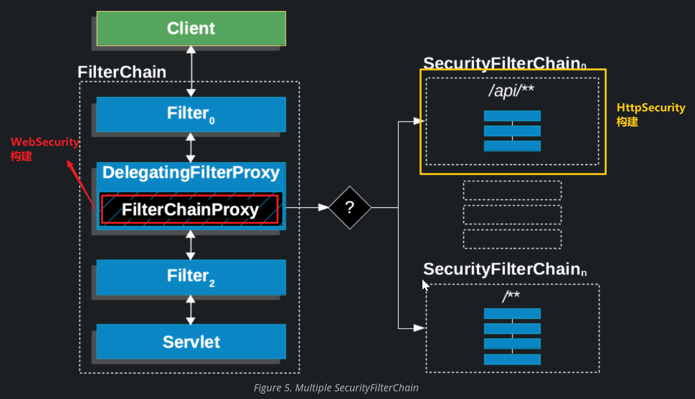

<!-- toc -->

### 前言

项目的前端框架基本搭建完成后, 来到项目比较抽象的地方, 登录和授权. 说其抽象主要是因为使用`SpringSecurity`框架的原因, `SpringSecurity`框架机制健全切强大, 但由于其封装的非常好, 所以在使用时开发人员会觉得非常抽象, 动不动的就认证异常, 一不小心就弹出默认的登录页面, 也会出现各种不理解的情况, 所以来踩坑吧

由于开始项目时`springboot`使用的是`3.1.5`版本, 所以此处也使用同版本的`SpringSecurity`

当前网上介绍`SpringSecurity`的文章大致分为两类, 一类是讲源码, 一类是讲使用的. 本篇是讲`SpringSecurity`的使用的文章, 所以暂不评论将源码的文章如何, 但对于将使用的文章, 我只能说除了部分大佬的文章外, 其他都是:-1:

个人认为讲使用的文章要做到两点: 1.怎样用;2. 每个操作的作用是什么.但绝大多数的文章就是告诉属于者你要这样做, 然后就成功了, 读者看了之后成功了, 但根本不知道自己做了什么,特别是像我这种之前没有做过认证授权(登录)内容的`loser`, 本身就不了解, 文章也讲不清楚, 个人很迷茫啊

由于`SpringSecurity`内容很多, 但最重要的是配置内容, 本篇会介绍`SpringSecurity`中重要的内容讲解, 其他内容或许一句话带过

==如果想快速明白该如何配置, 可以直接看<a href="#认证流程" style="font-weight: blod">认证流程</a>部分==

### 引入`SpringSecurity`

#### 添加依赖

1. 父级项目中引入依赖

   ```xml
   <dependency>
       <groupId>org.springframework.boot</groupId>
       <artifactId>spring-boot-starter-security</artifactId>
   </dependency>
   ```

   由于`SpringSecurity`的依赖在`SpringBoot`的`spring-boot-dependencies`中引入, 所以在父项目中不必要显式的声明引入

   才用`starter`的方式时, 默认就会有`@EnableWebSecurity`注解, 所以会发现, 当引入依赖后, 就需要进行登录操作了. 如果只是单纯的进入`security`的依赖, 需要添加该注解开启相关内容

2. 子项目中引入依赖

   ```xml
   <dependency>
       <groupId>org.springframework.boot</groupId>
       <artifactId>spring-boot-starter-security</artifactId>
   </dependency>
   ```

3. 说明

   - 登录操作先在一个子项目中实现, 然后添加到整个项目中, 在分布式中实现一处登录
   - 后续在分布到整个项目中时, 可能会将登录操作放置在网关子项目中, 所以会有普通项目到网关项目的登录改造

#### 添加配置

在使用`starter`时, 不需要任何配置, 既可以正常使用`Security`, 如果引入的是单纯的`Security`, 则需要再配置类上添加`@EnableWebSecurity`注解

```java
@Configuration
@EnableWebSecurity
public class Security {
    
}
```

### 自定义配置前的说明

当需要自定义配置时, 主要是自定义配置两个内容:1. `HttpSecurity`; 2. `WebSecurity`. 这两个东西讲起来就啰嗦了

1. 首先区分请求中的容器: `servlet`容器和`spring`容器, `servlet`容器主要是为请求服务的, 主要有两类: `Filter`和`Servlet`, `Servlet`是对请求进行具有实际意义的内容处理, 可以参照`spring mvc`中的`controller+service+dao`, `Filter`是对请求进行预处理或者后置处理; `spring`容器就是我们常说的`spring`的`bean`

2. 其次区分`Filter`: `Filter`根据容器不同, 有`servlet`的`Filter`和`spring`的`Filter`, 通常我们使用`spring`的方式注册的`Filter`都是`spring`的`Filter`; `servlet`必须是继承自`javax.serlvet.Filter`(`tomcat-embed-core`依赖包应该是`jakarta.servlet.Filter`)接口, 并通过`web.xml`(`SpirngBoot`是通过`@WebFilter`注解)注册到`servlet`容器中(不明白的可以先学习一下`servlet`开发)

3. 在了解上述两个内容之后, 就再认识三个名词:

   - `DelegatingFilterProxy`(委派过滤器代理, `servlet`中的`Filter`与`spring`中的`Filter`的桥接器, `spring web`中定义的, 任何框架都可以通过此方式添加`Filter`到`servlet`执行链中);
   - `FilterChainProxy` (`spring`容器中的过滤器链代理, 内部维护多个`spring`过滤器链, 在`SpringSecurity`中定义的, 即专门为`SpringSecurity`使用); 
   - `SecurityFilterChain`(安全框架的过滤器链, 在`SpringSecurity`中定义的, 认证流程的处理过程)

4. 直接上图

   

5. 现在讲`WebSecurity`和`HttpSecurity`. `Security`的原理就是根据不同的路径, 匹配不同的`SecurityFilterChain`

   - `HttpSecurity`是用来构建`SecurityFilterChain`的, `HttpSecurity`每`build`一次, 就构建出一条完整的`SecurityFilterChain`, 每个`SecurityFilterChain`根据配置不同, 有不同数量的过滤器, 当项目中没有构建`SecurityFilterChain`时, 框架会添加一条默认的`SecurityFilterChain` ; 
   - `WebSecurity`是用来构建`FilterChainProxy`的构建类, 它会维护项目中添加的`SecurityFilterChain`, 根据`SecurityFilterChain`中的路径匹配规则, 调用不同的`SecurityFilterChain`
   - 

6. 演示

   

   

7. 说明

   - 个人不太推荐使用`addSecurityFilterChainBuilder`的方式添加`SecurityFilterChain`, 这种方式定义比较麻烦. 不同的`SecurityFilterChain`可以通过定义不同的`SecurityFilterChain`的`Bean`实例, 通过`SecurityFilterChain`的`securityMatcher`来实现不同请求的处理

   - 项目中的静态资源推荐使用`ignoring`的方式实现, 因为大多数静态资源都是允许直接访问的

   - 同一个`HttpSecurity`是不允许重复构建的, 重复构建时会出现已构建的错误, 所以说第一点中的`addSecurityFilterChainBuilder`添加比较麻烦, 同时也拒绝了直接构建`List<SecurityFilterChain>`的道路. 但是每次创建新的`SecurityFilterChain`时注入的`HttpSecurity`都是不同的, 所以推荐此方式添加`SecurityFilterChain`. 

     

### 配置`WebSecurity`


上述是`WebSecurity`中的可配置内容

- `ignoring`: 忽略路径
- `httpFirewall`: 防火墙
- `debug`: 是否开启`debug`
- `addSecurityFilterChainBuilder`: 添加一个`SecurityFilterChain`
- `privilegeEvaluator`: 特权, 这个我也没有明白具体要怎么做, 大致是说判断某个请求是否有某种特权, 至于是什么样的特权, 怎样定义, 不甚了解
- `expressionHandler`: 表达式处理器. 不明白不要紧, 去查看参数, 可以找到`SecurityExpressionHandler`接口, 有三个方法, 查看其抽象实现类`AbstractSecurityExpressionHandler`, 其中有一个解析器`SpelExpressionParser`, 这是`spring`的`spel`表达式解析器, 该类中还能找到`SecurityExpressionOperations`这个类, 看到其中的方法名就明白了, 解析控制器中方法的`@PreAuthorize`等权限注解中定义的表达式内容. 该方法是为了添加自己的表达式解析类
- `postBuildAction`: 构建后的处理, 参数是一个`Runnable`任务
- `requestRejectedHandler`: 请求拒绝处理器, 用来处理防火墙的拒绝异常的处理器

配置`WebSecurity`主要是为了将路径放行, 避免某些资源即使放行还要走一个完整的`SecurityFilterChain`, 此方式添加的`SecurityFilterChain`中没有任何`Filter`, 直接向下运行; `WebSecurity`中的其他配置可按需自行添加

```java
@Bean
public WebSecurityCustomizer webSecurityCustomizer() {
    return web -> web
        .ignoring().requestMatchers("/static/**");
}
```

上面即是放行`/static`路径下的所有请求

### 配置`HttpSecurity`

`HttpSecurity`是`security`配置的重点

1. 可以通过`HttpSecurity`配置多个`SecurityFilterChain`, 这些`SecurityFilterChain`之间需要注意一些内容

   - 由于每个请求只能走一个`SecurityFilterChain`, 所以在配置时, 尽可能不要出现路径配置重叠的情况, 避免出现走错了`SecurityFilterChain`而导致的问题
   - 如果接收的请求没有被覆盖在配置的`SecurityFilterChain`的映射路径中, 则该请求会被直接通过, 所以在进行配置时需要确保有一个`SecurityFilterChain`是覆盖全部请求的, 即上面的图片中的`anyRequest`的`SecurityFilterChain`
   - 通常情况下我们只会配置一个`SecurityFilterChain`, 这个`SecurityFilterChain`不要配置`securityMatcher`这一项, 避免覆盖`anyRequest`的`SecurityFilterChain`导致的映射路径没有全覆盖的情况

2. `HttpSecurity`可以配置的内容

   `HttpSecurity`可以配置的内容非常多, 目前`3.1.5`版本中, 保守估计有一半已经标记为过时的方法了, 所以就不截图了, 这里分类介绍一下吧

   - 配置当前`SecurityFilterChain` 处理的映射路径: `securityMatchers`
   - 在当前`SecurityFilterChain`中添加自定义过滤器: `addFilter`
   - `csrf`配置: 默认是开启的, 当设置为`disable`时会将`SecurityFilterChain`中的该过滤器删除
   - `cors`配置: 默认是没有的, 当添加配置后, 会添加一个`CorsFilter`
   - 认证配置: 默认是使用用户密码的认证方式; 认证的实现是通过添加每一种的认证过滤器来配置的, 官方定义支持的认证方式: 
     - `Basic`: `Basic`请求头的认证方式, 通过`httpBasic`配置, 可以参考`https://blog.csdn.net/ShiJunzhiCome/article/details/126064450`
     - 用户密码认证: 用户名, 密码认证, `username`, `password`, 通过`formLogin`可配置
     - `JAAS`: `jaas`认证方式, 官方可能没有提供该认证方式的过滤器实现. 有一个很相似的`jee`方法是用来配置`Java EE security`过滤器的
     - `X509`: `X509`认证可以通过`x509`配置
     - `rememberMe`: 记住一个过了`session`有效期的用户, 可以通过`rememberMe`配置
     - `SAML 2.0 Login`: `SAML2.0`认证可以通过`saml2Login`配置
     - `OAuth 2.0 Login`: `OpenId Connect`和非标准的`OAuth 2.0`认证, 通过`oauth2Login`配置
     - `CAS`: 支持, 但没有实现过滤器
     - `Pre-Authentication Scenatios`: 使用外部机制(如`SiteMinder`或`Java EE security`)进行认证, 但仍使用`spring security`进行授权保护. 通过`jee`可以配置`Java EE security`
     - 匿名认证: 通过`anonymous`可以配置匿名认证
   - 认证时可共用的配置:
     - `authenticationManager`: 认证管理器, 维护一组认证处理器, 默认的是`ProviderManager`
     - `AuthenticationProvider`: 认证处理器, 此方法是添加一个认证处理器, 这些认证处理器通过`AuthenticationManager`进行维护管理, 进行认证操作时, 会遍历`AuthenticationManager`中维护的`AuthenticationProvider`, 通过`AuthenticationProvider`的`supports`判断是否符合验证要求, 符合则通过`authenticate`方法验证, 然后跳过后续还未执行的验证处理器
     - `userDetailsService`: 用户详情服务, 用于加载用户的详情信息, 通常会重写该内容(注册一个该接口的`@Bean`实例即可替换默认`SecurityFilterChain`中的用户详情服务), 从数据库中查询用户信息
     - `exceptionHandling`: 异常处理, 此方法是添加可共用的认证异常处理机制
     - `sessionManagement`: `session`管理
     - `passwordManagement`: 加密管理
     - `authorizeHttpRequests`: 认证请求配置
     - `securityContext`: 安全上下文
     - `setSharedObject`: 共享对象
   - 注销认证配置: `logout`
   - 其它配置我不太明白, 就不误人子弟了

### 请求流程


在上面描述了基本概念和配置内容之后, 可以简单的描述请求的流程

1. 接收请求, 执行到`security`添加的`DelegatingFilterProxy`, 通过这个桥接器接入认证流程
2. `FilterChainProxy`根据请求查询并调用`SecurityFilterChain`, 执行认证流程
3. 认证流程执行结束后, 执行后续的操作
4. 返回请求的处理结果

其中我们在认证中最关心的就是认证流程, 即使用的`SecurityFilterChain`

### 认证流程

此处就以用户名和密码的登录方式为例, 演示认证流程, 此次演示会偏向于前后端分离的配置, 不会有页面内容

在开始之前先开启日志, 方便查看和定位

```yml
logging:
  level:
    org:
      springframework:
        security: trace
```

首先我们不做配置, 查看一下默认的`SecurityFilterChain`


我们进行配置时, 多数是进行步骤三的配置和步骤七的配置, 其他的配置内容或禁用,或用默认, 或配置比较简单. 我们先将这部分简单配置一下

1. 先禁用`csrf`:

   ```java
   http.csrf(AbstractHttpConfigurer::disable);
   ```

2. 异常处理设置为返回`json`内容: 

   ```java
   http.exceptionHandling(config ->
                          config
                          .authenticationEntryPoint(customerAuthenticationHandler())
                         );
   ```

   ```java
   public class CustomerAuthenticationHandler implements AuthenticationEntryPoint {
       public CustomerAuthenticationHandler(AuthenticationSaveHandler authenticationSaveHandler) {
           this.authenticationSaveHandler = authenticationSaveHandler;
       }
   
       private AuthenticationSaveHandler authenticationSaveHandler;
       @Override
       public void commence(HttpServletRequest request, HttpServletResponse response, AuthenticationException authException) throws IOException, ServletException {
           authenticationSaveHandler.remove(request.getHeader("TOKEN"));
           Map<String, Object> result = new HashMap<String, Object>();
           result.put("msg", authException);
           result.put("status", 500);
           response.setContentType("application/json;charset=UTF-8");
           String s = new ObjectMapper().writeValueAsString(result);
           response.getWriter().println(s);
       }
   }
   ```

   ==`AuthenticationSaveHandler`是我个人封装的一个验证信息的保存处理器,  `TOKEN`是我个人在请求头中定义的内容, 作为保存处理器的`KEY`, 至于具体实现可以个人自定义, `JWT`, `Redis`保存都可以, 如果演示想要简单点可以直接使用一个`Map`保存, 通过`KEY`来`get`和`put`即可==

   需要注意的是, 当配置完这些后, 访问服务资源时会发现可以直接访问, 这是因为我们没有添加鉴权的配置, 这样生成的`SecurityFilterChain`是没有鉴权过滤器的, 如果想要验证一下`exceptionHandling`效果可以先添加简单的鉴权配置

   ```java
   http.authorizeHttpRequests(
       (auth) -> auth
       .requestMatchers("test/unauth", "login")
       .permitAll()
       .anyRequest()
       .authenticated()
   );
   ```

   测试访问除了`/test/unauth`路径之外的资源时, 就会异常, 异常信息是: `Full authentication is required to access this resource`

3. 注销认证后的处理和成功的处理:

   ```java
   http.logout(
       (config) -> config
       .addLogoutHandler(userLogoutHandler())
       .logoutSuccessHandler(userLogoutSuccessHandler())
   );
   ```

   ```java
   public class UserLogoutHandler implements LogoutHandler {
       public UserLogoutHandler(AuthenticationSaveHandler authenticationSaveHandler) {
           this.authenticationSaveHandler = authenticationSaveHandler;
       }
   
       private AuthenticationSaveHandler authenticationSaveHandler;
       @Override
       public void logout(HttpServletRequest request, HttpServletResponse response, Authentication authentication) {
           authenticationSaveHandler.remove(request.getHeader("TOKEN"));
       }
   }
   ```

   ```java
   public class UserLogoutSuccessHandler implements LogoutSuccessHandler {
       public UserLogoutSuccessHandler(AuthenticationSaveHandler authenticationSaveHandler) {
           this.authenticationSaveHandler = authenticationSaveHandler;
       }
   
       private AuthenticationSaveHandler authenticationSaveHandler;
   
       @Override
       public void onLogoutSuccess(HttpServletRequest request, HttpServletResponse response, Authentication authentication) {
           Map<String, Object> result = new HashMap<String, Object>();
           result.put("msg", "注销成功");
           result.put("status", 200);
           response.setContentType("application/json;charset=UTF-8");
           try {
               String s = new ObjectMapper().writeValueAsString(result);
               response.getWriter().println(s);
           } catch (IOException e) {
               throw new RuntimeException(e);
           }
       }
   }
   ```

   此时可以去请求`logout`注销认证, 请求成功时就会返回`UserLogoutSuccessHandler`中`onLogoutSuccess`返回的内容
   
   ==项目默认的注销登录的地址是`logout`, 可以通过`logoutUrl`修改注销请求的路径==
   
   ```java
   http.logout(
       (config) -> config
       .logoutUrl("/api/logout")
       .addLogoutHandler(userLogoutHandler())
       .logoutSuccessHandler(userLogoutSuccessHandler())
   );
   ```
   
4. 认证之后的操作和游客模式暂不操作

5. 鉴权配置, 通过`authorizeHttpRequests`配置资源的权限信息

   通过前面图片的过滤器介绍应该清晰的了解到, 鉴权操作实际是在认证等过滤器执行完之后操作的, 所以在此过滤器执行之前就被拦截处理的请求是不会走到该过滤器的, 比如登录配置中配置的登录请求路径(默认`/login`)和注销请求路径(`logout`); 部分过滤器是有执行链结束的后置处理的, 比如异常处理器是需要`catch`鉴权异常(即鉴权过滤器中抛出的异常)的, 所以会出现鉴权过滤器执行完后抛出了异常返回到异常过滤器中执行

   ```java
   // 用于匹配当前的SecurityFilterChain适用的请求路径, 不配置默认为anyRequest
   http.securityMatcher("/**");
   ```

   上面的配置不是鉴权配置, 而是`SecurityFilterChain`处理的请求路径, 不符合要求的不会匹配到该`SecurityFilterChain`

   ```java
   // 请求鉴权配置
   http.authorizeHttpRequests(
       (auth) -> auth
       .requestMatchers("test/unauth") // 用于匹配路径
       .permitAll()
       .requestMatchers("/test/auth")
       .hasRole("USER_TEST")   // 具有某种角色
       .requestMatchers("/test/auth")
       .hasAuthority("AUTH")   // 具有某种权限
       .requestMatchers("/**")
       .access((authentication, object) -> new AuthorizationDecision(true))    // 自定义符合某种要求
       .anyRequest()   // 用于匹配任何路径
       .authenticated()    // 表示需要认证
   );
   ```

   上述鉴权配置只是演示了几个配置的例子, `requestMatchers`表示匹配路径, 鉴权处理整体分为5个类别: `permitAll`(放行), `hasRole`(具有某种角色), `hasAuthority`(具有某种权限), `access`(自定义的访问要求), `authenticated`(需认证)

   鉴权配置的每一个都会在鉴权配置类`AuthorizeHttpRequestsConfigurer`中添加一个`AuthorizationManager`(注意别跟`AuthenticationManager`混了), 在`AuthorizationFilter`中实现其作用

6. 认证配置

   这是登录操作最重要的配置了, 我们以用户名和密码的认证方式为例进行演示

   ```java
   http.formLogin((config) ->
                  config
                  .usernameParameter("username")	// 用户名参数key
                  .passwordParameter("password")	// 密码参数key
                  .loginProcessingUrl("/login")	// 登录处理的匹配路径
                  .failureHandler(loginFailureHandler())	// 登录失败处理器
                  .successHandler(loginSuccessHandler())	// 登录成功处理
                 );
   ```

   上述配置是常做的配置, 当客户端发送`/login`请求时会被该过滤器拦截处理, 从请求中获取`key`为`username`和`password`的参数获取其值进行认证;  `failureHandler`配置一个认证失败的处理器; `successHandler`配置一个认证成功的处理器

   ```java
   public class LoginFailureHandler implements AuthenticationFailureHandler {
   
       public LoginFailureHandler(AuthenticationSaveHandler authenticationSaveHandler) {
           this.authenticationSaveHandler = authenticationSaveHandler;
       }
   
       private AuthenticationSaveHandler authenticationSaveHandler;
       @Override
       public void onAuthenticationFailure(HttpServletRequest request, HttpServletResponse response, AuthenticationException exception) throws IOException, ServletException {
           Map<String, Object> result = new HashMap<String, Object>();
           result.put("msg", "登录失败: "+exception.getMessage());
           result.put("status", 500);
           response.setContentType("application/json;charset=UTF-8");
           String s = new ObjectMapper().writeValueAsString(result);
           response.getWriter().println(s);
       }
   }
   ```

   ```java
   public class LoginSuccessHandler implements AuthenticationSuccessHandler {
   
       public LoginSuccessHandler(AuthenticationSaveHandler authenticationSaveHandler) {
           this.authenticationSaveHandler = authenticationSaveHandler;
       }
   
       private AuthenticationSaveHandler authenticationSaveHandler;
   
       @Override
       public void onAuthenticationSuccess(HttpServletRequest request, HttpServletResponse response, Authentication authentication) throws IOException, ServletException {
           String token = StringUtils.isBlank(request.getHeader("TOKEN")) ? UUID.randomUUID().toString() : request.getHeader("TOKEN");
           authenticationSaveHandler.add(token, authentication);
           Map<String, Object> result = new HashMap<>();
           result.put("msg", "登录成功");
           result.put("status", 200);
           Map<String, Object> data = new HashMap<>();
           data.put("token", token);
           data.put("userInfo", authentication);
           result.put("data", data);
           response.setContentType("application/json;charset=UTF-8");
           String s = new ObjectMapper().writeValueAsString(result);
           response.getWriter().println(s);
       }
   
   }
   ```

7. 当配置到此处时, 会发现登录功能都已经成功了, 但是有一个问题还没有解决, 请求的认证存储问题

   当我说出这个问题时可能会有疑问: 认证信息在登录成功后已经保存, `token`也已经返回, 只需要在请求时添加`token`到请求头里不就可以成功了. 答案是否

   先认识两个概念: 1. 请求是无状态的, 请求与请求之间是不存在关联的; 2. 在认证框架中, 请求是分为两类的: 认证类(登录和注销); 普通类(资源请求)

   当我们在上述配置的基础上登录请求登录成功了, 会将认证信息保存到自定义的存储中并返回`token`, 但是当资源请求进来时我们并没有获取对应的认证信息添加到请求上下文中来表示已经通过验证

   当登录后如果访问资源请求时成功这不是我们的逻辑的成功, 而是框架的一些默认配置带来的效果, 默认配置中会将`sessionId`返回并写到`Cookie`中, 所以访问资源时可能带有了已通过认证的`sessionId`导致的

   解决方案:

   - 第一种是网上大多的解决方案: 在走到认证流程过滤器前添加一个过滤器, 在这个过滤器中添加验证信息到上下文中, 还有的有会再获取`AuthenticationManager`然后再手动调用认证方法

   - 第二种是修改`session`的保存策略: 我个人比较懒, 所以想直接替换``spring`中验证信息的获取和保存方式. `spring`中无论是`mvc`还是`security`都是将请求基于`ThreadLocal`的, 所以此处的`session`策略不要修改, 依然使用`ThreadLocalSecurityContextHolderStrategy`, 我们要修改的是其存储库`SecurityContextRepository`

     `SecurityContextHolderFilter`: 获取验证信息的过滤器

     `AuthorizationFilter`: 获取并使用验证信息的过滤器

     `AbstractAuthenticationProcessingFilter`: 保存验证信息的过滤器(仅仅是用户名密码模式下的保存过滤器)

     ```java
     public interface AuthenticationSaveHandler extends SecurityContextRepository {
     
         boolean add(Object account, SecurityContext authentication);
     
         SecurityContext get(Object account);
     
         boolean remove(Object account);
     
     }
     
     public class MemoryAuthenticationSaveHandler implements AuthenticationSaveHandler {
     
         private static final Map<Object, SecurityContext> USER = new HashMap<>();
     
         @Override
         public boolean add(Object account, SecurityContext authentication) {
             USER.put(account, authentication);
             return true;
         }
     
         @Override
         public SecurityContext get(Object account) {
             return USER.get(account);
         }
     
         @Override
         public boolean remove(Object account) {
             USER.remove(account);
             return true;
         }
     
         @Override
         public SecurityContext loadContext(HttpRequestResponseHolder requestResponseHolder) {
             HttpServletRequest request = requestResponseHolder.getRequest();
             String token = request.getHeader("TOKEN");
             return get(token);
         }
     
         @Override
         public void saveContext(SecurityContext context, HttpServletRequest request, HttpServletResponse response) {
             String token = UUID.randomUUID().toString();
             response.addHeader("TOKEN", token);
     //        Authentication authentication = context.getAuthentication();
             add(token, context);
         }
     
         @Override
         public boolean containsContext(HttpServletRequest request) {
             String token = request.getHeader("TOKEN");
             return USER.containsKey(token);
         }
     }
     ```

     配置

     ```java
     http.setSharedObject(SecurityContextRepository.class, authenticationSaveHandler());
     ```


### 自定义登录

通过前面的配置, 我们可以实现配置官方的登录处理, 有些时候我们不希望使用官方的登录流程, 而是希望自定义登录流程和逻辑, 此处有两种方式: 

1. 请求处理器的方式

   这种方式就是前面提到的, 将登录请求放行, 然后在`controller`中实现自定义的登录逻辑, 并进行相关处理

2. 登录过滤器方式

   这种方式与上述方式类似, 只是逻辑处理通过自定义的过滤器实现

   首先根据自己的需求, 将官方实现的登录过滤器配置好, 然后创建一个自定义的过滤器, 并添加到`SecurityFilterChain`中

   ```java
   http.addFilterBefore(new MyLoginFilter(passwordEncoder, userDetailsService, authenticationSaveHandler), RequestCacheAwareFilter.class);
   ```

   然后自定义实现一个过滤器

   ```java
   public class MyLoginFilter extends OncePerRequestFilter {
   
       private PasswordEncoder passwordEncoder;
       private final RequestMatcher requiresAuthenticationRequestMatcher = new AntPathRequestMatcher("/login",
               "POST");
       private final UserDetailsService userDetailsService;
   
       private final SecurityContextRepository securityContextRepository;
   
       public MyLoginFilter(PasswordEncoder passwordEncoder, UserDetailsService userDetailsService, SecurityContextRepository securityContextRepository) {
           this.passwordEncoder = passwordEncoder;
           this.userDetailsService = userDetailsService;
           this.securityContextRepository = securityContextRepository;
       }
   
       @Override
       protected void doFilterInternal(HttpServletRequest request, HttpServletResponse response, FilterChain filterChain) throws ServletException, IOException {
           if (!requiresAuthentication(request, response)) {
               filterChain.doFilter(request, response);
               return;
           }
           String username = request.getParameter("username");
           String password = request.getParameter("password");
           UserDetails user = userDetailsService.loadUserByUsername(username);
           if (passwordEncoder.matches(password, user.getPassword())) {
               Authentication authentication = UsernamePasswordAuthenticationToken.authenticated(user, user, Collections.emptyList());
               SecurityContext context = SecurityContextHolder.createEmptyContext();
               context.setAuthentication(authentication);
               try {
                   securityContextRepository.saveContext(context, request, response);
               } catch (Exception e) {
                   throw new IOException(e);
               }
           }
           filterChain.doFilter(request, response);
       }
   
       protected boolean requiresAuthentication(HttpServletRequest request, HttpServletResponse response) {
           return this.requiresAuthenticationRequestMatcher.matches(request);
       }
   }
   ```

   可以在`OncePerRequestFilter`这个过滤器类的基础上进行构建, 此处只是简单的做了一个简单的逻辑处理和上下文保存样例, 具体实现可根据个人需要进行具体修改

### 出现问题:sob:

问题一

出现问题: 

```error
Not injecting HSTS header since it did not match request to [Is Secure]
```

问题描述: 这个问题在自定义登录后, 在请求登录时可能会出现, 具体内容上不会报错, 但是在打开日志打印时会显示自定义的登录过滤器出现了该描述

解决方案: 配置请求头`https`配置, 具体可参考: https://blog.csdn.net/w_monster/article/details/119936215

### 挖坑

`SpringSecurity`源码


