<!-- top -->


### 前言

上篇基本完成了服务的注册与发现, 服务间的`API`调用和配置中心, 对于服务间的调用, 需要解决服务调用失败的情况以及可能带来的服务雪崩的问题.

由于`Hystrix`不再维护, 所以此处使用`SpringCloudAlibaba`的`Sentinel`作为服务熔断与降级的组件. `SpringCloudAlibaba`的`Sentinel`作为微服务的容错组件, 以流量为一切入点, 从流量控制, 熔断降级, 系统负载保护等多维度保护服务稳定性, 是真正的流量防卫兵

### 安装部署`Sentinel`控制端

#### 下载

从https://github.com/alibaba/Sentinel/releases下载`jar`包

此处下载所使用的是`v1.8.6`

#### 启动

`Sentinel`默认端口是`8080`, 如果`8080`端口被占用了需要使用其他端口

修改方式使用普通的`SpringBoot`项目的修改方式即可

此处使用项目同目录下创建`application.yml`文件的方式

```yml
server:
  port: 10000
```

#### 访问测试

浏览器中访问`Sentinel`控制端, 用户和密码都是`sentinel`

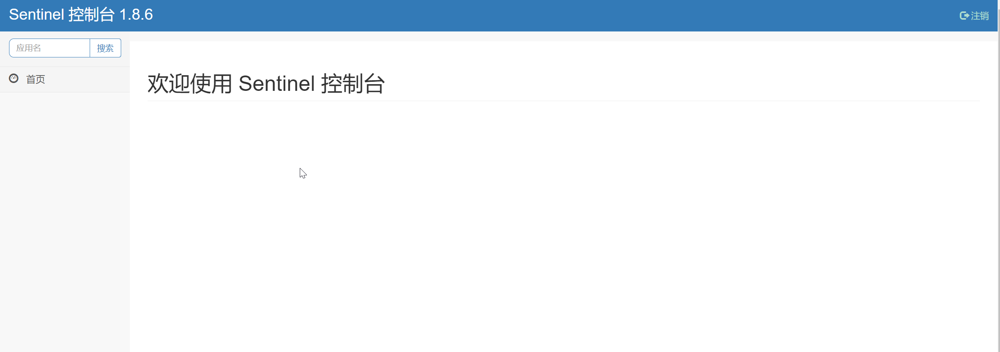

### 项目中引入`Sentinel`

#### 引入依赖

1. 父项目中引入依赖

   ```xml
   <dependency>
       <groupId>com.alibaba.cloud</groupId>
       <artifactId>spring-cloud-alibaba-dependencies</artifactId>
       <version>2022.0.0.0</version>
       <type>pom</type>
       <scope>import</scope>
   </dependency>
   <dependency>
       <groupId>com.alibaba</groupId>
       <artifactId>fastjson</artifactId>
       <version>2.0.32</version>
   </dependency>
   ```

2. 子项目中引入依赖

   ```xml
   <dependency>
       <groupId>com.alibaba.cloud</groupId>
       <artifactId>spring-cloud-starter-alibaba-sentinel</artifactId>
       <exclusions>
           <exclusion>
               <groupId>com.alibaba</groupId>
               <artifactId>fastjson</artifactId>
           </exclusion>
       </exclusions>
   </dependency>
   <dependency>
       <groupId>com.alibaba</groupId>
       <artifactId>fastjson</artifactId>
   </dependency>
   ```

   `IDEA`中提示`sentinel`中引用的`fastjson`版本存在漏洞, 所以在此处排除掉并引入稳定版本

#### 添加配置

配置文件添加监控项目配置

```yml
spring:
  cloud:
    sentinel:
      transport:
        dashboard: localhost:10000
```

#### `Sentinel`使用

使用`@SentinelResource`注解, 将资源注册为`Sentinel`监控资源

```java
@Service
public class DictTypeServiceImpl extends ServiceImpl<DictTypeMapper, DictTypeEntity> implements IDictTypeService {

    @Autowired
    private UserServiceClient userServiceClient;

    @Override
    // Sentinel资源配置
    @SentinelResource("dict-type-get-id")
    public Map<String, Object> get(Integer id) {
        Map<String, Object> result = new HashMap<>();
        DictTypeEntity type = this.getById(id);
        result.put("dictType", type);
        ApiResult<UserEntity> re = userServiceClient.getById(type.getCreator());
        if (!Objects.isNull(re)) {
            result.put("user", re.getData());
        }
        return result;
    }
}
```

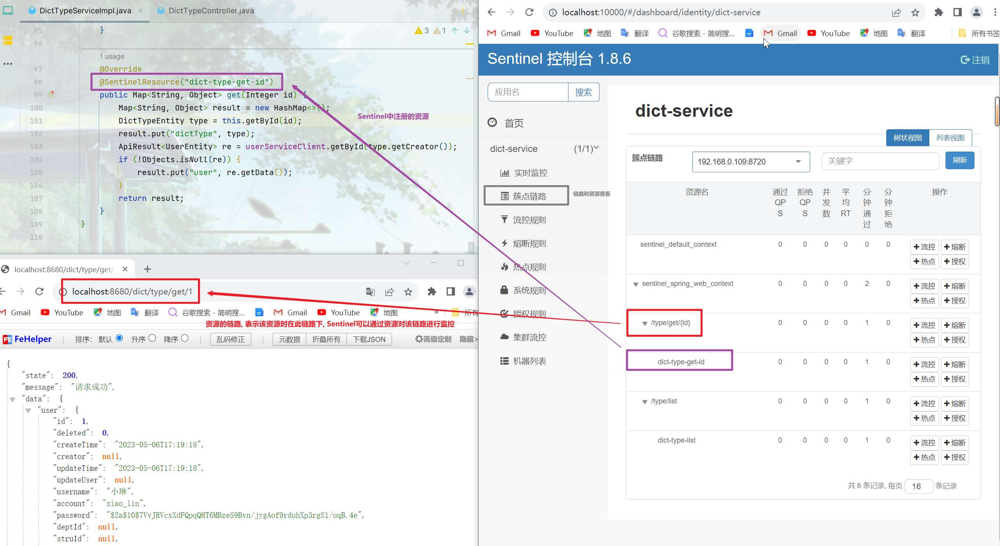

注意事项:

1. `@SentinelResource`注解可以使用在类和方法上
2. 项目启动后并不会立即注册到`Sentinel`中, 只有首次调用了资源后, 才会将该资源注册到`Sentinel`中
3. 通常使用在方法上是为了进行更细粒度的流量控制

### `Sentinel`的流控规则

#### 流控策略

1. 快速失败: 直接拒绝

2. 预热: 缓慢将阈值提高到指定阈值, 形成缓冲保护

   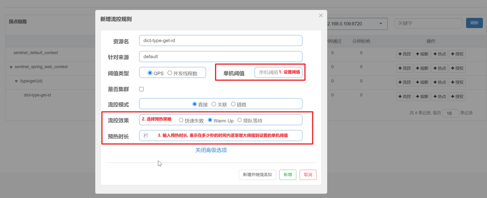

3. 排队等候: 先进入队列等待, 如果规定时间内没有执行则放弃执行

   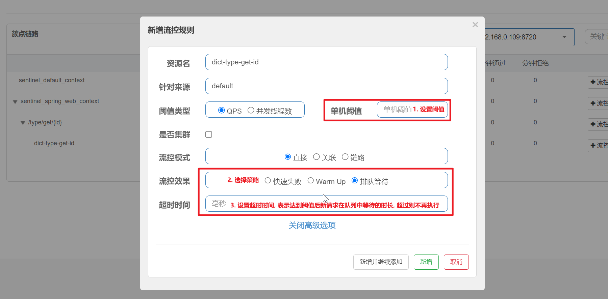

#### 流控模式

1. 直接: 资源的直接控制, 当前资源达到流控阈值, 当前资源限流

2. 关联: 资源的间接控制, 关联资源达到流控阈值, 当前资源限流

   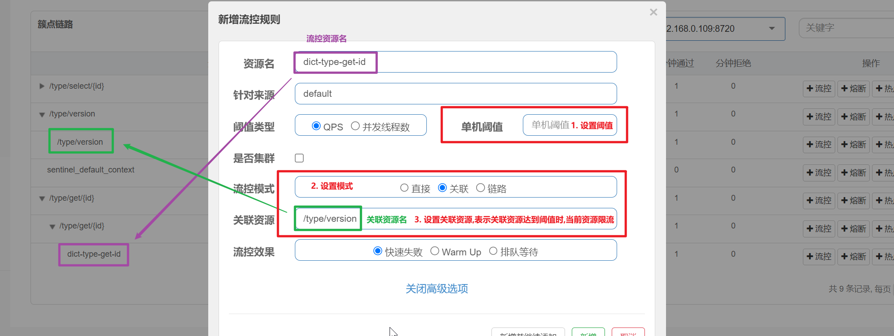

3. 链路: 更细粒度的监控; 只有指定资源链路的请求达到阈值时, 才执行限流

   首先要关闭`context`收敛, 使资源进行链路隔离, 实现不同链路的单独控制

   ```yml
   spring:
     cloud:
       sentinel:
         # 关闭context收敛, 这样被监控方法可以进行不同链路的单独控制
         web-context-unify: false
   ```

   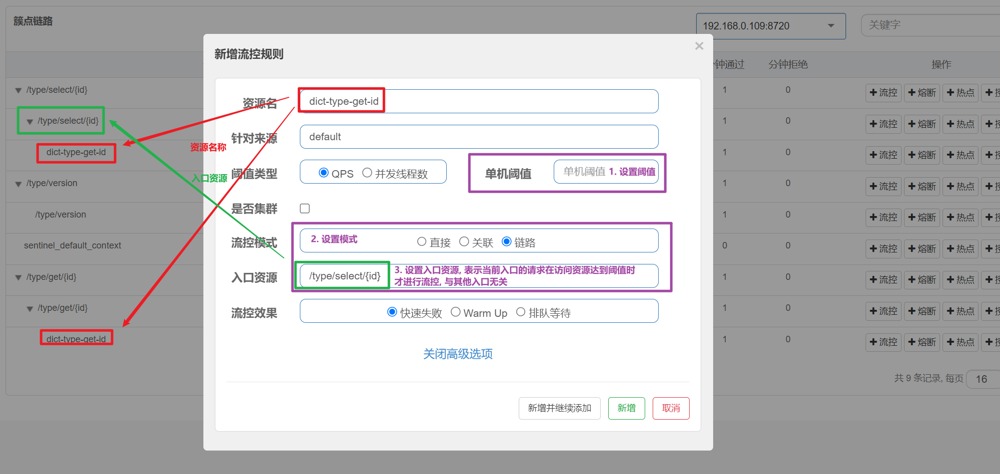

### `Sentinel`的异常处理

#### 自定义异常处理请求

自定义异常处理请求是定义一个异常处理的请求, 当监控的资源限流时, 会直接调用该请求返回结果, 这种方式可以放到公共项目中定义, 在引入项目中配置

1. 定义异常处理请求

   ```java
   @RestController
   @RequestMapping("/sentinel")
   public class SentinelErrorController {
   
       @RequestMapping("/block")
       public ApiResult<?> block() {
           return ApiResult.failure(500, "资源被限流");
       }
       
   }
   ```

2. 添加异常处理请求路径

   ```yml
   spring:
     cloud:
       sentinel:
         transport:
           dashboard: localhost:10000
         # 异常请求的处理路径
         block-page: /dict/sentinel/block
   ```

3. 添加流控配置

   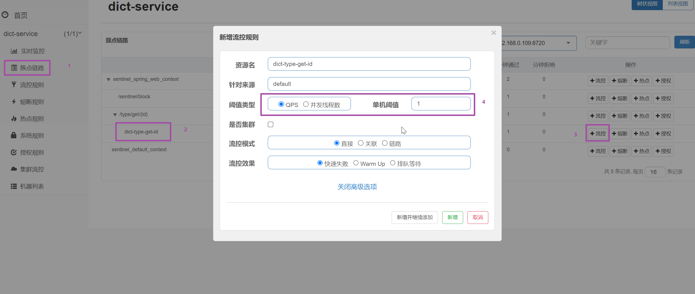

4. 限流异常结果

   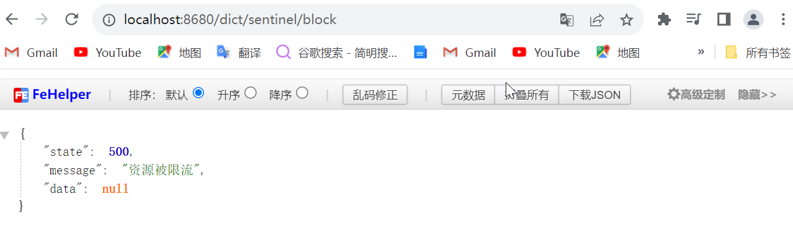

   当`QPS`大于单机阈值(每秒请求数大于单机阈值)时, 则会出现以上结果, 请求被转发到配置的异常请求处

#### 自定义异常处理器

自定义异常处理请求是定义一个异常处理器, 当监控的资源限流时, 会调用该处理器的返回结果, 此种方式是以中细粒度的处理方式

1. 自定义异常处理器

   ```java
   @Slf4j
   public class SentinelBlockHandler {
   
       // 与资源的返回值相同, 参数列表要一直, 并在最后添加一个 BlockException 类型的参数
       public static Map<String, Object> get(Integer id, BlockException ex) {
           log.info("{}: 资源限流", LocalDateTime.now());
           return Collections.emptyMap();
       }
   
   }
   ```

2. 为资源配置异常处理器

   ```java
   @Service
   public class DictTypeServiceImpl extends ServiceImpl<DictTypeMapper, DictTypeEntity> implements IDictTypeService {
   
       @Autowired
       private UserServiceClient userServiceClient;
   
       @Override
       @SentinelResource(value = "dict-type-get-id", blockHandlerClass = {SentinelBlockHandler.class}, blockHandler = "get")
       public Map<String, Object> get(Integer id) {
           Map<String, Object> result = new HashMap<>();
           DictTypeEntity type = this.getById(id);
           result.put("dictType", type);
           ApiResult<UserEntity> re = userServiceClient.getById(type.getCreator());
           if (!Objects.isNull(re)) {
               result.put("user", re.getData());
           }
           return result;
       }
   }
   ```

   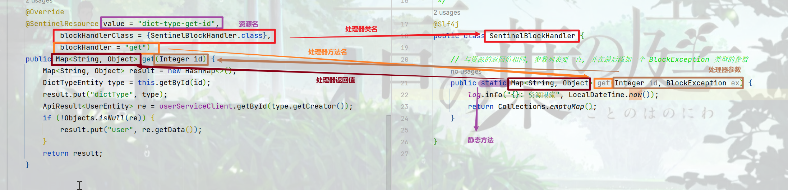

3. 添加流控配置

   

4. 限流异常结果

   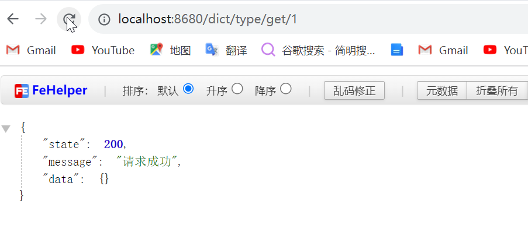

   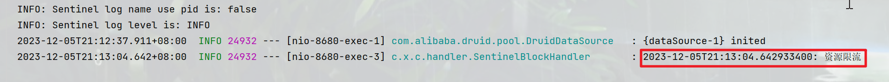

### 服务熔断和降级

#### 服务熔断和降级是什么

网络上讲述这两者的区别的时候都非常专业化, 我看的是云里雾里, 个人浅薄的理解就是熔断是基于服务高可用的, 而降级是基于整体负载的, 保证系统正常可用的; 熔断目的是为了保证服务的高可用性, 在目标资源压力过大时采取的避险方案; 降级的目的是为了保证核心业务的可用性, 不同时间段的核心业务可能不一致, 一方面通过管控非核心业务资源, 使得核心业务可以获得更多的系统资源, 另一方面通过熔断方式保证核心业务的可用

#### 资源熔断处理

在`Sentinel`中, 熔断的处理其实与流控一致, 即通过异常请求或者异常处理器来实现, 可以参考流控中的异常处理

熔断策略

1. 慢调用规则

   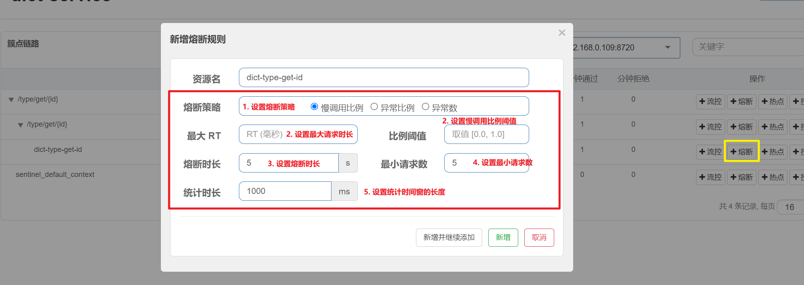

   **最大请求时长**: 一次请求的最大时长, 超过该时长视为一次慢调用

   **熔断时长**: 熔断器的周期时长, 每个周期即为熔断时长, 周期与周期之间会尝试请求以寻求关闭熔断器; 每经过一个熔断时长, 熔断器就会进入半开状态, 释放部分请求去尝试调用, 如果服务仍然不可用, 则继续保持开启, 进入下一个熔断周期, 如果可用则熔断器关闭

   **最小请求数**: 统计时长内最小的请求次数

   **统计时长**: 每个统计时间窗的时长, 统计该时长内的请求次数和状态, 判断是否需要熔断

   **比例阈值**: 用来判断统计时长内所有请求中慢调用请求所占的比例的最大值

   **注意**: 

   > 慢调用比例策略要想开启熔断器需要达到两个条件:
   >
   > 1. 统计时长内, 请求数量大于最小请求数
   > 2. 统计时长内, 慢调用所占比例大于阈值

2. 异常比例

   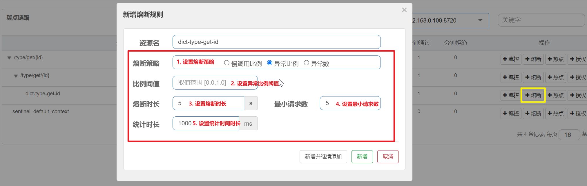

   **熔断时长**: 熔断器的周期时长, 每个周期即为熔断时长, 周期与周期之间会尝试请求以寻求关闭熔断器; 每经过一个熔断时长, 熔断器就会进入半开状态, 释放部分请求去尝试调用, 如果服务仍然不可用, 则继续保持开启, 进入下一个熔断周期, 如果可用则熔断器关闭

   **最小请求数**: 统计时长内最小的请求次数

   **统计时长**: 每个统计时间窗的时长, 统计该时长内的请求次数和状态, 判断是否需要熔断

   **比例阈值**: 用来判断统计时长内所有请求中异常请求所占的比例的最大值

   **注意**: 

   > 异常比例策略要想开启熔断器需要达到两个条件:
   >
   > 1. 统计时长内, 请求数量大于最小请求数
   > 2. 统计时长内, 异常请求所占比例大于阈值

3. 异常数

   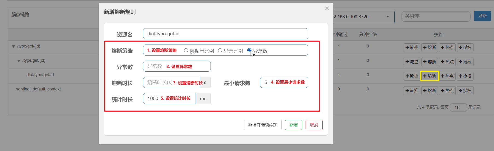

   **熔断时长**: 熔断器的周期时长, 每个周期即为熔断时长, 周期与周期之间会尝试请求以寻求关闭熔断器; 每经过一个熔断时长, 熔断器就会进入半开状态, 释放部分请求去尝试调用, 如果服务仍然不可用, 则继续保持开启, 进入下一个熔断周期, 如果可用则熔断器关闭

   **最小请求数**: 统计时长内最小的请求次数

   **统计时长**: 每个统计时间窗的时长, 统计该时长内的请求次数和状态, 判断是否需要熔断

   **异常数**: 用来判断统计时长内异常请求的数量

   **注意**: 

   > 异常比例策略要想开启熔断器需要达到两个条件:
   >
   > 1. 统计时长内, 请求数量大于最小请求数
   > 2. 统计时长内, 异常请求达到阈值

#### 服务调用熔断处理

本次项目中的服务调用使用的是`OpenFeign`, `Sentinel`整个`OpenFeign`进行熔断处理的方式与`Hystrix`一致

1. 配置开启`OpenFeign`支持`Sentinel`

   ```yml
   feign:
     sentinel:
       enabled: true
   ```

2. 添加服务调用的熔断处理

   - 服务调用接口

     ```java
     @Component
     @FeignClient(value = "user-service")
     public interface UserServiceClient {
     
         @GetMapping("/user/get/{id}")
         ApiResult<UserEntity> getById(@PathVariable("id") Integer id);
     
     }
     ```

   - 创建服务调用接口的实现类, 重写方法的返回值即为熔断的默认调用结果, 并将其注册为`Bean`

     ```java
     @Component
     public class UserServiceClientFallback implements UserServiceClient {
         @Override
         public ApiResult<UserEntity> getById(Integer id) {
             return ApiResult.failure();
         }
     }
     ```

     <a href="#问题一">如果没有注册为`Bean`, 项目启动时会报异常</a>

   - 将该实现类在服务调用接口上添加为`fallback`参数的值

     ```java
     @Component
     @FeignClient(value = "user-service", fallback = UserServiceClientFallback.class)
     public interface UserServiceClient {
     
         @GetMapping("/user/get/{id}")
         ApiResult<UserEntity> getById(@PathVariable("id") Integer id);
     
     }
     ```


### 出现问题:sob:

<i id="问题一">问题一</i>

出现问题:

```err
Caused by: java.lang.IllegalStateException: No fallback instance of type class com.xiaolin.commons.clients.fallback.UserServiceClientFallback found for feign client user-service
```

问题原因: 在做服务熔断时, 服务调用接口的实现没有注册为`Bean`

解决方案: 将服务调用接口的实现注册为`Bean`

### 挖坑

`Sentinel`的高级使用(系统规则, 集群等)


