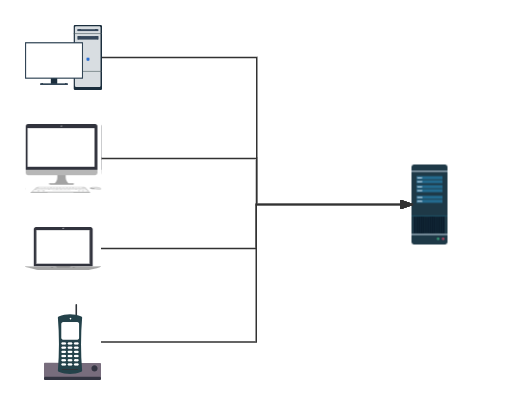
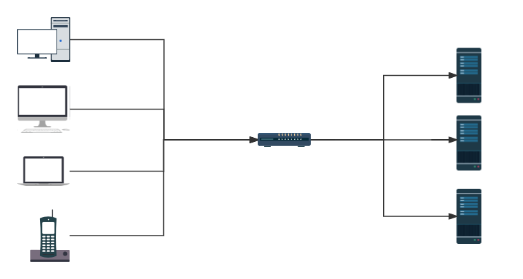
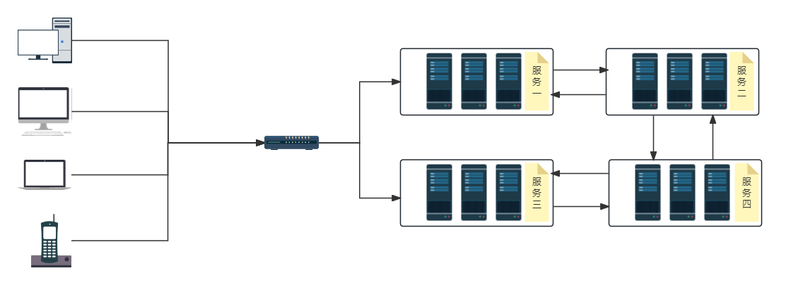

<!-- toc -->

###  前言

本篇是写在全局事务篇之前, 前面讲述了`SpringCloud`的一些搭建内容, 现在要对分布式系统做一些描述或者说前面内容的补充, 按照逻辑来说, 本篇讲述在分类开始之前比较合适, 但是...反正...(绝不承认我忽略了)

### 原因

首先为什么使用分布式 ? 一句话概述就是单个单体服务的吞吐量不足以支撑系统的正常使用

实际上每个项目的起步阶段绝大多数都是单体项目, 在项目之初就以分布式的方式设计的项目少之又少, 因为项目初始阶段的业务内容比较少, 处理量少, 单体应用即可解决, 不需要使用分布式的方式

随着项目的逐渐成熟, 客户量和业务量增加, 项目的压力增加, 单体应用难以支撑庞大的请求量, 系统就会出现问题, 此时就开始引入分布式

阶段一: 分布式的初始阶段并不是按照服务来划分的, 这通常成为第一阶段, 这一阶段通常是通过增加单体服务的数量来解决的, 即原本一个单体应用难以维持的压力, 现在增加两台应用, 将原本的压力分成三份, 通过这种方式维持运行

> 其实市面上除了少数庞然大物外, 大多数需要走分布式的企业正处在上述阶段, 特别是一些国企
>
> 上图中的每个服务都是一台完整的单体应用

阶段二: 分布式的发展阶段是开始按照服务来拆分, 即开始走微服务路线, 此时拆分的划分会比较粗略, 比如会将一整个关联性比较强的功能全部拆分成一个服务, 每个服务都添加多个, 构成一个单一服务的服务组, 通过服务间的调用实现整个业务逻辑. 每个请求的流程实质上是服务间的调用流程

阶段三: 分布式的最终阶段在设计上与阶段二没有分别, 只是服务的拆分更加合理, 服务的数量和分布按照实际的使用情况进行合理拆分, 比如在多个请求流程中都用到了某个服务, 则该服务的数量应该多于其他相关的服务, 这个数量应该是在系统的实际应用中进行统计, 得到的合理数值

> 如:
>
> 请求一: 服务一 ---> 服务二 ---> 服务三
>
> 请求二: 服务四 ---> 服务二 ---> 服务五
>
> 假设两个请求的请求数一致, 则在系统中, 服务二的数量与其他服务的数量可能不一致(这个数量与这个服务工作的吞吐量有关)

### 需要解决的问题

#### 一致性问题

#### `Session`共享问题

