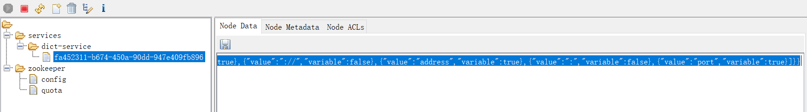
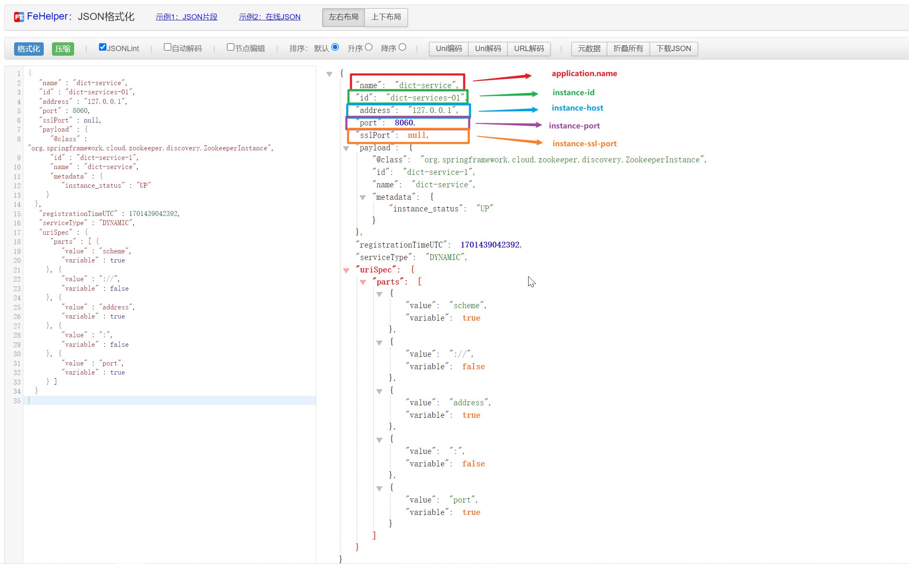
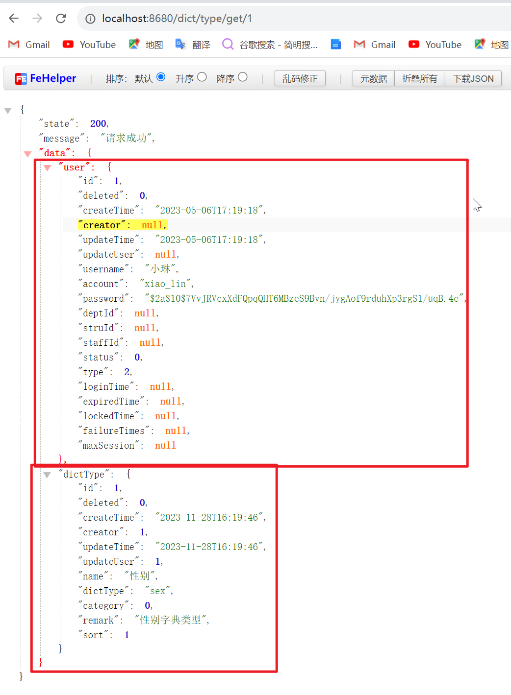
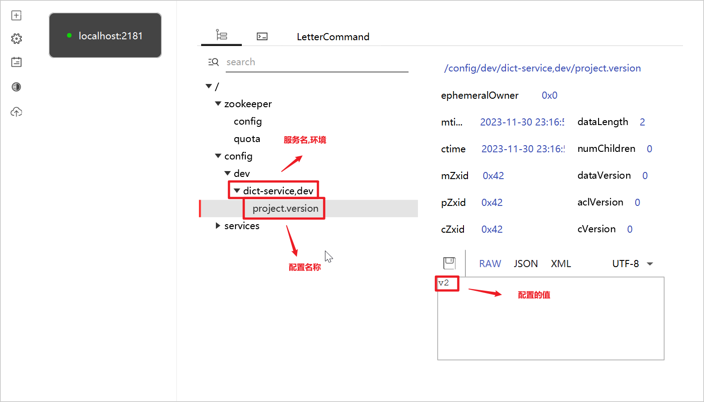
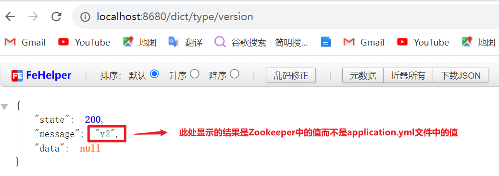

<!-- toc -->


### 前言

前一篇搭建了分布式项目基本服务内容, 此篇开始进行分布式的架构设计. 首先从注册中心开始, 原本是想使用`Eureka`的, 但由于`Eureka`从2.x开始不再开源, 担心会发生风向偏移, 所以此处选用`Zookeeper`. 最近看的招聘信息里, `Zookeeper`出现的频率也挺高的, 当然, 自己也想学习使用新东西.

由于本系列是学习搭建`SpringCloud`的系列文章, 所以不会探讨`Zookeeper`的深度学习和使用, 本篇的目的是在项目中引入`Zookeeper`作为注册中心和配置中心

### 启动`Zookeeper`

#### 下载

从https://zookeeper.apache.org/releases.html下载对应版本的`Zookeeper`, 解压缩

#### 修改配置

根据`conf`目录中的`zoo_sample.cfg`文件, 在`conf`目录下创建`zoo.cfg`文件, 修改其中的配置

```properties
# The number of milliseconds of each tick
# 心跳间隔
tickTime=2000
# The number of ticks that the initial 
# synchronization phase can take
initLimit=10
# The number of ticks that can pass between 
# sending a request and getting an acknowledgement
syncLimit=5
# the directory where the snapshot is stored.
# do not use /tmp for storage, /tmp here is just 
# example sakes.
# 数据库经
dataDir=D:\\software\\apache-zookeeper-3.9.1\\data
# 日志路径
dataLogDir=D:\\software\\apache-zookeeper-3.9.1\\logs
# the port at which the clients will connect
# 客户端端口号
clientPort=2181
# 修改占用的8080端口号
admin.serverPort=8079
# the maximum number of client connections.
# increase this if you need to handle more clients
#maxClientCnxns=60
#
# Be sure to read the maintenance section of the 
# administrator guide before turning on autopurge.
#
# https://zookeeper.apache.org/doc/current/zookeeperAdmin.html#sc_maintenance
#
# The number of snapshots to retain in dataDir
#autopurge.snapRetainCount=3
# Purge task interval in hours
# Set to "0" to disable auto purge feature
#autopurge.purgeInterval=1

## Metrics Providers
#
# https://prometheus.io Metrics Exporter
#metricsProvider.className=org.apache.zookeeper.metrics.prometheus.PrometheusMetricsProvider
#metricsProvider.httpHost=0.0.0.0
#metricsProvider.httpPort=7000
#metricsProvider.exportJvmInfo=true
```

> - tickTime：这个时间是作为 Zookeeper 服务器之间或客户端与服务器之间维持心跳的时间间隔，也就是每个 tickTime 时间就会发送一个心跳。
> - initLimit：LF初始通信时限，集群中的follower服务器（F）与leader服务器（L）之间初始连接时能容忍的最多心跳数（tickTime的数量）。
> - syncLimit：LF同步通信时限，集群中的follower服务器与leader服务器之间请求和应答之间能容忍的最多心跳数（tickTime的数量）。
> - dataDir：顾名思义就是 Zookeeper 保存数据的目录，默认情况下，Zookeeper 将写数据的日志文件也保存在这个目录里。
> - clientPort：客户端连接端口，这个端口就是客户端连接 Zookeeper 服务器的端口，Zookeeper 会监听这个端口，接受客户端的访问请求
> - autopurge.snapRetainCount：保留数量。
> - autopurge.purgeInterval：清理时间间隔，单位：小时。
> - server.N = YYY:A:B，其中N表示服务器编号，YYY表示服务器的IP地址，A为LF通信端口，表示该服务器与集群中的leader交换的信息的端口。B为选举端口，表示选举新leader时服务器间相互通信的端口（当leader挂掉时，其余服务器会相互通信，选择出新的leader）。一般来说，集群中每个服务器的A端口都是一样，每个服务器的B端口也是一样。但是当所采用的为伪集群时，IP地址都一样，只能时A端口和B端口不一样。

详细介绍可参考: https://blog.csdn.net/zlbdmm/article/details/109669049

需要注意的是, `Zookeeper`在`3.5`版本后会占用`8080`端口, 所以需要使用`8080`端口的要修改端口号

```properties
# 修改占用的8080端口号为自己想要使用的端口号
admin.serverPort=8079 
```

#### 启动

进入`bin`目录, `Windows`使用`zkServer.cmd`文件启动, `Linux`使用`zkServer.sh`文件启动

### 引入`Zookeeper`

#### 添加依赖

1. 父级项目中引入依赖

   ```xml
   <dependency>
       <groupId>org.springframework.cloud</groupId>
       <artifactId>spring-cloud-dependencies</artifactId>
       <version>2022.0.4</version>
       <type>pom</type>
       <scope>import</scope>
   </dependency>
   ```

   由于下载使用的`Zookeeper`是比较新的版本, 所以此处引入的`spring-cloud-dependencies`也使用了最新版本, 尽量避免版本问题

   上篇中介绍到, 在`<dependencyManagement>`标签中引入预定义组依赖时, 需要使用`<scope>import</scope>`来表示导入该依赖中管理的依赖. `spring-cloud-dependencies`就是预定义依赖组, 它的`pom`文件中只是在`<dependencyManagement>`中定义了引入依赖及其版本, 本身并没有这些依赖, 所以项目在引入时, 需要使用`<scope>import</scope>`来将其管理的依赖导入, 但具体导入使用哪些依赖, 需要在子项目中的`<dependencies>`中定义     

2. 子项目中引入依赖

   ```xml
   <dependency>
       <groupId>org.springframework.cloud</groupId>
       <artifactId>spring-cloud-starter-zookeeper-discovery</artifactId>
   </dependency>
   ```

#### 添加配置

1. 配置文件

   ```yml
   spring:
     profiles:
       active: dev
     application:
       name: dict-service
     cloud:
       zookeeper:
         discovery:
           enabled: true
           # 实例 host 对应 zookeeper 数据的 address
           instance-host: 127.0.0.1
           # 实例 port 对应 zookeeper 数据的 port
           instance-port: 8060
           # 实例 id 对应 zookeeper 数据的 id
           instance-id: dict-services-01
         # 配置zookeeper的服务地址, 多个使用 , 隔开
         connect-string: localhost:2181
   ```

2. 配置类

   ```java
   // @EnableDiscoveryClient 注解开启服务注册发现功能
   @EnableDiscoveryClient
   @Configuration
   public class ZookeeperConfig {
   }
   ```

### 使用`Zookeeper`

1. 启动服务

   - 启动`Zookeeper`

   - 启动项目

     <a href="#问题一">你看, 我说的会出现版本问题吧, 它提示我使用`3.0.x`或者`3.1.x`的`SpringBoot`</a>

2. 查看`Zookeeper`

   使用`ZooInspector`或者`PrettyZoo`工具, 查看`Zookeeper`中的内容

   

   

3. 修改根节点

   上述图片中, 服务注册到`Zookeeper`中的的`services`根节点中, 这是默认的根节点, 如果想要自定义根节点或者多级节点, 可以使用`root`配置

   ```yml
   spring:
     cloud:
       zookeeper:
         discovery:
           enabled: true
         	# 配置根节点为/dev, 其下有子节点/services, 将服务注册到 /dev/services 节点下
           root: /dev/services
         # 配置zookeeper的服务地址, 多个使用 , 隔开
         connect-string: localhost:2181
   ```

### 服务调用

使用`OpenFeign`进行服务间的调用

1. 引入依赖

   ```xml
   <dependency>
       <groupId>org.springframework.cloud</groupId>
       <artifactId>spring-cloud-starter-openfeign</artifactId>
   </dependency>
   ```

2. 添加配置

   ```java
   @EnableFeignClients(basePackages = {"com.xiaolin.*.clients"})
   @Configuration
   public class OpenFeignConfig {
   }
   ```

3. 确认被调用服务的`API`

   ```java
   // 注意, 此项目的context-path配置是添加了 /user 的, 所以此访问路径为 ip:port/user/get/{id}
   @RestController
   @RequestMapping("/")
   public class UserController {
   
       @Autowired
       private IUserService userService;
   
       @GetMapping("/get/{id}")
       public ApiResult<?> getById(@PathVariable("id") Integer id) {
           return ApiResult.success(userService.getById(id));
       }
   }
   ```

4. 创建`OpenFeign`的服务调用客户端

   ```java
   @Component
   @FeignClient("user-service")
   public interface UserServiceClient {
   
       @GetMapping("/user/get/{id}")
       ApiResult<UserEntity> getById(@PathVariable("id") Integer id);
   
   }
   ```

5. 创建测试用例

   ```java
   @RestController
   @RequestMapping("/type")
   public class DictTypeController {
   
       @Autowired
       private IDictTypeService dictTypeService;
   
       @GetMapping("/get/{id}")
       public ApiResult<?> get(@PathVariable("id") Integer id) {
           return ApiResult.success(dictTypeService.get(id));
       }
   
   }
   ```

   ```java
   @Service
   public class DictTypeServiceImpl extends ServiceImpl<DictTypeMapper, DictTypeEntity> implements IDictTypeService {
   
       @Autowired
       private UserServiceClient userServiceClient;
   
       @Override
       public Map<String, Object> get(Integer id) {
           Map<String, Object> result = new HashMap<>();
           DictTypeEntity type = this.getById(id);
           result.put("dictType", type);
           ApiResult<UserEntity> re = userServiceClient.getById(type.getCreator());
           if (!Objects.isNull(re)) {
               result.put("user", re.getData());
           }
           return result;
       }
   }
   ```

6. 测试结果

   

### 配置中心

1. 添加依赖

   ```xml
   <!-- 使用Zookeeper配置 -->
   <dependency>
       <groupId>org.springframework.cloud</groupId>
       <artifactId>spring-cloud-starter-zookeeper-config</artifactId>
   </dependency>
   <!-- 允许使用bootstrap -->
   <dependency>
       <groupId>org.springframework.cloud</groupId>
       <artifactId>spring-cloud-starter-bootstrap</artifactId>
   </dependency>
   ```

   <a href="#问题二">`bootstrap.yml`的导入问题</a>

2. 修改配置

   在服务项目的`resources`目录下添加`bootstrap.yml`文件, 将项目配置和`Zookeeper`配置添加到`bootstrap.yml`中

   ```yml
   server:
     port: 8680
     servlet:
       context-path: /dict
   
   spring:
     application:
       name: dict-service
     cloud:
       zookeeper:
         discovery:
           enabled: true
         # 配置zookeeper的服务地址, 多个使用 , 隔开
         connect-string: localhost:2181
         config:
           enabled: true
           # 配置所在节点
           root: /config/dev
           # application.name与profile的分割符, 比如要给dict-service的dev环境配置一个project.version, 则配置的节点名称为/config/dev/dict-service,dev/project.version
           profile-separator: ","
   ```

   `application.yml`文件中可以添加其他配置

   ```yml
   # 在application.yml文件中添加配置, 此处是为了让程序启动时, 可以读取到配置而不报错
   project:
     version: v1
   ```

   <a href="#问题四">配置文件配置</a>

3. 测试用例

   ```java
   @RestController
   @RequestMapping("/type")
   @RefreshScope //开启属性更新功能，让这个bean里面的属性会根据配置中心的修改而同步
   public class DictTypeController {
   
       @Value("${project.version}")
       private String projectVersion;
   
       @GetMapping("/version")
       public ApiResult<?> version() {
           return ApiResult.success(projectVersion);
       }
   }
   ```

4. `Zookeeper`中添加配置

   
   此处使用`Zookeeper`可视化工具`PrettyZoo`

5. 结果

   

### 建议

### 出现问题:sob:

<i id="问题一">问题一</i>

问题

```err
Your project setup is incompatible with our requirements due to following reasons:

- Spring Boot [3.2.0] is not compatible with this Spring Cloud release train


Action:

Consider applying the following actions:

- Change Spring Boot version to one of the following versions [3.0.x, 3.1.x] .
```

问题原因: `SpringCloud`版本更新跟不上`SpringBoot`版本更新速度

解决方案: 将`SpringBoot`版本降低到`3.1.5`

<i id="问题二">问题二</i>

问题:

```err
Description:

No spring.config.import property has been defined

Action:

Add a spring.config.import=zookeeper: property to your configuration.
	If configuration is not required add spring.config.import=optional:zookeeper: instead.
	To disable this check, set spring.cloud.zookeeper.config.enabled=false or 
	spring.cloud.zookeeper.config.import-check.enabled=false.
```

问题原因: 由于`bootstrap.yml`是系统级的资源配置文件，是用在程序引导执行时更加早期配置信息读取；而`application.yml`是用户级的资源配置文件，是用来后续的一些配置所需要的公共参数。 `bootstrap.yml`比`application.yml`的优先级要高. `SpringCloud` 版本把`bootstrap`禁用了，导致在读取文件的时候读取不到而报错.

解决方案: 添加`spring-cloud-starter-bootstrap`依赖, `bootstrap`从新导入进来

<i id="问题三">问题三</i>

问题:

```err
Caused by: org.yaml.snakeyaml.parser.ParserException: while parsing a block node
 in 'reader', line 22, column 28:
            profile-separator: ,
                               ^
expected the node content, but found ','
 in 'reader', line 22, column 28:
            profile-separator: ,
```

问题原因: 读取配置时不符合要求

解决方案: `profile-separator`配置的值一定要用`""`括起来

<i id="问题四">问题四</i>

问题:

```err
Could not resolve placeholder 'project.version' in value "${project.version}"
```

问题原因: 配置文件中没有添加`project.version`

解决方案: 在配置文件中添加配置

### 挖坑

`Zookeeper`详解