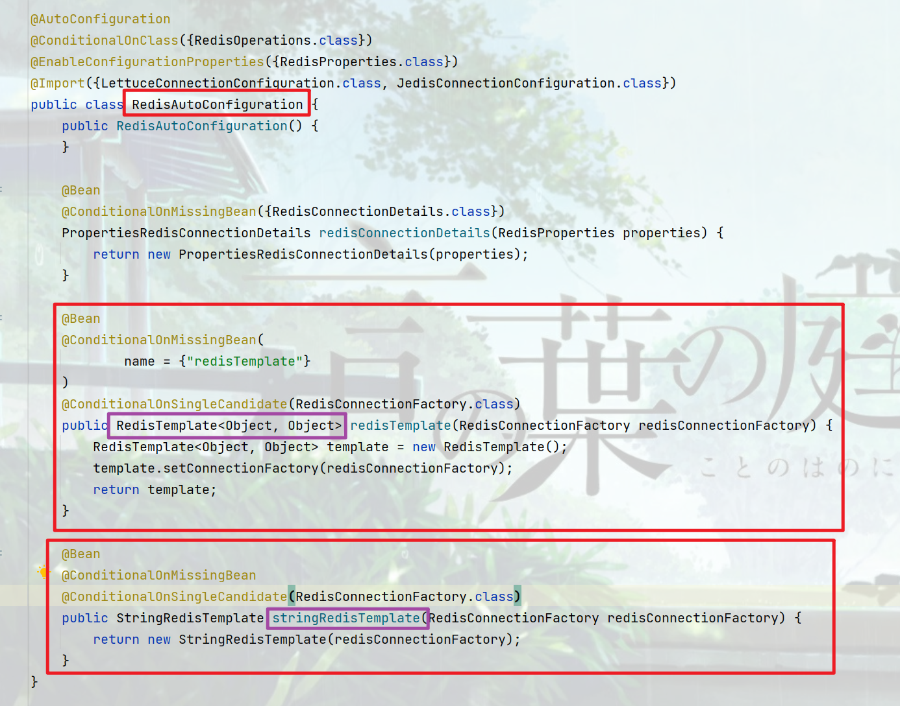
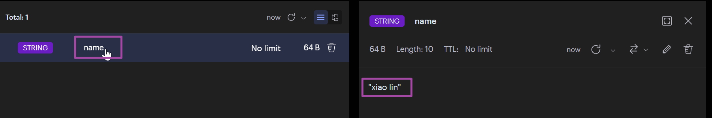

<!-- toc -->

### 前言

当前环境中, `Redis`在分布式系统重占有重要的位置, 其作用包括但不限于作缓存, 分布式锁, 分布式主键等, 本篇讲解`Spring`集成`Redis`, 将`Redis`引入到项目中使用.

### 引入

#### 引入依赖

子项目中引入依赖

```xml
<dependency>
    <groupId>org.springframework.boot</groupId>
    <artifactId>spring-boot-starter-data-redis</artifactId>
</dependency>
```

#### 添加配置

```yml
spring: 
  data:
    redis:
      host: 172.29.241.128
      port: 6379
      database: 0
```

如果没有自己注册名称为`redisTemplate`的`Bean`, 框架会在自动导入配置文件中注册一个`redisTemplate`的`Bean`和一个`stringRedisTemplate`的`Bean`



自己添加一个自定义的`RedisTemplate`

```java
@Configuration
public class RedisConfig {

    @Bean
    public RedisTemplate<String, Object> redisTemplate(RedisConnectionFactory redisConnectionFactory) {
        RedisTemplate<String, Object> template = new RedisTemplate<>();
        StringRedisSerializer keySerializer = new StringRedisSerializer();
        template.setKeySerializer(keySerializer);
        template.setHashKeySerializer(keySerializer);

        Jackson2JsonRedisSerializer<Object> valueSerializer = new Jackson2JsonRedisSerializer<>(Object.class);
        template.setValueSerializer(valueSerializer);
        template.setHashValueSerializer(valueSerializer);

        template.setDefaultSerializer(valueSerializer);

        template.setConnectionFactory(redisConnectionFactory);
        return template;
    }

}
```

添加`Redis`封装工具类

```java
@Slf4j
@Component
public class RedisUtil {

    @Autowired
    private RedisTemplate<String, Object> redisTemplate;

    public boolean expire(String key, long time) {
        try {
            if (time > 0) {
                redisTemplate.expire(key, time, TimeUnit.SECONDS);
            }
            return true;
        } catch (Exception e) {
            log.error("redis expire error:{}", e.getMessage());
            return false;
        }
    }

    public Long getExpire(String key) {
        return redisTemplate.getExpire(key, TimeUnit.SECONDS);
    }

    public boolean hasKey(String key) {
        try {
            return Boolean.TRUE.equals(redisTemplate.hasKey(key));
        } catch (Exception e) {
            log.error("redis has key error:{}", e.getMessage());
            return false;
        }
    }

    public boolean del(String key) {
        return Boolean.TRUE.equals(redisTemplate.delete(key));
    }

    public Long del(String... key) {
        return del(Arrays.asList(key));
    }

    public Long del(List<String> keys) {
        if (CollectionUtils.isEmpty(keys)) {
            return 0L;
        }
        return redisTemplate.delete(keys);
    }

    public Object get(String key) {
        return key == null ? null : redisTemplate.opsForValue().get(key);
    }

    public boolean set(String key, Object value) {
        try {
            redisTemplate.opsForValue().set(key, value);
            return true;
        } catch (Exception e) {
            log.error("redis set error:{}", e.getMessage());
            return false;
        }
    }

    public boolean set(String key, Object value, long time) {
        try {
            if (time > 0) {
                redisTemplate.opsForValue().set(key, value, time, TimeUnit.SECONDS);
            } else {
                set(key, value);
            }
            return true;
        } catch (Exception e) {
            log.error("redis set error:{}", e.getMessage());
            return false;
        }
    }
    
    public boolean setNx(String key, Object value) {
        try {
            return Boolean.TRUE.equals(redisTemplate.opsForValue().setIfAbsent(key, value));
        } catch (Exception e) {
            log.error("redis setnx error:{}", e.getMessage());
            return false;
        }
    }

    public boolean setNx(String key, Object value, long time) {
        try {
            return Boolean.TRUE.equals(redisTemplate.opsForValue().setIfAbsent(key, value, time, TimeUnit.SECONDS));
        } catch (Exception e) {
            log.error("redis setnx error:{}", e.getMessage());
            return false;
        }
    }

    public Long incr(String key, long delta) {
        if (delta <= 0) {
            throw new RuntimeException("递增因子必须大于0");
        }
        return redisTemplate.opsForValue().increment(key, delta);
    }

    public Long decr(String key, long delta) {
        if (delta <= 0) {
            throw new RuntimeException("递减因子必须大于0");
        }
        return redisTemplate.opsForValue().increment(key, -delta);
    }

    public Object hGet(String key, String item) {
        return redisTemplate.opsForHash().get(key, item);
    }

    public Map<Object, Object> hGet(String key) {
        return redisTemplate.opsForHash().entries(key);
    }

    public boolean hSet(String key, Map<String, Object> map) {
        try {
            redisTemplate.opsForHash().putAll(key, map);
            return true;
        } catch (Exception e) {
            log.error("redis hash set error:{}", e.getMessage());
            return false;
        }
    }

    public boolean hSet(String key, Map<String, Object> map, long time) {
        try {
            return hSet(key, map) && expire(key, time);
        } catch (Exception e) {
            log.error("redis hash set error:{}", e.getMessage());
            return false;
        }
    }

    public boolean hSet(String key, String item, Object value) {
        try {
            redisTemplate.opsForHash().put(key, item, value);
            return true;
        } catch (Exception e) {
            log.error("redis hash set error:{}", e.getMessage());
            return false;
        }
    }

    public boolean hSet(String key, String item, Object value, long time) {
        try {
            return hSet(key, item, value) && expire(key, time);
        } catch (Exception e) {
            log.error("redis hash set error:{}", e.getMessage());
            return false;
        }
    }

    public void hDel(String key, Object... item) {
        redisTemplate.opsForHash().delete(key, item);
    }

    public boolean hHasKey(String key, String item) {
        return redisTemplate.opsForHash().hasKey(key, item);
    }

    public double hIncr(String key, String item, double by) {
        return redisTemplate.opsForHash().increment(key, item, by);
    }

    public double hDecr(String key, String item, double by) {
        return redisTemplate.opsForHash().increment(key, item, -by);
    }

    public Set<Object> sGet(String key) {
        try {
            return redisTemplate.opsForSet().members(key);
        } catch (Exception e) {
            log.error("redis set get error:{}", e.getMessage());
            return null;
        }
    }

    public boolean sHasKey(String key, Object value) {
        try {
            return Boolean.TRUE.equals(redisTemplate.opsForSet().isMember(key, value));
        } catch (Exception e) {
            log.error("redis set has key error:{}", e.getMessage());
            return false;
        }
    }

    public Long sSet(String key, Object... values) {
        try {
            return redisTemplate.opsForSet().add(key, values);
        } catch (Exception e) {
            log.error("redis set set error:{}", e.getMessage());
            return 0L;
        }
    }

    public Long sSet(String key, long time, Object... values) {
        try {
            Long count = redisTemplate.opsForSet().add(key, values);
            expire(key, time);
            return count;
        } catch (Exception e) {
            log.error("redis set set error:{}", e.getMessage());
            return 0L;
        }
    }

    public Long sSize(String key) {
        try {
            return redisTemplate.opsForSet().size(key);
        } catch (Exception e) {
            log.error("redis set size error:{}", e.getMessage());
            return 0L;
        }
    }

    public Long sDel(String key, Object... values) {
        try {
            return redisTemplate.opsForSet().remove(key, values);
        } catch (Exception e) {
            log.error("redis expire error:{}", e.getMessage());
            return 0L;
        }
    }

    public List<Object> lGet(String key, long start, long end) {
        try {
            return redisTemplate.opsForList().range(key, start, end);
        } catch (Exception e) {
            log.error("redis expire error:{}", e.getMessage());
            return null;
        }
    }

    public Long lSize(String key) {
        try {
            return redisTemplate.opsForList().size(key);
        } catch (Exception e) {
            log.error("redis list size error:{}", e.getMessage());
            return 0L;
        }
    }

    public Object lIndex(String key, long index) {
        try {
            return redisTemplate.opsForList().index(key, index);
        } catch (Exception e) {
            log.error("redis list index error:{}", e.getMessage());
            return null;
        }
    }

    public boolean lPushAll(String key, List<Object> value) {
        try {
            redisTemplate.opsForList().leftPushAll(key, value);
            return true;
        } catch (Exception e) {
            log.error("redis list left push all error:{}", e.getMessage());
            return false;
        }
    }

    public boolean lSet(String key, Object value) {
        try {
            redisTemplate.opsForList().leftPushIfPresent(key, value);
            return true;
        } catch (Exception e) {
            log.error("redis list left set error:{}", e.getMessage());
            return false;
        }
    }

    public boolean lSet(String key, Object value, long time) {
        try {
            return lSet(key, value) && expire(key, time);
        } catch (Exception e) {
            log.error("redis list left set error:{}", e.getMessage());
            return false;
        }

    }

    public boolean lPushAll(String key, List<Object> value, long time) {
        try {
            return lPushAll(key, value) && expire(key, time);
        } catch (Exception e) {
            log.error("redis list left push all error:{}", e.getMessage());
            return false;
        }
    }

    public boolean rSet(String key, Object value) {
        try {
            redisTemplate.opsForList().rightPush(key, value);
            return true;
        } catch (Exception e) {
            log.error("redis list right push error:{}", e.getMessage());
            return false;
        }
    }

    public boolean rSet(String key, Object value, long time) {
        try {
            return rSet(key, value) && expire(key, time);
        } catch (Exception e) {
            log.error("redis list right push error:{}", e.getMessage());
            return false;
        }

    }

    public boolean rPushAll(String key, List<Object> value) {
        try {
            redisTemplate.opsForList().rightPushAll(key, value);
            return true;
        } catch (Exception e) {
            log.error("redis list right push all error:{}", e.getMessage());
            return false;
        }

    }

    public boolean rPushAll(String key, List<Object> value, long time) {
        try {
            return rPushAll(key, value) && expire(key, time);
        } catch (Exception e) {
            log.error("redis list right push all error:{}", e.getMessage());
            return false;
        }
    }

    public boolean lSetIndex(String key, long index, Object value) {
        try {
            redisTemplate.opsForList().set(key, index, value);
            return true;
        } catch (Exception e) {
            log.error("redis list set index element error:{}", e.getMessage());
            return false;
        }
    }

    public Long lDel(String key, long count, Object value) {
        try {
            return redisTemplate.opsForList().remove(key, count, value);
        } catch (Exception e) {
            log.error("redis list delete error:{}", e.getMessage());
            return 0L;
        }
    }

    public void rangeDel(String key, long start, long end) {
        try {
            redisTemplate.opsForList().trim(key, start, end);
        } catch (Exception e) {
            log.error("redis list range delete error:{}", e.getMessage());
        }
    }

}
```

#### 简单应用

```java
@Slf4j
@Service
public class DictTypeServiceImpl extends ServiceImpl<DictTypeMapper, DictTypeEntity> implements IDictTypeService {

    @Autowired
    private RedisUtil redisUtil;

    @Override
    @SentinelResource("dict-type-list")
    public List<DictTypeEntity> list(String type) {
        redisUtil.set("name", "xiao lin");
        log.info("name: {}", redisUtil.get("name"));
        return this.list();
    }

}

```




### 使用

#### 缓存

在引入`Redis`之前, 通常使用`Map`来做缓存, 引入`Redis`之后, 就可以使用`Redis`做缓存了

```java
if (Objects.isNull(redisUtil.hGet("key"))) {
    synchronized (this) {
        if (Objects.isNull(redisUtil.hGet("key"))) {
            redisUtil.hSet("key", new HashMap<>(), 10 * 60);
        }
    }
}
```

在分布式系统中, 写入时需要使用分布式锁, 大多数缓存内容的修改操作次数是远小于查询操作次数的

#### 热点数据

热点数据与缓存相似, 不同的是, 热点数据可能存在频繁地修改操作

```java
synchronized (this) {
    redisUtil.hSet("good", "count", (Integer) redisUtil.hGet("good", "count") - 1);
}
```

与缓存一样, 热点数据在分布式系统中也需要使用分布式锁

#### 分布式锁

锁和分布式锁是一个大课题, 此处仅仅是演示一个案例

```java
String value = UUID.randomUUID().toString();
// 存在则不处理, 并返回false, 不存在则添加, 并返回true
boolean key = redisUtil.setNx("dict_type_add", value, 10);
if (!key) {
    // dosomething
    return; // 或者抛出异常
}
try {
    // do something
} catch (Exception e) {
    // do something
} finally {
    String r = (String) redisUtil.get("dict_type_add");
    if (value.equalsIgnoreCase(r)) {
        redisUtil.del("dict_type_add");
    }
}
```

基于以上会发现, 分布式锁的流程大致相似, 所以可以做一个封装

```java
// 此处的Component是为了注入RedisUtil使用, 此工具类本身并不需要注册为bean
// 或者可以在RedisUtil中使用创建完成后置操作
@Slf4j
@Component
@ConditionalOnBean(name = "redisUtil")
public class DistributedLockUtil {

    private static RedisUtil REDIS_UTIL;

    @Autowired
    public void setRedisUtil(RedisUtil redisUtil) {
        REDIS_UTIL = redisUtil;
    }

    public static void lock(@NotNull String key, Object value, long time,@NotNull VoidSyncExecutor executor) {
        lock(key, value, time);
        try {
            executor.exec();
        } catch (Exception e) {
            log.info("redis lock error: ", e);
            throw e;
        } finally {
            unlock(key, value);
        }
    }

    public static void lock(@NotNull String key, long time,@NotNull VoidSyncExecutor executor) {
        String value = UUID.randomUUID().toString();
        lock(key, value, time, executor);
    }

    public static void lock(@NotNull String key,@NotNull VoidSyncExecutor executor) {
        lock(key,10, executor);
    }

    public static <R> R lock(@NotNull String key, Object value, long time,@NotNull TypeSyncExecutor<R> executor) {
        lock(key, value, time);
        try {
            return executor.exec();
        } catch (Exception e) {
            log.info("redis lock error: ", e);
            throw e;
        } finally {
            unlock(key, value);
        }
    }

    public static <R> R lock(@NotNull String key, long time,@NotNull TypeSyncExecutor<R> executor) {
        String value = UUID.randomUUID().toString();
        return lock(key, value, time, executor);
    }

    public static <R> R lock(@NotNull String key,@NotNull TypeSyncExecutor<R> executor) {
        return lock(key, 10, executor);
    }

    public static boolean lock(@NotNull String key, Object value, long time,@NotNull BooleanTypeSyncExecutor executor) {
        lock(key, value, time);
        try {
            return Boolean.TRUE.equals(executor.exec());
        } catch (Exception e) {
            log.info("redis lock error: ", e);
            throw e;
        } finally {
            unlock(key, value);
        }
    }

    public static boolean lock(@NotNull String key, long time,@NotNull BooleanTypeSyncExecutor executor) {
        String value = UUID.randomUUID().toString();
        return lock(key, value, time, executor);
    }

    public static boolean lock(@NotNull String key,@NotNull BooleanTypeSyncExecutor executor) {
        return lock(key, 10, executor);
    }

    private static void lock(@NotNull String key, Object value, long time) {
        // 需要有重试机制
        // 存在则不处理, 并返回false, 不存在则添加, 并返回true
        boolean nx = REDIS_UTIL.setNx(key, value, time);
        if (!nx) {
            // 判断是否是同一个线程加锁
            Object r = REDIS_UTIL.get(key);
            if (!(Objects.equals(value, r))) {
                throw new ServiceException(500, "系统获取不到锁");
            }
        }
    }

    private static void unlock(@NotNull String key, Object value) {
        Object r = REDIS_UTIL.get(key);
        if (Objects.equals(value, r)) {
            REDIS_UTIL.del(key);
        }
    }

    @FunctionalInterface
    public interface BooleanTypeSyncExecutor {
        Boolean exec();
    }

    @FunctionalInterface
    public interface TypeSyncExecutor<R> {
        R exec();
    }

    @FunctionalInterface
    public interface VoidSyncExecutor {
        void exec();
    }


}

```

使用

```java
public List<DictTypeEntity> list(String type) {

    DistributedLockUtil.lock("key", () -> {
        redisUtil.set("name", "xiao lin");
        log.info("name: {}", redisUtil.get("name"));
    });

    return this.list();
}
```

### 出现问题:sob:

### 挖坑

`Redis`详解