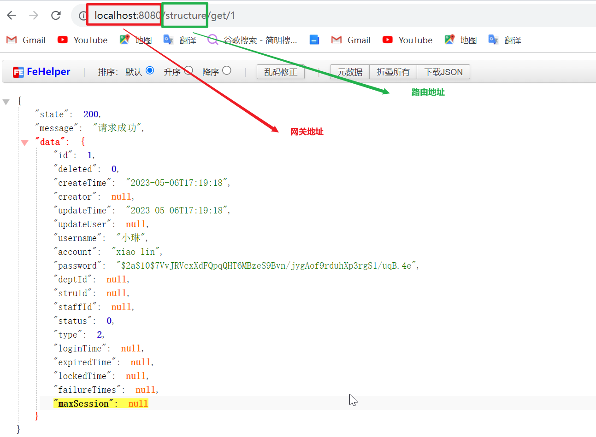
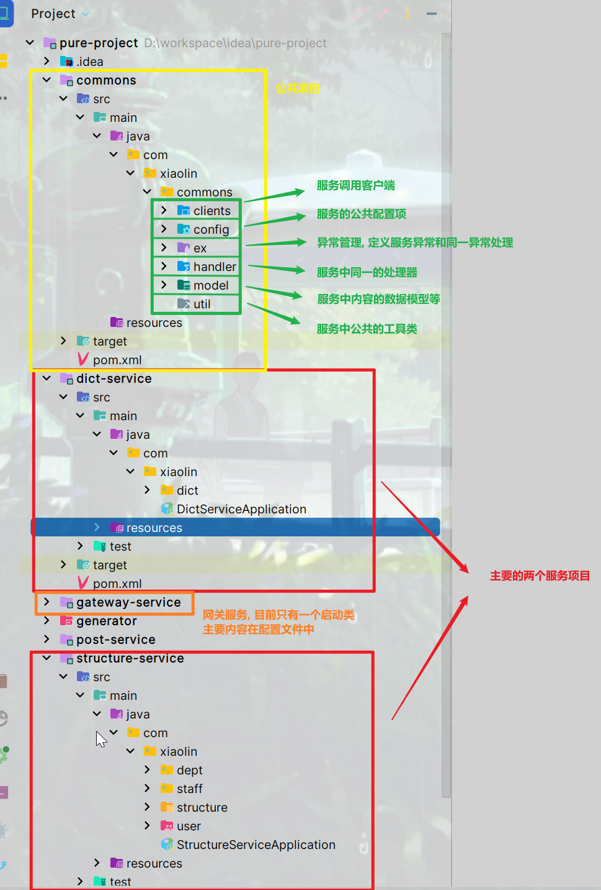

<!-- toc -->

### 前言

 为了不暴露服务器情况, 也为了实现请求的`host`统一, 添加网关作为请求的中转站, 实现请求路由.

本次项目中使用的是`SpringCloud`官方推荐的`Gateway`网关, 依然延续挖坑的思想, 本篇只介绍在项目中使用`Gateway`, 对于`Gateway`的详细使用和配置, 挖坑:sweat_smile:

### 引入网关

#### 创建网关项目

参考创建服务的文章, 创建一个网关的`SpringBoot`子项目

#### 添加依赖

网关子项目中引入依赖

```xml
<!-- 注册中心, 寻找服务 -->
<dependency>
    <groupId>org.springframework.cloud</groupId>
    <artifactId>spring-cloud-starter-zookeeper-discovery</artifactId>
</dependency>

<!-- 网关 -->
<dependency>
    <groupId>org.springframework.cloud</groupId>
    <artifactId>spring-cloud-starter-gateway</artifactId>
</dependency>
```

#### 添加配置

1. 启用注册中心

   `@EnableDiscoveryClient`启用`Zookeeper`注册中心

   ```java
   @EnableDiscoveryClient
   @SpringBootApplication
   public class GatewayServiceApplication {
       public static void main(String[] args) {
           SpringApplication.run(GatewayServiceApplication.class, args);
       }
   }
   ```

2. 配置路由

   方式一:

   使用配置文件配置

   ```yml
   server:
     port: 8080
   
   spring:
     application:
       name: gateway-service
     profiles:
       active: dev
     cloud:
       zookeeper:
         discovery:
           enabled: true
           root: /services/dev
           instance-port: 8080
           instance-host: 127.0.0.1
           instance-id: gateway-service-01
         connect-string: localhost:2181
       gateway:
         routes:
           - id: structure-service
             uri: lb://structure-service
             predicates:
               - name: Path
                 args:
                   patterns: /structure/**
   #          filters:
   #            - args:
   #              name:
           - id: dict-service
             uri: lb://dict-service
             predicates:
               - Path=/dict/**
   ```

   配置路由的`predicates`和`filters`有两种方式

   1. 使用`key=value`的格式: 这种格式有两种类型, 一种是`type=key,value`如`- Query=param,name`; 一种是`type=value`, 如`- Path=/xxx/**`, `type`即策略类型, `key`表示`args`中的`key`, `value`表示该`key`对应的值
   2. 使用`map`的格式: 这种格式要求每一个配置项都有一个名称和一个参数列表, 名称即是每一个配置项的`type`, 如`Path`, `Query`, `Header`等, 参数是一个`map`, `map`对应的`key`值是由要求的, 可以通过`XxxRoutePredicateFactory`类中`shortcutFieldOrder`方法中定义了哪些`key`来进行查看, 如`PathRoutePredicateFactory`中的`shortcutFieldOrder`方法定义了`patterns`和`matchTrailingSlash`两个`key`

   <a href="#问题二">每种格式的每一项都需要使用`-`作为一项的开始</a>

   方式二:

   使用`RouteLocator`配置

   ```java
   @Bean
   public RouteLocator routeLocator(RouteLocatorBuilder builder) {
       return builder.routes()
           .route("path_route", r -> r.path("/dict/**").uri("lb://dict-service"))
           .build();
   }
   ```

   注册一个`RouteLocator`, 在其中添加路由信息, 此方式配置的路由会覆盖配置文件中配置的相同路由, 比如上面定义的路由会覆盖配置文件中定义的`Path`类型`/dict/**`的`pattern`路由

### 使用网关

访问服务资源时, 不再直接访问该资源, 而是访问网关地址, 通过网关进行路由



### 关于项目的其他内容

此处调整了一下项目的内容, 主要是将用户部门合并为了一个结构项目



### 出现问题:sob:

<i id="问题一">问题一</i>

```err
Unable to find RoutePredicateFactory with name -Path
```

问题原因: 配置`predicates`的格式不对, `predicates`的格式是由要求的, 首字母要大写, `-`和`Path`之间要有空格(`Query`, `Header`等同理)

解决方案: 修改为正确格式

<i id="问题二">问题二</i>

```err
Property: spring.cloud.gateway.routes[0].xxx
Value: "[]"
Reason: 不能为空
```

问题原因: 一. 配置的`route`的参数名写错了, 比如`uri`写成了`url`; 二, 配置的内容的项格式错误, 比如`predicates`或者`filters`的项没有以`-`开始

解决方案: 检查名称和格式

<i id="问题三">问题三</i>

访问项目时路径正确但是出现`404`的问题

问题原因: 1. 路由配置问题, 查看路由的路径转发是否匹配; 2.服务注册问题, 可以实现转发, 要求服务都在注册在同一个注册中心的同一个目录下, 并且服务注册的`address`和`port`都对应该服务的访问`host`和`port`

```yml
server:
  port: 8080

spring:
  cloud:
    zookeeper:
      discovery:
        enabled: true
        root: /services/dev
        instance-port: 8080
        instance-host: 127.0.0.1
        instance-id: gateway-service-01
      connect-string: localhost:2181
```

如上, 该网关只能找到注册在`/services/dev`下的服务, 只有同在该目录的服务才能被该网关发现, 进而实现转发, 该网关对外展示的`address`是定义的`instance-host`对应的值, 对外展示的端口是定义的`instance-port`对应的值

<i id="问题四">问题四</i>

问题: 配置文件中配置路由正确, 但是访问时却访问不到, 既没有任何返回, 也没有报错信息

问题原因: 可能是配置`uri`时协议方式写错了, 比如`lb`写成了`bl`

解决方案: 改, 这种问题需要仔细检查路由配置, 在没有报错信息的情况下追溯可能出错的位置

### 挖坑

`Gateway`详解