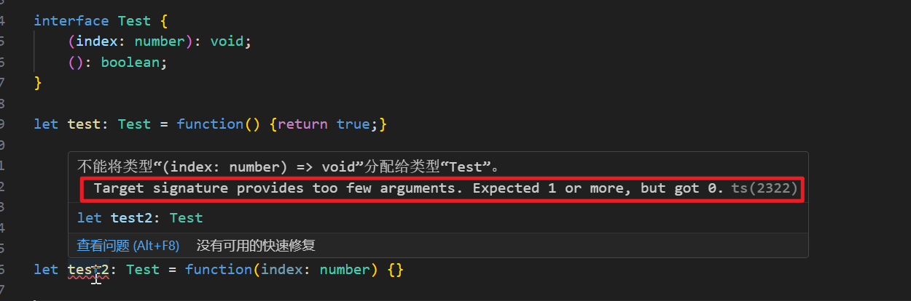

<!-- toc -->

### 前言

本系列是`Vue`前端项目的前传, 由于本人没有系统学习过`Typescript`, 所以从此处下手

本系列是一个语言学习系列, 所以质量不高, 像是流水账

本篇需要使用`node`环境运行`ts`脚本, 本人使用`pnpm`安装了`ts`

### 基础类型

#### 布尔

类型为`boolean`, 值为`true/false`

```typescript
let flag: boolean = true;
```

#### 数字

类型为`number`, 不区分整数和浮点数, 所有的数都是浮点数; 支持二进制, 八进制, 十进制, 十六进制的字面量

```typescript
let num1: number = 1;
let num2: number = 1.1;
let num3: number = 0x6666;
let num4: number = 0b1010;
let num5: number = 0o333;
```

#### 字符串

类型为`string`, 可以使用双引号(**"**)和单引号(**'**)表示; 也可以通过反引号来使用模板字符串, 并以`${expr}`的形式嵌入表达式

```typescript
let hello: string = 'hello';
let world: string = "world";
let all: string = `${hello} ${world}`; // `${hello + ' ' + world}`
```

#### 数组

定义数组有两种方式, 一种直接在元素类型后接上`[]`, 另一种是使用数组泛型`Array<元素类型>`

```typescript
let arr: string[] = ["hello", "world"];
let ar: Array<string> = ['Hello', 'World'];
```

#### 元组(`Tuple`)

允许表示一组元素数量和对应类型已经确定的数组, 各个元素的类型不必相同

```typescript
let x: [string, number] = ['hello', 10];
```

当访问一个已知索引的元素, 会得到正确的类型

```typescript
console.log(x[0].substr(1));
```

当访问一个越界的元素, 会使用联合类型替代

```typescript
x[3] = 'world'; // OK x[3]的定义类型为联合类型 string | number
```

```typescript
x[4] = true; // ERROR x[4]的定义类型为联合类型 string | number, boolean类型无法赋值
```

#### 枚举

对`js`的补充, 默认从`0`开始为元素编号

```typescript
enum Color {Red, Green, Blue}
let c: Color = Color.Red
```

上述中从首个开始, 一次编号为`0,1,2`

可以也可以通过编号获取名字

```typescript
let name: string = Color[0] // Red
```

也可以手动指定成员的值

```typescript
enum Color {Black, Red = 1, Green, Blue = 4, Yellow}
```

成员编号从`0`开始, 每遇到一个手动指定编号的成员, 会从该编号开始向后继续, 不能出现重复编号


发生编号重复时


#### `Any`

任意值, 为不清楚类型的变量指定一个类型, 此类型的变量不会进行类型检查, 而是直接通过编译阶段

```typescript
let anyArr: any[] = ['xiaolin', 18, true];
```

与`Object`类型变量的区别是, `Object`变量不能调用任意方法, 即使它真的有这些方法


从感官上来讲, `Object`是对象类型的超类, 而所有类型都是`Object`类型的子类或者包装类, `Object`只包含自定义的方法和函数, 子类定义的方法和函数无法感知到; 而`any`可以认为是无校验的`Object`类型, 它是对象类型的超类, 但不做任何类型相关校验

#### `Void`

空值, 表示没有任何类型, 函数没有返回值时, 其返回值就是`void`

`void`类型的变量只能赋值`null`和`undefined`

```typescript
let v: void = undefined;
function v(): void {
    return;
}
```

#### `Null`和`Undefined`

`null`和`undefined`都有自己的类型, 只能赋值自身

```typescript
let u: undefined = undefined
let n: null = null
```

默认情况下, `null`和`undefined`是所有类型的子类

当指定了`--strictNullChecks`标记, `null`和`undefined`只能显式的赋值给各自和`void`, 如果需要显式的将`null`和`undefined`赋值给一个类型变量, 则该变量类型可以使用联合类型

```typescript
let nil: string = null; // 编译错误
let str: string | null | undefined = null;
```

#### `Never`

表示用不存在的值的类型

如异常或不会有返回值的函数表达式或箭头函数表达式的返回值类型

变量也可以为`never`类型, 被永不为真的类型保护所约束时

`never`类型是任何类型的子类型, 也可以赋值给任何类型; 但没有类型是`never`的子类型, 除了`never`本身没有值可以赋值给`never`类型, `any`也不行

```typescript
// 返回never的函数必须存在无法达到的终点
function error(): never {
    throw new Error();
}
// 推断的返回值类型为never
function fail(): never {
    return error();
}
// 返回never的函数必须存在无法达到的终点
function infiniteLoop(): never {
    while(true) {}
}
```

#### `Object`

对象类型, 所有类型的父类型

### 类型断言

强制类型转换或者向下转型

有两种方式:

方式一: 使用尖括号

```typescript
let value: any = "this is a string";
let length: number = (<string>value).length
```

方式二: 使用`as`语法

```typescript
let value: any = "this is a string";
let length: number = (value as string).length;
```

### 解构

解构是`ES6`中的新特性, 并不是`typescript`定义的, 此处将此特性介绍是因为此特性与`typescript`配合会有不一样的火花

#### 数组解构

进行数组变量赋值时, 为数组中的元素创建变量名

```typescript
let input = [1, 2];
let [first, second] = input; // == let first = input[0]; let second = input[1];

let [first, , third] = [1, 2, 3, 4]; // 不关心其他元素

let [first, ...rest] = [1, 2, 3, 4] // 使用...创建剩余变量
// first = 1, rest = [2, 3, 4]
```

作为函数参数时

```typescript
function foo([first, second]: number[]) {
    // ...
}
foo([1, 2, 3]);
```

#### 对象解构

如果将对象视作特殊的(各个元素有名称的)数组, 则容易理解对象解构

```typescript
let obj = {
    nam: "xiaolin",
    age: 18,
    sex: "男"
}
let {nam, age} = obj;
```

同数组一样, 不需要的元素可以不声明赋值

需要注意的是, 对象解构时, 定义的变量名需要与对象中对应的属性(元素)名称一致; 可以通过属性重命名的方式来来给属性不同的名字

```typescript
let obj = {
    nam: "xiaolin",
    age: 18,
    sex: "男"
}
let {nam: personName, age}: {nam: string, age: number} = obj;
```

上述中为`nam`重命名为`personName`, 其中`{nam: personName, age}`中的`:`表示将`nam`重命名为`personName`, 其类型是通过定义`{nam: personName, age}`对象的整体类型来描述的, 在定义`{nam: personName, age}`对象的整体类型时, 重命名的变量进行类型定义时使用的名称是重命名之前的名字

对象解构中也可以使用`...`创建剩余变量

```typescript
let obj = {
    nam: "xiaolin",
    age: 18,
    sex: "男"
}
let {nam, ...person} = obj;
// nam = "xiaolin", person = {age: 18, sex: "男"}
```

当对象的某个属性为`undefined`时, 可以为该属性添加默认值

```typescript
let obj = {
    nam: "xiaolin",
    age: 18,
    sex: "男",
    des: undefined
}
let {nam, des: desc = "太帅了"}: {nam: string, des: string} = obj;
```

当`obj`的`des`有值时, `desc`为该值, 没有值时为默认的赋值

对象解构配合函数, 实现函数参数的多样化声明

```typescript
function foo({a, b}: {a: string, b?: number}) {
    // ...
}

// 整体默认值
function fooFirst({a, b} = {a: '', b: 0}) {
    // ...
}
function fooSecond({a, b = 0} = {a: '', b: undefined}) {
    // ...
}
// 部分默认值
function fooThird({a, b = 0}: {a: string, b: number}) {
    // ...
}
```

对于结构, 在便于理解时使用可以提高开发效率, 但是当出现类型注解和默认值时应小心使用, 语法和使用上都难以理解

### 展开

#### 使用

展开也是`ES6`中添加的新特性, 展开操作与解构相反, 它将一个数组展开为另一个数组, 或将一个对象展开为另一个对象

```typescript
let first = [1, 2];
let second = [3, 4];
let all = [0, ...first, ...second, 5]; // 展开操作时浅拷贝, 其内容不会被展开操作改变
```

```typescript
let obj = {
    nam: "xiaolin",
    age: 18
}
let food = "rich";
let person = {
    ...obj,
    food,
    sex: "男"
}
```

需要注意的是, 对象的展开比数组的展开要复杂. 它像数组展开一样, 使用开始元素依次处理, 结果仍然为对象, 由于对象的属性唯一, 所以展开对象后面的属性会覆盖前面的属性

```typescript
let obj = {
    nam: "xiaolin",
    age: 18,
    food: "cake"
}
let food = "rich";
let person = {
    ...obj,
    food,
    sex: "男"
} // {nam: "xiaolin", age: 18, food: "rich", sex: "男"}
```


同理在展开的对象中如果有同名的属性, 则后展开的对象的该属性会覆盖先展开的对象的该属性

#### 限制

对象的展开存在限制:

一. 仅包含对象自身的可枚举属性

1. 当展开对象实例时, 无法获取其类型的所有属性, 而是获取其实际存在的属性
2. 当展开一个对象实例时, 会丢失其方法, 即展开只会拷贝属性, 不会拷贝方法

二. `typescript`编译器不允许展开泛型函数上的类型参数

1. 这个描述是`typescript`手册上的描述, 当前不知道是已经实现还是我理解有误, 一下方式编译运行时是正常的

   ```typescript
   function fo<T>(arg: T): void {
       let o = {...arg};
   }
   fo<{nam: string, age: number}>({nam: "xiaolin", age: 18});
   ```


### 函数

`typescript`中函数也是作为一种类型的, 但是函数类型必须是有定义的函数类型, 这种定义是通过接口实现的, 后续讲接口时详细讲述

所谓必须是有定义的函数类型指的是, 所定义的函数在指明类型时, 必须声明函数的参数列表和返回值

```typescript
// 函数不指明类型 -> 推断类型
let foo = function(x: number, y: number): number {return x + y;}

// 函数指明类型
let foo: (base: number, increment: number) => number = function(x: number, y: number): number{return x + y;}

// 可选参数
let foo = (x: number, y: number, z?: number): number => x + y

// 默认参数
let foo = (x: number, y: number, z: number = 0): number => x + y + z

// 剩余参数
let foo = (x: number, y: number: ...z: number[]): number => x + y
```

1. 函数指明类型的定义中, 变量名之后, `=`之前就是类型定义, `=>`之前是参数列表定义, 之后是返回值类型定义; 此函数类型的定义像是一个匿名类型, 只要函数定义的参数列表类型和返回值类型符合类型定义的参数列表类型和返回值类型接口, 不在乎参数名称

   指明类型的定义在使用时, 使用箭头函数的方式定义函数更直观一些

   ```typescript
   let foo: (base: number, increment: number) => number = (x: number, y: number): number => x + y
   ```

   由此可以看出, 函数是一种类型, 但函数的类型只是由参数类型和返回值组成和决定

2. 推断类型有两个含义: 一. 在函数变量不指明函数类型时, 通过函数定义推断函数类型; 二. 在函数变量指明函数类型时, 函数定义的参数列表中参数类型和返回值类型通过函数类型推断得出

3. 可选参数, `typescript`的函数定义中, 可以通过`?`来指明某个参数可传可不传, 没传的时候就是`undefined`. 可选参数必须定义在函数的必传参数的后面

4. 默认参数, 为函数的参数设置一个默认值, 当用户没有传递该参数时, 可以使用默认值

   默认参数如果放在所有必传参数的后面, 则与可选参数类似, 并与可选参数共享参数类型; 默认参数如果没有放在所有必须参数的后面, 则必须明确的传入`undefined`来表示使用默认值

5. 剩余参数会被当做个数不限的可选参数, 其数量可以是`0`或者任意个, 剩余参数必须放在函数参数列表的最后

6. 函数重载, 需要注意的是, `typescript`中单独定义的函数重载时, 是只有一个函数定义, 多个函数声明, 函数声明的参数个数不能少于函数定义参数个数

   ```typescript
   function pickCard(x: {suit: string; card: number; }[]): number;
   function pickCard(x: number): {suit: string; card: number; } 
   function pickCard(x): any {
       // Check to see if we're working with an object/array
       // if so, they gave us the deck and we'll pick the card
       if (typeof x == "object") {
           let pickedCard = Math.floor(Math.random() * x.length);
           return pickedCard;
       }
       // Otherwise just let them pick the card
       else if (typeof x == "number") {
           let pickedSuit = Math.floor(x / 13);
           return { suit: suits[pickedSuit], card: x % 13 };
       }
   }
   
   let myDeck = [{ suit: "diamonds", card: 2 }, { suit: "spades", card: 10 }, { suit: "hearts", card: 4 }];
   let pickedCard1 = myDeck[pickCard(myDeck)];
   alert("card: " + pickedCard1.card + " of " + pickedCard1.suit);
   
   let pickedCard2 = pickCard(15);
   alert("card: " + pickedCard2.card + " of " + pickedCard2.suit);
   ```

   上述中只有一个函数定义, 它处理了不同的参数类型的情况, 但是函数声明有两个, 分别是`{suit: string; card: number; }`类型参数的声明和`number`类型参数的声明, 这两个声明即是函数的重载, 而`any`类型参数的函数并不是重载列表中的一部分, 而是实际的函数定义, 在调用时编译器只会检查参数类型是否符合函数声明, 而不去检查是否符合函数定义

   如果在某个函数声明上添加了额外的参数, 编译不会出现问题, 但是在调用时, 如果前面的参数符合该函数声明, 则需要将额外的参数添加上, 但是在函数定义中该额外的参数并不会被使用

7. 函数中有个非常难以理解的地方: `this`的指向问题

   在`java`中, 无论是属性还是方法, 都是在对象中定义的, 所以`this`永远指向当前属性或者方法定义的类的实例对象

   但是在`javascript`和`typescript`, 可以认为所有的内容全部是在`window`对象中定义执行的, 由于我们对此无感, 认为函数可以独立于对象之外定义, 而独立于对象之外定义的函数的`this`实际是定义在`window`对象中的, 所以其`this`指向是`window`对象

   在`js`和`ts`的函数中, 传统函数定义的`this`是指向调用方的, 而箭头函数定义的`this`是指向创建方的, 所以在函数的创建调用时, 需要仔细分析

   ```typescript
   let deck = {
       suits: ["hearts", "spades", "clubs", "diamonds"],
       // deck 对象的内部函数
       returnHearts: function() {
           // 返回一个传统定义方式的函数
           return function() {
               return this.suits[0];
           }
       }
       // deck 对象内部函数
       returnSpades: function() {
           // 返回一个箭头函数
           return () => {
               return this.suits[1];
           }
       }
   }
   
   let hearts = deck.returnHearts();	// 本质是 let hearts = function() {return this.suits[0];}
   // 传统方式定义的函数, 所以this指向调用方, 即window, 所以找不到suits
   let spades = deck.returnSpades();	// 本质是 let spades = () => {return this.suits[1];}
   // 箭头函数方式定义的函数, 所以this指向创建方, 即deck
   
   console.log(hearts());	// 运行时报错, 找不到suits
   console.log(spades());	// 正常, 返回spades
   ```

### 类

#### 基本定义

类通常用来描述一个对象, 其中可以定义属性和方法, 还需要有构造函数. 在类中, 引用任何一个类成员的时候都需要使用`this`

```typescript
class Greeter {
    greeting: string;
    constructor(message: string) {
        this.greeting = message;
    }
    greet() {
        return "Hello, " + this.greeting;
    }
}
```

#### 继承

类可以继承类, 但只能单继承

```typescript
class Animal {
    name: string
    constructor(name: string) {
        this.name = name;
    }
    move(distanceInMeters: number = 0) {
        console.log(`Animal moved ${distanceInMeters}m.`);
    }
}

class Dog extends Animal {
    constructor(name: string) {
        super(name);
    }
    bark() {
        console.log('Woof! Woof!');
    }
}
```

子类可以继承超类中的属性和方法

子类的构造函数的首行必须调用父类的构造函数

#### 访问权限

类中内容的访问权限受访问修饰符控制, 默认为`public`, 即公共的, 任意位置可使用; `private`表示私有的, 即只有本类中可以访问; `protected`为受保护的, 在本类和子类中可以访问

两个类的兼容性中, 两个类的`public`的属性只判断类型是否兼容, `private`和`protected`的属性必须保证访问修饰符相同且来自于同一处声明; 在`java`中称为向上转型

```typescript
class Animal {
    private name: string;
    constructor(theName: string) { this.name = theName; }
}

class Rhino extends Animal {
    constructor() { super("Rhino"); }
}

class Employee {
    private name: string;
    constructor(theName: string) { this.name = theName; }
}

let animal = new Animal("Goat");
let rhino = new Rhino();
let employee = new Employee("Bob");

animal = rhino;
animal = employee; // 错误: Animal 与 Employee 不兼容.
```

#### 静态

类中使用`static`修饰的属性和方法, 不需要创建类即可使用, 其所属是属于类而不是类实例

```typescript
class Grid {
    static origin = {x: 0, y: 0};
    calculateDistanceFromOrigin(point: {x: number; y: number;}) {
        let xDist = (point.x - Grid.origin.x);
        let yDist = (point.y - Grid.origin.y);
        return Math.sqrt(xDist * xDist + yDist * yDist) / this.scale;
    }
    constructor (public scale: number) { }
}

let grid1 = new Grid(1.0);  // 1x scale
let grid2 = new Grid(5.0);  // 5x scale

console.log(grid1.calculateDistanceFromOrigin({x: 10, y: 10}));
console.log(grid2.calculateDistanceFromOrigin({x: 10, y: 10}));
```

#### 抽象类

抽象类作为基类使用, 不会直接被实例化

抽象类用`abstract`关键字定义, 抽象类内部可以有`abstract`定义的抽象方法, 不需要具体的方法实现, 在派生类中实现

```typescript
abstract class Animal {
    abstract makeSound(): void;
    move(): void {
        console.log('roaming the earch...');
    }
}
```

#### 构造函数

在定义一个非抽象类时, 如果类中定义有必须存在的属性, 则必须显式的声明构造函数, 并传入对应的参数数量及类型

```typescript
class Greeter {
    greeting: string;
    constructor(message: string) {
        this.greeting = message;
    }
    greet() {
        return "Hello, " + this.greeting;
    }
}
```

### 接口

#### 接口基本定义

最后讲接口有两个原因: 一是在`typescript`中, 接口的应用最广而多, 类反而少; 二是`typescript`中的接口有比较多的特性

使用`interface`定义接口

```typescript
interface Test {
    name: string;	// 必要属性
    age: number;	// 必要属性
    sex?: string;	// 可选属性
    readonly desc: string;	// 只读属性
    [propName: string]: any;	// 字符串索引签名
}
```

1. 可选属性有两个好处: 一. 可以对可能存在的属性进行预定义; 二. 可以捕获引用了不存在的属性错误.

   ```typescript
   interface SquareConfig {
       color?: string;
       width?: number;
   }
   
   function createSquare(config: SquareConfig): { color: string; area: number } {
       let newSquare = {color: "white", area: 100};
       if (config.color) {
           // 提示错误
           // Error: Property 'clor' does not exist on type 'SquareConfig'
           // 该接口中找不到clor属性
           newSquare.color = config.clor;
       }
       if (config.width) {
           newSquare.area = config.width * config.width;
       }
       return newSquare;
   }
   
   let mySquare = createSquare({color: "black"});
   ```

2. 只读属性只能在对象刚刚创建的时候修改其值, 使用`readonly`来指定

   接口或类中都可定义只读属性, 只读数组则需要使用数组泛型得到

   ```typescript
   let arr: ReadonlyArray<T> = [1, 2, 3];
   ```

   只读数组的所有可变方法都被去掉了, 其属性不可修改, 内容不可修改, 甚至不能重新赋值给普通数组

   只读数组如果想要赋值类普通数组变量, 只能通过类型断言实现

3. 字符串索引签名表示该接口可以有任意数量的名称在该接口中未定义的其他属性. 这种方式在编译时会绕过属性名的检查, 可能会引起错误.

   绕过属性名检查的方式有:

   ```typescript
   let mySquare = createSquare({colour: "black", width: 100});	// ERROR: 'colour' not expected in type 'SquareConfig'
   ```

   - 类型断言

     ```typescript
     let mySquare = createSquare({colour: "black", width: 100} as SquareConfig);
     ```

   - 接口中添加索引签名

     ```stylus
     interface SquareConfig {
         color?: string;
         width?: number;
         [propName: string]: any;
     }
     ```

   - 将对象赋值给一个变量

     ```typescript
     let squareOptions = { colour: "red", width: 100 };
     let mySquare = createSquare(squareOptions);
     ```


#### 继承与实现

接口可以继承接口, 且支持多继承

```typescript
interface Shape {
    color: string;
}

interface Square extends Shape {
    sideLength: number;
}
```

类可以实现接口, 且支持多实现

```typescript
interface ClockConstructor {
    new (hour: number, minute: number);
}

class Clock implements ClockConstructor {
    currentTime: Date;
    constructor(h: number, m: number) { }
}
```

特殊的, 接口也可以继承类, 从而把类当做接口使用, 此继承也是单继承

```typescript
class Control {
    private state: any;
}

interface SelectableControl extends Control {
    select(): void;
}

class Button extends Control implements SelectableControl {
    select() { }
}
```

#### 其他用法

1. 函数类型

   除了描述带有属性的普通对象外，接口也可以描述函数类型

   给接口定义一个调用签名, 就像是一个只有参数列表和返回值类型的函数定义, 参数列表里的每个参数都需要名字和类型

   ```typescript
   interface SearchFunc {
     (source: string, subString: string): boolean;
   }
   ```

   函数类型定义的接口与`java`中的函数式接口相似, 但是`typescript`中的函数类型接口是没有方法名的

   ```typescript
   let mySearch: SearchFunc;
   mySearch = function(source: string, subString: string) {
     let result = source.search(subString);
     return result > -1;
   }
   ```

   函数类型的接口可以定义多个函数, 但是只能有一个匿名函数, 并非语法上不允许, 而是在创建使用时, 无法解析到多个匿名函数, 具体是哪个作为函数类型的接口定义, 我还不知道...

   

   函数的参数会逐个进行检查，要求对应位置上的参数类型是兼容的

   函数的返回值类型是通过其返回值推断出来的

2. 可索引类型

   描述那些能够“通过索引得到”的类型

   可索引类型具有一个*索引签名*，它描述了对象索引的类型，还有相应的索引返回值类型

   ```typescript
   interface StringArray {
     [index: number]: string;
   }
   
   let myArray: StringArray;
   myArray = ["Bob", "Fred"];
   
   let myStr: string = myArray[0];
   ```

   共有支持两种索引签名：字符串和数字。 可以同时使用两种类型的索引，但是数字索引的返回值必须是字符串索引返回值类型的子类型

   当使用`number`来索引时，`JavaScript`会将它转换成`string`然后再去索引对象, 即`myArray[0]`与`myArray['0']`是一致的

3. 混合类型

   在有了普通接口, 函数类型接口, 可索引类型接口等定义形式之后, 就可以实现混合类型接口

   ```typescript
   interface Counter {
       (start: number): string;
       interval: number;
       reset(): void;
   }
   
   function getCounter(): Counter {
       let counter = <Counter>function (start: number) { };
       counter.interval = 123;
       counter.reset = function () { };
       return counter;
   }
   
   let c = getCounter();
   c(10);
   c.reset();
   c.interval = 5.0;
   ```

   `getCounter()`函数中, 创建了一个`Counter`的函数接口实例, 然后又在这个实例中添加了`interval`属性和`reset`方法定义

   在使用时, 直接作为函数调用(如:`c(10)`)则实际调用`Counter`中定义的匿名函数

### 泛型

在定义接口, 类和函数时, 其中的某个属性或参数在定义时不确定具体类型, 但在使用时需要确定是哪种类型, 此时就用到泛型

```typescript
function identity<T>(arg: T): T {
    return arg;
}
```

在定义时不确定是哪种类型, 所以使用泛型, 但在运行时, 根据传入的参数, 推断出具体类型

需要注意的是, 当定义接口, 类和函数使用泛型时, 每个泛型定义在运行时只能识别为一种实际类型

定义的泛型可以通过继承接口或者类来实现约束

```typescript
interface Lengthwise {
    length: number;
}

function loggingIdentity<T extends Lengthwise>(arg: T): T {
    console.log(arg.length);  // Now we know it has a .length property, so no more error
    return arg;
}
```

