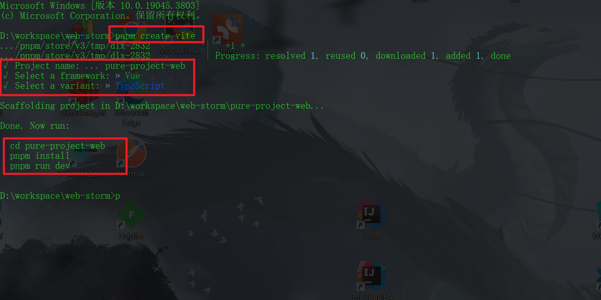
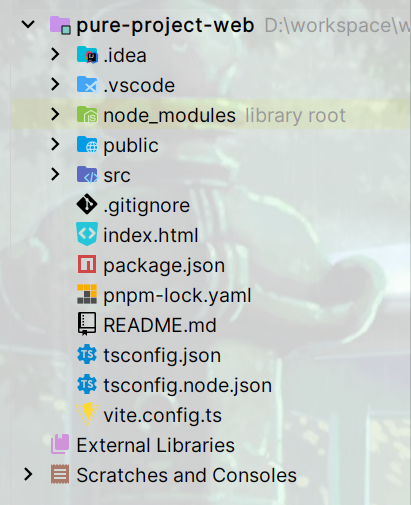

<!-- toc -->

### 前言

现在开始搭建前端项目, 其中会使用`node`, `pnpm`, `vite`, `typescript`, `vue`等

本篇默认已经安装`node`, 并配置好了`pnpm`

### 创建项目

使用`pnpm`命令创建项目

```shell
pnpm create vite
```

填写项目名称, 框架选择`Vue`, 支持选择`TypeScript`



执行相关命令, 下载依赖



### 配置

#### 依赖配置

添加`@type/node`依赖

```shell
pnpm add @type/node --save-dev
```

#### 项目配置

1. `tsconfig.json`

   添加`complierOptions.types`配置

   ```json
   "complierOptions": {
       ...,
       "types": ["vite/client", "node"]
   }
   ```

2. `vite.config.ts`

   添加项目配置

   ```typescript
   export default defineConfig({
     plugins: [vue()],
     base: './',
     // 服务配置
     server: {
       host: '0.0.0.0',
       port: 8000,
       open: true
     },
     resolve: {
       // 扩展名忽略
       extensions: ['.js', '.ts', '.vue'],
       // 别名配置
       alias: [
         {
           find: '@',
           replacement: resolve(__dirname, 'src')
         }, {
           find: '@views',
           replacement: resolve(__dirname, 'src/views')
         }, {
           find: '@components',
           replacement: resolve(__dirname, 'src/components')
         }
       ]
     },
     build: {
       outDir: './dist'
     }
   })
   ```
   
3. 环境配置

   - 配置环境导入

     ```typescript
     export default defineConfig({
       // ... 其他配置
       envDir: 'config/env',
     })
     ```

     在项目的根目录下创建`config/env`目录, 在该目录中创建环境配置文件

   - 环境文件配置

     ```env
     NODE_ENV = development
     VITE_HELLO = hello
     ```

     > 需要注意的是, 在环境配置中分为两部分, 一部分是默认的不可修改的配置, 另一部分是自定义配置
     >
     > 1. 默认配置: `BASE_URL`, `MODE`, `DEV`, `PROD`, `SSR`. 此部分是不可修改的默认配置, 跟项目启动或者构建的环境模式有关
     > 2. 自定义配置: 在`vite`中, 自定义配置必须以`VITE_`开头, 否则无法添加到环境配置中. 其中`NODE_ENV`比较特殊, 可以直接定义, 但是在环境变量中会被重命名为`VITE_USER_NODE_ENV`, 这本质上不会影响`node`的`NODE_ENV`, 如果想要修改`NODE_ENV`, 则需要在启动命令行中定义(参考: https://cn.vitejs.dev/guide/env-and-mode/#node-env-and-modes)

   - 环境配置信息使用

     1. 在项目的`vite.config.ts`配置文件中, 与`webpack`一样, 直接通过`process.env.`使用即可

     2. 在项目的资源文件中, 通过`import.meta.env.`使用

        参考文档: https://cn.vitejs.dev/guide/env-and-mode.html

### 出现问题:sob:

<i id="问题一">问题一</i>

问题: 下载`@type/node`依赖时出现`404`

问题原因: 1. 可能是镜像源导致的; 2. 可能是使用`ssl`导致的

解决方案: 1. 可以切换到官方的镜像源尝试; 2. 可以关闭`ssl`方式 `npm config set strict-ssl false`

<i id="问题二">问题二</i>

问题: 解析不到`resolver`函数和`__dirname`变量

问题原因: 没有添加`node`依赖

解决方案: 添加`@type/node`依赖, 并引入`import {resolve} from 'path'`

<i id="问题三">问题三</i>

问题: 在使用`@`别名后引入`vue`组件时, 会报错提示找不到组件

问题原因: 因为`ts`只能解析` .ts `文件，无法解析` .vue`文件

解决方案: 在`vite-env.d.ts`中添加如下代码

```typescript
// 方案一: 添加主体
declare module '*.vue' {
    import { DefineComponent } from "vue"
    const component: DefineComponent<{}, {}, any>
    export default component
}
// 方案二: 不添加主体
declare module '*.vue';
```

导入时, 添加`.vue`后缀

其实即使不添加也可以正常运行, 只是报错提示有些烦人

