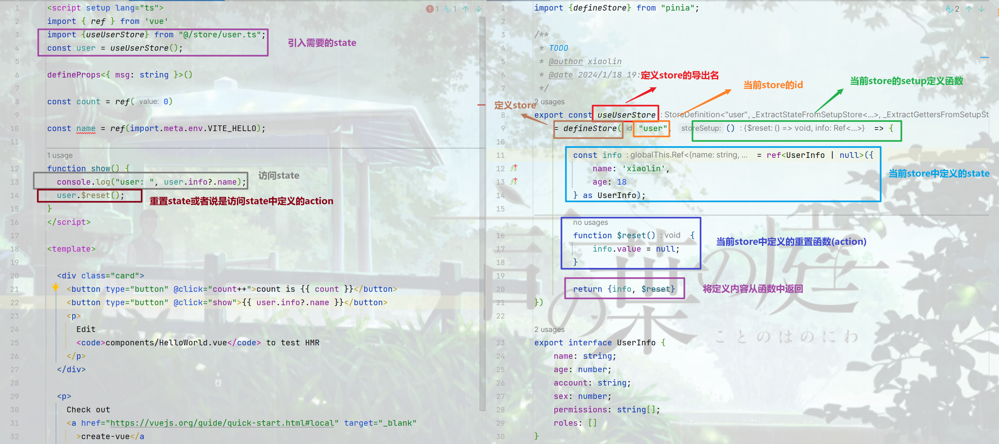
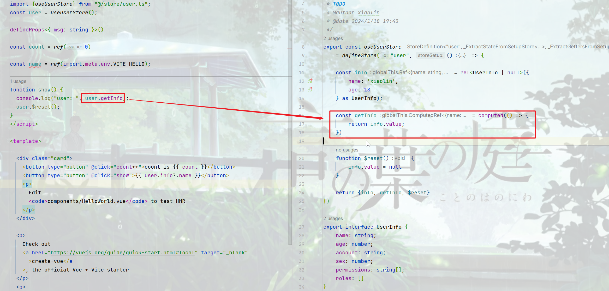
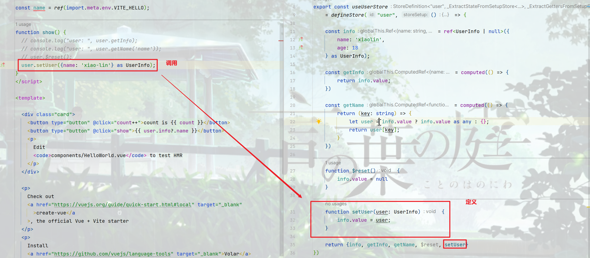

<!-- toc -->

### 前言

`Vue`项目中的状态管理库是另一种形式的会话存储, 常用了有`vuex`, `pinia`, 目前官网推荐使用`pinia`, 所以...

### 引入

#### 安装

使用`pnpm`命令安装

```bash
pnpm add pinia;
```

#### 引入

在`main.ts`中使用`pinia`函数创建一个状态管理库, 并使用`use`函数引入

```typescript
import { createApp } from 'vue'
import '@/assets/css/global.css'
import App from './App.vue'
import router from "@/router/router.ts";
import {createPinia} from "pinia";

const pinia = createPinia();

const app = createApp(App);
app.use(router);
app.use(pinia);
app.mount('#app')
```

### 使用

此处使用类组合式`API`的方式使用

首先在项目中创建一个`store`目录用于存放状态, 创建一个`user.ts`作为用户的状态管理库, 并以此为例

#### 定义状态库

所谓定义状态就是定义一个全局的内容, 组合式`API`的方式需要使用`defineStore`函数, 有两个参数, 第一个是名称, 必须保证在`store`中全局唯一, 第二个是一个`setup`函数, 再`setup`函数中定义内容

```typescript
export const useUserStore = defineStore("user", () => {
    return {}
})
```

此时就定义好了名为`user`的状态, 但是在这个状态中并没有定义其他内容

> 在`setup store`中
>
> - `ref`就是`state`属性
> - `computed()`就是`getters`
> - `function()`就是`actions`

#### 定义`state`

```typescript
export const useUserStore = defineStore("user", () => {
    const info = ref<UserInfo | null>({
        name: 'xiaolin',
        age: 18
    } as UserInfo);
    return {info}
})

export interface UserInfo {
    name: string;
    age: number;
    account: string;
    sex: number;
    permissions: string[];
    roles: []
}
```

访问

```typescript
import {useUserStore} from "@/store/user.ts";
const user = useUserStore();
function show() {
    console.log("user name: ", user.info.name);
}
```

重置

使用组合式`API`时, 需要自己创建`$reset`函数

```typescript
// store/user.ts
export const useUserStore = defineStore("user", () => {
    const info = ref<UserInfo | null>({
        name: 'xiaolin',
        age: 18
    } as UserInfo);
    
    function $reset() {
        info.value = null;
    }
    
    return {info, $reset}
})

// 组件中或组件外
import {userUserStore} from "@/store/user.ts";
const user = useUserStore();
// 重置
user.$reset();
```

注意: 

1. 使用`setup store`时, `setup`函数要像`vue`中的`setup`函数一样, 需要返回一个对象, 这样才能在组件中或者组件外访问到
2. 选项式`API`方式定义的`state`不需要手动创建`$reset`函数



<a href="#问题一">重置时出错</a>

#### 定义`getters`

`setup store`中的`getter`是通过`computed`定义的

```typescript
export const useUserStore
    = defineStore("user", () => {

    const info = ref<UserInfo | null>({
        name: 'xiaolin',
        age: 18
    } as UserInfo);

    const getInfo = computed(() => {
        return info.value;
    })

    return {info, getInfo}
})
```

访问

与访问`state`的属性一致, 直接调用即可, 需要注意的是, `getter`或者说计算属性的定义方式是函数式, 但是访问时是不需要使用"()"的; `computed`在定义时就已经确定了返回的内容, 它是通过定义的回调函数确定的

```typescript
import {useUserStore} from "@/store/user.ts";
const user = useUserStore();

function show() {
  console.log("user: ", user.getInfo);
}
```



需要注意的是, `getter`本身是不接收参数的, 但是由于`getter`是自定义的, 所以可以通过`getter`返回一个函数, 通过函数接收参数, 执行操作, 其调用方式即可类似函数调用

```typescript
// store/user.ts
export const useUserStore
    = defineStore("user", () => {

    const info = ref<UserInfo | null>({
        name: 'xiaolin',
        age: 18
    } as UserInfo);

    const getInfo = computed(() => {
        return (key) => info.value[key];
    })

    return {info, getInfo}
})

// 组件中或组件外
import {useUserStore} from "@/store/user.ts";
const user = useUserStore();

function show() {
    const name = user.getInfo('name');
}
```

#### 定义`action`

`setup store`中的`action`是通过`function`定义的

定义

定义方式与函数定义方式一致

```typescript
// store/user.ts
export const useUserStore
    = defineStore("user", () => {

    const info = ref<UserInfo | null>(null);

    function setUser(user: UserInfo) {
        info.value = user;
    }

    return {info, setUser}
})
```

访问

访问时与调用函数一致, 有参数时添加参数

```typescript
// 组件中或组件外
function show() {
  user.setUser({} as UserInfo);
}
```



订阅`action`

可以通过`store.$onAction()`来监听`action`和它们的结果, 传递给它们的回调函数会在`action`本身之前执行. `after`表示在`promise`解决之后,允许在`action`解决之后执行一个回调函数. `onError`允许在`action`抛出错误或者`reject`时执行一个回调

```typescript
const actionListener = userStore.$onAction(
	({name, store, arges, after, onError}) => {
        const time = Date.now();
        console.log(`start action [${name}] with params [${args.join(', ')}].`);
        
        after((result) => {
            console.log(`finish action [${name}] after ${Date.now() - time}ms.\nresult: ${result}`)
        });
        
        onError((err) => [
            console.warn(`failed action [${name}] after ${Date.now() - time}ms.\nerror: ${err}`)
        ])
    }
)
```

上述监听器的中

- `name`: 监听的`action`名称
- `store`: 监听的`action`所在的状态库
- `agres`: 监听的`action`调用时的参数
- `after`: 监听的`action`成功调用后的后置处理
- `onError`: 监听的`action`异常或者拒绝情况的后置处理

默认情况下, `action`订阅器会被绑定到添加的组件上, 当组件被卸载时, 将被自动删除. 如果想在组件卸载后依旧保留, 可以在定义时添加第二个参数, 值为`true`

```typescript
const listener = store.$onAction(callback, true);
```

### 项目使用

到此处, 可以先添加两处`store`的使用, 信息从最初始信息开始, 项目开发过程中不断完善信息

#### 状态库

一处是`menu`, 用于存储菜单和路由信息

```typescript
/**
 * TODO
 * @author xiaolin
 * @date 2024/1/23 18:58
 */
import {defineStore} from "pinia";
import {RouteModel} from "@/router/model.ts";
import {addRouters, currentRoute, to} from "@/router/router.ts";
import {RouteNameEnum, RoutePathEnum} from "@/assets/ts/enums/RouteEnum.ts";
import {useUserStore} from "@/store/user.ts";
import {UserInfo} from "@/assets/ts/model/system/UserInfo.ts";

export const useMenuStore = defineStore("menu", () => {
    const menus = ref<RouteModel[]>([] as RouteModel[]);

    const menuList = ref<RouteModel[]>([] as RouteModel[]);

    const activeMenu = ref<RouteModel>();

    const includeMenu = ref<RouteModel[]>([]);
    // 获取菜单
    const getMenus = computed(() => {
        return menus.value;
    })
    // 获取菜单路由
    const getRoutes = computed(() => {
        return menuList.value;
    })
    // 获取某个菜单路由
    const getRoute = computed(() => {
        return (path: string) => menuList.value.find(item => path === item.path) || RouteModel.generateModel({});
    })
    // 获取当前活跃菜单
    const getActive = computed(() => {
        return activeMenu.value;
    })
    // 获取打开的标签
    const getIncludeMenu = computed(() => {
        return includeMenu.value;
    })
    // 设置菜单
    const setMenu = (menu: RouteModel[]) => {
        menus.value = menu;
        menuList.value = RouteModel.getRoutes(menu);
    }
    // 设置当前活跃菜单
    const setActive = (menu: RouteModel | undefined) => {
        activeMenu.value = menu;
    }
    // 添加打开的标签
    const addIncludeMenu = async (menu: RouteModel) => {
        if (includeMenu.value.length < 1 && menu.path !== RoutePathEnum.HOME) {
            let first = getRoute.value(RoutePathEnum.HOME);
            includeMenu.value.push(first);
        }
        let tag = includeMenu.value.find(item => item.same(menu));
        if (!tag) {
            includeMenu.value.push(menu);
            setActive(menu);
            await to(menu);
        }
    }
    // 移除已打开的标签
    const removeIncludeMenu = async (menu: RouteModel) => {
        let menus = includeMenu.value;
        if (menus.length <= 1) {
            return;
        }
        let index = menus.indexOf(menu);
        if (index > 0) {
            includeMenu.value = includeMenu.value.filter(item => !item.same(menu));
            let next = includeMenu.value[--index];
            setActive(next);
            await to(next);
        }
    }
    // 是否需要初始化
    const needInit = () => {
        return menus.value.length < 1;
    }
    // 初始化菜单
    const initMenu = async (path?: string, isLogin: boolean = false) => {
        if (!isLogin && !needInit()) {
            return true;
        }
        const userStore = useUserStore();
        let user: UserInfo = userStore.getUser;
        // TODO 请求菜单
        let result = {account: user.account, code: true, data: []};
        if (!result.code) {
            return false;
        }
        const ms = [
            {
                id: 5,
                name: '详情',
                children: [],
                path: '/about',
                component: '@/components/HelloWorld.vue',
                type: 1
            }
        ];
        const menu: RouteModel[] = ms.map((item: any) => {
            return RouteModel.generateModel(item);
        });
        menu.unshift(RouteModel.HOME)
        addRouters(menu, RouteNameEnum.INDEX);
        setMenu(menu);
        let next: string = path || currentRoute().path as string || RoutePathEnum.HOME
        next = '/' === next ? RoutePathEnum.HOME : next;
        const route: RouteModel = getRoute.value(next);
        // setActive(route);
        await addIncludeMenu(route);
        // await to(route).then(() => {
        // })
        return true;
    }
    // 清空菜单
    const clearMenu = function (): boolean {
        setMenu([])
        includeMenu.value = [];
        setActive(undefined);
        return true;
    }

    return {getRoutes, getRoute, getMenus, getActive, getIncludeMenu,
        setMenu, setActive, addIncludeMenu, removeIncludeMenu, needInit, initMenu, clearMenu}
})
```

一处是`user`, 用于存储用户信息

```typescript
import {defineStore} from "pinia";
import {useMenuStore} from "@/store/menu.ts";
import {currentRoute} from "@/router/router.ts";
import {UserInfo, selectUser, saveUser, UserKey} from "@/assets/ts/model/system/UserInfo.ts";
import {RoutePathEnum} from "@/assets/ts/enums/RouteEnum.ts";

/**
 * TODO
 * @author xiaolin
 * @date 2024/1/18 19:43
 */
export const useUserStore = defineStore("user", () => {

    const user = ref<UserInfo>(selectUser());

    // 是否登录
    const isLogin = computed(() => {
        return !!(getToken.value);
    })
    // 获取用户嘻嘻
    const getUser = computed(() => {
        if (!user.value || !user.value.token) {
            user.value = selectUser();
        }
        return user.value;
    })
    // 获取用于token
    const getToken = computed(() => {
        return getUser.value.token;
    })
    // 获取用户
    const getUserInfo = computed(() => {
        return (key: UserKey) => {
            let info: UserInfo = getUser.value ? getUser.value as UserInfo : {} as UserInfo;
            return info[key];
        }
    })
    // 重置用户
    function $reset(): void {
        setUser(new UserInfo());
    }
    // 设置用户
    function setUser(userInfo: UserInfo): void {
        user.value = userInfo;
        saveUser(userInfo);
    }
    // 设置token
    function setToken(tokenInfo: string): void {
        let userInfo: UserInfo = getUser.value
        userInfo.token = tokenInfo;
        saveUser(userInfo);
    }
	// 登录
    async function login(): Promise<void> {
        console.log("login")
        // 登录
        await Promise.resolve();
        let user: UserInfo = new UserInfo();
        user.name = "xiao lin"
        user.sex = 1;
        user.age = 18;
        user.account = 'xiao-lin'
        user.token = 'xiao-lin'
        setUser(user);
        // 初始化用户信息
        const menuStore = useMenuStore();
        // 初始化菜单
        let next: string = currentRoute().query.toNext as string || RoutePathEnum.HOME
        next = '/' === next ? RoutePathEnum.HOME : next;
        await menuStore.initMenu(next, true);
        // const route: RouteModel = menuStore.getRoute(next);
        // menuStore.setActive(route);
        // menuStore.addIncludeMenu(route);
    }
	// 退出
    async function logout(): Promise<void> {
        console.log("logout");
        await Promise.resolve();
        let user: UserInfo = new UserInfo();
        setUser(user);
    }

    return {getUser, isLogin, getUserInfo, getToken, $reset, setUser, setToken, login, logout}
})
```

#### 路由

```typescript
/**
 * TODO
 * @author xiaolin
 * @date 2024/1/7 16:20
 */
import {createRouter, createWebHashHistory, Router, RouteRecordRaw} from "vue-router";
import {RouteModel} from "@/router/model.ts";
import {useUserStore} from "@/store/user.ts";
import {useMenuStore} from "@/store/menu.ts";
import {RouteNameEnum, RoutePathEnum} from "@/assets/ts/enums/RouteEnum.ts";

// 路由
export const routes: Readonly<RouteRecordRaw[]> = [
    {
        path: RoutePathEnum.INDEX,
        name: RouteNameEnum.INDEX,
        component: () => import('@/views/system/container/Container.vue'),
        children: []
    },
    {
        path: '/',
        redirect: RoutePathEnum.HOME
    },
    {
        path: RoutePathEnum.LOGIN,
        name: RouteNameEnum.LOGIN,
        component: () => import('@/views/system/login/Login.vue'),
    }
]

// 创建路由
const router: Router = createRouter({
    history: createWebHashHistory(),
    routes
});

// 路由前置守卫
router.beforeEach(async (to, from, next) => {
    console.trace("router before guide: ", from, to);
    const userStore = useUserStore();
    const menuStore = useMenuStore();
    // 如果是登录页, 则直接跳转
    if (to.path === RoutePathEnum.LOGIN) {
        next();
    } else if (!userStore.isLogin) {    // 未登录则直接到登录页
        next({path: RoutePathEnum.LOGIN, name: RouteNameEnum.LOGIN, query: {toNext: to.path}})
    } else {
        // 如果需要初始化菜单
        if (menuStore.needInit()) {
            // 初始化菜单, 初始完之后
            if (await menuStore.initMenu(to.path)) {
                next({...to, replace: true});
            } else {
                next({path: RoutePathEnum.LOGIN, name: RouteNameEnum.LOGIN, query: {toNext: to.path}})
            }
        } else {
            next();
        }
    }
});

export default router;

// 添加路由
export function addRouters(routes: RouteModel[], parentName?: string): void {
    console.trace("router add routers: ", parentName, routes);
    if (!routes || routes.length <= 0) {
        return;
    }
    routes.forEach(route => {
        if (parentName) {
            router.addRoute(parentName, route);
        } else {
            router.addRoute(route)
        }
        if (route.children && route.children.length) {
            addRouters(route.children, route.name);
        }
    })
}

// 路由跳转
export async function to(to: RouteModel) {
    console.trace("router to: ", to);
    return router.push(to).then(r => {
        return r;
    });
}

// 获取当前路由
export function currentRoute() {
    let route = router.currentRoute.value;
    console.trace("router current route: ", route);
    return route;
}
```

#### 登录组件

登录组件中添加登录操作, 调用用户状态库中的登录函数

```typescript
async function operation(type: any) {
  if(!userInfo.value.username) {
    ElMessage.warning("用户名不能为空!");
    return;
  }
  if(!userInfo.value.password) {
    ElMessage.warning("密码不能为空!");
    return;
  }
  if(1 === type.type) {
    await login();
  } else if(2 === type.type) {
    register();
  }
}

async function login() {
  let info = {
    username: userInfo.value.username,
    password: userInfo.value.password
  }
  await userStore.login();
  // store.dispatch('Login', info).then(res => {
  //   console.log(res)
  // })
}
```

上述为演示代码, 具体需要操作可根据自己的需要处理

#### 菜单组件

```typescript
const menuStore = useMenuStore();
const menus = ref<RouteModel[]>([]);
const active = ref<string | undefined>(undefined);
// 获取菜单和当前路由路径
onMounted(() => {
  menus.value = menuStore.getMenus
  active.value = router.currentRoute.value.path;
})
// 监听路由路径, 修改活跃菜单
watch(
    () => router.currentRoute.value.path,
    (newVal, oldVal) => {
      active.value = newVal;
    })
// 菜单点击事件, 添加到打开菜单, 并设置新的活跃菜单
async function menuClick(menu: RouteModel) {
  await menuStore.addIncludeMenu(menu);
}
```

菜单组件中做三件事: 1. 获取初始化后的菜单和活跃菜单; 2. 监听路由; 3, 菜单点击事件. 前两件事是为了获取活跃菜单, 回显菜单的样式; 菜单点击是为了切换路由

#### 标签组件

```typescript
const menuStore = useMenuStore();

const router = useRouter();
// 当前活跃标签
let checkedName = ref<string | undefined>();
// 打开的菜单标签
let dynamicTags = ref<RouteModel[]>([]);
// 初始化打开的菜单标签和活跃标签
onMounted(() => {
  dynamicTags.value = menuStore.getIncludeMenu;
  checkedName.value = menuStore.getActive?.name;
})
// 监听路由, 添加新标签
watch(
    () => router.currentRoute.value.path,
    async (newVal, oldVal) => {
      console.log("route change", newVal)
      await addTag(newVal)
    })
// 标签关闭操作
async function handleClose(name: string) {
  let remove = dynamicTags.value.find(item => item.name === name);
  await menuStore.removeIncludeMenu(remove as RouteModel);
  dynamicTags.value = menuStore.getIncludeMenu;
  checkedName.value = menuStore.getActive?.name;
}
// 标签点击操作
async function onClick(tag: any, ev?: any) {
  console.log("tag: ", tag.index);
  checkedName.value = tag.paneName;
  await to(dynamicTags.value[tag.index] as RouteModel)
}
// 添加新标签
async function addTag(newValue: string) {
  let route = menuStore.getRoute(newValue);
  if (!route) {
    return;
  }
  await menuStore.addIncludeMenu(route);
  menuStore.setActive(route);
  checkedName.value = menuStore.getActive?.name;
}
```

标签组件主要做三件事: 1. 打开标签和活跃标签的初始化; 2. 监听路由; 3. 标签关闭操作; 4. 标签点击操作. 前两件是为了显示标签列表和活跃标签样式; 第3件是为了关闭标签, 并获取跳转到最新标签和路由; 第4件事为了切换标签和路由

### 出现问题:sob:

<i id="问题一">问题一</i>

出现问题:

```err
Store "user" is built using the setup syntax and does not implement $reset()
```

问题原因:

原因一: 在使用组合式`API`时, 需要自定义`$reset`函数, 如果没有自定义, 则调用时会出现此问题

原因二: 如果定义了`$reset`函数后依然出现此问题, 可能是缓存导致的

解决方案:

方案一: 在目标`store`中定义`$reset`函数

方案二: 清空缓存并刷新浏览器


