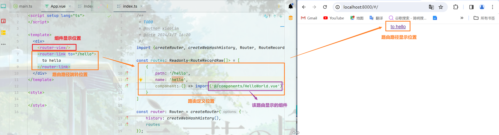

<!-- toc -->

### 前言

`vue-router`是`vue`官方推荐的前端路由. 由于本篇的路由会实际引入项目中使用, 所以本篇中的路由不仅仅是路由, 还是菜单和页面标签. 在使用时会重新定义路由的使用

### 安装

本篇基于前篇, 使用`pnpm`方式安装

```bash
pnpm add vue-router@4
```

### 创建

在项目中创建一个`router`目录, 在`router`目录下创建`index.ts`

在`index.ts`中创建一个路由

```typescript
import {createRouter, createWebHashHistory, Router, RouteRecordRaw} from "vue-router";

const routes: Readonly<RouteRecordRaw[]> = [

]
const router: Router = createRouter({
    history: createWebHashHistory(),
    routes
});
export default router;
```

### 引入

在`main.ts`中导入创建的路由, 并通过`use`函数引入

```typescript
import { createApp } from 'vue'
import App from './App.vue'
import router from "@/router";

const app = createApp(App);
app.use(router);
app.mount('#app')
```

### 简单使用

1. 使用`router-view`来展示内容

   在`App.vue`中添加`router-view`

   ```vue
   <script setup lang="ts">
   </script>
   
   <template>
     <div>
       <router-view />
     </div>
   </template>
   
   <style>
   </style>
   ```

   `App.vue`中实际上其他事情都可以不做, 但也可以处理部分内容, 如定义部分根样式

2. 使用`router-link`来切换路由

   ```vue
   <router-link to="/hello">to hello</router-link>
   ```

   通常使用编程式导航代替

   ```typescript
   router.push({path: `/hello`});
   router.replace({path: `hello`});
   router.go(1/-1/1000)
   ```

   

3. 在`routes`中添加路由

   ```typescript
   const routes: Readonly<RouteRecordRaw[]> = [
       {
           path: '/hello',
           name: 'hello',
           component: () => import('@/components/HelloWorld.vue')
       }
   ]
   ```

4. 展示

   

5. 其他

   在实际使用中, 路由路径的定义位置通常不是使用`router-link`, 而是使用组件来实现, 路由路径的定义位置和方式不重要, 重要的是定义路由路径和组件映射, 以及如何跳转到该路由路径上

### 菜单和路由

本篇中使用`element`作为项目的开发组件库, 所以此处需要添加`element`, 然后使用`element`中的`menu`组件实现菜单和路由的控制

采用官方推荐的按需导入的方式

```bash
pnpm add element-plus --save
pnpm add unplugin-vue-components unplugin-auto-import --save-dev
```

修改`vite.config.ts`

```typescript
import {ElementPlusResolver} from "unplugin-vue-components/resolvers";
import AutoImport from 'unplugin-auto-import/vite'
import Components from 'unplugin-vue-components/vite'

export default defineConfig({
    plugins: [
        vue(),
        AutoImport({
            resolvers: [ElementPlusResolver()]
        }),
        Components({
            resolvers: [ElementPlusResolver()],
        }),
    ]
})
```

需要注意的是`AutoImport`和`Components`可能无法解析到, 需要手动添加导入

1. 添加一个`login`路由

   ```typescript
   {
       path: '/login',
       name: 'login',
       component: () => import('@/views/system/login/Index.vue')
   }
   ```

   在`/src/views/system/login`下创建`Index.vue`文件

   网上随便扒拉一个登录页面添加到`Index.vue`中

   启动项目后, 输入`#/login`跳转路由

   

2. 项目布局和首页

   添加一个首页路由

   扒拉一个项目布局

   左侧添加菜单

   

   路由设置:

   1. `App.vue`中有一个`router-view`标签, 用来路由网站首页和登录页
   2. `Show.vue`中有一个`router-view`用来路由网站内容页
   3. 路由配置
      - 顶级路由有两个: 内容根路由和登录页路由
      - 内容路由: 内容路由作为内容根路由的子路由
      - 项目初始时的路由: 三个, 分别是两个顶级路由和一个内容根路由下的首页路由
      - 菜单和内容: 菜单所对应的路由从服务端获取, 依次添加到根路由中

### 高级使用

#### 多个`router-view`

通常一个项目中会存在多个`router-view`标签, 不同的方式会有不同的展示结果

1. 同一个组件中有多个`router-view`

   即多视图

   要求:

   - 不同的`router-view`需要添加不同的`name`属性
   - 需要使用该组件展示的路由, 对应的`components`中的每个`component`的`key`必须与`router-view`中的`name`对应

   这种是通过路由的多组件表达的, 组件的`key`需要与对应的`router-view`的`name`一致

   多`router-view`组件定义:

   ```vue
   <template>
   	<router-view name="left" />
   	<router-view name="right" />
   </template>
   ```

   多`router-view`的路由定义:

   ```typescript
   const routes = [
       {
           path: '/',
           components: {
               left: () => import('@/views/**/Left.vue'),
               right: () => import('@/views/**/Right.vue')
           }
       }
   ]
   ```

   展示描述:

   当路由到`path`为`/`的地址时, `Left.vue`和`Right.vue`将分别在`left`和`right`中显示

2. 在有父子级关系的组件中有多个`router-view`

   即**嵌套路由**

   这种是通过路由的父子级关系表达的, 每更深一层的`router-view`都对应路由定义中更深一层的`children`

   层级`router-view`组件定义:

   ```vue
   <template>
   	<h3>
           HOME
       </h3>
   	<router-view />
   </template>
   ```

   ```vue
   <template>
   	<h3>
           CONTENT
       </h3>
   	<router-view />
   </template>
   ```

   ```vue
   <template>
   	<h3>
           SO COOL
       </h3>
   </template>
   ```

   上述两个组件中分别有一个`router-view`, 现在想要在`HOME`的`router-view`中展示`CONTENT`, `CONTENT`的`router-view`中展示`SO COOL`

   层级路由定义:

   ```typescript
   const routes = [
       {
           path: '/content',
           component: () => import('@/views/**/Content.vue')
           children: [
               {
                   path: '/so-cool',
                   component: () => import('@/views/**/SoCool.vue')
               }
           ]
       }
   ]
   ```

   展示描述:

   当路由到`path`为`/content`的地址时, 将展示`Content.vue`组件, 当路由到`path`为`/content/so-cool`的地址时, 将展示`SoCool.vue`组件

#### 动态路由匹配与动态路由

首先动态路由匹配和动态路由不是同一个概念, 动态路由匹配是一种路由的匹配规则, 动态路由是指可以动态的添加删除路由

动态路由匹配: 

指将路由中的参数定义在路由路径中, 路由在解析时会将该参数以`name:value`的形式放到`parmas`中, 格式通过`:name`的方式体现, 如下

```typescript
const routes = [
    {
        path: '/user/:id',
        // ...
    }
]
```

这个路由会匹配具有两级, 并且以`user`开始的路径, 如:``/user/1`,`/user/xiaolin`, 它不会区分参数的类型等信息, 解析完成后会在`params`中有`id:1`或者`id:xiaolin`的内容:

```typescript
{
    path: '/user/1',
        params: {
            id: 1
        }
}
```

> 注意: 
>
> 当使用路由匹配, 其中参数发生变化时, 相同的组件实例会被复用, 即不会由于参数值的变化而重新销毁再创建, 这表示组件的声明周期钩子函数不会被调用
>
> 解决方式:
>
> 1. 在组件中使用`watch`监听路由参数变化
>
>    ```typescript
>    watch(
>    	() => router.currentRoute.value.params,
>        (newVal, oldVal) => {
>        // ...
>        }
>    )
>    ```
>
> 2. 在组件中使用导航守卫监听路由参数变化
>
>    ```typescript
>    async beforeRouteUpdate(to, from, next) {
>        // to.params
>    }
>    ```
>
> ```vue
> <script setup>
>     import { useRouter,onBeforeRouteUpdate } from 'vue-router';
>     const router = useRouter();
>     watch(
>         () => router.currentRoute.value.params,
>         (newVal, oldVal) => {
>             // ...
>         }
>     );
>     onBeforeRouteUpdate(to, from, next) {
>         // to.params
>     }
> </script>
> <template>
> <!-- ... -->
> </template>
> <style>
> </style>
> ```

1. 参数形式匹配正则

   在参数后紧跟`()`, 在`()`内定义参数正则

   ```json
   {
       path: '/user/:id',
       // ...
   },
   {
       path: '/user/:name',
       // ...
   }
   ```

   由于路由匹配时, 实际是不知道参数的, 所以上述两个路由匹配时只是参数的`key`不一致, 但内容无限制, 所以会冲突

   ```json
   {
       path: '/user/:id(\\d+)',
       // ...
   },
   {
       path: '/user/:name',
       // ...
   }
   ```

   现在将第一个路由添加正则匹配, 则该路由仅匹配参数值为数字的路径, 而其他类型的参数将被第二个路由匹配

2. 可重复参数匹配

   可以认为是参数个数正则匹配

   在参数后面紧跟`*`(>=0个参数)或者`+`(>=1个参数), 有参数形式正则匹配时, 跟在参数形式正则匹配之后

   ```json
   {
       path: '/user/:name+',
       // ...
   },
   {
       path: '/user/:name*',
       // ...
   }
   ```

   路由解析时会将可重复的参数在`params`中解析为一个数组, `key`为定义的参数名

   ```json
   {
       path: '/user/:name',
       params: {
           name: []
       }
   }
   ```

   该路由即可匹配`/user/1/2/3/...`, 需要注意的是`*`是可以匹配0个参数的, 但`+`不可以, 这是正则匹配

3. 可选参数匹配

   可以使用`?`标记一个参数为可选

   ```json
   {
       path: '/user/:id?'
   }
   ```

   这表示参数的个数只能是0或1, 配合参数正则匹配

   ```json
   {
       path: '/user:id(\\d+)?'
   }
   ```

#### 导航守卫

用来通过跳转或取消的方式守卫导航, 织入方式: 全局的, 单个路由独享的, 组件级别的

1. 全局

   - 前置守卫

     `beforeEach`

     两个参数`(to, from)`: 返回`boolean`, `true`时通过, `false`不通过

     三个参数`(to, from, next)`: 返回`void`, 调用`next`回调才会跳转到`to`路由, 如果`next`回调函数在调用时添加了新路由作为参数, 则会跳转到新路由

     ```typescript
     router.beforeEach(async (to, from, next) => {
         if(!isAuthenticated() && to.name !== 'Login') {
             next({path: '/login', name: 'Login', query: {
                 to
             }});
         } else {
             next();
         }
     })
     ```

   - 解析守卫

     `beforeResolve`

     解析守卫刚好会在导航被确认之前, 所有组件内守卫和异步路由组件被解析之后调用

     一个参数`(to)`: 返回`boolean | void`, `false`时取消导航

     ```typescript
     router.beforeResole(async to => {
         if(to.meta.requiresCamera) {
             try {
                 //...
             } catch(err) {
                 if(err instanceof NotAllowedError) {
                    returen false
                 } else {
                     throw err
                 }
             }
         }
     })
     ```

     上述是一个确保用户可以访问自定义的`meta`属性`requiresCamera`的例子

   - 后置钩子

     `afterEach`

     后置称为钩子, 和守卫不同, 这些钩子不会接受`next`函数, 也不会改变导航本身. 可以用来处理导航故障

     ```typescript
     router.afterEach((to, from, failure) => {
         // ...
     })
     ```

   - 守卫内的全局注册

     在导航守卫内使用`inject`方法获取全局内容. 在`app.provede`中提供的所有内容都可以在`beforeEach`, `beforeResolve`, `afterEach`内获取到

     ```typescript
     // main.ts
     const app = createApp(App);
     app.provide('global', 'Hello Injections');
     
     // router.ts
     router.beforeEach((to, from) => {
         const global = inject('global');
         
         const userStore = userAuthStore();
     })
     ```

2. 路由独享守卫

   `beforeEnter`

   路由独享守卫只在进入路由时触发, 不会再`params`, `query`或`hash`改变时触发

   ```typescript
   const routes = [
       {
           path: '/user/:id',
           component: User,
           beforeEnter: (to, from) => {
               // ...
               return false;
           }
       }
   ]
   ```

   `beforeEnter`也可以是函数数组

   ```typescript
   function foo1(to) {
       //...
   }
   function foo2(to) {
       // ...
   }
   const routes = [
       {
           path: '/user/:id',
           component: User,
           beforeEnter: [foo1, foo2]
       }
   ]
   ```

3. 组件内的守卫

   - 进入

     `beforeRouteEnter` => `onBeforeRouteEnter`

     支持`next`回调, 与全局的前置守卫相似, 却别时组件内的守卫是在组件的声明周期中调用的,只针对该组件有效

     ```typescript
     beforeRouteEnter(to, from, next) => {
         // ...
         next(vm => {
             // 通过vm访问组件实例, 可以访问组件中定义的内容
         })
     }
     ```

     

   - 修改

     `beforeRouteUpdate` => `onBeforeRouteUpdate`

     不支持`next`

   - 离开

     `beforeRouteLeave` => `onBeforeRouteLeave`

     不支持`next`, 通常用来预防用户在还未保存修改前突然离开, 可以通过返回`false`来取消离开

4. 完整的导航解析流程

   - 导航被触发
   - 失活组件里调用`beforeRouteLeave`
   - 调用全局`beforeEach`
   - 在重用的组件里调用`beforeRouteUpdate`
   - 在路由配置里调用`BeforeEnter`
   - 解析异步路由组件
   - 在被激活的组件里调用`beforeRouteEnter`
   - 调用全局的`beforeResolve`
   - 导航被确认
   - 调用全局的`afterEach`
   - 触发`DOM`更新
   - 调用`beforeRouteEnter`, 创建好的组件实例会为作为回调函数`next`的参数传入

#### 数据获取

某些情况下需要根据路由的参数来从服务中获取相关数据, 实现方式有两种: 

1. 导航完成之后获取

   通常是在组件的声明周期钩子函数中完成的

   ```typescript
   onMounted(async () => {
   	const id = route.params.id;
       const data = await getData(id);
   })
   watch(
       () => route.params,
       async () => {
           const id = router.currentRoute.value.params.id;
           const data = await getData();
       }
   )
   ```

2. 导航完成之前获取

   通常是组件内守卫中完成的

   ```typescript
   onBeforeRouteEnter(to, from, next) {
       const id = to.params.id;
       const data = getData(id).then((res) => {
           next(vm => vm.setData(res));
       })
   }
   const comData = ref(null)
   function setData(data) {
       comData.value = data;
   }
   ```

#### 组合式`API`

在`setup`中使用路由的组合式`API`

```typescript
import {useRoute, useRouter, onBeforeRouteUpdate } from 'vue-router';

const route = useRoute();
const router = useRouter();

onBeforeRouteUpdate((to, from) => {
    
})
```

参考文章: https://router.vuejs.org/zh/guide/advanced/composition-api.html

### 出现问题:sob:

<i id="问题一">问题一</i>

添加`element-plus`的`icon`不生效

此处指的不生效是指: 1. 使用自动导入的方式; 2. 添加`element-plus`组件后, 组件生效; 3. 添加`icon`库后, 并进行的自动导入配置. 如下

> 1. `element-plus`组件库自动导入
>
>    ```bash
>    $ pnpm add element-plus
>    $ pnpm add --save-dev unplugin-vue-components unplugin-auto-import
>    ```
>
> 2. `element-plus`组件库配置
>
>    ```typescript
>    // vite.config.ts
>    import { defineConfig } from 'vite'
>    import AutoImport from 'unplugin-auto-import/vite'
>    import Components from 'unplugin-vue-components/vite'
>    import { ElementPlusResolver } from 'unplugin-vue-components/resolvers'
>    
>    export default defineConfig({
>      // ...
>      plugins: [
>        // ...
>        AutoImport({
>          resolvers: [ElementPlusResolver()],
>        }),
>        Components({
>          resolvers: [ElementPlusResolver()],
>        }),
>      ],
>    })
>    ```
>
> 3. 添加`element-plus`的`icon`
>
>    ```bash
>    $ pnpm add @element-plus/icons-vue
>    $ pnpm add --save-dev unplugin-icons unplugin-auto-import
>    ```
>
> 4. 添加`element-plus`的`icon`配置
>
>    ```typescript
>    // vite.config.ts
>    import {resolve} from 'path'
>    import { defineConfig } from 'vite'
>    import Vue from '@vitejs/plugin-vue'
>    import Icons from 'unplugin-icons/vite'
>    import IconsResolver from 'unplugin-icons/resolver'
>    import AutoImport from 'unplugin-auto-import/vite'
>    import Components from 'unplugin-vue-components/vite'
>    import { ElementPlusResolver } from 'unplugin-vue-components/resolvers'
>    import Inspect from 'vite-plugin-inspect'
>    
>    const pathSrc = resolve(__dirname, 'src')
>    
>    export default defineConfig({
>      resolve: {
>        alias: {
>          '@': pathSrc,
>        },
>      },
>      plugins: [
>        Vue(),
>        AutoImport({
>          // Auto import functions from Vue, e.g. ref, reactive, toRef...
>          // 自动导入 Vue 相关函数，如：ref, reactive, toRef 等
>          imports: ['vue'],
>    
>          // Auto import functions from Element Plus, e.g. ElMessage, ElMessageBox... (with style)
>          // 自动导入 Element Plus 相关函数，如：ElMessage, ElMessageBox... (带样式)
>          resolvers: [
>            ElementPlusResolver(),
>    
>            // Auto import icon components
>            // 自动导入图标组件
>            IconsResolver({
>              prefix: 'Icon',
>            }),
>          ],
>    
>          dts: resolve(pathSrc, 'auto-imports.d.ts'),
>        }),
>    
>        Components({
>          resolvers: [
>            // Auto register icon components
>            // 自动注册图标组件
>            IconsResolver({
>              enabledCollections: ['ep'],
>            }),
>            // Auto register Element Plus components
>            // 自动导入 Element Plus 组件
>            ElementPlusResolver(),
>          ],
>    
>          dts: resolve(pathSrc, 'components.d.ts'),
>        }),
>    
>        Icons({
>          autoInstall: true,
>        }),
>    
>        Inspect(),
>      ],
>    })
>    ```

问题原因: 进行如上配置后, 仍然不生效, 大概率是标签使用方式问题. 这个在官方文档中没有写, 很***CD***

解决方案: 修改`icon`标签的命名, 比如官方文档中复制出的`icon`标签为`<Edit/>`, 则在使用时修改为`<i-ep-edit/>`或者<IconEpEdit/>, 这个可以在官方网站的参考模板中看到


