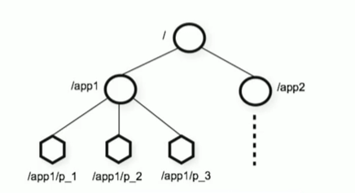

<!-- toc -->

### `Zookeeper`概念

`Zookeeper`是一个开源的分布式应用程序的协调服务,其重点就是在==协调==这两个字上,它最重要的能力就是服务协调工作,某一项任务由哪个节点去处理

`Zookeeper`常用的功能有: 配置管理, 分布式锁, 集群管理

### `Zookeeper`安装

从<a href="[Apache ZooKeeper](https://zookeeper.apache.org/)">`Zookeeper`</a>官网选择想要的版本, 直接通过`http`下载压缩包即可.

将压缩包解压之后即可使用


- `bin`目录中有启动`Zookeeper`服务和客户端的脚本
- `conf`目录中可以修改`zoo.cfg`来修改`Zookeeper`的配置
- `data`目录是`Zookeeper`服务的数据目录
- `lib`目录中是`Zookeeper`服务及其使用的相关包

```properties
# zoo.cfg 配置

# 心跳间隔
tickTime=2000
# The number of ticks that the initial 
# synchronization phase can take
initLimit=10
# The number of ticks that can pass between 
# sending a request and getting an acknowledgement
syncLimit=5
# the directory where the snapshot is stored.
# do not use /tmp for storage, /tmp here is just 
# example sakes.
# 数据路径
dataDir=D:\\software\\zookeeper\\apache-zookeeper-3.9.3-bin\\data
# 日志路径
dataLogDir=D:\\software\\zookeeper\\apache-zookeeper-3.9.3-bin\\logs
# the port at which the clients will connect
# 客户端端口号
clientPort=2181
# 修改占用的8080端口号
admin.serverPort=8079
# the maximum number of client connections.
# increase this if you need to handle more clients
#maxClientCnxns=60

# The number of snapshots to retain in dataDir
#autopurge.snapRetainCount=3
# Purge task interval in hours
# Set to "0" to disable auto purge feature
#autopurge.purgeInterval=1

## Metrics Providers
#
# https://prometheus.io Metrics Exporter
#metricsProvider.className=org.apache.zookeeper.metrics.prometheus.PrometheusMetricsProvider
#metricsProvider.httpHost=0.0.0.0
#metricsProvider.httpPort=7000
#metricsProvider.exportJvmInfo=true
```

从`bin`目录中的`zkServer.cmd`(`Windows`)或者`zkServer.sh`(`Linux`)启动服务

自此, `Zookeeper`就安装启动完成

如果想在项目中使用`Zookeeper`, 可以查看<a href="https://xiao-lin-unit.github.io/2023/11/30/springcloud/SpringCloud%E7%B3%BB%E5%88%97%E4%BA%8C%E4%B9%8B%E6%B3%A8%E5%86%8C%E4%B8%AD%E5%BF%83/">`SpringCloud系列(二)`</a>

### `Zookeeper`数据模型

`Zookeeper`是一个树形目录服务, 其数据模型和`Unix`的文件系统目录树类似, 拥有一个层次化结构



`Zookeeper`的每个节点都可以存储数据和节点信息

`Zookeeper`的节点分类:

1. `PERSISTENT`持久化节点
2. `EPHEMERAL`临时节点, 客户端关闭即删除: `-e`
3. `PERSISTENT_SEQUENTIAL`持久化顺序节点: `-s`
4. `EPHEMERAL_SEQUENTIAL`临时顺序节点: `-es`

### `Zookeeper`客户端命令

`ls`: 查看节点

```bash
ls [-s] /zookeeper
```

`create`: 创建节点

```bash
create [option(-e/-s/-es)] /mynode [data]
```

`get`: 获取节点数据

```bash
get /mynode
```

`set`: 设置节点数据

```bash
set /mynode data
```

`delete`: 删除节点

```bash
delete /mynode
```

> 注意: 
>
> `Zookeeper`客户端命令的指向节点必须从根开始

### `Zookeeper`的`JAVA API`

使用`Curator API`操作`Zookeeper`

#### 引入依赖

```xml
<dependency>
    <groupId>org.apache.curator</groupId>
    <artifactId>curator-framework</artifactId>
    <version>5.1.0</version>
</dependency>
<dependency>
    <groupId>org.apache.curator</groupId>
    <artifactId>curator-recipes</artifactId>
    <version>5.1.0</version>
</dependency>
```

#### 建立连接

```java
public CuratorFramework connect {
    CuratorFramework client = CuratorFrameworkFactory.builder()
        .connectString("192.168.0.1:2181,192.168.0.2:2181")
        .connectionTimeoutMs(3000)
        .sessionTimeoutMs(3000)
        .retryPolicy(new ExponentialBackoffRetry(3000, 5))
        .build();
    client.start();
    return client;
}
```

#### 创建节点

```java

public void create() throws Exception {
    // 如果没有添加数据, 会默认将本机的ip地址添加到节点数据中
    client.create().forPath("/mynode", "data".getBytes(StandardCharsets.UTF_8));
    // 不同类型的节点用 withMode 表示
    client.create().withMode(CreateMode.PERSISTENT).forPath("/mynode", "data".getBytes(StandardCharsets.UTF_8));
    // 创建多级节点使用 creatingParentsIfNeeded
    client.create().creatingParentsIfNeeded().forPath("/mynode/node1", "data".getBytes(StandardCharsets.UTF_8));
}
```

#### 查询节点

```java

public void get() throws Exception {
    // 节点的数据和状态都是用getData获取,不同的是数据是直接返回,但是状态信息需要使用状态类用storingStatIn获取
    // 用于查询节点状态
    Stat stat = new Stat();
    // 节点数据
    byte[] bytes = client.getData().storingStatIn(stat).forPath("/mynode");
    String s = new String(bytes, StandardCharsets.UTF_8);
	// 节点的子节点
    List<String> strings = client.getChildren().forPath("/mynode");

}
```

#### 修改节点

```java
public void set() throws Exception {
    Stat stat = new Stat();
    client.getData().storingStatIn(stat).forPath("/mynode");
    // 根据版本修改, 避免数据不一致
    client.setData().withVersion(stat.getVersion()).forPath("/mynode", "data".getBytes(StandardCharsets.UTF_8));
}
```

#### 删除节点

```java

public void delete() throws Exception {
    Stat stat = new Stat();
    client.getData().storingStatIn(stat).forPath("/mynode");
    // 根据版本删除
    client.delete().withVersion(stat.getVersion()).forPath("/mynode");
    // 删除节点及其子节点
    client.delete().deletingChildrenIfNeeded().withVersion(stat.getVersion()).forPath("/mynode/node1");
    // 必须删除
    client.delete().guaranteed().deletingChildrenIfNeeded().withVersion(stat.getVersion()).forPath("/mynode/node1");
    // 带有回调的删除
    client.delete().deletingChildrenIfNeeded().withVersion(stat.getVersion()).inBackground((client, event) -> {
        System.out.println("删除成功");
    }).forPath("/mynode/node1");
}
```

#### `Watch`监听

```java

public void cache() {
    CuratorCache cache = CuratorCache.builder(client, "/mynode").build();
    cache.listenable().addListener((type, oldData, data) -> {
        switch (type) {
            case NODE_CREATED -> System.out.println("create node " + data.getPath());
            case NODE_CHANGED -> System.out.println("change " + oldData.getPath() + " to " + data.getPath());
            case NODE_DELETED -> System.out.println("delete node " + oldData.getPath());
        }
    });

    cache.start();

}
```

#### 分布式锁

核心思想: 当客户端要获取锁, 则创建节点, 使用完锁, 则删除该节点

1. 客户端获取锁时, 在`lock`节点下创建==临时顺序==节点
2. 所有客户端获取`lock`节点下的所有子节点
3. 如果当前客户端发现自己创建的节点序号在`lock`节点的所有子节点中最小, 那么就认为该客户端获取到了锁, 使用完锁后, 将该节点删除
4. 如果当前客户端发现自己创建的节点序号在`lock`节点的所有子节点中并非最小, 说明该客户端还没有获取到锁, 此时该客户端需要找到比自己小的那个节点, 同事对其祖册事件监听器, 监听删除事件
5. 如果当前客户端发现比自己小的节点被删除, 则客户端的监听器会收到相应通知, 此时再次判断自己创建的节点是否是`lock`子节点中序号最小的, 如果是则获取到锁, 如果不是则重复上述步骤

```java

public void lock() {
    InterProcessLock lock = new InterProcessMutex(client, "/mynode/lock");
    try {
        lock.acquire(3, TimeUnit.SECONDS);
        // do some synchronized things
    } catch (Exception e) {
        throw new RuntimeException(e);
    } finally {
        try {
            lock.release();
        } catch (Exception e) {
            throw new RuntimeException(e);
        }
    }

}
```

### `Zookeeper`集群

#### 安装

安装即在不同的机器上安装`Zookeeper`

#### 配置集群

1. 在每个`Zookeeper`的`data`目录下创建一个`myid`文件, 这个文件就是记录每个服务器的`ID`, 文件内容就是`Zookeeper`在集群中的数字, 如`1, 2, 3`

2. 修改每个`Zookeeper`服务的`zoo.cfg`配置文件

   ```properties
   # 服务.myid=对应zk服务ip:对应zk服务通信端口(2881):对应zk服务选举端口(3881)
   server.1={zk1.ip}:{zk1.connect_port}:{zk1.port}
   server.2={zk2.ip}:{zk2.connect_port}:{zk2.port}
   server.3={zk3.ip}:{zk3.connect_port}:{zk3.port}
   ```

3. 将所有`Zookeeper`服务启动

#### 集群角色

集群中的三种角色:

- `Leader`领导者: 处理事务请求; 集群内部个服务器的调度者
- `Follower`跟随者: 处理非事务请求, 并转发事务请求给`Leader`; 参与`Leader`选举投票
- `Observer`观察者: 处理非事务请求, 并转发事务请求给`Leader`


